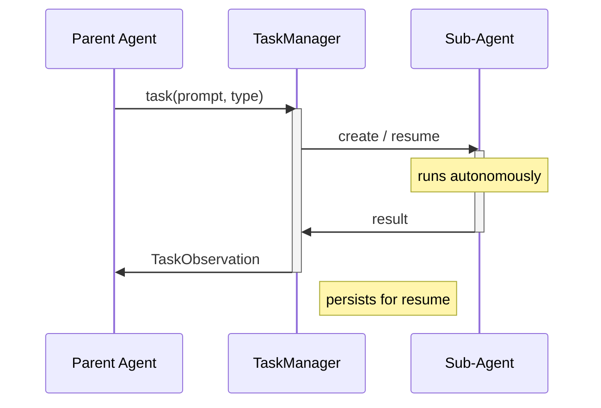
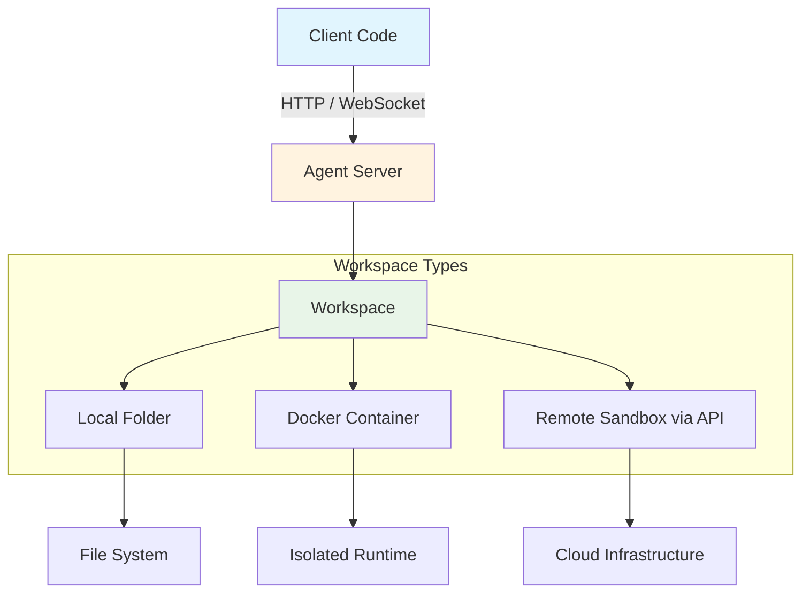

# OpenHands SDK Guides - 完整文档合集

> 来源: [OpenHands Docs](https://docs.openhands.dev)

> 生成日期: 2026-05-09

> 共收录 51 篇指南

---


# 目录


## Guides

- [Hello World](#hello-world)
- [Custom Tools](#custom-tools)
- [Model Context Protocol](#model-context-protocol)
- [Agent Skills & Context](#agent-skills-and-context)
- [Plugins](#plugins)
- [Persistence](#persistence)
- [Context Condenser](#context-condenser)
- [Agent Settings](#agent-settings)
- [Sub-Agent Delegation](#sub-agent-delegation)
- [Parallel Tool Execution](#parallel-tool-execution)
- [Task Tool Set](#task-tool-set)
- [Iterative Refinement](#iterative-refinement)
- [Security & Action Confirmation](#security-and-action-confirmation)
- [Metrics Tracking](#metrics-tracking)
- [Observability & Tracing](#observability-and-tracing)
- [Secret Registry](#secret-registry)


## LLM Features

- [LLM Subscriptions](#llm-subscriptions)
- [LLM Registry](#llm-registry)
- [Model Routing](#model-routing)
- [Reasoning](#reasoning)
- [GPT-5 Preset (ApplyPatchTool)](#gpt-5-preset-applypatchtool)
- [LLM Streaming](#llm-streaming)
- [Image Input](#image-input)
- [Exception Handling](#exception-handling)
- [LLM Fallback Strategy](#llm-fallback-strategy)
- [LLM Profile Store](#llm-profile-store)


## Agent Features

- [ACP Agent](#acp-agent)
- [Interactive Terminal](#interactive-terminal)
- [Browser Use](#browser-use)
- [Creating Custom Agent](#creating-custom-agent)
- [File-Based Agents](#file-based-agents)
- [Stuck Detector](#stuck-detector)
- [Theory of Mind (TOM) Agent](#theory-of-mind-tom-agent)
- [Critic (Experimental)](#critic-experimental)


## Conversation Features

- [Fork a Conversation](#fork-a-conversation)
- [Pause and Resume](#pause-and-resume)
- [Custom Visualizer](#custom-visualizer)
- [Send Message While Running](#send-message-while-running)
- [Conversation with Async](#conversation-with-async)
- [Ask Agent Questions](#ask-agent-questions)
- [Hooks](#hooks)


## Remote Agent Server

- [Overview](#overview)
- [Local Agent Server](#local-agent-server)
- [Docker Sandbox](#docker-sandbox)
- [Apptainer Sandbox](#apptainer-sandbox)
- [API-based Sandbox](#api-based-sandbox)
- [OpenHands Cloud Workspace](#openhands-cloud-workspace)
- [Custom Tools with Remote Agent Server](#custom-tools-with-remote-agent-server)


## GitHub Workflows

- [Assign Reviews](#assign-reviews)
- [PR Review](#pr-review)
- [TODO Management](#todo-management)


---


# Guides

==================================================


## Hello World

> 原文链接: https://docs.openhands.dev/sdk/guides/hello-world

> ## Documentation Index
> Fetch the complete documentation index at: https://docs.openhands.dev/llms.txt
> Use this file to discover all available pages before exploring further.

# Hello World

> The simplest possible OpenHands agent - configure an LLM, create an agent, and complete a task.

> Script: "examples/01_standalone_sdk/01_hello_world.py"

> A ready-to-run example is available [here](#ready-to-run-example)!

## Your First Agent

This is the most basic example showing how to set up and run an OpenHands agent.

<Steps>
  <Step>
    ### LLM Configuration

    Configure the language model that will power your agent:

    ```python icon="python" theme={null}
    llm = LLM(
        model=model,
        api_key=SecretStr(api_key),
        base_url=base_url,  # Optional
        service_id="agent"
    )
    ```
  </Step>

  <Step>
    ### Select an Agent

    Use the preset agent with common built-in tools:

    ```python icon="python" theme={null}
    agent = get_default_agent(llm=llm, cli_mode=True)
    ```

    The default agent includes `BashTool`, `FileEditorTool`, etc.

    <Tip>
      For the complete list of available tools see the
      [tools package source code](https://github.com/OpenHands/software-agent-sdk/tree/main/openhands-tools/openhands/tools).
    </Tip>
  </Step>

  <Step>
    ### Start a Conversation

    Start a conversation to manage the agent's lifecycle:

    ```python icon="python" theme={null}
    conversation = Conversation(agent=agent, workspace=cwd)
    conversation.send_message(
      "Write 3 facts about the current project into FACTS.txt."
    )
    conversation.run()
    ```
  </Step>

  <Step>
    ### Expected Behavior

    When you run this example:

    1. The agent analyzes the current directory
    2. Gathers information about the project
    3. Creates `FACTS.txt` with 3 relevant facts
    4. Completes and exits

    Example output file:

    ```text icon="text" wrap theme={null}
    FACTS.txt
    ---------
    1. This is a Python project using the OpenHands Software Agent SDK.
    2. The project includes examples demonstrating various agent capabilities.
    3. The SDK provides tools for file manipulation, bash execution, and more.
    ```
  </Step>
</Steps>

## Ready-to-run Example

<Note>
  This example is available on GitHub: [examples/01\_standalone\_sdk/01\_hello\_world.py](https://github.com/OpenHands/software-agent-sdk/blob/main/examples/01_standalone_sdk/01_hello_world.py)
</Note>

```python icon="python" wrap expandable examples/01_standalone_sdk/01_hello_world.py theme={null}
import os

from openhands.sdk import LLM, Agent, Conversation, Tool
from openhands.tools.file_editor import FileEditorTool
from openhands.tools.task_tracker import TaskTrackerTool
from openhands.tools.terminal import TerminalTool


llm = LLM(
    model=os.getenv("LLM_MODEL", "anthropic/claude-sonnet-4-5-20250929"),
    api_key=os.getenv("LLM_API_KEY"),
    base_url=os.getenv("LLM_BASE_URL", None),
)

agent = Agent(
    llm=llm,
    tools=[
        Tool(name=TerminalTool.name),
        Tool(name=FileEditorTool.name),
        Tool(name=TaskTrackerTool.name),
    ],
)

cwd = os.getcwd()
conversation = Conversation(agent=agent, workspace=cwd)

conversation.send_message("Write 3 facts about the current project into FACTS.txt.")
conversation.run()
print("All done!")
```

You can run the example code as-is.

<Note>
  The model name should follow the [LiteLLM convention](https://models.litellm.ai/): `provider/model_name` (e.g., `anthropic/claude-sonnet-4-5-20250929`, `openai/gpt-4o`).
  The `LLM_API_KEY` should be the API key for your chosen provider.
</Note>

<CodeGroup>
  <CodeBlock language="bash" filename="Bring-your-own provider key" icon="terminal" wrap>
    {`export LLM_API_KEY="your-api-key"\nexport LLM_MODEL="anthropic/claude-sonnet-4-5-20250929"  # or openai/gpt-4o, etc.\ncd software-agent-sdk\nuv run python ${path_to_script_0}`}
  </CodeBlock>

  <CodeBlock language="bash" filename="OpenHands Cloud" icon="terminal" wrap>
    {`# https://app.all-hands.dev/settings/api-keys\nexport LLM_API_KEY="your-openhands-api-key"\nexport LLM_MODEL="openhands/claude-sonnet-4-5-20250929"\ncd software-agent-sdk\nuv run python ${path_to_script_0}`}
  </CodeBlock>
</CodeGroup>

<Tip>
  **ChatGPT Plus/Pro subscribers**: You can use `LLM.subscription_login()` to authenticate with your ChatGPT account and access Codex models without consuming API credits. See the [LLM Subscriptions guide](/sdk/guides/llm-subscriptions) for details.
</Tip>

## Next Steps

* **[Custom Tools](/sdk/guides/custom-tools)** - Create custom tools for specialized needs
* **[Model Context Protocol (MCP)](/sdk/guides/mcp)** - Integrate external MCP servers
* **[Security Analyzer](/sdk/guides/security)** - Add security validation to tool usage


---


## Custom Tools

> 原文链接: https://docs.openhands.dev/sdk/guides/custom-tools

> ## Documentation Index
> Fetch the complete documentation index at: https://docs.openhands.dev/llms.txt
> Use this file to discover all available pages before exploring further.

# Custom Tools

> Tools define what agents can do. The SDK includes built-in tools for common operations and supports creating custom tools for specialized needs.

> Script: "examples/01_standalone_sdk/02_custom_tools.py"

> The ready-to-run example is available [here](#ready-to-run-example)!

## Understanding the Tool System

The SDK's tool system is built around three core components:

1. **Action** - Defines input parameters (what the tool accepts)
2. **Observation** - Defines output data (what the tool returns)
3. **Executor** - Implements the tool's logic (what the tool does)

These components are tied together by a **ToolDefinition** that registers the tool with the agent.

## Built-in Tools

The tools package ([source code](https://github.com/OpenHands/software-agent-sdk/tree/main/openhands-tools/openhands/tools)) provides a bunch of built-in tools that follow these patterns.

```python icon="python" wrap theme={null}
from openhands.tools import BashTool, FileEditorTool
from openhands.tools.preset import get_default_tools

# Use specific tools
agent = Agent(llm=llm, tools=[BashTool.create(), FileEditorTool.create()])

# Or use preset
tools = get_default_tools()
agent = Agent(llm=llm, tools=tools)
```

<Tip>
  See [source code](https://github.com/OpenHands/software-agent-sdk/tree/main/openhands-tools/openhands/tools) for the complete list of available tools and design philosophy.
</Tip>

## Creating a Custom Tool

Here's a minimal example of creating a custom grep tool:

<Steps>
  <Step>
    ### Define the Action

    Defines input parameters (what the tool accepts)

    ```python icon="python" wrap theme={null}
    class GrepAction(Action):
        pattern: str = Field(description="Regex to search for")
        path: str = Field(
            default=".",
            description="Directory to search (absolute or relative)"
        )
        include: str | None = Field(
            default=None,
            description="Optional glob to filter files (e.g. '*.py')"
        )
    ```
  </Step>

  <Step>
    ### Define the Observation

    Defines output data (what the tool returns)

    ```python icon="python" wrap theme={null}
    class GrepObservation(Observation):
        matches: list[str] = Field(default_factory=list)
        files: list[str] = Field(default_factory=list)
        count: int = 0

        @property
        def to_llm_content(self) -> Sequence[TextContent | ImageContent]:
            if not self.count:
                return [TextContent(text="No matches found.")]
            files_list = "\n".join(f"- {f}" for f in self.files[:20])
            sample = "\n".join(self.matches[:10])
            more = "\n..." if self.count > 10 else ""
            ret = (
                f"Found {self.count} matching lines.\n"
                f"Files:\n{files_list}\n"
                f"Sample:\n{sample}{more}"
            )
            return [TextContent(text=ret)]
    ```

    <Note>
      The to\_llm\_content() property formats observations for the LLM.
    </Note>
  </Step>

  <Step>
    ### Define the Executor

    Implements the tool’s logic (what the tool does)

    ```python icon="python" wrap theme={null}
    class GrepExecutor(ToolExecutor[GrepAction, GrepObservation]):
        def __init__(self, terminal: TerminalExecutor):
            self.terminal: TerminalExecutor = terminal

        def __call__(
            self,
            action: GrepAction,
            conversation=None,
        ) -> GrepObservation:
            root = os.path.abspath(action.path)
            pat = shlex.quote(action.pattern)
            root_q = shlex.quote(root)

            # Use grep -r; add --include when provided
            if action.include:
                inc = shlex.quote(action.include)
                cmd = f"grep -rHnE --include {inc} {pat} {root_q}"
            else:
                cmd = f"grep -rHnE {pat} {root_q}"
            cmd += " 2>/dev/null | head -100"
            result = self.terminal(TerminalAction(command=cmd))

            matches: list[str] = []
            files: set[str] = set()

            # grep returns exit code 1 when no matches; treat as empty
            output_text = result.text

            if output_text.strip():
                for line in output_text.strip().splitlines():
                    matches.append(line)
                    # Expect "path:line:content"
                    # take the file part before first ":"
                    file_path = line.split(":", 1)[0]
                    if file_path:
                        files.add(os.path.abspath(file_path))

            return GrepObservation(
                matches=matches,
                files=sorted(files),
                count=len(matches),
            )
    ```
  </Step>

  <Step>
    ### Finally, define the tool

    ```python icon="python" wrap theme={null}
    class GrepTool(ToolDefinition[GrepAction, GrepObservation]):
        """Custom grep tool that searches file contents using regular expressions."""

        @classmethod
        def create(
            cls,
            conv_state,
            terminal_executor: TerminalExecutor | None = None
        ) -> Sequence[ToolDefinition]:
            """Create GrepTool instance with a GrepExecutor.

            Args:
                conv_state: Conversation state to get
                    working directory from.
                terminal_executor: Optional terminal executor to reuse.
                    If not provided, a new one will be created.

            Returns:
                A sequence containing a single GrepTool instance.
            """
            if terminal_executor is None:
                terminal_executor = TerminalExecutor(
                    working_dir=conv_state.workspace.working_dir
                )
            grep_executor = GrepExecutor(terminal_executor)

            return [
                cls(
                    description=_GREP_DESCRIPTION,
                    action_type=GrepAction,
                    observation_type=GrepObservation,
                    executor=grep_executor,
                )
            ]
    ```
  </Step>
</Steps>

## Good to know

### Tool Registration

Tools are registered using `register_tool()` and referenced by name:

```python icon="python" wrap theme={null}
# Register a simple tool class
register_tool("FileEditorTool", FileEditorTool)

# Register a factory function that creates multiple tools
register_tool("BashAndGrepToolSet", _make_bash_and_grep_tools)

# Use registered tools by name
tools = [
    Tool(name="FileEditorTool"),
    Tool(name="BashAndGrepToolSet"),
]
```

### Factory Functions

Tool factory functions receive `conv_state` as a parameter, allowing access to workspace information:

```python icon="python" wrap theme={null}
def _make_bash_and_grep_tools(conv_state) -> list[ToolDefinition]:
    """Create execute_bash and custom grep tools sharing one executor."""
    bash_executor = BashExecutor(
        working_dir=conv_state.workspace.working_dir
    )
    # Create and configure tools...
    return [bash_tool, grep_tool]
```

### Shared Executors

Multiple tools can share executors for efficiency and state consistency:

```python icon="python" wrap theme={null}
bash_executor = BashExecutor(working_dir=conv_state.workspace.working_dir)
bash_tool = execute_bash_tool.set_executor(executor=bash_executor)

grep_executor = GrepExecutor(bash_executor)
grep_tool = ToolDefinition(
    name="grep",
    description=_GREP_DESCRIPTION,
    action_type=GrepAction,
    observation_type=GrepObservation,
    executor=grep_executor,
)
```

## When to Create Custom Tools

Create custom tools when you need to:

* Combine multiple operations into a single, structured interface
* Add typed parameters with validation
* Format complex outputs for LLM consumption
* Integrate with external APIs or services

## Ready-to-run Example

<Note>
  This example is available on GitHub: [examples/01\_standalone\_sdk/02\_custom\_tools.py](https://github.com/OpenHands/software-agent-sdk/blob/main/examples/01_standalone_sdk/02_custom_tools.py)
</Note>

```python icon="python" expandable examples/01_standalone_sdk/02_custom_tools.py theme={null}
"""Advanced example showing explicit executor usage and custom grep tool."""

import os
import shlex
from collections.abc import Sequence

from pydantic import Field, SecretStr

from openhands.sdk import (
    LLM,
    Action,
    Agent,
    Conversation,
    Event,
    ImageContent,
    LLMConvertibleEvent,
    Observation,
    TextContent,
    ToolDefinition,
    get_logger,
)
from openhands.sdk.tool import (
    Tool,
    ToolExecutor,
    register_tool,
)
from openhands.tools.file_editor import FileEditorTool
from openhands.tools.terminal import (
    TerminalAction,
    TerminalExecutor,
    TerminalTool,
)


logger = get_logger(__name__)

# --- Action / Observation ---


class GrepAction(Action):
    pattern: str = Field(description="Regex to search for")
    path: str = Field(
        default=".", description="Directory to search (absolute or relative)"
    )
    include: str | None = Field(
        default=None, description="Optional glob to filter files (e.g. '*.py')"
    )


class GrepObservation(Observation):
    matches: list[str] = Field(default_factory=list)
    files: list[str] = Field(default_factory=list)
    count: int = 0

    @property
    def to_llm_content(self) -> Sequence[TextContent | ImageContent]:
        if not self.count:
            return [TextContent(text="No matches found.")]
        files_list = "\n".join(f"- {f}" for f in self.files[:20])
        sample = "\n".join(self.matches[:10])
        more = "\n..." if self.count > 10 else ""
        ret = (
            f"Found {self.count} matching lines.\n"
            f"Files:\n{files_list}\n"
            f"Sample:\n{sample}{more}"
        )
        return [TextContent(text=ret)]


# --- Executor ---


class GrepExecutor(ToolExecutor[GrepAction, GrepObservation]):
    def __init__(self, terminal: TerminalExecutor):
        self.terminal: TerminalExecutor = terminal

    def __call__(self, action: GrepAction, conversation=None) -> GrepObservation:  # noqa: ARG002
        root = os.path.abspath(action.path)
        pat = shlex.quote(action.pattern)
        root_q = shlex.quote(root)

        # Use grep -r; add --include when provided
        if action.include:
            inc = shlex.quote(action.include)
            cmd = f"grep -rHnE --include {inc} {pat} {root_q} 2>/dev/null | head -100"
        else:
            cmd = f"grep -rHnE {pat} {root_q} 2>/dev/null | head -100"

        result = self.terminal(TerminalAction(command=cmd))

        matches: list[str] = []
        files: set[str] = set()

        # grep returns exit code 1 when no matches; treat as empty
        output_text = result.text

        if output_text.strip():
            for line in output_text.strip().splitlines():
                matches.append(line)
                # Expect "path:line:content" — take the file part before first ":"
                file_path = line.split(":", 1)[0]
                if file_path:
                    files.add(os.path.abspath(file_path))

        return GrepObservation(matches=matches, files=sorted(files), count=len(matches))


# Tool description
_GREP_DESCRIPTION = """Fast content search tool.
* Searches file contents using regular expressions
* Supports full regex syntax (eg. "log.*Error", "function\\s+\\w+", etc.)
* Filter files by pattern with the include parameter (eg. "*.js", "*.{ts,tsx}")
* Returns matching file paths sorted by modification time.
* Only the first 100 results are returned. Consider narrowing your search with stricter regex patterns or provide path parameter if you need more results.
* Use this tool when you need to find files containing specific patterns
* When you are doing an open ended search that may require multiple rounds of globbing and grepping, use the Agent tool instead
"""  # noqa: E501


# --- Tool Definition ---


class GrepTool(ToolDefinition[GrepAction, GrepObservation]):
    """A custom grep tool that searches file contents using regular expressions."""

    @classmethod
    def create(
        cls, conv_state, terminal_executor: TerminalExecutor | None = None
    ) -> Sequence[ToolDefinition]:
        """Create GrepTool instance with a GrepExecutor.

        Args:
            conv_state: Conversation state to get working directory from.
            terminal_executor: Optional terminal executor to reuse. If not provided,
                         a new one will be created.

        Returns:
            A sequence containing a single GrepTool instance.
        """
        if terminal_executor is None:
            terminal_executor = TerminalExecutor(
                working_dir=conv_state.workspace.working_dir
            )
        grep_executor = GrepExecutor(terminal_executor)

        return [
            cls(
                description=_GREP_DESCRIPTION,
                action_type=GrepAction,
                observation_type=GrepObservation,
                executor=grep_executor,
            )
        ]


# Configure LLM
api_key = os.getenv("LLM_API_KEY")
assert api_key is not None, "LLM_API_KEY environment variable is not set."
model = os.getenv("LLM_MODEL", "anthropic/claude-sonnet-4-5-20250929")
base_url = os.getenv("LLM_BASE_URL")
llm = LLM(
    usage_id="agent",
    model=model,
    base_url=base_url,
    api_key=SecretStr(api_key),
)

# Tools - demonstrating both simplified and advanced patterns
cwd = os.getcwd()


def _make_bash_and_grep_tools(conv_state) -> list[ToolDefinition]:
    """Create terminal and custom grep tools sharing one executor."""

    terminal_executor = TerminalExecutor(working_dir=conv_state.workspace.working_dir)
    # terminal_tool = terminal_tool.set_executor(executor=terminal_executor)
    terminal_tool = TerminalTool.create(conv_state, executor=terminal_executor)[0]

    # Use the GrepTool.create() method with shared terminal_executor
    grep_tool = GrepTool.create(conv_state, terminal_executor=terminal_executor)[0]

    return [terminal_tool, grep_tool]


register_tool("BashAndGrepToolSet", _make_bash_and_grep_tools)

tools = [
    Tool(name=FileEditorTool.name),
    Tool(name="BashAndGrepToolSet"),
]

# Agent
agent = Agent(llm=llm, tools=tools)

llm_messages = []  # collect raw LLM messages


def conversation_callback(event: Event):
    if isinstance(event, LLMConvertibleEvent):
        llm_messages.append(event.to_llm_message())


conversation = Conversation(
    agent=agent, callbacks=[conversation_callback], workspace=cwd
)

conversation.send_message(
    "Hello! Can you use the grep tool to find all files "
    "containing the word 'class' in this project, then create a summary file listing them? "  # noqa: E501
    "Use the pattern 'class' to search and include only Python files with '*.py'."  # noqa: E501
)
conversation.run()

conversation.send_message("Great! Now delete that file.")
conversation.run()

print("=" * 100)
print("Conversation finished. Got the following LLM messages:")
for i, message in enumerate(llm_messages):
    print(f"Message {i}: {str(message)[:200]}")

# Report cost
cost = llm.metrics.accumulated_cost
print(f"EXAMPLE_COST: {cost}")
```

You can run the example code as-is.

<Note>
  The model name should follow the [LiteLLM convention](https://models.litellm.ai/): `provider/model_name` (e.g., `anthropic/claude-sonnet-4-5-20250929`, `openai/gpt-4o`).
  The `LLM_API_KEY` should be the API key for your chosen provider.
</Note>

<CodeGroup>
  <CodeBlock language="bash" filename="Bring-your-own provider key" icon="terminal" wrap>
    {`export LLM_API_KEY="your-api-key"\nexport LLM_MODEL="anthropic/claude-sonnet-4-5-20250929"  # or openai/gpt-4o, etc.\ncd software-agent-sdk\nuv run python ${path_to_script_0}`}
  </CodeBlock>

  <CodeBlock language="bash" filename="OpenHands Cloud" icon="terminal" wrap>
    {`# https://app.all-hands.dev/settings/api-keys\nexport LLM_API_KEY="your-openhands-api-key"\nexport LLM_MODEL="openhands/claude-sonnet-4-5-20250929"\ncd software-agent-sdk\nuv run python ${path_to_script_0}`}
  </CodeBlock>
</CodeGroup>

<Tip>
  **ChatGPT Plus/Pro subscribers**: You can use `LLM.subscription_login()` to authenticate with your ChatGPT account and access Codex models without consuming API credits. See the [LLM Subscriptions guide](/sdk/guides/llm-subscriptions) for details.
</Tip>

## Next Steps

* **[Model Context Protocol (MCP) Integration](/sdk/guides/mcp)** - Use Model Context Protocol servers
* **[Tools Package Source Code](https://github.com/OpenHands/software-agent-sdk/tree/main/openhands-tools/openhands/tools)** - Built-in tools implementation


---


## Model Context Protocol

> 原文链接: https://docs.openhands.dev/sdk/guides/mcp

> ## Documentation Index
> Fetch the complete documentation index at: https://docs.openhands.dev/llms.txt
> Use this file to discover all available pages before exploring further.

# Model Context Protocol

> Model Context Protocol (MCP) enables dynamic tool integration from external servers. Agents can discover and use MCP-provided tools automatically.

> Script: "examples/01_standalone_sdk/08_mcp_with_oauth.py"

> Script: "examples/01_standalone_sdk/07_mcp_integration.py"

<Info>
  ***MCP*** (Model Context Protocol) is a protocol for exposing tools and resources to AI agents.
  Read more about MCP [here](https://modelcontextprotocol.io/).
</Info>

## Basic MCP Usage

> The ready-to-run basic MCP usage example is available [here](#ready-to-run-basic-mcp-usage-example)!

<Steps>
  <Step>
    ### MCP Configuration

    Configure MCP servers using a dictionary with server names and connection details following [this configuration format](https://gofastmcp.com/clients/client#configuration-format)

    ```python mcp_config icon="python" wrap focus={3-10} theme={null}
    mcp_config = {
        "mcpServers": {
            "fetch": {
                "command": "uvx",
                "args": ["mcp-server-fetch"]
            },
            "repomix": {
                "command": "npx",
                "args": ["-y", "repomix@1.4.2", "--mcp"]
            },
        }
    }
    ```
  </Step>

  <Step>
    ### Tool Filtering

    Use `filter_tools_regex` to control which MCP tools are available to the agent

    ```python filter_tools_regex focus={4-5} icon="python" theme={null}
    agent = Agent(
        llm=llm,
        tools=tools,
        mcp_config=mcp_config,
        filter_tools_regex="^(?!repomix)(.*)|^repomix.*pack_codebase.*$",
    )
    ```
  </Step>
</Steps>

## MCP with OAuth

> The ready-to-run MCP with OAuth example is available [here](#ready-to-run-mcp-with-oauth-example)!

For MCP servers requiring OAuth authentication:

* Configure OAuth-enabled MCP servers by specifying the URL and auth type
* The SDK automatically handles the OAuth flow when first connecting
* When the agent first attempts to use an OAuth-protected MCP server's tools, the SDK initiates the OAuth flow via [FastMCP](https://gofastmcp.com/servers/auth/authentication)
* User will be prompted to authenticate via browser
* Access tokens are securely stored in `~/.fastmcp/oauth-mcp-client-cache/` and automatically refreshed by FastMCP as needed

```python mcp_config focus={5} icon="python" wrap theme={null}
mcp_config = {
    "mcpServers": {
        "Notion": {
            "url": "https://mcp.notion.com/mcp",
            "auth": "oauth"
        }
    }
}
```

<Note>
  OAuth MCP servers require user interaction for the initial browser-based authentication. This means they are not suitable for fully automated/headless workflows. If you need headless access, check if the MCP provider offers API key authentication as an alternative.
</Note>

## Ready-to-Run Basic MCP Usage Example

<Note>
  This example is available on GitHub: [examples/01\_standalone\_sdk/07\_mcp\_integration.py](https://github.com/OpenHands/software-agent-sdk/blob/main/examples/01_standalone_sdk/07_mcp_integration.py)
</Note>

Here's an example integrating MCP servers with an agent:

```python icon="python" expandable examples/01_standalone_sdk/07_mcp_integration.py theme={null}
import os

from pydantic import SecretStr

from openhands.sdk import (
    LLM,
    Agent,
    Conversation,
    Event,
    LLMConvertibleEvent,
    get_logger,
)
from openhands.sdk.security.llm_analyzer import LLMSecurityAnalyzer
from openhands.sdk.tool import Tool
from openhands.tools.file_editor import FileEditorTool
from openhands.tools.terminal import TerminalTool


logger = get_logger(__name__)

# Configure LLM
api_key = os.getenv("LLM_API_KEY")
assert api_key is not None, "LLM_API_KEY environment variable is not set."
model = os.getenv("LLM_MODEL", "anthropic/claude-sonnet-4-5-20250929")
base_url = os.getenv("LLM_BASE_URL")
llm = LLM(
    usage_id="agent",
    model=model,
    base_url=base_url,
    api_key=SecretStr(api_key),
)

cwd = os.getcwd()
tools = [
    Tool(name=TerminalTool.name),
    Tool(name=FileEditorTool.name),
]

# Add MCP Tools
mcp_config = {
    "mcpServers": {
        "fetch": {"command": "uvx", "args": ["mcp-server-fetch"]},
        "repomix": {"command": "npx", "args": ["-y", "repomix@1.4.2", "--mcp"]},
    }
}
# Agent
agent = Agent(
    llm=llm,
    tools=tools,
    mcp_config=mcp_config,
    # This regex filters out all repomix tools except pack_codebase
    filter_tools_regex="^(?!repomix)(.*)|^repomix.*pack_codebase.*$",
)

llm_messages = []  # collect raw LLM messages


def conversation_callback(event: Event):
    if isinstance(event, LLMConvertibleEvent):
        llm_messages.append(event.to_llm_message())


# Conversation
conversation = Conversation(
    agent=agent,
    callbacks=[conversation_callback],
    workspace=cwd,
)
conversation.set_security_analyzer(LLMSecurityAnalyzer())

logger.info("Starting conversation with MCP integration...")
conversation.send_message(
    "Read https://github.com/OpenHands/OpenHands and write 3 facts "
    "about the project into FACTS.txt."
)
conversation.run()

conversation.send_message("Great! Now delete that file.")
conversation.run()

print("=" * 100)
print("Conversation finished. Got the following LLM messages:")
for i, message in enumerate(llm_messages):
    print(f"Message {i}: {str(message)[:200]}")

# Report cost
cost = llm.metrics.accumulated_cost
print(f"EXAMPLE_COST: {cost}")
```

You can run the example code as-is.

<Note>
  The model name should follow the [LiteLLM convention](https://models.litellm.ai/): `provider/model_name` (e.g., `anthropic/claude-sonnet-4-5-20250929`, `openai/gpt-4o`).
  The `LLM_API_KEY` should be the API key for your chosen provider.
</Note>

<CodeGroup>
  <CodeBlock language="bash" filename="Bring-your-own provider key" icon="terminal" wrap>
    {`export LLM_API_KEY="your-api-key"\nexport LLM_MODEL="anthropic/claude-sonnet-4-5-20250929"  # or openai/gpt-4o, etc.\ncd software-agent-sdk\nuv run python ${path_to_script_0}`}
  </CodeBlock>

  <CodeBlock language="bash" filename="OpenHands Cloud" icon="terminal" wrap>
    {`# https://app.all-hands.dev/settings/api-keys\nexport LLM_API_KEY="your-openhands-api-key"\nexport LLM_MODEL="openhands/claude-sonnet-4-5-20250929"\ncd software-agent-sdk\nuv run python ${path_to_script_0}`}
  </CodeBlock>
</CodeGroup>

<Tip>
  **ChatGPT Plus/Pro subscribers**: You can use `LLM.subscription_login()` to authenticate with your ChatGPT account and access Codex models without consuming API credits. See the [LLM Subscriptions guide](/sdk/guides/llm-subscriptions) for details.
</Tip>

## Ready-to-Run MCP with OAuth Example

<Note>
  This example is available on GitHub: [examples/01\_standalone\_sdk/08\_mcp\_with\_oauth.py](https://github.com/OpenHands/software-agent-sdk/blob/main/examples/01_standalone_sdk/08_mcp_with_oauth.py)
</Note>

```python icon="python" expandable examples/01_standalone_sdk/08_mcp_with_oauth.py theme={null}
import os

from pydantic import SecretStr

from openhands.sdk import (
    LLM,
    Agent,
    Conversation,
    Event,
    LLMConvertibleEvent,
    get_logger,
)
from openhands.sdk.tool import Tool
from openhands.tools.file_editor import FileEditorTool
from openhands.tools.terminal import TerminalTool


logger = get_logger(__name__)

# Configure LLM
api_key = os.getenv("LLM_API_KEY")
assert api_key is not None, "LLM_API_KEY environment variable is not set."
model = os.getenv("LLM_MODEL", "anthropic/claude-sonnet-4-5-20250929")
base_url = os.getenv("LLM_BASE_URL")
llm = LLM(
    usage_id="agent",
    model=model,
    base_url=base_url,
    api_key=SecretStr(api_key),
)

cwd = os.getcwd()
tools = [
    Tool(
        name=TerminalTool.name,
    ),
    Tool(name=FileEditorTool.name),
]

mcp_config = {
    "mcpServers": {"Notion": {"url": "https://mcp.notion.com/mcp", "auth": "oauth"}}
}
agent = Agent(llm=llm, tools=tools, mcp_config=mcp_config)

llm_messages = []  # collect raw LLM messages


def conversation_callback(event: Event):
    if isinstance(event, LLMConvertibleEvent):
        llm_messages.append(event.to_llm_message())


# Conversation
conversation = Conversation(
    agent=agent,
    callbacks=[conversation_callback],
)

logger.info("Starting conversation with MCP integration...")
conversation.send_message("Can you search about OpenHands V1 in my notion workspace?")
conversation.run()

print("=" * 100)
print("Conversation finished. Got the following LLM messages:")
for i, message in enumerate(llm_messages):
    print(f"Message {i}: {str(message)[:200]}")
```

You can run the example code as-is.

<Note>
  The model name should follow the [LiteLLM convention](https://models.litellm.ai/): `provider/model_name` (e.g., `anthropic/claude-sonnet-4-5-20250929`, `openai/gpt-4o`).
  The `LLM_API_KEY` should be the API key for your chosen provider.
</Note>

<CodeGroup>
  <CodeBlock language="bash" filename="Bring-your-own provider key" icon="terminal" wrap>
    {`export LLM_API_KEY="your-api-key"\nexport LLM_MODEL="anthropic/claude-sonnet-4-5-20250929"  # or openai/gpt-4o, etc.\ncd software-agent-sdk\nuv run python ${path_to_script_1}`}
  </CodeBlock>

  <CodeBlock language="bash" filename="OpenHands Cloud" icon="terminal" wrap>
    {`# https://app.all-hands.dev/settings/api-keys\nexport LLM_API_KEY="your-openhands-api-key"\nexport LLM_MODEL="openhands/claude-sonnet-4-5-20250929"\ncd software-agent-sdk\nuv run python ${path_to_script_1}`}
  </CodeBlock>
</CodeGroup>

<Tip>
  **ChatGPT Plus/Pro subscribers**: You can use `LLM.subscription_login()` to authenticate with your ChatGPT account and access Codex models without consuming API credits. See the [LLM Subscriptions guide](/sdk/guides/llm-subscriptions) for details.
</Tip>

## Next Steps

* **[Custom Tools](/sdk/guides/custom-tools)** - Creating native SDK tools
* **[Security Analyzer](/sdk/guides/security)** - Securing tool usage
* **[MCP Package Source Code](https://github.com/OpenHands/software-agent-sdk/tree/main/openhands-sdk/openhands/sdk/mcp)** - MCP integration implementation


---


## Agent Skills & Context

> 原文链接: https://docs.openhands.dev/sdk/guides/skill

> ## Documentation Index
> Fetch the complete documentation index at: https://docs.openhands.dev/llms.txt
> Use this file to discover all available pages before exploring further.

# Agent Skills & Context

> Skills add specialized behaviors, domain knowledge, and context-aware triggers to your agent through structured prompts.

export const path_to_script_3 = "examples/05_skills_and_plugins/01_loading_agentskills/main.py"

> Script: "examples/01_standalone_sdk/03_activate_skill.py"

> Script: "examples/01_standalone_sdk/43_mixed_marketplace_skills/main.py"

> Script: "examples/05_skills_and_plugins/03_managing_installed_skills/main.py"

This guide shows how to implement skills in the SDK. For conceptual overview, see [Skills Overview](/overview/skills).

OpenHands supports an **extended version** of the [AgentSkills standard](https://agentskills.io/specification) with optional keyword triggers.

## Skill Injection Behavior

Understanding where skill content appears in the prompt is critical. The behavior differs based on skill format and trigger configuration:

| Skill Format                 | Trigger      | Where Content Appears                                                                                   | Model Mediated?                      |
| ---------------------------- | ------------ | ------------------------------------------------------------------------------------------------------- | ------------------------------------ |
| **AgentSkills** (`SKILL.md`) | Any          | `<available_skills>` (description only)                                                                 | ✅ Yes — agent calls `invoke_skill()` |
| **AgentSkills** (`SKILL.md`) | Has triggers | `<available_skills>` + auto-inject on match                                                             | ✅ Yes                                |
| **Legacy** (inline/`*.md`)   | `None`       | **`<REPO_CONTEXT>` (full content in the initial system prompt; included in LLM context for each turn)** | ❌ No                                 |
| **Legacy** (inline/`*.md`)   | Has triggers | `<available_skills>` + auto-inject on match                                                             | ✅ Yes                                |

<Warning>
  **Token Usage Warning**: Legacy skills with `trigger=None` add their **full content** to `<REPO_CONTEXT>` in the initial `SystemPromptEvent`. That system message remains part of the conversation context for subsequent LLM calls, so the content still affects token usage on each turn. Consider using AgentSkills format (`SKILL.md`) for progressive disclosure instead.
</Warning>

### Prompt Structure

Skills appear in different parts of the system prompt:

```xml icon="file" theme={null}
<!-- System Prompt Structure -->

<REPO_CONTEXT>
  <!-- Legacy trigger=None skills: FULL content in the initial system prompt;
       included in LLM context for each turn while retained in history -->
  [BEGIN context from [agents]]
  ... AGENTS.md content ...
  [END Context]
</REPO_CONTEXT>

<SKILLS>
  <available_skills>
    <!-- AgentSkills + legacy with triggers: description only -->
    <skill>
      <name>github</name>
      <description>Interact with GitHub...</description>
    </skill>
  </available_skills>
</SKILLS>
```

When a trigger matches, content is injected into the **user message**:

```xml icon="file" theme={null}
<EXTRA_INFO>
The following information has been included based on a keyword match for "github".
Skill location: /path/to/skill
... skill content ...
</EXTRA_INFO>
```

## Context Loading Methods

| Method                     | When Content Loads    | Use Case                            |
| -------------------------- | --------------------- | ----------------------------------- |
| **Always-loaded**          | At conversation start | Repository rules, coding standards  |
| **Trigger-loaded**         | When keywords match   | Specialized tasks, domain knowledge |
| **Progressive disclosure** | Agent reads on demand | Large reference docs (AgentSkills)  |

## Always-Loaded Context

Content that's always in the system prompt.

### Option 1: `AGENTS.md` (Auto-loaded)

Place `AGENTS.md` at your repo root - it's loaded automatically. See [Permanent Context](/overview/skills/repo).

```python icon="python" focus={3, 4} theme={null}
from openhands.sdk.context.skills import load_project_skills

# Automatically finds AGENTS.md, CLAUDE.md, GEMINI.md at workspace root
skills = load_project_skills(workspace_dir="/path/to/repo")
agent_context = AgentContext(skills=skills)
```

### Option 2: Inline Skill (Code-defined)

```python icon="python" focus={5-11} theme={null}
from openhands.sdk import AgentContext
from openhands.sdk.context import Skill

agent_context = AgentContext(
    skills=[
        Skill(
            name="code-style",
            content="Always use type hints in Python.",
            trigger=None,  # No trigger = always loaded
        ),
    ]
)
```

<Warning>
  **Important**: Inline skills with `trigger=None` use **legacy format** behavior — full content is added to `<REPO_CONTEXT>` in the initial system prompt and remains part of the conversation context for subsequent LLM calls. For large skills, consider using the AgentSkills `SKILL.md` format for progressive disclosure.
</Warning>

## Trigger-Loaded Context

Content injected when keywords appear in user messages. See [Keyword-Triggered Skills](/overview/skills/keyword).

```python icon="python" focus={6} theme={null}
from openhands.sdk.context import Skill, KeywordTrigger

Skill(
    name="encryption-helper",
    content="Use the encrypt.sh script to encrypt messages.",
    trigger=KeywordTrigger(keywords=["encrypt", "decrypt"]),
)
```

When user says "encrypt this", the content is injected into the message:

```xml icon="file" theme={null}
<EXTRA_INFO>
The following information has been included based on a keyword match for "encrypt".
Skill location: /path/to/encryption-helper

Use the encrypt.sh script to encrypt messages.
</EXTRA_INFO>
```

## Progressive Disclosure (AgentSkills Standard)

For the agent to trigger skills, use the [AgentSkills standard](https://agentskills.io/specification) `SKILL.md` format. The agent sees a summary and reads full content on demand.

```python icon="python" theme={null}
from openhands.sdk.context.skills import load_skills_from_dir

# Load SKILL.md files from a directory
_, _, agent_skills = load_skills_from_dir("/path/to/skills")
agent_context = AgentContext(skills=list(agent_skills.values()))
```

Skills are listed in the system prompt:

```xml icon="file" theme={null}
<available_skills>
  <skill>
    <name>code-style</name>
    <description>Project coding standards.</description>
    <location>/path/to/code-style/SKILL.md</location>
  </skill>
</available_skills>
```

<Tip>
  Add `triggers` to a SKILL.md for **both** progressive disclosure AND automatic injection when keywords match.
</Tip>

## Managing Installed Skills

You can install AgentSkills into a persistent directory and manage them through
`openhands.sdk.skills`. Skills are stored under
`~/.openhands/skills/installed/` with a `.installed.json` metadata file that
records an `enabled` flag. `list_installed_skills()` returns all installed
skills, while `load_installed_skills()` returns only those with
`enabled=true`.

The public lifecycle API includes `install_skill()`, `update_skill()`,
`enable_skill()`, `disable_skill()`, and `uninstall_skill()`, which gives the
CLI a clean SDK surface for `/skill install`, `/skill enable`,
`/skill disable`, and `/skill uninstall`.

### Installed Skill Lifecycle Example

This example mirrors the installed-plugin lifecycle example, but for
AgentSkills. It installs sample skills, lists them, toggles the
persistent `enabled` flag, and uninstalls one skill while leaving the
other available.

<Note>
  Source: [examples/05\_skills\_and\_plugins/03\_managing\_installed\_skills/main.py](https://github.com/OpenHands/software-agent-sdk/blob/main/examples/05_skills_and_plugins/03_managing_installed_skills/main.py)
</Note>

```python icon="python" expandable examples/05_skills_and_plugins/03_managing_installed_skills/main.py theme={null}
"""Example: Installing and Managing Skills

This example demonstrates installed skill lifecycle operations in the SDK:

1. Install skills from local paths into persistent storage
2. List tracked skills and load only the enabled ones
3. Inspect the `.installed.json` metadata file and `enabled` flag
4. Disable and re-enable a skill without reinstalling it
5. Uninstall a skill while leaving other installed skills available

For marketplace installation flows, see:
`examples/01_standalone_sdk/43_mixed_marketplace_skills/`.
"""

import json
import tempfile
from pathlib import Path

from openhands.sdk.skills import (
    disable_skill,
    enable_skill,
    install_skill,
    list_installed_skills,
    load_installed_skills,
    uninstall_skill,
)


script_dir = Path(__file__).resolve().parent
example_skills_dir = script_dir.parent / "01_loading_agentskills" / "example_skills"


def print_state(label: str, installed_dir: Path) -> None:
    """Print tracked, loaded, and persisted skill state."""
    print(f"\n{label}")
    print("-" * len(label))

    installed = list_installed_skills(installed_dir=installed_dir)
    print("Tracked skills:")
    for info in installed:
        print(f"  - {info.name} (enabled={info.enabled}, source={info.source})")

    loaded = load_installed_skills(installed_dir=installed_dir)
    print(f"Loaded skills: {[skill.name for skill in loaded]}")

    metadata = json.loads((installed_dir / ".installed.json").read_text())
    print("Metadata file:")
    print(json.dumps(metadata, indent=2))


def demo_install_skills(installed_dir: Path) -> list[str]:
    """Install the sample skills into the isolated installed directory."""
    print("\n" + "=" * 60)
    print("DEMO 1: Installing local skills")
    print("=" * 60)

    installed_names: list[str] = []
    for skill_dir in sorted(example_skills_dir.iterdir()):
        if not skill_dir.is_dir():
            continue
        info = install_skill(source=str(skill_dir), installed_dir=installed_dir)
        installed_names.append(info.name)
        print(f"✓ Installed: {info.name}")
        print(f"  Source: {info.source}")
        print(f"  Path: {info.install_path}")

    return installed_names


def demo_list_and_load_skills(installed_dir: Path) -> None:
    """List tracked skills and load them as runtime Skill objects."""
    print("\n" + "=" * 60)
    print("DEMO 2: Listing and loading installed skills")
    print("=" * 60)

    installed = list_installed_skills(installed_dir=installed_dir)
    print("Tracked skills:")
    for info in installed:
        desc = (info.description or "No description")[:60]
        print(f"  - {info.name} (enabled={info.enabled})")
        print(f"    Description: {desc}...")

    loaded = load_installed_skills(installed_dir=installed_dir)
    print(f"\nLoaded {len(loaded)} skill(s):")
    for skill in loaded:
        desc = (skill.description or "No description")[:60]
        print(f"  - {skill.name}: {desc}...")


def demo_enable_disable_skill(installed_dir: Path, skill_name: str) -> None:
    """Disable then re-enable a skill and show the persisted metadata."""
    print("\n" + "=" * 60)
    print("DEMO 3: Disabling and re-enabling a skill")
    print("=" * 60)

    print_state("Before disable", installed_dir)

    assert disable_skill(skill_name, installed_dir=installed_dir) is True
    print_state("After disable", installed_dir)
    assert skill_name not in [
        skill.name for skill in load_installed_skills(installed_dir=installed_dir)
    ]

    metadata = json.loads((installed_dir / ".installed.json").read_text())
    assert metadata["skills"][skill_name]["enabled"] is False

    assert enable_skill(skill_name, installed_dir=installed_dir) is True
    print_state("After re-enable", installed_dir)

    metadata = json.loads((installed_dir / ".installed.json").read_text())
    assert metadata["skills"][skill_name]["enabled"] is True
    assert skill_name in [
        skill.name for skill in load_installed_skills(installed_dir=installed_dir)
    ]


def demo_uninstall_skill(
    installed_dir: Path, skill_name: str, remaining_skill_name: str
) -> None:
    """Uninstall one skill and confirm the other skill remains available."""
    print("\n" + "=" * 60)
    print("DEMO 4: Uninstalling a skill")
    print("=" * 60)

    assert uninstall_skill(skill_name, installed_dir=installed_dir) is True
    print_state("After uninstall", installed_dir)

    assert not (installed_dir / skill_name).exists()
    metadata = json.loads((installed_dir / ".installed.json").read_text())
    assert skill_name not in metadata["skills"]
    assert remaining_skill_name in metadata["skills"]


if __name__ == "__main__":
    with tempfile.TemporaryDirectory() as tmpdir:
        installed_dir = Path(tmpdir) / "installed-skills"
        installed_dir.mkdir(parents=True)

        installed_names = demo_install_skills(installed_dir)
        demo_list_and_load_skills(installed_dir)
        demo_enable_disable_skill(installed_dir, skill_name="rot13-encryption")
        demo_uninstall_skill(
            installed_dir,
            skill_name="rot13-encryption",
            remaining_skill_name="code-style-guide",
        )

        remaining_names = [
            info.name for info in list_installed_skills(installed_dir=installed_dir)
        ]
        assert remaining_names == ["code-style-guide"]
        assert sorted(installed_names) == ["code-style-guide", "rot13-encryption"]

    print("\nEXAMPLE_COST: 0")
```

You can run the example code as-is.

<Note>
  The model name should follow the [LiteLLM convention](https://models.litellm.ai/): `provider/model_name` (e.g., `anthropic/claude-sonnet-4-5-20250929`, `openai/gpt-4o`).
  The `LLM_API_KEY` should be the API key for your chosen provider.
</Note>

<CodeGroup>
  <CodeBlock language="bash" filename="Bring-your-own provider key" icon="terminal" wrap>
    {`export LLM_API_KEY="your-api-key"\nexport LLM_MODEL="anthropic/claude-sonnet-4-5-20250929"  # or openai/gpt-4o, etc.\ncd software-agent-sdk\nuv run python ${path_to_script_0}`}
  </CodeBlock>

  <CodeBlock language="bash" filename="OpenHands Cloud" icon="terminal" wrap>
    {`# https://app.all-hands.dev/settings/api-keys\nexport LLM_API_KEY="your-openhands-api-key"\nexport LLM_MODEL="openhands/claude-sonnet-4-5-20250929"\ncd software-agent-sdk\nuv run python ${path_to_script_0}`}
  </CodeBlock>
</CodeGroup>

<Tip>
  **ChatGPT Plus/Pro subscribers**: You can use `LLM.subscription_login()` to authenticate with your ChatGPT account and access Codex models without consuming API credits. See the [LLM Subscriptions guide](/sdk/guides/llm-subscriptions) for details.
</Tip>

### Installing Skills from a Marketplace

Use a marketplace when you want to install a curated mix of local and remote
AgentSkills in one step. The example below shows how to define a marketplace,
install all listed skills, and inspect the installed metadata.

<Note>
  Source: [examples/01\_standalone\_sdk/43\_mixed\_marketplace\_skills/main.py](https://github.com/OpenHands/software-agent-sdk/blob/main/examples/01_standalone_sdk/43_mixed_marketplace_skills/main.py)
</Note>

```python icon="python" expandable examples/01_standalone_sdk/43_mixed_marketplace_skills/main.py theme={null}
"""Example: Mixed Marketplace with Local and Remote Skills

This example demonstrates how to create a marketplace that includes both:
1. Local skills hosted in your project directory
2. Remote skills from GitHub (OpenHands/extensions repository)

The marketplace.json schema supports source paths in these formats:
- Local paths: ./path, ../path, /absolute/path, ~/path, file:///path
- GitHub URLs: https://github.com/{owner}/{repo}/blob/{branch}/{path}

This pattern is useful for teams that want to:
- Maintain their own custom skills locally
- Reference specific skills from remote repositories
- Create a curated skill set for their specific workflows

Directory Structure:
    43_mixed_marketplace_skills/
    ├── .plugin/
    │   └── marketplace.json     # Marketplace with local and remote skills
    ├── skills/
    │   └── greeting-helper/
    │       └── SKILL.md         # Local skill content
    ├── main.py                  # This file
    └── README.md                # Documentation

Usage:
    # Install all skills from marketplace to ~/.openhands/skills/installed/
    python main.py --install

    # Force reinstall (overwrite existing)
    python main.py --install --force

    # Show installed skills
    python main.py --list
"""

import sys
from pathlib import Path

from openhands.sdk.plugin import Marketplace
from openhands.sdk.skills import (
    install_skills_from_marketplace,
    list_installed_skills,
)


def main():
    script_dir = Path(__file__).parent

    if "--list" in sys.argv:
        # List installed skills
        print("=" * 80)
        print("Installed Skills")
        print("=" * 80)
        installed = list_installed_skills()
        if not installed:
            print("\nNo skills installed.")
            print("Run with --install to install skills from the marketplace.")
        else:
            for info in installed:
                desc = (info.description or "No description")[:60]
                print(f"\n  {info.name}")
                print(f"    Description: {desc}...")
                print(f"    Source: {info.source}")
        return

    if "--install" in sys.argv:
        # Install skills from marketplace
        print("=" * 80)
        print("Installing Skills from Marketplace")
        print("=" * 80)
        print(f"\nMarketplace directory: {script_dir}")

        force = "--force" in sys.argv
        installed = install_skills_from_marketplace(script_dir, force=force)

        print(f"\n\nInstalled {len(installed)} skills:")
        for info in installed:
            print(f"  - {info.name}")

        # Show all installed skills
        print("\n" + "=" * 80)
        print("All Installed Skills")
        print("=" * 80)
        all_installed = list_installed_skills()
        for info in all_installed:
            desc = (info.description or "No description")[:50]
            print(f"  - {info.name}: {desc}...")
        return

    # Default: show marketplace info
    print("=" * 80)
    print("Marketplace Information")
    print("=" * 80)
    print(f"\nMarketplace directory: {script_dir}")

    marketplace = Marketplace.load(script_dir)
    print(f"Name: {marketplace.name}")
    print(f"Description: {marketplace.description}")
    print(f"Skills defined: {len(marketplace.skills)}")

    print("\nSkills:")
    for entry in marketplace.skills:
        source_type = "remote" if entry.source.startswith("http") else "local"
        print(f"  - {entry.name} ({source_type})")
        print(f"    Source: {entry.source}")
        if entry.description:
            print(f"    Description: {entry.description}")

    print("\n" + "-" * 80)
    print("Usage:")
    print("  python main.py --install        # Install all skills")
    print("  python main.py --install --force # Force reinstall")
    print("  python main.py --list           # List installed skills")


if __name__ == "__main__":
    main()
```

You can run the example code as-is.

<Note>
  The model name should follow the [LiteLLM convention](https://models.litellm.ai/): `provider/model_name` (e.g., `anthropic/claude-sonnet-4-5-20250929`, `openai/gpt-4o`).
  The `LLM_API_KEY` should be the API key for your chosen provider.
</Note>

<CodeGroup>
  <CodeBlock language="bash" filename="Bring-your-own provider key" icon="terminal" wrap>
    {`export LLM_API_KEY="your-api-key"\nexport LLM_MODEL="anthropic/claude-sonnet-4-5-20250929"  # or openai/gpt-4o, etc.\ncd software-agent-sdk\nuv run python ${path_to_script_1}`}
  </CodeBlock>

  <CodeBlock language="bash" filename="OpenHands Cloud" icon="terminal" wrap>
    {`# https://app.all-hands.dev/settings/api-keys\nexport LLM_API_KEY="your-openhands-api-key"\nexport LLM_MODEL="openhands/claude-sonnet-4-5-20250929"\ncd software-agent-sdk\nuv run python ${path_to_script_1}`}
  </CodeBlock>
</CodeGroup>

<Tip>
  **ChatGPT Plus/Pro subscribers**: You can use `LLM.subscription_login()` to authenticate with your ChatGPT account and access Codex models without consuming API credits. See the [LLM Subscriptions guide](/sdk/guides/llm-subscriptions) for details.
</Tip>

***

## Full Example

<Note>
  Full example: [examples/01\_standalone\_sdk/03\_activate\_skill.py](https://github.com/OpenHands/software-agent-sdk/blob/main/examples/01_standalone_sdk/03_activate_skill.py)
</Note>

```python icon="python" expandable examples/01_standalone_sdk/03_activate_skill.py theme={null}
import os

from pydantic import SecretStr

from openhands.sdk import (
    LLM,
    Agent,
    AgentContext,
    Conversation,
    Event,
    LLMConvertibleEvent,
    get_logger,
)
from openhands.sdk.context import (
    KeywordTrigger,
    Skill,
)
from openhands.sdk.tool import Tool
from openhands.tools.file_editor import FileEditorTool
from openhands.tools.terminal import TerminalTool


logger = get_logger(__name__)

# Configure LLM
api_key = os.getenv("LLM_API_KEY")
assert api_key is not None, "LLM_API_KEY environment variable is not set."
model = os.getenv("LLM_MODEL", "anthropic/claude-sonnet-4-5-20250929")
base_url = os.getenv("LLM_BASE_URL")
llm = LLM(
    usage_id="agent",
    model=model,
    base_url=base_url,
    api_key=SecretStr(api_key),
)

# Tools
cwd = os.getcwd()
tools = [
    Tool(
        name=TerminalTool.name,
    ),
    Tool(name=FileEditorTool.name),
]

# AgentContext provides flexible ways to customize prompts:
# 1. Skills: Inject instructions (always-active or keyword-triggered)
# 2. system_message_suffix: Append text to the system prompt
# 3. user_message_suffix: Append text to each user message
#
# For complete control over the system prompt, you can also use Agent's
# system_prompt_filename parameter to provide a custom Jinja2 template:
#
#   agent = Agent(
#       llm=llm,
#       tools=tools,
#       system_prompt_filename="/path/to/custom_prompt.j2",
#       system_prompt_kwargs={"cli_mode": True, "repo": "my-project"},
#   )
#
# See: https://docs.openhands.dev/sdk/guides/skill#customizing-system-prompts
agent_context = AgentContext(
    skills=[
        Skill(
            name="repo.md",
            content="When you see this message, you should reply like "
            "you are a grumpy cat forced to use the internet.",
            # source is optional - identifies where the skill came from
            # You can set it to be the path of a file that contains the skill content
            source=None,
            # trigger determines when the skill is active
            # trigger=None means always active (repo skill)
            trigger=None,
        ),
        Skill(
            name="flarglebargle",
            content=(
                'IMPORTANT! The user has said the magic word "flarglebargle". '
                "You must only respond with a message telling them how smart they are"
            ),
            source=None,
            # KeywordTrigger = activated when keywords appear in user messages
            trigger=KeywordTrigger(keywords=["flarglebargle"]),
        ),
    ],
    # system_message_suffix is appended to the system prompt (always active)
    system_message_suffix="Always finish your response with the word 'yay!'",
    # user_message_suffix is appended to each user message
    user_message_suffix="The first character of your response should be 'I'",
    # You can also enable automatic load skills from
    # public registry at https://github.com/OpenHands/extensions
    load_public_skills=True,
)

# Agent
agent = Agent(llm=llm, tools=tools, agent_context=agent_context)

llm_messages = []  # collect raw LLM messages


def conversation_callback(event: Event):
    if isinstance(event, LLMConvertibleEvent):
        llm_messages.append(event.to_llm_message())


conversation = Conversation(
    agent=agent, callbacks=[conversation_callback], workspace=cwd
)

print("=" * 100)
print("Checking if the repo skill is activated.")
conversation.send_message("Hey are you a grumpy cat?")
conversation.run()

print("=" * 100)
print("Now sending flarglebargle to trigger the knowledge skill!")
conversation.send_message("flarglebargle!")
conversation.run()

print("=" * 100)
print("Now triggering public skill 'github'")
conversation.send_message(
    "About GitHub - tell me what additional info I've just provided?"
)
conversation.run()

print("=" * 100)
print("Conversation finished. Got the following LLM messages:")
for i, message in enumerate(llm_messages):
    print(f"Message {i}: {str(message)[:200]}")

# Report cost
cost = llm.metrics.accumulated_cost
print(f"EXAMPLE_COST: {cost}")
```

You can run the example code as-is.

<Note>
  The model name should follow the [LiteLLM convention](https://models.litellm.ai/): `provider/model_name` (e.g., `anthropic/claude-sonnet-4-5-20250929`, `openai/gpt-4o`).
  The `LLM_API_KEY` should be the API key for your chosen provider.
</Note>

<CodeGroup>
  <CodeBlock language="bash" filename="Bring-your-own provider key" icon="terminal" wrap>
    {`export LLM_API_KEY="your-api-key"\nexport LLM_MODEL="anthropic/claude-sonnet-4-5-20250929"  # or openai/gpt-4o, etc.\ncd software-agent-sdk\nuv run python ${path_to_script_2}`}
  </CodeBlock>

  <CodeBlock language="bash" filename="OpenHands Cloud" icon="terminal" wrap>
    {`# https://app.all-hands.dev/settings/api-keys\nexport LLM_API_KEY="your-openhands-api-key"\nexport LLM_MODEL="openhands/claude-sonnet-4-5-20250929"\ncd software-agent-sdk\nuv run python ${path_to_script_2}`}
  </CodeBlock>
</CodeGroup>

<Tip>
  **ChatGPT Plus/Pro subscribers**: You can use `LLM.subscription_login()` to authenticate with your ChatGPT account and access Codex models without consuming API credits. See the [LLM Subscriptions guide](/sdk/guides/llm-subscriptions) for details.
</Tip>

### Creating Skills

Skills are defined with a name, content (the instructions), and an optional trigger:

```python icon="python" focus={3-14} theme={null}
agent_context = AgentContext(
    skills=[
        Skill(
            name="AGENTS.md",
            content="When you see this message, you should reply like "
                    "you are a grumpy cat forced to use the internet.",
            trigger=None,  # Always active
        ),
        Skill(
            name="flarglebargle",
            content='IMPORTANT! The user has said the magic word "flarglebargle". '
                    "You must only respond with a message telling them how smart they are",
            trigger=KeywordTrigger(keywords=["flarglebargle"]),
        ),
    ]
)
```

### Keyword Triggers

Use `KeywordTrigger` to activate skills only when specific words appear:

```python icon="python" focus={4} theme={null}
Skill(
    name="magic-word",
    content="Special instructions when magic word is detected",
    trigger=KeywordTrigger(keywords=["flarglebargle", "sesame"]),
)
```

## File-Based Skills (`SKILL.md`)

For reusable skills, use the [AgentSkills standard](https://agentskills.io/specification) directory format.

<Note>
  Full example: [examples/05\_skills\_and\_plugins/01\_loading\_agentskills/main.py](https://github.com/OpenHands/software-agent-sdk/blob/main/examples/05_skills_and_plugins/01_loading_agentskills/main.py)
</Note>

### Directory Structure

Each skill is a directory containing:

<Tree>
  <Tree.Folder name="my-skill/" defaultOpen>
    <Tree.File name="SKILL.md" />

    <Tree.Folder name="scripts/" defaultOpen>
      <Tree.File name="helper.sh" />
    </Tree.Folder>

    <Tree.Folder name="references/" defaultOpen>
      <Tree.File name="examples.md" />
    </Tree.Folder>

    <Tree.Folder name="assets/" defaultOpen>
      <Tree.File name="config.json" />
    </Tree.Folder>
  </Tree.Folder>
</Tree>

where

| Component     | Required | Description                       |
| ------------- | -------- | --------------------------------- |
| `SKILL.md`    | Yes      | Skill definition with frontmatter |
| `scripts/`    | No       | Executable scripts                |
| `references/` | No       | Reference documentation           |
| `assets/`     | No       | Static assets                     |

### `SKILL.md` Format

The `SKILL.md` file defines the skill with YAML frontmatter:

```md icon="markdown" theme={null}
---
name: my-skill                    # Required (standard)
description: >                    # Required (standard)
  A brief description of what this skill does and when to use it.
license: MIT                      # Optional (standard)
compatibility: Requires bash      # Optional (standard)
metadata:                         # Optional (standard)
  author: your-name
  version: "1.0"
triggers:                         # Optional (OpenHands extension)
  - keyword1
  - keyword2
---

# Skill Content

Instructions and documentation for the agent...
```

#### Frontmatter Fields

| Field           | Required | Description                                                      |
| --------------- | -------- | ---------------------------------------------------------------- |
| `name`          | Yes      | Skill identifier (lowercase + hyphens)                           |
| `description`   | Yes      | What the skill does (shown to agent)                             |
| `triggers`      | No       | Keywords that auto-activate this skill (**OpenHands extension**) |
| `license`       | No       | License name                                                     |
| `compatibility` | No       | Environment requirements                                         |
| `metadata`      | No       | Custom key-value pairs                                           |

<Tip>
  Add `triggers` to make your SKILL.md keyword-activated by matching a user prompt. Without triggers, the skill can only be triggered by the agent, not the user.
</Tip>

### Loading Skills

Use `load_skills_from_dir()` to load all skills from a directory:

```python icon="python" expandable examples/05_skills_and_plugins/01_loading_agentskills/main.py theme={null}
"""Example: Loading Skills from Disk (AgentSkills Standard)

This example demonstrates how to load skills following the AgentSkills standard
from a directory on disk.

Skills are modular, self-contained packages that extend an agent's capabilities
by providing specialized knowledge, workflows, and tools. They follow the
AgentSkills standard which includes:
- SKILL.md file with frontmatter metadata (name, description, triggers)
- Optional resource directories: scripts/, references/, assets/

The example_skills/ directory contains two skills:
- rot13-encryption: Has triggers (encrypt, decrypt) - listed in <available_skills>
  AND content auto-injected when triggered
- code-style-guide: No triggers - listed in <available_skills> for on-demand access

All SKILL.md files follow the AgentSkills progressive disclosure model:
they are listed in <available_skills> with name, description, and location.
Skills with triggers get the best of both worlds: automatic content injection
when triggered, plus the agent can proactively read them anytime.
"""

import os
import sys
from pathlib import Path

from pydantic import SecretStr

from openhands.sdk import LLM, Agent, AgentContext, Conversation
from openhands.sdk.context.skills import (
    discover_skill_resources,
    load_skills_from_dir,
)
from openhands.sdk.tool import Tool
from openhands.tools.file_editor import FileEditorTool
from openhands.tools.terminal import TerminalTool


# Get the directory containing this script
script_dir = Path(__file__).parent
example_skills_dir = script_dir / "example_skills"

# =========================================================================
# Part 1: Loading Skills from a Directory
# =========================================================================
print("=" * 80)
print("Part 1: Loading Skills from a Directory")
print("=" * 80)

print(f"Loading skills from: {example_skills_dir}")

# Discover resources in the skill directory
skill_subdir = example_skills_dir / "rot13-encryption"
resources = discover_skill_resources(skill_subdir)
print("\nDiscovered resources in rot13-encryption/:")
print(f"  - scripts: {resources.scripts}")
print(f"  - references: {resources.references}")
print(f"  - assets: {resources.assets}")

# Load skills from the directory
repo_skills, knowledge_skills, agent_skills = load_skills_from_dir(example_skills_dir)

print("\nLoaded skills from directory:")
print(f"  - Repo skills: {list(repo_skills.keys())}")
print(f"  - Knowledge skills: {list(knowledge_skills.keys())}")
print(f"  - Agent skills (SKILL.md): {list(agent_skills.keys())}")

# Access the loaded skill and show all AgentSkills standard fields
if agent_skills:
    skill_name = next(iter(agent_skills))
    loaded_skill = agent_skills[skill_name]
    print(f"\nDetails for '{skill_name}' (AgentSkills standard fields):")
    print(f"  - Name: {loaded_skill.name}")
    desc = loaded_skill.description or ""
    print(f"  - Description: {desc[:70]}...")
    print(f"  - License: {loaded_skill.license}")
    print(f"  - Compatibility: {loaded_skill.compatibility}")
    print(f"  - Metadata: {loaded_skill.metadata}")
    if loaded_skill.resources:
        print("  - Resources:")
        print(f"    - Scripts: {loaded_skill.resources.scripts}")
        print(f"    - References: {loaded_skill.resources.references}")
        print(f"    - Assets: {loaded_skill.resources.assets}")
        print(f"    - Skill root: {loaded_skill.resources.skill_root}")

# =========================================================================
# Part 2: Using Skills with an Agent
# =========================================================================
print("\n" + "=" * 80)
print("Part 2: Using Skills with an Agent")
print("=" * 80)

# Check for API key
api_key = os.getenv("LLM_API_KEY")
if not api_key:
    print("Skipping agent demo (LLM_API_KEY not set)")
    print("\nTo run the full demo, set the LLM_API_KEY environment variable:")
    print("  export LLM_API_KEY=your-api-key")
    sys.exit(0)

# Configure LLM
model = os.getenv("LLM_MODEL", "anthropic/claude-sonnet-4-5-20250929")
llm = LLM(
    usage_id="skills-demo",
    model=model,
    api_key=SecretStr(api_key),
    base_url=os.getenv("LLM_BASE_URL"),
)

# Create agent context with loaded skills
agent_context = AgentContext(
    skills=list(agent_skills.values()),
    # Disable public skills for this demo to keep output focused
    load_public_skills=False,
)

# Create agent with tools so it can read skill resources
tools = [
    Tool(name=TerminalTool.name),
    Tool(name=FileEditorTool.name),
]
agent = Agent(llm=llm, tools=tools, agent_context=agent_context)

# Create conversation
conversation = Conversation(agent=agent, workspace=os.getcwd())

# Test the skill (triggered by "encrypt" keyword)
# The skill provides instructions and a script for ROT13 encryption
print("\nSending message with 'encrypt' keyword to trigger skill...")
conversation.send_message("Encrypt the message 'hello world'.")
conversation.run()

print(f"\nTotal cost: ${llm.metrics.accumulated_cost:.4f}")
print(f"EXAMPLE_COST: {llm.metrics.accumulated_cost:.4f}")
```

You can run the example code as-is.

<Note>
  The model name should follow the [LiteLLM convention](https://models.litellm.ai/): `provider/model_name` (e.g., `anthropic/claude-sonnet-4-5-20250929`, `openai/gpt-4o`).
  The `LLM_API_KEY` should be the API key for your chosen provider.
</Note>

<CodeGroup>
  <CodeBlock language="bash" filename="Bring-your-own provider key" icon="terminal" wrap>
    {`export LLM_API_KEY="your-api-key"\nexport LLM_MODEL="anthropic/claude-sonnet-4-5-20250929"  # or openai/gpt-4o, etc.\ncd software-agent-sdk\nuv run python ${path_to_script_3}`}
  </CodeBlock>

  <CodeBlock language="bash" filename="OpenHands Cloud" icon="terminal" wrap>
    {`# https://app.all-hands.dev/settings/api-keys\nexport LLM_API_KEY="your-openhands-api-key"\nexport LLM_MODEL="openhands/claude-sonnet-4-5-20250929"\ncd software-agent-sdk\nuv run python ${path_to_script_3}`}
  </CodeBlock>
</CodeGroup>

<Tip>
  **ChatGPT Plus/Pro subscribers**: You can use `LLM.subscription_login()` to authenticate with your ChatGPT account and access Codex models without consuming API credits. See the [LLM Subscriptions guide](/sdk/guides/llm-subscriptions) for details.
</Tip>

### Key Functions

#### `load_skills_from_dir()`

Loads all skills from a directory, returning three dictionaries:

```python icon="python" focus={3} theme={null}
from openhands.sdk.context.skills import load_skills_from_dir

repo_skills, knowledge_skills, agent_skills = load_skills_from_dir(skills_dir)
```

| Return Value          | Source Files                                      | Injection Behavior                                                                                   |
| --------------------- | ------------------------------------------------- | ---------------------------------------------------------------------------------------------------- |
| **repo\_skills**      | `repo.md`, `AGENTS.md`, `.cursorrules`            | Full content in `<REPO_CONTEXT>` in the initial system prompt; included in LLM context for each turn |
| **knowledge\_skills** | `knowledge/` subdirectories, `*.md` with triggers | Listed in `<available_skills>`, auto-inject on trigger                                               |
| **agent\_skills**     | `SKILL.md` files (AgentSkills standard)           | Listed in `<available_skills>`, agent calls `invoke_skill()`                                         |

<Tip>
  When passing to `AgentContext(skills=...)`, all three types are accepted. The injection behavior depends on the skill's `is_agentskills_format` flag and `trigger` field — see [Skill Injection Behavior](#skill-injection-behavior).
</Tip>

#### `discover_skill_resources()`

Discovers resource files in a skill directory:

```python icon="python" focus={3} theme={null}
from openhands.sdk.context.skills import discover_skill_resources

resources = discover_skill_resources(skill_dir)
print(resources.scripts)     # List of script files
print(resources.references)  # List of reference files
print(resources.assets)      # List of asset files
print(resources.skill_root)  # Path to skill directory
```

### Skill Location in Prompts

The `<location>` element in `<available_skills>` follows the AgentSkills standard, allowing agents to read the full skill content on demand. When a triggered skill is activated, the content is injected with the location path:

```
<EXTRA_INFO>
The following information has been included based on a keyword match for "encrypt".

Skill location: /path/to/rot13-encryption
(Use this path to resolve relative file references in the skill content below)

[skill content from SKILL.md]
</EXTRA_INFO>
```

This enables skills to reference their own scripts and resources using relative paths like `./scripts/encrypt.sh`.

### Example Skill: ROT13 Encryption

Here's a skill with triggers (OpenHands extension):

**SKILL.md:**

```markdown icon="markdown" theme={null}
---
name: rot13-encryption
description: >
  This skill helps encrypt and decrypt messages using ROT13 cipher.
triggers:
  - encrypt
  - decrypt
  - cipher
---

# ROT13 Encryption Skill

Run the [encrypt.sh](scripts/encrypt.sh) script with your message:

\`\`\`bash
./scripts/encrypt.sh "your message"
\`\`\`
```

**scripts/encrypt.sh:**

```bash icon="sh" theme={null}
#!/bin/bash
echo "$1" | tr 'A-Za-z' 'N-ZA-Mn-za-m'
```

When the user says "encrypt", the skill is triggered and the agent can use the provided script.

## Loading Public Skills

OpenHands maintains a [public skills repository](https://github.com/OpenHands/extensions) with community-contributed skills. You can automatically load these skills without waiting for SDK updates.

### Automatic Loading via AgentContext

Enable public skills loading in your `AgentContext`:

```python icon="python" focus={2} theme={null}
agent_context = AgentContext(
    load_public_skills=True,  # Auto-load from public registry
    skills=[
        # Your custom skills here
    ]
)
```

When enabled, the SDK will:

1. Clone or update the public skills repository to `~/.openhands/cache/skills/` on first run
2. Load all available skills from the repository
3. Merge them with your explicitly defined skills

### Skill Naming and Triggers

**Skill Precedence by Name**: If a skill name conflicts, your explicitly defined skills take precedence over public skills. For example, if you define a skill named `code-review`, the public `code-review` skill will be skipped entirely.

**Multiple Skills with Same Trigger**: Skills with different names but the same trigger can coexist and will ALL be activated when the trigger matches. To add project-specific guidelines alongside public skills, use a unique name (e.g., `custom-codereview-guide` instead of `code-review`). Both skills will be triggered together.

```python icon="python" theme={null}
# Both skills will be triggered by "/codereview"
agent_context = AgentContext(
    load_public_skills=True,  # Loads public "code-review" skill
    skills=[
        Skill(
            name="custom-codereview-guide",  # Different name = coexists
            content="Project-specific guidelines...",
            trigger=KeywordTrigger(keywords=["/codereview"]),
        ),
    ]
)
```

<Tip>
  **Skill Activation Behavior**: When multiple skills share a trigger, all matching skills are loaded. Content is concatenated into the agent's context with public skills first, then explicitly defined skills. There is no smart merging—if guidelines conflict, the agent sees both.
</Tip>

### Programmatic Loading

You can also load public skills manually and have more control:

```python icon="python" theme={null}
from openhands.sdk.context.skills import load_public_skills

# Load all public skills
public_skills = load_public_skills()

# Use with AgentContext
agent_context = AgentContext(skills=public_skills)

# Or combine with custom skills
my_skills = [
    Skill(name="custom", content="Custom instructions", trigger=None)
]
agent_context = AgentContext(skills=my_skills + public_skills)
```

### Custom Skills Repository

You can load skills from your own repository:

```python icon="python" focus={3-7} theme={null}
from openhands.sdk.context.skills import load_public_skills

# Load from a custom repository
custom_skills = load_public_skills(
    repo_url="https://github.com/my-org/my-skills",
    branch="main"
)
```

### How It Works

The `load_public_skills()` function uses git-based caching for efficiency:

* **First run**: Clones the skills repository to `~/.openhands/cache/skills/public-skills/`
* **Subsequent runs**: Pulls the latest changes to keep skills up-to-date
* **Offline mode**: Uses the cached version if network is unavailable

This approach is more efficient than fetching individual skill files via HTTP and ensures you always have access to the latest community skills.

<Note>
  Explore available public skills at [github.com/OpenHands/extensions](https://github.com/OpenHands/extensions). These skills cover various domains like GitHub integration, Python development, debugging, and more.
</Note>

## Customizing Agent Context

### Message Suffixes

Append custom instructions to the system prompt or user messages via `AgentContext`:

```python icon="python" theme={null}
agent_context = AgentContext(
    system_message_suffix="""
<REPOSITORY_INFO>
Repository: my-project
Branch: feature/new-api
</REPOSITORY_INFO>
    """.strip(),
    user_message_suffix="Remember to explain your reasoning."
)
```

* **`system_message_suffix`**: Appended to system prompt (always active, combined with repo skills)
* **`user_message_suffix`**: Appended to each user message

### Replacing the Entire System Prompt

For complete control, provide a custom Jinja2 template via the `Agent` class:

```python icon="python" focus={6} theme={null}
from openhands.sdk import Agent

agent = Agent(
    llm=llm,
    tools=tools,
    system_prompt_filename="/path/to/custom_system_prompt.j2",  # Absolute path
    system_prompt_kwargs={"cli_mode": True, "repo_name": "my-project"}
)
```

**Custom template example** (`custom_system_prompt.j2`):

```jinja2 theme={null}
You are a helpful coding assistant for {{ repo_name }}.


You are running in CLI mode. Keep responses concise.


Follow these guidelines:
- Write clean, well-documented code
- Consider edge cases and error handling
- Suggest tests when appropriate
```

**Key points:**

* Use relative filenames (e.g., `"system_prompt.j2"`) to load from the agent's prompts directory
* Use absolute paths (e.g., `"/path/to/prompt.j2"`) to load from any location
* Pass variables to the template via `system_prompt_kwargs`
* The `system_message_suffix` from `AgentContext` is automatically appended after your custom prompt

## Dynamic Command Execution

Skills support inline shell command execution for injecting dynamic context at render time. This is useful for including repository state, environment information, or computed values in skill content.

<Warning>
  **Security**: Commands execute with full shell privileges. Only use this feature with trusted skill sources. User-provided content should never be passed to command execution.
</Warning>

### Basic Syntax

Use `` !`command` `` to execute a shell command and replace it with stdout:

```markdown icon="markdown" theme={null}
---
name: repo-context
description: Injects current repository state
triggers:
  - git
  - commit
---

# Repository Context

Current branch: !`git branch --show-current`
Last commit: !`git log -1 --oneline`
```

When triggered, the skill content becomes:

```markdown icon="markdown" theme={null}
# Repository Context

Current branch: main
Last commit: a1b2c3d Fix authentication bug
```

### Safety Rules

**Code blocks are never executed.** Both fenced and inline code blocks are preserved:

````markdown icon="markdown" theme={null}
# Safe Examples

Regular inline code: `git status` → preserved as-is
Fenced block: → preserved as-is
```bash
!`echo "not executed"`
```

Dynamic command: !`echo "executed"` → replaced with "executed"
````

**Unclosed fenced blocks protect trailing content.** If a fenced block isn't closed (odd number of \`\`\` delimiters), everything after it is treated as inside the fence:

````markdown icon="markdown" theme={null}
```bash
!`echo "inside fence - not executed"`
```

!`echo "between fences - executed"`

```bash
!`echo "unclosed fence - not executed"`
````

### Escape Syntax

Use `` \!`cmd` `` to output the literal text `` !`cmd` `` without execution:

```markdown icon="markdown" theme={null}
# Documenting the Syntax

To execute a command, use \!`command` syntax.
For example: \!`git status` shows the current git state.
```

Output:

```markdown theme={null}
# Documenting the Syntax

To execute a command, use !`command` syntax.
For example: !`git status` shows the current git state.
```

### Error Handling

Failed commands return inline error markers:

| Scenario             | Output                                                     |
| -------------------- | ---------------------------------------------------------- |
| Command fails        | `[Error: Command `xyz` exited with code 1: error message]` |
| Command times out    | `[Error: Command `xyz` timed out after 10s]`               |
| Large output (>50KB) | Output truncated with `... [output truncated]`             |

### Programmatic Rendering

When using skills programmatically, call `render_content()` to execute commands:

```python icon="python" focus={6-7} theme={null}
from openhands.sdk.context import Skill

skill = Skill.load("/path/to/skill/SKILL.md")

# Render with command execution
rendered = skill.render_content(working_dir="/path/to/repo")
print(rendered)  # Commands replaced with output
```

The `working_dir` parameter sets the current directory for command execution, enabling workspace-relative commands like `git status`.

## Migrating from Legacy to AgentSkills Format

If you have legacy inline skills consuming many tokens, convert them to AgentSkills format for progressive disclosure:

### Before (Legacy Format)

```python icon="python" theme={null}
# Legacy: Full content in <REPO_CONTEXT> in the initial system prompt
Skill(
    name="api-guidelines",
    content="""
    # API Guidelines
    ... 2000 lines of detailed documentation ...
    """,
    trigger=None,  # Always-on context - affects token usage on each turn!
)
```

### After (AgentSkills Format)

Create a directory `api-guidelines/SKILL.md`:

```markdown icon="markdown" theme={null}
---
name: api-guidelines
description: Comprehensive API design guidelines for the project. Invoke when designing or reviewing API endpoints.
---

# API Guidelines

... 2000 lines of detailed documentation ...
```

Then load it:

```python icon="python" theme={null}
from openhands.sdk.skills import load_skills_from_dir

# AgentSkills: Only description in prompt, agent reads full content on demand
_, _, skills = load_skills_from_dir("/path/to/skills")
agent_context = AgentContext(skills=list(skills.values()))
```

### Benefits

| Aspect        | Legacy `trigger=None`                                                | AgentSkills `SKILL.md`          |
| ------------- | -------------------------------------------------------------------- | ------------------------------- |
| Token usage   | Full content in system prompt; included in LLM context for each turn | Description only (\~100 chars)  |
| Model control | None — always present                                                | Agent decides when to read      |
| Scalability   | Limited by context window                                            | Many skills without token bloat |

## Next Steps

* **[Custom Tools](/sdk/guides/custom-tools)** - Create specialized tools
* **[MCP Integration](/sdk/guides/mcp)** - Connect external tool servers
* **[Confirmation Mode](/sdk/guides/security)** - Add execution approval


---


## Plugins

> 原文链接: https://docs.openhands.dev/sdk/guides/plugins

> ## Documentation Index
> Fetch the complete documentation index at: https://docs.openhands.dev/llms.txt
> Use this file to discover all available pages before exploring further.

# Plugins

> Plugins bundle skills, hooks, MCP servers, agents, and commands into reusable packages that extend agent capabilities.

> Script: "examples/05_skills_and_plugins/02_loading_plugins/main.py"

Plugins provide a way to package and distribute multiple agent components together. A single plugin can include:

* **Skills**: Specialized knowledge and workflows
* **Hooks**: Event handlers for tool lifecycle
* **MCP Config**: External tool server configurations
* **Agents**: Specialized agent definitions
* **Commands**: Slash commands

The plugin format is compatible with the [Claude Code plugin structure](https://github.com/anthropics/claude-code/tree/main/plugins).

## Plugin Structure

<Note>
  See the [example\_plugins directory](https://github.com/OpenHands/software-agent-sdk/tree/main/examples/05_skills_and_plugins/02_loading_plugins/example_plugins) for a complete working plugin structure.
</Note>

A plugin follows this directory structure:

<Tree>
  <Tree.Folder name={"plugin-name"} defaultOpen>
    <Tree.Folder name=".plugin" defaultOpen>
      <Tree.File name="plugin.json" />
    </Tree.Folder>

    <Tree.Folder name="skills" defaultOpen>
      <Tree.Folder name="skill-name">
        <Tree.File name="SKILL.md" />
      </Tree.Folder>
    </Tree.Folder>

    <Tree.Folder name="hooks" defaultOpen>
      <Tree.File name="hooks.json" />
    </Tree.Folder>

    <Tree.Folder name="agents" defaultOpen>
      <Tree.File name="agent-name.md" />
    </Tree.Folder>

    <Tree.Folder name="commands" defaultOpen>
      <Tree.File name="command-name.md" />
    </Tree.Folder>

    <Tree.File name=".mcp.json" />

    <Tree.File name="README.md" />
  </Tree.Folder>
</Tree>

Note that the plugin metadata, i.e., `plugin-name/.plugin/plugin.json`, is required.

### Plugin Manifest

The manifest file `plugin-name/.plugin/plugin.json` defines plugin metadata:

```json icon="file-code" wrap theme={null}
{
  "name": "code-quality",
  "version": "1.0.0",
  "description": "Code quality tools and workflows",
  "author": "openhands",
  "license": "MIT",
  "repository": "https://github.com/example/code-quality-plugin"
}
```

### Skills

Skills are defined in markdown files with YAML frontmatter:

```markdown icon="file-code" theme={null}
---
name: python-linting
description: Instructions for linting Python code
trigger:
  type: keyword
  keywords:
    - lint
    - linting
    - code quality
---

# Python Linting Skill

Run ruff to check for issues:

\`\`\`bash
ruff check .
\`\`\`
```

### Hooks

Hooks are defined in `hooks/hooks.json`:

```json icon="file-code" wrap theme={null}
{
  "hooks": {
    "PostToolUse": [
      {
        "matcher": "file_editor",
        "hooks": [
          {
            "type": "command",
            "command": "echo 'File edited: $OPENHANDS_TOOL_NAME'",
            "timeout": 5
          }
        ]
      }
    ]
  }
}
```

### MCP Configuration

MCP servers are configured in `.mcp.json`:

```json wrap icon="file-code" theme={null}
{
  "mcpServers": {
    "fetch": {
      "command": "uvx",
      "args": ["mcp-server-fetch"]
    }
  }
}
```

## Using Plugin Components

> The ready-to-run example is available [here](#ready-to-run-example)!

Brief explanation on how to use a plugin with an agent.

<Steps>
  <Step>
    ### Loading a Plugin

    First, load the desired plugins.

    ```python icon="python" theme={null}
    from openhands.sdk.plugin import Plugin

    # Load a single plugin
    plugin = Plugin.load("/path/to/plugin")

    # Load all plugins from a directory
    plugins = Plugin.load_all("/path/to/plugins")
    ```
  </Step>

  <Step>
    ### Accessing Components

    You can access the different plugin components to see which ones are available.

    ```python icon="python" theme={null}
    # Skills
    for skill in plugin.skills:
        print(f"Skill: {skill.name}")

    # Hooks configuration
    if plugin.hooks:
        print(f"Hooks configured: {plugin.hooks}")

    # MCP servers
    if plugin.mcp_config:
        servers = plugin.mcp_config.get("mcpServers", {})
        print(f"MCP servers: {list(servers.keys())}")
    ```
  </Step>

  <Step>
    ### Using with an Agent

    You can now feed your agent with your preferred plugin.

    ```python focus={3,10,17} icon="python" theme={null}
    # Create agent context with plugin skills
    agent_context = AgentContext(
        skills=plugin.skills,
    )

    # Create agent with plugin MCP config
    agent = Agent(
        llm=llm,
        tools=tools,
        mcp_config=plugin.mcp_config or {},
        agent_context=agent_context,
    )

    # Create conversation with plugin hooks
    conversation = Conversation(
        agent=agent,
        hook_config=plugin.hooks,
    )
    ```
  </Step>
</Steps>

## Ready-to-run Example

The example below demonstrates plugin loading via Conversation and plugin management utilities (install, list, load, enable, disable, and uninstall).

<Note>
  This example is available on GitHub: [examples/05\_skills\_and\_plugins/02\_loading\_plugins/main.py](https://github.com/OpenHands/software-agent-sdk/blob/main/examples/05_skills_and_plugins/02_loading_plugins/main.py)
</Note>

```python icon="python" expandable examples/05_skills_and_plugins/02_loading_plugins/main.py theme={null}
"""Example: Loading and Managing Plugins

This example demonstrates plugin loading and lifecycle management in the SDK:

1. Loading a plugin from GitHub via Conversation (PluginSource)
2. Installing plugins to persistent storage (local and GitHub)
3. Listing tracked plugins and loading only the enabled ones
4. Inspecting the `.installed.json` metadata file and `enabled` flag
5. Disabling and re-enabling a plugin without reinstalling it
6. Uninstalling plugins from persistent storage

Plugins bundle skills, hooks, and MCP config together.

Supported plugin sources:
- Local path: /path/to/plugin
- GitHub shorthand: github:owner/repo
- Git URL: https://github.com/owner/repo.git
- With ref: branch, tag, or commit SHA
- With repo_path: subdirectory for monorepos

For full documentation, see: https://docs.all-hands.dev/sdk/guides/plugins
"""

import json
import os
import tempfile
from pathlib import Path

from pydantic import SecretStr

from openhands.sdk import LLM, Agent, Conversation
from openhands.sdk.plugin import (
    PluginFetchError,
    PluginSource,
    disable_plugin,
    enable_plugin,
    install_plugin,
    list_installed_plugins,
    load_installed_plugins,
    uninstall_plugin,
)
from openhands.sdk.tool import Tool
from openhands.tools.file_editor import FileEditorTool
from openhands.tools.terminal import TerminalTool


script_dir = Path(__file__).parent
local_plugin_path = script_dir / "example_plugins" / "code-quality"


def print_state(label: str, installed_dir: Path) -> None:
    """Print tracked, loaded, and persisted plugin state."""
    print(f"\n{label}")
    print("-" * len(label))

    installed = list_installed_plugins(installed_dir=installed_dir)
    print("Tracked plugins:")
    for info in installed:
        print(f"  - {info.name} (enabled={info.enabled}, source={info.source})")

    loaded = load_installed_plugins(installed_dir=installed_dir)
    print(f"Loaded plugins: {[plugin.name for plugin in loaded]}")

    metadata = json.loads((installed_dir / ".installed.json").read_text())
    print("Metadata file:")
    print(json.dumps(metadata, indent=2))


def demo_conversation_with_github_plugin(llm: LLM) -> None:
    """Demo 1: Load plugin from GitHub via Conversation."""
    print("\n" + "=" * 60)
    print("DEMO 1: Loading plugin from GitHub via Conversation")
    print("=" * 60)

    plugins = [
        PluginSource(
            source="github:anthropics/skills",
            ref="main",
        ),
    ]

    agent = Agent(
        llm=llm,
        tools=[Tool(name=TerminalTool.name), Tool(name=FileEditorTool.name)],
    )

    with tempfile.TemporaryDirectory() as tmpdir:
        try:
            conversation = Conversation(
                agent=agent,
                workspace=tmpdir,
                plugins=plugins,
            )

            conversation.send_message(
                "What's the best way to create a PowerPoint presentation "
                "programmatically? Check the skill before you answer."
            )

            skills = (
                conversation.agent.agent_context.skills
                if conversation.agent.agent_context
                else []
            )
            print(f"✓ Loaded {len(skills)} skill(s) from GitHub plugin")
            for skill in skills[:5]:
                print(f"  - {skill.name}")
            if len(skills) > 5:
                print(f"  ... and {len(skills) - 5} more skills")

            if conversation.resolved_plugins:
                print("Resolved plugin refs:")
                for resolved in conversation.resolved_plugins:
                    print(f"  - {resolved.source} @ {resolved.resolved_ref}")

            conversation.run()

        except PluginFetchError as e:
            print(f"⚠ Could not fetch from GitHub: {e}")
            print("  Skipping this demo (network or rate limiting issue)")


def demo_install_local_plugin(installed_dir: Path) -> str:
    """Demo 2: Install a plugin from a local path."""
    print("\n" + "=" * 60)
    print("DEMO 2: Installing plugin from local path")
    print("=" * 60)

    info = install_plugin(source=str(local_plugin_path), installed_dir=installed_dir)
    print(f"✓ Installed: {info.name} v{info.version}")
    print(f"  Source: {info.source}")
    print(f"  Path: {info.install_path}")
    return info.name


def demo_install_github_plugin(installed_dir: Path) -> None:
    """Demo 3: Install a plugin from GitHub to persistent storage."""
    print("\n" + "=" * 60)
    print("DEMO 3: Installing plugin from GitHub")
    print("=" * 60)

    try:
        info = install_plugin(
            source="github:anthropics/skills",
            ref="main",
            installed_dir=installed_dir,
        )
        print(f"✓ Installed: {info.name} v{info.version}")
        print(f"  Source: {info.source}")
        print(f"  Resolved ref: {info.resolved_ref}")

        plugins = load_installed_plugins(installed_dir=installed_dir)
        for plugin in plugins:
            if plugin.name != info.name:
                continue

            skills = plugin.get_all_skills()
            print(f"  Skills: {len(skills)}")
            for skill in skills[:5]:
                desc = skill.description or "(no description)"
                print(f"    - {skill.name}: {desc[:50]}...")
            if len(skills) > 5:
                print(f"    ... and {len(skills) - 5} more skills")

    except PluginFetchError as e:
        print(f"⚠ Could not fetch from GitHub: {e}")
        print("  (Network or rate limiting issue)")


def demo_list_and_load_plugins(installed_dir: Path) -> None:
    """Demo 4: List tracked plugins and load the enabled ones."""
    print("\n" + "=" * 60)
    print("DEMO 4: Listing and loading installed plugins")
    print("=" * 60)

    print("Tracked plugins:")
    for info in list_installed_plugins(installed_dir=installed_dir):
        print(f"  - {info.name} v{info.version} (enabled={info.enabled})")

    plugins = load_installed_plugins(installed_dir=installed_dir)
    print(f"\nLoaded {len(plugins)} plugin(s):")
    for plugin in plugins:
        skills = plugin.get_all_skills()
        print(f"  - {plugin.name}: {len(skills)} skill(s)")


def demo_enable_disable_plugin(installed_dir: Path, plugin_name: str) -> None:
    """Demo 5: Disable then re-enable a plugin without reinstalling it."""
    print("\n" + "=" * 60)
    print("DEMO 5: Disabling and re-enabling a plugin")
    print("=" * 60)

    print_state("Before disable", installed_dir)

    assert disable_plugin(plugin_name, installed_dir=installed_dir) is True
    print_state("After disable", installed_dir)
    assert plugin_name not in [
        plugin.name for plugin in load_installed_plugins(installed_dir=installed_dir)
    ]

    metadata = json.loads((installed_dir / ".installed.json").read_text())
    assert metadata["plugins"][plugin_name]["enabled"] is False

    assert enable_plugin(plugin_name, installed_dir=installed_dir) is True
    print_state("After re-enable", installed_dir)

    metadata = json.loads((installed_dir / ".installed.json").read_text())
    assert metadata["plugins"][plugin_name]["enabled"] is True
    assert plugin_name in [
        plugin.name for plugin in load_installed_plugins(installed_dir=installed_dir)
    ]


def demo_uninstall_plugins(installed_dir: Path) -> None:
    """Demo 6: Uninstall all tracked plugins."""
    print("\n" + "=" * 60)
    print("DEMO 6: Uninstalling plugins")
    print("=" * 60)

    for info in list_installed_plugins(installed_dir=installed_dir):
        uninstall_plugin(info.name, installed_dir=installed_dir)
        print(f"✓ Uninstalled: {info.name}")

    remaining = list_installed_plugins(installed_dir=installed_dir)
    print(f"\nRemaining plugins: {len(remaining)}")


if __name__ == "__main__":
    api_key = os.getenv("LLM_API_KEY")
    if not api_key:
        print("Set LLM_API_KEY to run the full example")
        print("Running install and lifecycle demos only...")
        llm = None
    else:
        model = os.getenv("LLM_MODEL", "anthropic/claude-sonnet-4-5-20250929")
        llm = LLM(
            usage_id="plugin-demo",
            model=model,
            api_key=SecretStr(api_key),
            base_url=os.getenv("LLM_BASE_URL"),
        )

    with tempfile.TemporaryDirectory() as tmpdir:
        installed_dir = Path(tmpdir) / "installed-plugins"
        installed_dir.mkdir()

        if llm:
            demo_conversation_with_github_plugin(llm)

        local_plugin_name = demo_install_local_plugin(installed_dir)
        demo_install_github_plugin(installed_dir)
        demo_list_and_load_plugins(installed_dir)
        demo_enable_disable_plugin(installed_dir, local_plugin_name)
        demo_uninstall_plugins(installed_dir)

    print("\n" + "=" * 60)
    print("EXAMPLE COMPLETED SUCCESSFULLY")
    print("=" * 60)

    if llm:
        print(f"EXAMPLE_COST: {llm.metrics.accumulated_cost:.4f}")
    else:
        print("EXAMPLE_COST: 0")
```

You can run the example code as-is.

<Note>
  The model name should follow the [LiteLLM convention](https://models.litellm.ai/): `provider/model_name` (e.g., `anthropic/claude-sonnet-4-5-20250929`, `openai/gpt-4o`).
  The `LLM_API_KEY` should be the API key for your chosen provider.
</Note>

<CodeGroup>
  <CodeBlock language="bash" filename="Bring-your-own provider key" icon="terminal" wrap>
    {`export LLM_API_KEY="your-api-key"\nexport LLM_MODEL="anthropic/claude-sonnet-4-5-20250929"  # or openai/gpt-4o, etc.\ncd software-agent-sdk\nuv run python ${path_to_script_0}`}
  </CodeBlock>

  <CodeBlock language="bash" filename="OpenHands Cloud" icon="terminal" wrap>
    {`# https://app.all-hands.dev/settings/api-keys\nexport LLM_API_KEY="your-openhands-api-key"\nexport LLM_MODEL="openhands/claude-sonnet-4-5-20250929"\ncd software-agent-sdk\nuv run python ${path_to_script_0}`}
  </CodeBlock>
</CodeGroup>

<Tip>
  **ChatGPT Plus/Pro subscribers**: You can use `LLM.subscription_login()` to authenticate with your ChatGPT account and access Codex models without consuming API credits. See the [LLM Subscriptions guide](/sdk/guides/llm-subscriptions) for details.
</Tip>

## Installing Plugins to Persistent Storage

The SDK provides utilities to install plugins to a local directory
(`~/.openhands/plugins/installed/` by default). Installed plugins are tracked
in `.installed.json`, which stores metadata including a persistent enabled
flag.

Use `list_installed_plugins()` to see all tracked plugins (enabled and
disabled). Use `load_installed_plugins()` to load only enabled plugins.
`install_plugin()`, `enable_plugin()`, `disable_plugin()`, and
`uninstall_plugin()` are exposed from `openhands.sdk.plugin`, which gives the
CLI a clean SDK surface for `/plugin install`, `/plugin enable`,
`/plugin disable`, and `/plugin uninstall`.

### Installed Plugin Lifecycle

The ready-to-run example above already demonstrates the full
installed-plugin lifecycle, including toggling the persistent `enabled`
flag in `.installed.json` before uninstalling the plugin.

Use the same APIs directly when you need a narrower flow:

```python icon="python" theme={null}
from openhands.sdk.plugin import (
    disable_plugin,
    enable_plugin,
    install_plugin,
    list_installed_plugins,
    load_installed_plugins,
    uninstall_plugin,
)

info = install_plugin(source="/path/to/plugin")
tracked_plugins = list_installed_plugins()
disable_plugin(info.name)
enabled_plugins = load_installed_plugins()
enable_plugin(info.name)
uninstall_plugin(info.name)
```

## Next Steps

* **[Skills](/sdk/guides/skill)** - Learn more about skills and triggers
* **[Hooks](/sdk/guides/hooks)** - Understand hook event types
* **[MCP Integration](/sdk/guides/mcp)** - Configure external tool servers


---


## Persistence

> 原文链接: https://docs.openhands.dev/sdk/guides/convo-persistence

> ## Documentation Index
> Fetch the complete documentation index at: https://docs.openhands.dev/llms.txt
> Use this file to discover all available pages before exploring further.

# Persistence

> Save and restore conversation state for multi-session workflows.

> Script: "examples/01_standalone_sdk/36_event_json_to_openai_messages.py"

> Script: "examples/01_standalone_sdk/10_persistence.py"

> A ready-to-run example is available [here](#ready-to-run-example)!

## How to use Persistence

Save conversation state to disk and restore it later for long-running or multi-session workflows.

### Saving State

Create a conversation with a unique ID to enable persistence:

```python focus={3-4,10-11} icon="python" wrap theme={null}
import uuid

conversation_id = uuid.uuid4()
persistence_dir = "./.conversations"

conversation = Conversation(
    agent=agent,
    callbacks=[conversation_callback],
    workspace=cwd,
    persistence_dir=persistence_dir,
    conversation_id=conversation_id,
)
conversation.send_message("Start long task")
conversation.run()  # State automatically saved
```

### Restoring State

Restore a conversation using the same ID and persistence directory:

```python focus={9-10} icon="python" theme={null}
# Later, in a different session
del conversation

# Deserialize the conversation
print("Deserializing conversation...")
conversation = Conversation(
    agent=agent,
    callbacks=[conversation_callback],
    workspace=cwd,
    persistence_dir=persistence_dir,
    conversation_id=conversation_id,
)

conversation.send_message("Continue task")
conversation.run()  # Continues from saved state
```

## What Gets Persisted

The conversation state includes information that allows seamless restoration:

* **Message History**: Complete event log including user messages, agent responses, and system events
* **Agent Configuration**: LLM settings, tools, MCP servers, and agent parameters
* **Execution State**: Current agent status (idle, running, paused, etc.), iteration count, and stuck detection settings
* **Tool Outputs**: Results from bash commands, file operations, and other tool executions
* **Statistics**: LLM usage metrics like token counts and API calls
* **Workspace Context**: Working directory and file system state
* **Activated Skills**: [Skills](/sdk/guides/skill) that have been enabled during the conversation
* **Secrets**: Managed credentials and API keys
* **Agent State**: Custom runtime state stored by agents (see [Agent State](#agent-state) below)

<Tip>
  For the complete implementation details, see the [ConversationState class](https://github.com/OpenHands/software-agent-sdk/blob/main/openhands-sdk/openhands/sdk/conversation/state.py) in the source code.
</Tip>

## Persistence Directory Structure

When you set a `persistence_dir`, your conversation will be persisted to a directory structure where each
conversation has its own subdirectory. By default, the persistence directory is `workspace/conversations/`
(unless you specify a custom path).

**Directory structure:**

<Tree>
  <Tree.Folder name="workspace/conversations" defaultOpen>
    <Tree.Folder name="<conversation-id-1>" defaultOpen>
      <Tree.File name="base_state.json" />

      <Tree.Folder name="events" defaultOpen>
        <Tree.File name="event-00000-<event-id>.json" />

        <Tree.File name="event-00001-<event-id>.json" />

        <Tree.File name="..." />
      </Tree.Folder>
    </Tree.Folder>

    <Tree.Folder name="<conversation-id-2>">
      <Tree.File name="base_state.json" />

      <Tree.Folder name="events">
        <Tree.File name="..." />
      </Tree.Folder>
    </Tree.Folder>

    <Tree.Folder name="..." />
  </Tree.Folder>
</Tree>

Each conversation directory contains:

* **`base_state.json`**: The core conversation state including agent configuration, execution status, statistics, and metadata
* **`events/`**: A subdirectory containing individual event files, each named with a sequential index and event ID (e.g., `event-00000-abc123.json`)

The collection of event files in the `events/` directory represents the same trajectory data you would find in the `trajectory.json` file from OpenHands V0, but split into individual files for better performance and granular access.

## Ready-to-run Example

<Note>
  This example is available on GitHub: [examples/01\_standalone\_sdk/10\_persistence.py](https://github.com/OpenHands/software-agent-sdk/blob/main/examples/01_standalone_sdk/10_persistence.py)
</Note>

```python icon="python" expandable examples/01_standalone_sdk/10_persistence.py theme={null}
import os
import uuid

from pydantic import SecretStr

from openhands.sdk import (
    LLM,
    Agent,
    Conversation,
    Event,
    LLMConvertibleEvent,
    get_logger,
)
from openhands.sdk.tool import Tool
from openhands.tools.file_editor import FileEditorTool
from openhands.tools.terminal import TerminalTool


logger = get_logger(__name__)

# Configure LLM
api_key = os.getenv("LLM_API_KEY")
assert api_key is not None, "LLM_API_KEY environment variable is not set."
model = os.getenv("LLM_MODEL", "anthropic/claude-sonnet-4-5-20250929")
base_url = os.getenv("LLM_BASE_URL")
llm = LLM(
    usage_id="agent",
    model=model,
    base_url=base_url,
    api_key=SecretStr(api_key),
)

# Tools
cwd = os.getcwd()
tools = [
    Tool(name=TerminalTool.name),
    Tool(name=FileEditorTool.name),
]

# Add MCP Tools
mcp_config = {
    "mcpServers": {
        "fetch": {"command": "uvx", "args": ["mcp-server-fetch"]},
    }
}
# Agent
agent = Agent(llm=llm, tools=tools, mcp_config=mcp_config)

llm_messages = []  # collect raw LLM messages


def conversation_callback(event: Event):
    if isinstance(event, LLMConvertibleEvent):
        llm_messages.append(event.to_llm_message())


conversation_id = uuid.uuid4()
persistence_dir = "./.conversations"

conversation = Conversation(
    agent=agent,
    callbacks=[conversation_callback],
    workspace=cwd,
    persistence_dir=persistence_dir,
    conversation_id=conversation_id,
)
conversation.send_message(
    "Read https://github.com/OpenHands/OpenHands. Then write 3 facts "
    "about the project into FACTS.txt."
)
conversation.run()

conversation.send_message("Great! Now delete that file.")
conversation.run()

print("=" * 100)
print("Conversation finished. Got the following LLM messages:")
for i, message in enumerate(llm_messages):
    print(f"Message {i}: {str(message)[:200]}")

# Conversation persistence
print("Serializing conversation...")

del conversation

# Deserialize the conversation
print("Deserializing conversation...")
conversation = Conversation(
    agent=agent,
    callbacks=[conversation_callback],
    workspace=cwd,
    persistence_dir=persistence_dir,
    conversation_id=conversation_id,
)

print("Sending message to deserialized conversation...")
conversation.send_message("Hey what did you create? Return an agent finish action")
conversation.run()

# Report cost
cost = llm.metrics.accumulated_cost
print(f"EXAMPLE_COST: {cost}")
```

You can run the example code as-is.

<Note>
  The model name should follow the [LiteLLM convention](https://models.litellm.ai/): `provider/model_name` (e.g., `anthropic/claude-sonnet-4-5-20250929`, `openai/gpt-4o`).
  The `LLM_API_KEY` should be the API key for your chosen provider.
</Note>

<CodeGroup>
  <CodeBlock language="bash" filename="Bring-your-own provider key" icon="terminal" wrap>
    {`export LLM_API_KEY="your-api-key"\nexport LLM_MODEL="anthropic/claude-sonnet-4-5-20250929"  # or openai/gpt-4o, etc.\ncd software-agent-sdk\nuv run python ${path_to_script_0}`}
  </CodeBlock>

  <CodeBlock language="bash" filename="OpenHands Cloud" icon="terminal" wrap>
    {`# https://app.all-hands.dev/settings/api-keys\nexport LLM_API_KEY="your-openhands-api-key"\nexport LLM_MODEL="openhands/claude-sonnet-4-5-20250929"\ncd software-agent-sdk\nuv run python ${path_to_script_0}`}
  </CodeBlock>
</CodeGroup>

<Tip>
  **ChatGPT Plus/Pro subscribers**: You can use `LLM.subscription_login()` to authenticate with your ChatGPT account and access Codex models without consuming API credits. See the [LLM Subscriptions guide](/sdk/guides/llm-subscriptions) for details.
</Tip>

## Reading serialized events

Convert persisted events into LLM-ready messages for reuse or analysis.

<Note>
  This example is available on GitHub: [examples/01\_standalone\_sdk/36\_event\_json\_to\_openai\_messages.py](https://github.com/OpenHands/software-agent-sdk/blob/main/examples/01_standalone_sdk/36_event_json_to_openai_messages.py)
</Note>

```python icon="python" expandable examples/01_standalone_sdk/36_event_json_to_openai_messages.py theme={null}
"""Load persisted events and convert them into LLM-ready messages."""

import json
import os
import uuid
from pathlib import Path

from pydantic import SecretStr


conversation_id = uuid.uuid4()
persistence_root = Path(".conversations")
log_dir = (
    persistence_root / "logs" / "event-json-to-openai-messages" / conversation_id.hex
)

os.environ.setdefault("LOG_JSON", "true")
os.environ.setdefault("LOG_TO_FILE", "true")
os.environ.setdefault("LOG_DIR", str(log_dir))
os.environ.setdefault("LOG_LEVEL", "INFO")

from openhands.sdk import (  # noqa: E402
    LLM,
    Agent,
    Conversation,
    Event,
    LLMConvertibleEvent,
    Tool,
)
from openhands.sdk.logger import get_logger, setup_logging  # noqa: E402
from openhands.tools.terminal import TerminalTool  # noqa: E402


setup_logging(log_to_file=True, log_dir=str(log_dir))
logger = get_logger(__name__)

api_key = os.getenv("LLM_API_KEY")
if not api_key:
    raise RuntimeError("LLM_API_KEY environment variable is not set.")

llm = LLM(
    usage_id="agent",
    model=os.getenv("LLM_MODEL", "anthropic/claude-sonnet-4-5-20250929"),
    base_url=os.getenv("LLM_BASE_URL"),
    api_key=SecretStr(api_key),
)

agent = Agent(
    llm=llm,
    tools=[Tool(name=TerminalTool.name)],
)

######
# Create a conversation that persists its events
######

conversation = Conversation(
    agent=agent,
    workspace=os.getcwd(),
    persistence_dir=str(persistence_root),
    conversation_id=conversation_id,
)

conversation.send_message(
    "Use the terminal tool to run `pwd` and write the output to tool_output.txt. "
    "Reply with a short confirmation once done."
)
conversation.run()

conversation.send_message(
    "Without using any tools, summarize in one sentence what you did."
)
conversation.run()

assert conversation.state.persistence_dir is not None
persistence_dir = Path(conversation.state.persistence_dir)
event_dir = persistence_dir / "events"

event_paths = sorted(event_dir.glob("event-*.json"))

if not event_paths:
    raise RuntimeError("No event files found. Was persistence enabled?")

######
# Read from serialized events
######


events = [Event.model_validate_json(path.read_text()) for path in event_paths]

convertible_events = [
    event for event in events if isinstance(event, LLMConvertibleEvent)
]
llm_messages = LLMConvertibleEvent.events_to_messages(convertible_events)

if llm.uses_responses_api():
    logger.info("Formatting messages for the OpenAI Responses API.")
    instructions, input_items = llm.format_messages_for_responses(llm_messages)
    logger.info("Responses instructions:\n%s", instructions)
    logger.info("Responses input:\n%s", json.dumps(input_items, indent=2))
else:
    logger.info("Formatting messages for the OpenAI Chat Completions API.")
    chat_messages = llm.format_messages_for_llm(llm_messages)
    logger.info("Chat Completions messages:\n%s", json.dumps(chat_messages, indent=2))

# Report cost
cost = llm.metrics.accumulated_cost
print(f"EXAMPLE_COST: {cost}")
```

You can run the example code as-is.

<Note>
  The model name should follow the [LiteLLM convention](https://models.litellm.ai/): `provider/model_name` (e.g., `anthropic/claude-sonnet-4-5-20250929`, `openai/gpt-4o`).
  The `LLM_API_KEY` should be the API key for your chosen provider.
</Note>

<CodeGroup>
  <CodeBlock language="bash" filename="Bring-your-own provider key" icon="terminal" wrap>
    {`export LLM_API_KEY="your-api-key"\nexport LLM_MODEL="anthropic/claude-sonnet-4-5-20250929"  # or openai/gpt-4o, etc.\ncd software-agent-sdk\nuv run python ${path_to_script_1}`}
  </CodeBlock>

  <CodeBlock language="bash" filename="OpenHands Cloud" icon="terminal" wrap>
    {`# https://app.all-hands.dev/settings/api-keys\nexport LLM_API_KEY="your-openhands-api-key"\nexport LLM_MODEL="openhands/claude-sonnet-4-5-20250929"\ncd software-agent-sdk\nuv run python ${path_to_script_1}`}
  </CodeBlock>
</CodeGroup>

<Tip>
  **ChatGPT Plus/Pro subscribers**: You can use `LLM.subscription_login()` to authenticate with your ChatGPT account and access Codex models without consuming API credits. See the [LLM Subscriptions guide](/sdk/guides/llm-subscriptions) for details.
</Tip>

## How State Persistence Works

The SDK uses an **automatic persistence** system that saves state changes immediately when they occur. This ensures that conversation state is always recoverable, even if the process crashes unexpectedly.

### Auto-Save Mechanism

When you modify any public field on `ConversationState`, the SDK automatically:

1. Detects the field change via a custom `__setattr__` implementation
2. Serializes the entire base state to `base_state.json`
3. Triggers any registered state change callbacks

This happens transparently—you don't need to call any save methods manually.

```python theme={null}
# These changes are automatically persisted:
conversation.state.execution_status = ConversationExecutionStatus.RUNNING
conversation.state.max_iterations = 100
```

### Events vs Base State

The persistence system separates data into two categories:

| Category       | Storage               | Contents                                                                 |
| -------------- | --------------------- | ------------------------------------------------------------------------ |
| **Base State** | `base_state.json`     | Agent configuration, execution status, statistics, secrets, agent\_state |
| **Events**     | `events/event-*.json` | Message history, tool calls, observations, all conversation events       |

Events are appended incrementally (one file per event), while base state is overwritten on each change. This design optimizes for:

* **Fast event appends**: No need to rewrite the entire history
* **Atomic state updates**: Base state is always consistent
* **Efficient restoration**: Events can be loaded lazily

## Next Steps

* **[Pause and Resume](/sdk/guides/convo-pause-and-resume)** - Control execution flow
* **[Async Operations](/sdk/guides/convo-async)** - Non-blocking operations


---


## Context Condenser

> 原文链接: https://docs.openhands.dev/sdk/guides/context-condenser

> ## Documentation Index
> Fetch the complete documentation index at: https://docs.openhands.dev/llms.txt
> Use this file to discover all available pages before exploring further.

# Context Condenser

> Manage agent memory by condensing conversation history to save tokens.

> Script: "examples/01_standalone_sdk/14_context_condenser.py"

> A ready-to-run example is available [here](#ready-to-run-example)!

## What is a Context Condenser?

A **context condenser** is a crucial component that addresses one of the most persistent challenges in AI agent development: managing growing conversation context efficiently. As conversations with AI agents grow longer, the cumulative history leads to:

* **💰 Increased API Costs**: More tokens in the context means higher costs per API call
* **⏱️ Slower Response Times**: Larger contexts take longer to process
* **📉 Reduced Effectiveness**: LLMs become less effective when dealing with excessive irrelevant information

The context condenser solves this by intelligently summarizing older parts of the conversation while preserving essential information needed for the agent to continue working effectively.

## Default Implementation: `LLMSummarizingCondenser`

OpenHands SDK provides `LLMSummarizingCondenser` as the default condenser implementation. This condenser uses an LLM to generate summaries of conversation history when it exceeds the configured size limit.

### How It Works

When conversation history exceeds a defined threshold, the LLM-based condenser:

1. **Keeps recent messages intact** - The most recent exchanges remain unchanged for immediate context
2. **Preserves key information** - Important details like user goals, technical specifications, and critical files are retained
3. **Summarizes older content** - Earlier parts of the conversation are condensed into concise summaries using LLM-generated summaries
4. **Maintains continuity** - The agent retains awareness of past progress without processing every historical interaction


This approach achieves remarkable efficiency gains:

* Up to **2x reduction** in per-turn API costs
* **Consistent response times** even in long sessions
* **Equivalent or better performance** on software engineering tasks

Learn more about the implementation and benchmarks in our [blog post on context condensation](https://openhands.dev/blog/openhands-context-condensensation-for-more-efficient-ai-agents).

### Extensibility

The `LLMSummarizingCondenser` extends the `RollingCondenser` base class, which provides a framework for condensers that work with rolling conversation history. You can create custom condensers by extending base classes ([source code](https://github.com/OpenHands/software-agent-sdk/blob/main/openhands-sdk/openhands/sdk/context/condenser/base.py)):

* **`RollingCondenser`** - For condensers that apply condensation to rolling history
* **`CondenserBase`** - For more specialized condensation strategies

This architecture allows you to implement custom condensation logic tailored to your specific needs while leveraging the SDK's conversation management infrastructure.

### Setting Up Condensing

Create a `LLMSummarizingCondenser` to manage the context.
The condenser will automatically truncate conversation history when it exceeds max\_size, and replaces the dropped events with an LLM-generated summary.

This condenser triggers when there are more than `max_context_length` events in
the conversation history, and always keeps the first `keep_first` events (system prompts,
initial user messages) to preserve important context.

```python focus={3-4} icon="python" theme={null}
from openhands.sdk.context import LLMSummarizingCondenser

condenser = LLMSummarizingCondenser(
    llm=llm.model_copy(update={"usage_id": "condenser"}), max_size=10, keep_first=2
)

# Agent with condenser
agent = Agent(llm=llm, tools=tools, condenser=condenser)
```

### Ready-to-run example

<Note>
  This example is available on GitHub: [examples/01\_standalone\_sdk/14\_context\_condenser.py](https://github.com/OpenHands/software-agent-sdk/blob/main/examples/01_standalone_sdk/14_context_condenser.py)
</Note>

Automatically condense conversation history when context length exceeds limits, reducing token usage while preserving important information:

```python icon="python" expandable examples/01_standalone_sdk/14_context_condenser.py theme={null}
"""
To manage context in long-running conversations, the agent can use a context condenser
that keeps the conversation history within a specified size limit. This example
demonstrates using the `LLMSummarizingCondenser`, which automatically summarizes
older parts of the conversation when the history exceeds a defined threshold.
"""

import os

from pydantic import SecretStr

from openhands.sdk import (
    LLM,
    Agent,
    Conversation,
    Event,
    LLMConvertibleEvent,
    get_logger,
)
from openhands.sdk.context.condenser import LLMSummarizingCondenser
from openhands.sdk.tool import Tool
from openhands.tools.file_editor import FileEditorTool
from openhands.tools.task_tracker import TaskTrackerTool
from openhands.tools.terminal import TerminalTool


logger = get_logger(__name__)

# Configure LLM
api_key = os.getenv("LLM_API_KEY")
assert api_key is not None, "LLM_API_KEY environment variable is not set."
model = os.getenv("LLM_MODEL", "anthropic/claude-sonnet-4-5-20250929")
base_url = os.getenv("LLM_BASE_URL")
llm = LLM(
    usage_id="agent",
    model=model,
    base_url=base_url,
    api_key=SecretStr(api_key),
)

# Tools
cwd = os.getcwd()
tools = [
    Tool(
        name=TerminalTool.name,
    ),
    Tool(name=FileEditorTool.name),
    Tool(name=TaskTrackerTool.name),
]

# Create a condenser to manage the context. The condenser will automatically truncate
# conversation history when it exceeds max_size, and replaces the dropped events with an
#  LLM-generated summary. This condenser triggers when there are more than ten events in
# the conversation history, and always keeps the first two events (system prompts,
# initial user messages) to preserve important context.
condenser = LLMSummarizingCondenser(
    llm=llm.model_copy(update={"usage_id": "condenser"}), max_size=10, keep_first=2
)

# Agent with condenser
agent = Agent(llm=llm, tools=tools, condenser=condenser)

llm_messages = []  # collect raw LLM messages


def conversation_callback(event: Event):
    if isinstance(event, LLMConvertibleEvent):
        llm_messages.append(event.to_llm_message())


conversation = Conversation(
    agent=agent,
    callbacks=[conversation_callback],
    persistence_dir="./.conversations",
    workspace=".",
)

# Send multiple messages to demonstrate condensation
print("Sending multiple messages to demonstrate LLM Summarizing Condenser...")

conversation.send_message(
    "Hello! Can you create a Python file named math_utils.py with functions for "
    "basic arithmetic operations (add, subtract, multiply, divide)?"
)
conversation.run()

conversation.send_message(
    "Great! Now add a function to calculate the factorial of a number."
)
conversation.run()

conversation.send_message("Add a function to check if a number is prime.")
conversation.run()

conversation.send_message(
    "Add a function to calculate the greatest common divisor (GCD) of two numbers."
)
conversation.run()

conversation.send_message(
    "Now create a test file to verify all these functions work correctly."
)
conversation.run()

print("=" * 100)
print("Conversation finished. Got the following LLM messages:")
for i, message in enumerate(llm_messages):
    print(f"Message {i}: {str(message)[:200]}")

# Conversation persistence
print("Serializing conversation...")

del conversation

# Deserialize the conversation
print("Deserializing conversation...")
conversation = Conversation(
    agent=agent,
    callbacks=[conversation_callback],
    persistence_dir="./.conversations",
    workspace=".",
)

print("Sending message to deserialized conversation...")
conversation.send_message("Finally, clean up by deleting both files.")
conversation.run()

print("=" * 100)
print("Conversation finished with LLM Summarizing Condenser.")
print(f"Total LLM messages collected: {len(llm_messages)}")
print("\nThe condenser automatically summarized older conversation history")
print("when the conversation exceeded the configured max_size threshold.")
print("This helps manage context length while preserving important information.")

# Report cost
cost = conversation.conversation_stats.get_combined_metrics().accumulated_cost
print(f"EXAMPLE_COST: {cost}")
```

You can run the example code as-is.

<Note>
  The model name should follow the [LiteLLM convention](https://models.litellm.ai/): `provider/model_name` (e.g., `anthropic/claude-sonnet-4-5-20250929`, `openai/gpt-4o`).
  The `LLM_API_KEY` should be the API key for your chosen provider.
</Note>

<CodeGroup>
  <CodeBlock language="bash" filename="Bring-your-own provider key" icon="terminal" wrap>
    {`export LLM_API_KEY="your-api-key"\nexport LLM_MODEL="anthropic/claude-sonnet-4-5-20250929"  # or openai/gpt-4o, etc.\ncd software-agent-sdk\nuv run python ${path_to_script_0}`}
  </CodeBlock>

  <CodeBlock language="bash" filename="OpenHands Cloud" icon="terminal" wrap>
    {`# https://app.all-hands.dev/settings/api-keys\nexport LLM_API_KEY="your-openhands-api-key"\nexport LLM_MODEL="openhands/claude-sonnet-4-5-20250929"\ncd software-agent-sdk\nuv run python ${path_to_script_0}`}
  </CodeBlock>
</CodeGroup>

<Tip>
  **ChatGPT Plus/Pro subscribers**: You can use `LLM.subscription_login()` to authenticate with your ChatGPT account and access Codex models without consuming API credits. See the [LLM Subscriptions guide](/sdk/guides/llm-subscriptions) for details.
</Tip>

## Next Steps

* **[LLM Metrics](/sdk/guides/metrics)** - Track token usage reduction and analyze cost savings


---


## Agent Settings

> 原文链接: https://docs.openhands.dev/sdk/guides/agent-settings

> ## Documentation Index
> Fetch the complete documentation index at: https://docs.openhands.dev/llms.txt
> Use this file to discover all available pages before exploring further.

# Agent Settings

> Configure, serialize, and recreate agents from structured settings.

> Script: "examples/01_standalone_sdk/46_agent_settings.py"

> A ready-to-run example is available [here](#ready-to-run-example)!

`AgentSettings` gives you a structured, serializable way to define an agent's model, tools, and optional subsystems like the condenser. Use it when you want to store agent configuration in JSON, send it over an API, or rebuild agents from validated settings later.

## Why Use AgentSettings

* Keep agent configuration as data instead of wiring everything together imperatively.
* Validate settings with Pydantic before creating an agent.
* Serialize and deserialize settings for storage, transport, or UI-driven configuration.
* Create different agent variants by changing only the settings payload.

## Build Settings

Create an `AgentSettings` object with the same ingredients you would normally pass to an `Agent`.

```python icon="python" focus={8, 11, 12, 13} theme={null}
from pydantic import SecretStr

from openhands.sdk import AgentSettings, LLM, Tool
from openhands.sdk.settings import CondenserSettings
from openhands.tools.file_editor import FileEditorTool
from openhands.tools.terminal import TerminalTool

settings = AgentSettings(
    llm=LLM(
        model="anthropic/claude-sonnet-4-5-20250929",
        api_key=SecretStr("your-api-key"),
    ),
    tools=[
        Tool(name=TerminalTool.name),
        Tool(name=FileEditorTool.name),
    ],
    condenser=CondenserSettings(enabled=True, max_size=50),
)
```

## Serialize and Restore Settings

Because `AgentSettings` is a Pydantic model, you can dump it to JSON-compatible data and restore it later.

```python icon="python" focus={1, 2} theme={null}
payload = settings.model_dump(mode="json")
restored = AgentSettings.model_validate(payload)
```

This is useful when:

* Saving agent configuration in a database
* Sending settings through an API
* Letting users edit agent configuration in a form-based UI
* Rehydrating the same agent setup in another process

## Create an Agent from Settings

Once validated, create a working agent directly from the settings object.

```python icon="python" focus={1} theme={null}
agent = settings.create_agent()
```

You can then pass that agent into a `Conversation`, or derive another agent by changing the settings payload. For example, the full example below also shows how removing `FileEditorTool` and disabling the condenser produces a different agent configuration without rewriting the rest of the setup.

## Ready-to-run Example

<Note>
  This example is available on GitHub: [examples/01\_standalone\_sdk/46\_agent\_settings.py](https://github.com/OpenHands/software-agent-sdk/blob/main/examples/01_standalone_sdk/46_agent_settings.py)
</Note>

```python icon="python" expandable examples/01_standalone_sdk/46_agent_settings.py theme={null}
"""Create, serialize, and deserialize AgentSettings, then build a working agent.

Demonstrates:
1. Configuring an agent entirely through AgentSettings (LLM, tools, condenser).
2. Serializing settings to JSON and restoring them.
3. Building an Agent from settings via ``create_agent()``.
4. Running a short conversation to prove the settings take effect.
5. Changing the tool list and showing the agent's capabilities change.
"""

import json
import os

from pydantic import SecretStr

from openhands.sdk import LLM, AgentSettings, Conversation, Tool
from openhands.sdk.settings import CondenserSettings
from openhands.tools.file_editor import FileEditorTool
from openhands.tools.terminal import TerminalTool


# ── 1. Build settings ────────────────────────────────────────────────────
api_key = os.getenv("LLM_API_KEY")
assert api_key is not None, "LLM_API_KEY environment variable is not set."

settings = AgentSettings(
    llm=LLM(
        model=os.getenv("LLM_MODEL", "anthropic/claude-sonnet-4-5-20250929"),
        api_key=SecretStr(api_key),
        base_url=os.getenv("LLM_BASE_URL"),
    ),
    tools=[
        Tool(name=TerminalTool.name),
        Tool(name=FileEditorTool.name),
    ],
    condenser=CondenserSettings(enabled=True, max_size=50),
)

# ── 2. Serialize → JSON → deserialize ────────────────────────────────────
payload = settings.model_dump(mode="json")
print("Serialized settings (JSON):")
print(json.dumps(payload, indent=2, default=str)[:800], "…")
print()

restored = AgentSettings.model_validate(payload)
assert restored.condenser.enabled is True
assert restored.condenser.max_size == 50
assert len(restored.tools) == 2
print("✓ Roundtrip deserialization successful — all fields preserved")
print()

# ── 3. Create agent from settings and run a task ─────────────────────────
agent = settings.create_agent()
print(f"Agent created: llm.model={agent.llm.model}")
print(f"  tools={[t.name for t in agent.tools]}")
print(f"  condenser={type(agent.condenser).__name__}")
print()

cwd = os.getcwd()
conversation = Conversation(agent=agent, workspace=cwd)
conversation.send_message(
    "Create a file called hello_settings.txt containing "
    "'Agent settings work!' then confirm the file exists with ls."
)
conversation.run()

# Verify the agent actually wrote the file
assert os.path.exists(os.path.join(cwd, "hello_settings.txt")), (
    "Agent should have created hello_settings.txt"
)
print("✓ Agent created hello_settings.txt — settings drove real behavior")
print()

# ── 4. Different settings → different behavior ───────────────────────────
# Now create settings with ONLY the terminal tool and condenser disabled.
terminal_only_settings = AgentSettings(
    llm=settings.llm,
    tools=[Tool(name=TerminalTool.name)],
    condenser=CondenserSettings(enabled=False),
)

terminal_agent = terminal_only_settings.create_agent()
print(f"Terminal-only agent tools: {[t.name for t in terminal_agent.tools]}")
assert len(terminal_agent.tools) == 1
assert terminal_agent.condenser is None  # condenser disabled in these settings
print("✓ Different settings produce different agent configuration")
print()

# ── Cleanup ──────────────────────────────────────────────────────────────
os.remove(os.path.join(cwd, "hello_settings.txt"))

# Report cost
cost = conversation.conversation_stats.get_combined_metrics().accumulated_cost
print(f"\nEXAMPLE_COST: {cost}")
```

You can run the example code as-is.

<Note>
  The model name should follow the [LiteLLM convention](https://models.litellm.ai/): `provider/model_name` (e.g., `anthropic/claude-sonnet-4-5-20250929`, `openai/gpt-4o`).
  The `LLM_API_KEY` should be the API key for your chosen provider.
</Note>

<CodeGroup>
  <CodeBlock language="bash" filename="Bring-your-own provider key" icon="terminal" wrap>
    {`export LLM_API_KEY="your-api-key"\nexport LLM_MODEL="anthropic/claude-sonnet-4-5-20250929"  # or openai/gpt-4o, etc.\ncd software-agent-sdk\nuv run python ${path_to_script_0}`}
  </CodeBlock>

  <CodeBlock language="bash" filename="OpenHands Cloud" icon="terminal" wrap>
    {`# https://app.all-hands.dev/settings/api-keys\nexport LLM_API_KEY="your-openhands-api-key"\nexport LLM_MODEL="openhands/claude-sonnet-4-5-20250929"\ncd software-agent-sdk\nuv run python ${path_to_script_0}`}
  </CodeBlock>
</CodeGroup>

<Tip>
  **ChatGPT Plus/Pro subscribers**: You can use `LLM.subscription_login()` to authenticate with your ChatGPT account and access Codex models without consuming API credits. See the [LLM Subscriptions guide](/sdk/guides/llm-subscriptions) for details.
</Tip>

## Next Steps

* **[Getting Started](/sdk/getting-started)** - Start from a minimal agent and conversation setup
* **[Context Condenser](/sdk/guides/context-condenser)** - Control conversation compaction behavior
* **[Agent Delegation](/sdk/guides/agent-delegation)** - Compose specialized agents for larger tasks


---


## Sub-Agent Delegation

> 原文链接: https://docs.openhands.dev/sdk/guides/agent-delegation

> ## Documentation Index
> Fetch the complete documentation index at: https://docs.openhands.dev/llms.txt
> Use this file to discover all available pages before exploring further.

# Sub-Agent Delegation

> Enable parallel task execution by delegating work to multiple sub-agents that run independently and return consolidated results.

> Script: "examples/01_standalone_sdk/25_agent_delegation.py"

> A ready-to-run example is available [here](#ready-to-run-example)!

## Overview

Agent delegation allows a main agent to spawn multiple sub-agents and delegate tasks to them for parallel processing. Each sub-agent runs independently with its own conversation context and returns results that the main agent can consolidate and process further.

This pattern is useful when:

* Breaking down complex problems into independent subtasks
* Processing multiple related tasks in parallel
* Separating concerns between different specialized sub-agents
* Improving throughput for parallelizable work

## How It Works

The delegation system consists of two main operations:

### 1. Spawning Sub-Agents

Before delegating work, the agent must first spawn sub-agents with meaningful identifiers:

```python icon="python" wrap theme={null}
# Agent uses the delegate tool to spawn sub-agents
{
    "command": "spawn",
    "ids": ["lodging", "activities"]
}
```

Each spawned sub-agent:

* Gets a unique identifier that the agent specify (e.g., "lodging", "activities")
* Inherits the same LLM configuration as the parent agent
* Operates in the same workspace as the main agent
* Maintains its own independent conversation context

### 2. Delegating Tasks

Once sub-agents are spawned, the agent can delegate tasks to them:

```python icon="python" wrap theme={null}
# Agent uses the delegate tool to assign tasks
{
    "command": "delegate",
    "tasks": {
        "lodging": "Find the best budget-friendly areas to stay in London",
        "activities": "List top 5 must-see attractions and hidden gems in London"
    }
}
```

The delegate operation:

* Runs all sub-agent tasks in parallel using threads
* Blocks until all sub-agents complete their work
* Returns a single consolidated observation with all results
* Handles errors gracefully and reports them per sub-agent

## Setting Up the DelegateTool

<Steps>
  <Step>
    ### Register the Tool

    ```python icon="python" wrap theme={null}
    from openhands.sdk.tool import register_tool
    from openhands.tools.delegate import DelegateTool

    register_tool("DelegateTool", DelegateTool)
    ```
  </Step>

  <Step>
    ### Add to Agent Tools

    ```python icon="python" wrap theme={null}
    from openhands.sdk import Tool
    from openhands.tools.preset.default import get_default_tools

    tools = get_default_tools(enable_browser=False)
    tools.append(Tool(name="DelegateTool"))

    agent = Agent(llm=llm, tools=tools)
    ```
  </Step>

  <Step>
    ### Configure Maximum Sub-Agents (Optional)

    The user can limit the maximum number of concurrent sub-agents:

    ```python icon="python" wrap theme={null}
    from openhands.tools.delegate import DelegateTool

    class CustomDelegateTool(DelegateTool):
        @classmethod
        def create(cls, conv_state, max_children: int = 3):
            # Only allow up to 3 sub-agents
            return super().create(conv_state, max_children=max_children)

    register_tool("DelegateTool", CustomDelegateTool)
    ```
  </Step>
</Steps>

## Tool Commands

### spawn

Initialize sub-agents with meaningful identifiers.

**Parameters:**

* `command`: `"spawn"`
* `ids`: List of string identifiers (e.g., `["research", "implementation", "testing"]`)

**Returns:**
A message indicating the sub-agents were successfully spawned.

**Example:**

```python icon="python" wrap theme={null}
{
    "command": "spawn",
    "ids": ["research", "implementation", "testing"]
}
```

### delegate

Send tasks to specific sub-agents and wait for results.

**Parameters:**

* `command`: `"delegate"`
* `tasks`: Dictionary mapping sub-agent IDs to task descriptions

**Returns:**
A consolidated message containing all results from the sub-agents.

**Example:**

```python icon="python" wrap theme={null}
{
    "command": "delegate",
    "tasks": {
        "research": "Find best practices for async code",
        "implementation": "Refactor the MyClass class",
        "testing": "Write unit tests for the refactored code"
    }
}
```

## Ready-to-run Example

<Note>
  This example is available on GitHub: [examples/01\_standalone\_sdk/25\_agent\_delegation.py](https://github.com/OpenHands/software-agent-sdk/blob/main/examples/01_standalone_sdk/25_agent_delegation.py)
</Note>

```python icon="python" expandable examples/01_standalone_sdk/25_agent_delegation.py theme={null}
"""
Agent Delegation Example

This example demonstrates the agent delegation feature where a main agent
delegates tasks to sub-agents for parallel processing.
Each sub-agent runs independently and returns its results to the main agent,
which then merges both analyses into a single consolidated report.
"""

import os

from openhands.sdk import (
    LLM,
    Agent,
    AgentContext,
    Conversation,
    Tool,
    get_logger,
)
from openhands.sdk.context import Skill
from openhands.sdk.subagent import register_agent
from openhands.sdk.tool import register_tool
from openhands.tools.delegate import (
    DelegateTool,
    DelegationVisualizer,
)
from openhands.tools.preset.default import get_default_tools, register_builtins_agents


ONLY_RUN_SIMPLE_DELEGATION = False

logger = get_logger(__name__)

# Configure LLM and agent
llm = LLM(
    model=os.getenv("LLM_MODEL", "anthropic/claude-sonnet-4-5-20250929"),
    api_key=os.getenv("LLM_API_KEY"),
    base_url=os.environ.get("LLM_BASE_URL", None),
    usage_id="agent",
)

cwd = os.getcwd()

tools = get_default_tools(enable_browser=True)
tools.append(Tool(name=DelegateTool.name))
register_builtins_agents()

main_agent = Agent(
    llm=llm,
    tools=tools,
)
conversation = Conversation(
    agent=main_agent,
    workspace=cwd,
    visualizer=DelegationVisualizer(name="Delegator"),
)

conversation.send_message(
    "Forget about coding. Let's switch to travel planning. "
    "Let's plan a trip to London. I have two issues I need to solve: "
    "Lodging: what are the best areas to stay at while keeping budget in mind? "
    "Activities: what are the top 5 must-see attractions and hidden gems? "
    "Please use the delegation tools to handle these two tasks in parallel. "
    "Make sure the sub-agents use their own knowledge "
    "and dont rely on internet access. "
    "They should keep it short. After getting the results, merge both analyses "
    "into a single consolidated report.\n\n"
)
conversation.run()

conversation.send_message(
    "Ask the lodging sub-agent what it thinks about Covent Garden."
)
conversation.run()

# Report cost for simple delegation example
cost_simple = conversation.conversation_stats.get_combined_metrics().accumulated_cost
print(f"EXAMPLE_COST (simple delegation): {cost_simple}")

print("Simple delegation example done!", "\n" * 20)

if ONLY_RUN_SIMPLE_DELEGATION:
    # For CI: always emit the EXAMPLE_COST marker before exiting.
    print(f"EXAMPLE_COST: {cost_simple}")
    exit(0)


# -------- Agent Delegation Second Part: Built-in Agent Types (Explore + Bash) --------

main_agent = Agent(
    llm=llm,
    tools=[Tool(name=DelegateTool.name)],
)
conversation = Conversation(
    agent=main_agent,
    workspace=cwd,
    visualizer=DelegationVisualizer(name="Delegator (builtins)"),
)

builtin_task_message = (
    "Demonstrate SDK built-in sub-agent types. "
    "1) Spawn an 'explore' sub-agent and ask it to list the markdown files in "
    "openhands-sdk/openhands/sdk/subagent/builtins/ and summarize what each "
    "built-in agent type is for (based on the file contents). "
    "2) Spawn a 'bash' sub-agent and ask it to run `python --version` in the "
    "terminal and return the exact output. "
    "3) Merge both results into a short report. "
    "Do not use internet access."
)

print("=" * 100)
print("Demonstrating built-in agent delegation (explore + bash)...")
print("=" * 100)

conversation.send_message(builtin_task_message)
conversation.run()

# Report cost for builtin agent types example
cost_builtin = conversation.conversation_stats.get_combined_metrics().accumulated_cost
print(f"EXAMPLE_COST (builtin agents): {cost_builtin}")

print("Built-in agent delegation example done!", "\n" * 20)


# -------- Agent Delegation Third Part: User-Defined Agent Types --------


def create_lodging_planner(llm: LLM) -> Agent:
    """Create a lodging planner focused on London stays."""
    skills = [
        Skill(
            name="lodging_planning",
            content=(
                "You specialize in finding great places to stay in London. "
                "Provide 3-4 hotel recommendations with neighborhoods, quick "
                "pros/cons, "
                "and notes on transit convenience. Keep options varied by budget."
            ),
            trigger=None,
        )
    ]
    return Agent(
        llm=llm,
        tools=[],
        agent_context=AgentContext(
            skills=skills,
            system_message_suffix="Focus only on London lodging recommendations.",
        ),
    )


def create_activities_planner(llm: LLM) -> Agent:
    """Create an activities planner focused on London itineraries."""
    skills = [
        Skill(
            name="activities_planning",
            content=(
                "You design concise London itineraries. Suggest 2-3 daily "
                "highlights, grouped by proximity to minimize travel time. "
                "Include food/coffee stops "
                "and note required tickets/reservations."
            ),
            trigger=None,
        )
    ]
    return Agent(
        llm=llm,
        tools=[],
        agent_context=AgentContext(
            skills=skills,
            system_message_suffix="Plan practical, time-efficient days in London.",
        ),
    )


# Register user-defined agent types (default agent type is always available)
register_agent(
    name="lodging_planner",
    factory_func=create_lodging_planner,
    description="Finds London lodging options with transit-friendly picks.",
)
register_agent(
    name="activities_planner",
    factory_func=create_activities_planner,
    description="Creates time-efficient London activity itineraries.",
)

# Make the delegation tool available to the main agent
register_tool("DelegateTool", DelegateTool)

main_agent = Agent(
    llm=llm,
    tools=[Tool(name="DelegateTool")],
)
conversation = Conversation(
    agent=main_agent,
    workspace=cwd,
    visualizer=DelegationVisualizer(name="Delegator"),
)

task_message = (
    "Plan a 3-day London trip. "
    "1) Spawn two sub-agents: lodging_planner (hotel options) and "
    "activities_planner (itinerary). "
    "2) Ask lodging_planner for 3-4 central London hotel recommendations with "
    "neighborhoods, quick pros/cons, and transit notes by budget. "
    "3) Ask activities_planner for a concise 3-day itinerary with nearby stops, "
    "   food/coffee suggestions, and any ticket/reservation notes. "
    "4) Share both sub-agent results and propose a combined plan."
)

print("=" * 100)
print("Demonstrating London trip delegation (lodging + activities)...")
print("=" * 100)

conversation.send_message(task_message)
conversation.run()

conversation.send_message(
    "Ask the lodging sub-agent what it thinks about Covent Garden."
)
conversation.run()

# Report cost for user-defined agent types example
cost_user_defined = (
    conversation.conversation_stats.get_combined_metrics().accumulated_cost
)
print(f"EXAMPLE_COST (user-defined agents): {cost_user_defined}")

print("All done!")

# Full example cost report for CI workflow
print(f"EXAMPLE_COST: {cost_simple + cost_builtin + cost_user_defined}")
```

You can run the example code as-is.

<Note>
  The model name should follow the [LiteLLM convention](https://models.litellm.ai/): `provider/model_name` (e.g., `anthropic/claude-sonnet-4-5-20250929`, `openai/gpt-4o`).
  The `LLM_API_KEY` should be the API key for your chosen provider.
</Note>

<CodeGroup>
  <CodeBlock language="bash" filename="Bring-your-own provider key" icon="terminal" wrap>
    {`export LLM_API_KEY="your-api-key"\nexport LLM_MODEL="anthropic/claude-sonnet-4-5-20250929"  # or openai/gpt-4o, etc.\ncd software-agent-sdk\nuv run python ${path_to_script_0}`}
  </CodeBlock>

  <CodeBlock language="bash" filename="OpenHands Cloud" icon="terminal" wrap>
    {`# https://app.all-hands.dev/settings/api-keys\nexport LLM_API_KEY="your-openhands-api-key"\nexport LLM_MODEL="openhands/claude-sonnet-4-5-20250929"\ncd software-agent-sdk\nuv run python ${path_to_script_0}`}
  </CodeBlock>
</CodeGroup>

<Tip>
  **ChatGPT Plus/Pro subscribers**: You can use `LLM.subscription_login()` to authenticate with your ChatGPT account and access Codex models without consuming API credits. See the [LLM Subscriptions guide](/sdk/guides/llm-subscriptions) for details.
</Tip>


---


## Parallel Tool Execution

> 原文链接: https://docs.openhands.dev/sdk/guides/parallel-tool-execution

> ## Documentation Index
> Fetch the complete documentation index at: https://docs.openhands.dev/llms.txt
> Use this file to discover all available pages before exploring further.

# Parallel Tool Execution

> Execute multiple tools concurrently within a single LLM response to improve throughput for independent operations.

> Script: "examples/01_standalone_sdk/45_parallel_tool_execution.py"

> A ready-to-run example is available [here](#ready-to-run-example)!

<Warning>
  **Experimental Feature**: Parallel tool execution is still experimental. By default, `tool_concurrency_limit` is set to `1` (sequential execution). Increasing this value may improve runtime performance, but use at your own risk. Concurrent execution can lead to race conditions or unexpected behavior for tools that share state.
</Warning>

## Overview

When an LLM requests multiple tool calls in a single response, the SDK can execute them concurrently rather than sequentially. This is controlled by the `tool_concurrency_limit` parameter on the `Agent` class.

**Benefits:**

* Faster execution when tools are independent (e.g., reading multiple files)
* Better utilization of I/O-bound operations
* Enables parallel sub-agent delegation

**When to use:**

* Running multiple read-only operations simultaneously
* Delegating to multiple sub-agents at once
* Executing independent API calls or file operations

## Configuration

### Setting the Concurrency Limit

Configure `tool_concurrency_limit` when creating an `Agent`:

```python icon="python" wrap focus={11, 17, 18} theme={null}
import os
from openhands.sdk import Agent, LLM, Tool
from openhands.tools.terminal import TerminalTool
from openhands.tools.file_editor import FileEditorTool

llm = LLM(
    model="anthropic/claude-sonnet-4-5-20250929",
    api_key=os.getenv("LLM_API_KEY"),
)

agent = Agent(
    llm=llm,
    tools=[
        Tool(name=TerminalTool.name),
        Tool(name=FileEditorTool.name),
    ],
    # Execute up to 4 tools concurrently
    tool_concurrency_limit=4,
)
```

### Concurrency Limit Values

| Value         | Behavior                                                                                           |
| ------------- | -------------------------------------------------------------------------------------------------- |
| `1` (default) | Sequential execution—tools run one at a time                                                       |
| `2-8`         | Moderate parallelism—good for most use cases                                                       |
| `>8`          | High parallelism—only for I/O-heavy workloads with independent tools. Risk of resource exhaustion. |

<Note>
  The optimal value depends on your workload. Start with a lower value (e.g., `4`) and increase if needed.
</Note>

## Use Cases

### Parallel File Operations

When reading multiple independent files:

```python icon="python" wrap theme={null}
# Agent can read multiple files concurrently
agent = Agent(
    llm=llm,
    tools=[Tool(name=FileEditorTool.name)],
    tool_concurrency_limit=4,
)

# The agent might request:
# - file_editor view /path/to/file1.py
# - file_editor view /path/to/file2.py
# - file_editor view /path/to/file3.py
# All three execute concurrently
```

### Parallel Sub-Agent Delegation

Combine with [sub-agent delegation](/sdk/guides/agent-delegation) for parallel task processing:

```python icon="python" wrap focus={6,7,11} theme={null}
from openhands.tools.task import TaskToolSet

# Orchestrator with high concurrency for delegation
main_agent = Agent(
    llm=llm,
    tools=[
        Tool(name=TaskToolSet.name),
        Tool(name=TerminalTool.name),
        Tool(name=FileEditorTool.name),
    ],
    tool_concurrency_limit=8,  # Handle multiple delegations at once
)
```

### Sub-Agents with Their Own Parallelism

Each sub-agent can have its own concurrency limit:

```python icon="python" wrap theme={null}
def create_analysis_agent(llm: LLM) -> Agent:
    """Sub-agent that runs multiple analysis tools in parallel."""
    return Agent(
        llm=llm,
        tools=[
            Tool(name=TerminalTool.name),
            Tool(name=FileEditorTool.name),
        ],
        tool_concurrency_limit=4,  # Sub-agent also runs tools in parallel
    )
```

## Considerations

### Thread Safety

<Warning>
  Not all tools are safe to run concurrently. Be careful with:

  * Tools that modify shared state
  * Tools that write to the same files
  * Tools with external side effects that depend on execution order
  * Deadlocks when tools wait on resources held by other concurrent tools
  * Resource exhaustion (file handles, memory, network connections)
</Warning>

### When NOT to Use

* Tools that must execute in a specific order
* Operations that modify the same files
* Workflows where one tool's output feeds into another

## Ready-to-run Example

This example demonstrates parallel tool execution with an orchestrator agent that delegates to multiple sub-agents, each running their own tools concurrently.

<Note>
  This example is available on GitHub: [examples/01\_standalone\_sdk/45\_parallel\_tool\_execution.py](https://github.com/OpenHands/software-agent-sdk/blob/main/examples/01_standalone_sdk/45_parallel_tool_execution.py)
</Note>

```python icon="python" expandable examples/01_standalone_sdk/45_parallel_tool_execution.py theme={null}
"""Example: Parallel tool execution with tool_concurrency_limit.

Demonstrates how setting tool_concurrency_limit on an Agent enables
concurrent tool execution within a single step. The orchestrator agent
delegates to multiple sub-agents in parallel, and each sub-agent itself
runs tools concurrently. This stress-tests the parallel execution system
end-to-end.
"""

import json
import os
import tempfile
from collections import defaultdict
from pathlib import Path

from openhands.sdk import (
    LLM,
    Agent,
    AgentContext,
    Conversation,
    Tool,
    register_agent,
)
from openhands.sdk.context import Skill
from openhands.tools.delegate import DelegationVisualizer
from openhands.tools.file_editor import FileEditorTool
from openhands.tools.task import TaskToolSet
from openhands.tools.terminal import TerminalTool


llm = LLM(
    model=os.getenv("LLM_MODEL", "anthropic/claude-sonnet-4-5-20250929"),
    api_key=os.getenv("LLM_API_KEY"),
    base_url=os.getenv("LLM_BASE_URL"),
    usage_id="parallel-tools-demo",
)


# --- Sub-agents ---


def create_code_analyst(llm: LLM) -> Agent:
    """Sub-agent that analyzes code structure."""
    return Agent(
        llm=llm,
        tools=[
            Tool(name=TerminalTool.name),
            Tool(name=FileEditorTool.name),
        ],
        tool_concurrency_limit=4,
        agent_context=AgentContext(
            skills=[
                Skill(
                    name="code_analysis",
                    content=(
                        "You analyze code structure. Use the terminal to count files, "
                        "lines of code, and list directory structure. Use the file "
                        "editor to read key files. Run multiple commands at once."
                    ),
                    trigger=None,
                )
            ],
            system_message_suffix="Be concise. Report findings in bullet points.",
        ),
    )


def create_doc_reviewer(llm: LLM) -> Agent:
    """Sub-agent that reviews documentation."""
    return Agent(
        llm=llm,
        tools=[
            Tool(name=TerminalTool.name),
            Tool(name=FileEditorTool.name),
        ],
        tool_concurrency_limit=4,
        agent_context=AgentContext(
            skills=[
                Skill(
                    name="doc_review",
                    content=(
                        "You review project documentation. Check README files, "
                        "docstrings, and inline comments. Use the terminal and "
                        "file editor to inspect files. Run multiple commands at once."
                    ),
                    trigger=None,
                )
            ],
            system_message_suffix="Be concise. Report findings in bullet points.",
        ),
    )


def create_dependency_checker(llm: LLM) -> Agent:
    """Sub-agent that checks project dependencies."""
    return Agent(
        llm=llm,
        tools=[
            Tool(name=TerminalTool.name),
            Tool(name=FileEditorTool.name),
        ],
        tool_concurrency_limit=4,
        agent_context=AgentContext(
            skills=[
                Skill(
                    name="dependency_check",
                    content=(
                        "You analyze project dependencies. Read pyproject.toml, "
                        "requirements files, and package configs. Summarize key "
                        "dependencies, their purposes, and any version constraints. "
                        "Run multiple commands at once."
                    ),
                    trigger=None,
                )
            ],
            system_message_suffix="Be concise. Report findings in bullet points.",
        ),
    )


# Register sub-agents
register_agent(
    name="code_analyst",
    factory_func=create_code_analyst,
    description="Analyzes code structure, file counts, and directory layout.",
)
register_agent(
    name="doc_reviewer",
    factory_func=create_doc_reviewer,
    description="Reviews documentation quality and completeness.",
)
register_agent(
    name="dependency_checker",
    factory_func=create_dependency_checker,
    description="Checks and summarizes project dependencies.",
)
# --- Orchestrator agent with parallel execution ---
main_agent = Agent(
    llm=llm,
    tools=[
        Tool(name=TaskToolSet.name),
        Tool(name=TerminalTool.name),
        Tool(name=FileEditorTool.name),
    ],
    tool_concurrency_limit=8,
)

persistence_dir = Path(tempfile.mkdtemp(prefix="parallel_example_"))

conversation = Conversation(
    agent=main_agent,
    workspace=Path.cwd(),
    visualizer=DelegationVisualizer(name="Orchestrator"),
    persistence_dir=persistence_dir,
)

print("=" * 80)
print("Parallel Tool Execution Stress Test")
print("=" * 80)

conversation.send_message("""
Analyze the current project by delegating to ALL THREE sub-agents IN PARALLEL:

1. code_analyst: Analyze the project structure (file counts, key directories)
2. doc_reviewer: Review documentation quality (README, docstrings)
3. dependency_checker: Check dependencies (pyproject.toml, requirements)

IMPORTANT: Delegate to all three agents at the same time using parallel tool calls.
Do NOT delegate one at a time - call all three delegate tools in a single response.

Once all three have reported back, write a consolidated summary to
project_analysis_report.txt in the working directory. The report should have
three sections (Code Structure, Documentation, Dependencies) with the key
findings from each sub-agent.
""")
conversation.run()

# --- Analyze persisted events for parallelism ---
#
# Walk the persistence directory to find all conversations (main + sub-agents).
# Each conversation stores events as event-*.json files under an events/ dir.
# We parse ActionEvent entries and group by llm_response_id — batches with 2+
# actions sharing the same response ID prove the LLM requested parallel calls
# and the executor handled them concurrently.

print("\n" + "=" * 80)
print("Parallelism Report")
print("=" * 80)


def _analyze_conversation(events_dir: Path) -> dict[str, list[str]]:
    """Return {llm_response_id: [tool_name, ...]} for multi-tool batches."""
    batches: dict[str, list[str]] = defaultdict(list)
    for event_file in sorted(events_dir.glob("event-*.json")):
        data = json.loads(event_file.read_text())
        if data.get("kind") == "ActionEvent" and "llm_response_id" in data:
            batches[data["llm_response_id"]].append(data.get("tool_name", "?"))
    return {rid: tools for rid, tools in batches.items() if len(tools) >= 2}


for events_dir in sorted(persistence_dir.rglob("events")):
    if not events_dir.is_dir():
        continue
    # Derive a label from the path (main conv vs sub-agent)
    rel = events_dir.parent.relative_to(persistence_dir)
    is_subagent = "subagents" in rel.parts
    label = "sub-agent" if is_subagent else "main agent"

    multi_batches = _analyze_conversation(events_dir)
    if multi_batches:
        for resp_id, tools in multi_batches.items():
            print(f"\n  {label} batch ({resp_id[:16]}...):")
            print(f"    Parallel tools: {tools}")
    else:
        print(f"\n  {label}: no parallel batches")

cost = conversation.conversation_stats.get_combined_metrics().accumulated_cost
print(f"\nTotal cost: ${cost:.4f}")
print(f"EXAMPLE_COST: {cost:.4f}")
```

You can run the example code as-is.

<Note>
  The model name should follow the [LiteLLM convention](https://models.litellm.ai/): `provider/model_name` (e.g., `anthropic/claude-sonnet-4-5-20250929`, `openai/gpt-4o`).
  The `LLM_API_KEY` should be the API key for your chosen provider.
</Note>

<CodeGroup>
  <CodeBlock language="bash" filename="Bring-your-own provider key" icon="terminal" wrap>
    {`export LLM_API_KEY="your-api-key"\nexport LLM_MODEL="anthropic/claude-sonnet-4-5-20250929"  # or openai/gpt-4o, etc.\ncd software-agent-sdk\nuv run python ${path_to_script_0}`}
  </CodeBlock>

  <CodeBlock language="bash" filename="OpenHands Cloud" icon="terminal" wrap>
    {`# https://app.all-hands.dev/settings/api-keys\nexport LLM_API_KEY="your-openhands-api-key"\nexport LLM_MODEL="openhands/claude-sonnet-4-5-20250929"\ncd software-agent-sdk\nuv run python ${path_to_script_0}`}
  </CodeBlock>
</CodeGroup>

<Tip>
  **ChatGPT Plus/Pro subscribers**: You can use `LLM.subscription_login()` to authenticate with your ChatGPT account and access Codex models without consuming API credits. See the [LLM Subscriptions guide](/sdk/guides/llm-subscriptions) for details.
</Tip>

### Understanding the Example

The example demonstrates a two-level parallel execution pattern:

1. **Orchestrator Level**: The main agent has `tool_concurrency_limit=8`, allowing it to delegate to all three sub-agents simultaneously

2. **Sub-Agent Level**: Each sub-agent has `tool_concurrency_limit=4`, allowing them to run their own tools (terminal commands, file reads) in parallel

3. **Verification**: The example includes a parallelism report that analyzes persisted events to confirm tools actually ran concurrently

## Next Steps

* **[Sub-Agent Delegation](/sdk/guides/agent-delegation)** - Delegate work to specialized sub-agents
* **[Custom Tools](/sdk/guides/custom-tools)** - Create thread-safe custom tools
* **[Agent Architecture](/sdk/arch/agent)** - Understand the agent execution model


---


## Task Tool Set

> 原文链接: https://docs.openhands.dev/sdk/guides/task-tool-set

> ## Documentation Index
> Fetch the complete documentation index at: https://docs.openhands.dev/llms.txt
> Use this file to discover all available pages before exploring further.

# Task Tool Set

> Delegate complex work to specialized sub-agents that run synchronously and return results to the parent agent.

> Script: "examples/01_standalone_sdk/40_task_tool_set.py"

> A ready-to-run example is available [here](#ready-to-run-example)!

## Overview

The TaskToolSet lets a parent agent launch sub-agents that handle complex, multi-step tasks autonomously. Each sub-agent runs **synchronously** — the parent blocks until the sub-agent finishes and returns its result. Sub-agents can be **resumed** later using a task ID, preserving their full conversation context.

This pattern is useful when:

* Delegating specialized work to purpose-built sub-agents
* Breaking a problem into sequential steps handled by different experts
* Maintaining conversational context across multiple interactions with a sub-agent
* Isolating sub-task complexity from the parent agent's context

<Tip>
  For **parallel** sub-agent execution, see [Sub-Agent Delegation](/sdk/guides/agent-delegation). TaskToolSet is designed for **sequential** blocking tasks.
</Tip>

## How It Works

The agent calls the task tool with a prompt and a sub-agent type. The TaskManager creates (or resumes) a sub-agent conversation, runs it to completion, and returns the result to the parent.



### Task Lifecycle

1. **Creation**: A fresh sub-agent and conversation are created
2. **Running**: The sub-agent processes the prompt autonomously
3. **Completion**: The final response is extracted and returned
4. **Persistence**: The conversation is saved to disk for potential resumption
5. **Resumption** (optional): A previous task can be resumed with its full context preserved

## Setting Up the TaskToolSet

<Steps>
  <Step>
    ### Register Custom Sub-Agent Types (Optional)

    By default, a `"default"` general-purpose agent is available, but you can register your own custom types
    for specialized behavior:

    ```python icon="python" focus={23-27} theme={null}
    from openhands.sdk import LLM, Agent, AgentContext
    from openhands.sdk.context import Skill
    from openhands.sdk.subagent import register_agent

    def create_code_reviewer(llm: LLM) -> Agent:
        return Agent(
            llm=llm,
            tools=[],
            agent_context=AgentContext(
                skills=[
                    Skill(
                        name="code_review",
                        content="""You are an expert code reviewer.
                            Analyze code for bugs, style issues,
                            and suggest improvements.
                        """,
                        trigger=None,
                    )
                ],
            ),
        )

    register_agent(
        name="code_reviewer",
        factory_func=create_code_reviewer,
        description="Reviews code for bugs, style issues, and improvements.",
    )
    ```
  </Step>

  <Step>
    ### Add TaskToolSet to the Agent

    ```python icon="python" focus={6} theme={null}
    from openhands.sdk import Agent, Tool
    from openhands.tools.task import TaskToolSet

    agent = Agent(
        llm=llm,
        tools=[Tool(name=TaskToolSet.name)],
    )
    ```

    The tool auto-registers on import — no explicit `register_tool()` call is needed.
  </Step>

  <Step>
    ### Create a Conversation

    ```python icon="python" focus={5-9} theme={null}
    from openhands.sdk import Conversation
    from openhands.tools.delegate import DelegationVisualizer
    from pathlib import Path

    conversation = Conversation(
        agent=agent,
        workspace=Path.cwd(),
        visualizer=DelegationVisualizer(name="Orchestrator"),
    )
    ```

    <Note>
      The `DelegationVisualizer` is optional but recommended — it shows the multi-agent conversation flow in the terminal.
    </Note>
  </Step>
</Steps>

## Tool Parameters

When the parent agent calls the task tool, it provides these parameters:

| Parameter       | Type  | Required | Description                                               |
| --------------- | ----- | -------- | --------------------------------------------------------- |
| `prompt`        | `str` | Yes      | The instruction for the sub-agent                         |
| `subagent_type` | `str` | No       | Which registered agent type to use (default: `"default"`) |
| `description`   | `str` | No       | Short label (3-5 words) for display and tracking          |
| `resume`        | `str` | No       | Task ID from a previous invocation to continue            |

## Task Observation

The tool returns a `TaskObservation` containing:

| Field      | Description                                                         |
| ---------- | ------------------------------------------------------------------- |
| `task_id`  | Unique identifier (e.g., `task_00000001`) — use this for resumption |
| `subagent` | The agent type that handled the task                                |
| `status`   | Final status: `completed` or `error`                                |
| `text`     | The sub-agent's response (or error message)                         |

## Resuming Tasks

A key feature of TaskToolSet is the ability to resume a previously completed task. When a task finishes, its conversation is persisted to disk. Passing the `resume` parameter with the task ID reloads the full conversation history, allowing the sub-agent to continue where it left off.

```python icon="python" theme={null}
# First call — sub-agent generates a quiz question
conversation.send_message(
    "Use the task tool with subagent_type='quiz_expert' to generate "
    "a multiple-choice question about zebras."
)
conversation.run()
# The agent receives task_id "task_00000001" in the observation

# Second call — resume the same sub-agent to verify the answer
conversation.send_message(
    "The user answered A. Use the task tool with resume='task_00000001' "
    "to ask the same sub-agent whether that answer is correct."
)
conversation.run()
```

## TaskToolSet vs DelegateTool

|                 | TaskToolSet                             | DelegateTool                       |
| --------------- | --------------------------------------- | ---------------------------------- |
| **Execution**   | Sequential (blocking)                   | Parallel (concurrent)              |
| **Concurrency** | One task at a time                      | Multiple sub-agents simultaneously |
| **Resumption**  | Built-in via `resume` parameter         | Persistent sub-agents by ID        |
| **API**         | Single `task` tool call                 | `spawn` + `delegate` commands      |
| **Best for**    | Expert delegation, multi-turn workflows | Fan-out / fan-in parallelism       |

## Ready-to-run Example

<Note>
  This example is available on GitHub: [examples/01\_standalone\_sdk/41\_task\_tool\_set.py](https://github.com/OpenHands/software-agent-sdk/blob/main/examples/01_standalone_sdk/41_task_tool_set.py)
</Note>

```python icon="python" expandable examples/01_standalone_sdk/40_task_tool_set.py theme={null}
"""
Animal Quiz with Task Tool Set

Demonstrates the TaskToolSet with a main agent delegating to an
animal-expert sub-agent. The flow is:

1. User names an animal.
2. Main agent delegates to the "animal_expert" sub-agent to generate
   a multiple-choice question about that animal.
3. Main agent shows the question to the user.
4. User picks an answer.
5. Main agent resumes the same sub-agent to check whether the answer
   is correct and explain why.
"""

import os

from pydantic import SecretStr

from openhands.sdk import LLM, Agent, AgentContext, Conversation, Tool
from openhands.sdk.context import Skill
from openhands.sdk.subagent import register_agent
from openhands.tools.delegate import DelegationVisualizer
from openhands.tools.task import TaskToolSet


# ── LLM setup ────────────────────────────────────────────────────────

api_key = os.getenv("LLM_API_KEY")
assert api_key is not None, "LLM_API_KEY environment variable is not set."

llm = LLM(
    model=os.getenv("LLM_MODEL", "anthropic/claude-sonnet-4-5-20250929"),
    api_key=SecretStr(api_key),
    base_url=os.getenv("LLM_BASE_URL", None),
)

# ── Register the animal expert sub-agent ─────────────────────────────


def create_animal_expert(llm: LLM) -> Agent:
    """Factory for the animal-expert sub-agent."""
    return Agent(
        llm=llm,
        tools=[],  # no tools needed – pure knowledge
        agent_context=AgentContext(
            skills=[
                Skill(
                    name="animal_expertise",
                    content=(
                        "You are a world-class zoologist. "
                        "When asked to generate a quiz question, respond with "
                        "EXACTLY this format and nothing else:\n\n"
                        "Question: <question text>\n"
                        "A) <option>\n"
                        "B) <option>\n"
                        "C) <option>\n"
                        "D) <option>\n\n"
                        "When asked to verify an answer, state whether it is "
                        "correct or incorrect, reveal the right answer, and "
                        "give a short fun-fact explanation."
                    ),
                    trigger=None,  # always active
                )
            ],
            system_message_suffix="Keep every response concise.",
        ),
    )


register_agent(
    name="animal_expert",
    factory_func=create_animal_expert,
    description="Zoologist that creates and verifies animal quiz questions.",
)

# ── Main agent ───────────────────────────────────────────────────────

main_agent = Agent(
    llm=llm,
    tools=[Tool(name=TaskToolSet.name)],
)

conversation = Conversation(
    agent=main_agent,
    workspace=os.getcwd(),
    visualizer=DelegationVisualizer(name="QuizHost"),
)

# ── Round 1: generate the question ──────────────────────────────────

animal = input("Pick an animal: ")

conversation.send_message(
    f"The user chose the animal: {animal}. "
    "Use the task tool to delegate to the 'animal_expert' sub-agent "
    "and ask it to generate a single multiple-choice question (A-D) "
    f"about {animal}. "
    "Once you get the question back, display it to the user exactly "
    "as the sub-agent returned it and ask the user to pick A, B, C, or D."
)
conversation.run()

# ── Round 2: verify the answer ──────────────────────────────────────

answer = input("Your answer (A/B/C/D): ")

conversation.send_message(
    f"The user answered: {answer}. "
    "Use the task tool to delegate to the 'animal_expert' sub-agent again "
    f"and ask it whether '{answer}' is the correct answer to the question "
    "it generated earlier. Don't include the question; instead, use the "
    "'resume' parameter to continue the previous conversation."
)
conversation.run()

# ── Done ────────────────────────────────────────────────────────────

cost = conversation.conversation_stats.get_combined_metrics().accumulated_cost
print(f"\nEXAMPLE_COST: {cost}")
```

You can run the example code as-is.

<Note>
  The model name should follow the [LiteLLM convention](https://models.litellm.ai/): `provider/model_name` (e.g., `anthropic/claude-sonnet-4-5-20250929`, `openai/gpt-4o`).
  The `LLM_API_KEY` should be the API key for your chosen provider.
</Note>

<CodeGroup>
  <CodeBlock language="bash" filename="Bring-your-own provider key" icon="terminal" wrap>
    {`export LLM_API_KEY="your-api-key"\nexport LLM_MODEL="anthropic/claude-sonnet-4-5-20250929"  # or openai/gpt-4o, etc.\ncd software-agent-sdk\nuv run python ${path_to_script_0}`}
  </CodeBlock>

  <CodeBlock language="bash" filename="OpenHands Cloud" icon="terminal" wrap>
    {`# https://app.all-hands.dev/settings/api-keys\nexport LLM_API_KEY="your-openhands-api-key"\nexport LLM_MODEL="openhands/claude-sonnet-4-5-20250929"\ncd software-agent-sdk\nuv run python ${path_to_script_0}`}
  </CodeBlock>
</CodeGroup>

<Tip>
  **ChatGPT Plus/Pro subscribers**: You can use `LLM.subscription_login()` to authenticate with your ChatGPT account and access Codex models without consuming API credits. See the [LLM Subscriptions guide](/sdk/guides/llm-subscriptions) for details.
</Tip>

## Next Steps

* **[Sub-Agent Delegation](/sdk/guides/agent-delegation)** — Parallel task execution with DelegateTool
* **[Custom Tools](/sdk/guides/custom-tools)** — Build your own tools
* **[Skills](/sdk/guides/skill)** — Configure agent behavior with skills


---


## Iterative Refinement

> 原文链接: https://docs.openhands.dev/sdk/guides/iterative-refinement

> ## Documentation Index
> Fetch the complete documentation index at: https://docs.openhands.dev/llms.txt
> Use this file to discover all available pages before exploring further.

# Iterative Refinement

> Implement iterative refinement workflows where agents refine their work based on critique feedback until quality thresholds are met.

> Script: "examples/01_standalone_sdk/31_iterative_refinement.py"

> The ready-to-run example is available [here](#ready-to-run-example)!

## Overview

Iterative refinement is a powerful pattern where multiple agents work together in a feedback loop:

1. A **refactoring agent** performs the main task (e.g., code conversion)
2. A **critique agent** evaluates the quality and provides detailed feedback
3. If quality is below threshold, the refactoring agent tries again with the feedback

This pattern is useful for:

* Code refactoring and modernization (e.g., COBOL to Java)
* Document translation and localization
* Content generation with quality requirements
* Any task requiring iterative improvement

## How It Works

### The Iteration Loop

The core workflow runs in a loop until quality threshold is met:

```python icon="python" wrap theme={null}
QUALITY_THRESHOLD = 90.0
MAX_ITERATIONS = 5

while current_score < QUALITY_THRESHOLD and iteration < MAX_ITERATIONS:
    # Phase 1: Refactoring agent converts COBOL to Java
    refactoring_agent = get_default_agent(llm=llm, cli_mode=True)
    refactoring_conversation = Conversation(
        agent=refactoring_agent,
        workspace=str(workspace_dir)
    )
    refactoring_conversation.send_message(refactoring_prompt)
    refactoring_conversation.run()

    # Phase 2: Critique agent evaluates the conversion
    critique_agent = get_default_agent(llm=llm, cli_mode=True)
    critique_conversation = Conversation(
        agent=critique_agent,
        workspace=str(workspace_dir)
    )
    critique_conversation.send_message(critique_prompt)
    critique_conversation.run()

    # Parse score and decide whether to continue
    current_score = parse_critique_score(critique_file)

    iteration += 1
```

### Critique Scoring

The critique agent evaluates each file on four dimensions (0-25 pts each):

* **Correctness**: Does the Java code preserve the original business logic?
* **Code Quality**: Is the code clean and following Java conventions?
* **Completeness**: Are all COBOL features properly converted?
* **Best Practices**: Does it use proper OOP, error handling, and documentation?

### Feedback Loop

When the score is below threshold, the refactoring agent receives the critique file location:

```python icon="python" wrap theme={null}
if critique_file and critique_file.exists():
    base_prompt += f"""
IMPORTANT: A previous refactoring attempt was evaluated and needs improvement.
Please review the critique at: {critique_file}
Address all issues mentioned in the critique to improve the conversion quality.
"""
```

## Customization

### Adjusting Thresholds

```python icon="python" wrap theme={null}
QUALITY_THRESHOLD = 95.0  # Require higher quality
MAX_ITERATIONS = 10       # Allow more iterations
```

### Using Real COBOL Files

The example uses sample files, but you can use real files from the [AWS CardDemo project](https://github.com/aws-samples/aws-mainframe-modernization-carddemo/tree/main/app/cbl).

## Ready-to-run Example

<Note>
  This example is available on GitHub: [examples/01\_standalone\_sdk/31\_iterative\_refinement.py](https://github.com/OpenHands/software-agent-sdk/blob/main/examples/01_standalone_sdk/31_iterative_refinement.py)
</Note>

```python icon="python" expandable examples/01_standalone_sdk/31_iterative_refinement.py theme={null}
#!/usr/bin/env python3
"""
Iterative Refinement Example: COBOL to Java Refactoring

This example demonstrates an iterative refinement workflow where:
1. A refactoring agent converts COBOL files to Java files
2. A critique agent evaluates the quality of each conversion and provides scores
3. If the average score is below 90%, the process repeats with feedback

The workflow continues until the refactoring meets the quality threshold.

Source COBOL files can be obtained from:
https://github.com/aws-samples/aws-mainframe-modernization-carddemo/tree/main/app/cbl
"""

import os
import re
import tempfile
from pathlib import Path

from pydantic import SecretStr

from openhands.sdk import LLM, Conversation
from openhands.tools.preset.default import get_default_agent


QUALITY_THRESHOLD = float(os.getenv("QUALITY_THRESHOLD", "90.0"))
MAX_ITERATIONS = int(os.getenv("MAX_ITERATIONS", "5"))


def setup_workspace() -> tuple[Path, Path, Path]:
    """Create workspace directories for the refactoring workflow."""
    workspace_dir = Path(tempfile.mkdtemp())
    cobol_dir = workspace_dir / "cobol"
    java_dir = workspace_dir / "java"
    critique_dir = workspace_dir / "critiques"

    cobol_dir.mkdir(parents=True, exist_ok=True)
    java_dir.mkdir(parents=True, exist_ok=True)
    critique_dir.mkdir(parents=True, exist_ok=True)

    return workspace_dir, cobol_dir, java_dir


def create_sample_cobol_files(cobol_dir: Path) -> list[str]:
    """Create sample COBOL files for demonstration.

    In a real scenario, you would clone files from:
    https://github.com/aws-samples/aws-mainframe-modernization-carddemo/tree/main/app/cbl
    """
    sample_files = {
        "CBACT01C.cbl": """       IDENTIFICATION DIVISION.
       PROGRAM-ID. CBACT01C.
      *****************************************************************
      * Program: CBACT01C - Account Display Program
      * Purpose: Display account information for a given account number
      *****************************************************************
       ENVIRONMENT DIVISION.
       DATA DIVISION.
       WORKING-STORAGE SECTION.
       01  WS-ACCOUNT-ID          PIC 9(11).
       01  WS-ACCOUNT-STATUS      PIC X(1).
       01  WS-ACCOUNT-BALANCE     PIC S9(13)V99.
       01  WS-CUSTOMER-NAME       PIC X(50).
       01  WS-ERROR-MSG           PIC X(80).

       PROCEDURE DIVISION.
           PERFORM 1000-INIT.
           PERFORM 2000-PROCESS.
           PERFORM 3000-TERMINATE.
           STOP RUN.

       1000-INIT.
           INITIALIZE WS-ACCOUNT-ID
           INITIALIZE WS-ACCOUNT-STATUS
           INITIALIZE WS-ACCOUNT-BALANCE
           INITIALIZE WS-CUSTOMER-NAME.

       2000-PROCESS.
           DISPLAY "ENTER ACCOUNT NUMBER: "
           ACCEPT WS-ACCOUNT-ID
           IF WS-ACCOUNT-ID = ZEROS
               MOVE "INVALID ACCOUNT NUMBER" TO WS-ERROR-MSG
               DISPLAY WS-ERROR-MSG
           ELSE
               DISPLAY "ACCOUNT: " WS-ACCOUNT-ID
               DISPLAY "STATUS: " WS-ACCOUNT-STATUS
               DISPLAY "BALANCE: " WS-ACCOUNT-BALANCE
           END-IF.

       3000-TERMINATE.
           DISPLAY "PROGRAM COMPLETE".
""",
        "CBCUS01C.cbl": """       IDENTIFICATION DIVISION.
       PROGRAM-ID. CBCUS01C.
      *****************************************************************
      * Program: CBCUS01C - Customer Information Program
      * Purpose: Manage customer data operations
      *****************************************************************
       ENVIRONMENT DIVISION.
       DATA DIVISION.
       WORKING-STORAGE SECTION.
       01  WS-CUSTOMER-ID         PIC 9(9).
       01  WS-FIRST-NAME          PIC X(25).
       01  WS-LAST-NAME           PIC X(25).
       01  WS-ADDRESS             PIC X(100).
       01  WS-PHONE               PIC X(15).
       01  WS-EMAIL               PIC X(50).
       01  WS-OPERATION           PIC X(1).
           88 OP-ADD              VALUE 'A'.
           88 OP-UPDATE           VALUE 'U'.
           88 OP-DELETE           VALUE 'D'.
           88 OP-DISPLAY          VALUE 'V'.

       PROCEDURE DIVISION.
           PERFORM 1000-MAIN-PROCESS.
           STOP RUN.

       1000-MAIN-PROCESS.
           DISPLAY "CUSTOMER MANAGEMENT SYSTEM"
           DISPLAY "A-ADD U-UPDATE D-DELETE V-VIEW"
           ACCEPT WS-OPERATION
           EVALUATE TRUE
               WHEN OP-ADD
                   PERFORM 2000-ADD-CUSTOMER
               WHEN OP-UPDATE
                   PERFORM 3000-UPDATE-CUSTOMER
               WHEN OP-DELETE
                   PERFORM 4000-DELETE-CUSTOMER
               WHEN OP-DISPLAY
                   PERFORM 5000-DISPLAY-CUSTOMER
               WHEN OTHER
                   DISPLAY "INVALID OPERATION"
           END-EVALUATE.

       2000-ADD-CUSTOMER.
           DISPLAY "ADDING NEW CUSTOMER"
           ACCEPT WS-CUSTOMER-ID
           ACCEPT WS-FIRST-NAME
           ACCEPT WS-LAST-NAME
           DISPLAY "CUSTOMER ADDED: " WS-CUSTOMER-ID.

       3000-UPDATE-CUSTOMER.
           DISPLAY "UPDATING CUSTOMER"
           ACCEPT WS-CUSTOMER-ID
           DISPLAY "CUSTOMER UPDATED: " WS-CUSTOMER-ID.

       4000-DELETE-CUSTOMER.
           DISPLAY "DELETING CUSTOMER"
           ACCEPT WS-CUSTOMER-ID
           DISPLAY "CUSTOMER DELETED: " WS-CUSTOMER-ID.

       5000-DISPLAY-CUSTOMER.
           DISPLAY "DISPLAYING CUSTOMER"
           ACCEPT WS-CUSTOMER-ID
           DISPLAY "ID: " WS-CUSTOMER-ID
           DISPLAY "NAME: " WS-FIRST-NAME " " WS-LAST-NAME.
""",
        "CBTRN01C.cbl": """       IDENTIFICATION DIVISION.
       PROGRAM-ID. CBTRN01C.
      *****************************************************************
      * Program: CBTRN01C - Transaction Processing Program
      * Purpose: Process financial transactions
      *****************************************************************
       ENVIRONMENT DIVISION.
       DATA DIVISION.
       WORKING-STORAGE SECTION.
       01  WS-TRANS-ID            PIC 9(16).
       01  WS-TRANS-TYPE          PIC X(2).
           88 TRANS-CREDIT        VALUE 'CR'.
           88 TRANS-DEBIT         VALUE 'DB'.
           88 TRANS-TRANSFER      VALUE 'TR'.
       01  WS-TRANS-AMOUNT        PIC S9(13)V99.
       01  WS-FROM-ACCOUNT        PIC 9(11).
       01  WS-TO-ACCOUNT          PIC 9(11).
       01  WS-TRANS-DATE          PIC 9(8).
       01  WS-TRANS-STATUS        PIC X(10).

       PROCEDURE DIVISION.
           PERFORM 1000-INITIALIZE.
           PERFORM 2000-PROCESS-TRANSACTION.
           PERFORM 3000-FINALIZE.
           STOP RUN.

       1000-INITIALIZE.
           MOVE ZEROS TO WS-TRANS-ID
           MOVE SPACES TO WS-TRANS-TYPE
           MOVE ZEROS TO WS-TRANS-AMOUNT
           MOVE "PENDING" TO WS-TRANS-STATUS.

       2000-PROCESS-TRANSACTION.
           DISPLAY "ENTER TRANSACTION TYPE (CR/DB/TR): "
           ACCEPT WS-TRANS-TYPE
           DISPLAY "ENTER AMOUNT: "
           ACCEPT WS-TRANS-AMOUNT
           EVALUATE TRUE
               WHEN TRANS-CREDIT
                   PERFORM 2100-PROCESS-CREDIT
               WHEN TRANS-DEBIT
                   PERFORM 2200-PROCESS-DEBIT
               WHEN TRANS-TRANSFER
                   PERFORM 2300-PROCESS-TRANSFER
               WHEN OTHER
                   MOVE "INVALID" TO WS-TRANS-STATUS
           END-EVALUATE.

       2100-PROCESS-CREDIT.
           DISPLAY "PROCESSING CREDIT"
           ACCEPT WS-TO-ACCOUNT
           MOVE "COMPLETED" TO WS-TRANS-STATUS
           DISPLAY "CREDIT APPLIED TO: " WS-TO-ACCOUNT.

       2200-PROCESS-DEBIT.
           DISPLAY "PROCESSING DEBIT"
           ACCEPT WS-FROM-ACCOUNT
           MOVE "COMPLETED" TO WS-TRANS-STATUS
           DISPLAY "DEBIT FROM: " WS-FROM-ACCOUNT.

       2300-PROCESS-TRANSFER.
           DISPLAY "PROCESSING TRANSFER"
           ACCEPT WS-FROM-ACCOUNT
           ACCEPT WS-TO-ACCOUNT
           MOVE "COMPLETED" TO WS-TRANS-STATUS
           DISPLAY "TRANSFER FROM " WS-FROM-ACCOUNT " TO " WS-TO-ACCOUNT.

       3000-FINALIZE.
           DISPLAY "TRANSACTION STATUS: " WS-TRANS-STATUS.
""",
    }

    created_files = []
    for filename, content in sample_files.items():
        file_path = cobol_dir / filename
        file_path.write_text(content)
        created_files.append(filename)

    return created_files


def get_refactoring_prompt(
    cobol_dir: Path,
    java_dir: Path,
    cobol_files: list[str],
    critique_file: Path | None = None,
) -> str:
    """Generate the prompt for the refactoring agent."""
    files_list = "\n".join(f"  - {f}" for f in cobol_files)

    base_prompt = f"""Convert the following COBOL files to Java:

COBOL Source Directory: {cobol_dir}
Java Target Directory: {java_dir}

Files to convert:
{files_list}

Requirements:
1. Create a Java class for each COBOL program
2. Preserve the business logic and data structures
3. Use appropriate Java naming conventions (camelCase for methods, PascalCase)
4. Convert COBOL data types to appropriate Java types
5. Implement proper error handling with try-catch blocks
6. Add JavaDoc comments explaining the purpose of each class and method
7. In JavaDoc comments, include traceability to the original COBOL source using
   the format: @source <program>:<line numbers> (e.g., @source CBACT01C.cbl:73-77)
8. Create a clean, maintainable object-oriented design
9. Each Java file should be compilable and follow Java best practices

Read each COBOL file and create the corresponding Java file in the target directory.
"""

    if critique_file and critique_file.exists():
        base_prompt += f"""

IMPORTANT: A previous refactoring attempt was evaluated and needs improvement.
Please review the critique at: {critique_file}
Address all issues mentioned in the critique to improve the conversion quality.
"""

    return base_prompt


def get_critique_prompt(
    cobol_dir: Path,
    java_dir: Path,
    cobol_files: list[str],
) -> str:
    """Generate the prompt for the critique agent."""
    files_list = "\n".join(f"  - {f}" for f in cobol_files)

    return f"""Evaluate the quality of COBOL to Java refactoring.

COBOL Source Directory: {cobol_dir}
Java Target Directory: {java_dir}

Original COBOL files:
{files_list}

Please evaluate each converted Java file against its original COBOL source.

For each file, assess:
1. Correctness: Does the Java code preserve the original business logic? (0-25 pts)
2. Code Quality: Is the code clean, readable, following Java conventions? (0-25 pts)
3. Completeness: Are all COBOL features properly converted? (0-25 pts)
4. Best Practices: Does it use proper OOP, error handling, documentation? (0-25 pts)

Create a critique report in the following EXACT format:

# COBOL to Java Refactoring Critique Report

## Summary
[Brief overall assessment]

## File Evaluations

### [Original COBOL filename]
- **Java File**: [corresponding Java filename or "NOT FOUND"]
- **Correctness**: [score]/25 - [brief explanation]
- **Code Quality**: [score]/25 - [brief explanation]
- **Completeness**: [score]/25 - [brief explanation]
- **Best Practices**: [score]/25 - [brief explanation]
- **File Score**: [total]/100
- **Issues to Address**:
  - [specific issue 1]
  - [specific issue 2]
  ...

[Repeat for each file]

## Overall Score
- **Average Score**: [calculated average of all file scores]
- **Recommendation**: [PASS if average >= 90, NEEDS_IMPROVEMENT otherwise]

## Priority Improvements
1. [Most critical improvement needed]
2. [Second priority]
3. [Third priority]

Save this report to: {java_dir.parent}/critiques/critique_report.md
"""


def parse_critique_score(critique_file: Path) -> float:
    """Parse the average score from the critique report."""
    if not critique_file.exists():
        return 0.0

    content = critique_file.read_text()

    # Look for "Average Score: X" pattern
    patterns = [
        r"\*\*Average Score\*\*:\s*(\d+(?:\.\d+)?)",
        r"Average Score:\s*(\d+(?:\.\d+)?)",
        r"average.*?(\d+(?:\.\d+)?)\s*(?:/100|%|$)",
    ]

    for pattern in patterns:
        match = re.search(pattern, content, re.IGNORECASE)
        if match:
            return float(match.group(1))

    return 0.0


def run_iterative_refinement() -> None:
    """Run the iterative refinement workflow."""
    # Setup
    api_key = os.getenv("LLM_API_KEY")
    assert api_key is not None, "LLM_API_KEY environment variable is not set."
    model = os.getenv("LLM_MODEL", "anthropic/claude-sonnet-4-5-20250929")
    base_url = os.getenv("LLM_BASE_URL")

    llm = LLM(
        model=model,
        base_url=base_url,
        api_key=SecretStr(api_key),
        usage_id="iterative_refinement",
    )

    workspace_dir, cobol_dir, java_dir = setup_workspace()
    critique_dir = workspace_dir / "critiques"

    print(f"Workspace: {workspace_dir}")
    print(f"COBOL Directory: {cobol_dir}")
    print(f"Java Directory: {java_dir}")
    print(f"Critique Directory: {critique_dir}")
    print()

    # Create sample COBOL files
    cobol_files = create_sample_cobol_files(cobol_dir)
    print(f"Created {len(cobol_files)} sample COBOL files:")
    for f in cobol_files:
        print(f"  - {f}")
    print()

    critique_file = critique_dir / "critique_report.md"
    current_score = 0.0
    iteration = 0

    while current_score < QUALITY_THRESHOLD and iteration < MAX_ITERATIONS:
        iteration += 1
        print("=" * 80)
        print(f"ITERATION {iteration}")
        print("=" * 80)

        # Phase 1: Refactoring
        print("\n--- Phase 1: Refactoring Agent ---")
        refactoring_agent = get_default_agent(llm=llm, cli_mode=True)
        refactoring_conversation = Conversation(
            agent=refactoring_agent,
            workspace=str(workspace_dir),
        )

        previous_critique = critique_file if iteration > 1 else None
        refactoring_prompt = get_refactoring_prompt(
            cobol_dir, java_dir, cobol_files, previous_critique
        )

        refactoring_conversation.send_message(refactoring_prompt)
        refactoring_conversation.run()
        print("Refactoring phase complete.")

        # Phase 2: Critique
        print("\n--- Phase 2: Critique Agent ---")
        critique_agent = get_default_agent(llm=llm, cli_mode=True)
        critique_conversation = Conversation(
            agent=critique_agent,
            workspace=str(workspace_dir),
        )

        critique_prompt = get_critique_prompt(cobol_dir, java_dir, cobol_files)
        critique_conversation.send_message(critique_prompt)
        critique_conversation.run()
        print("Critique phase complete.")

        # Parse the score
        current_score = parse_critique_score(critique_file)
        print(f"\nCurrent Score: {current_score:.1f}%")

        if current_score >= QUALITY_THRESHOLD:
            print(f"\n✓ Quality threshold ({QUALITY_THRESHOLD}%) met!")
        else:
            print(
                f"\n✗ Score below threshold ({QUALITY_THRESHOLD}%). "
                "Continuing refinement..."
            )

    # Final summary
    print("\n" + "=" * 80)
    print("ITERATIVE REFINEMENT COMPLETE")
    print("=" * 80)
    print(f"Total iterations: {iteration}")
    print(f"Final score: {current_score:.1f}%")
    print(f"Workspace: {workspace_dir}")

    # List created Java files
    print("\nCreated Java files:")
    for java_file in java_dir.glob("*.java"):
        print(f"  - {java_file.name}")

    # Show critique file location
    if critique_file.exists():
        print(f"\nFinal critique report: {critique_file}")

    # Report cost
    cost = llm.metrics.accumulated_cost
    print(f"\nEXAMPLE_COST: {cost}")


if __name__ == "__main__":
    run_iterative_refinement()
```

You can run the example code as-is.

<Note>
  The model name should follow the [LiteLLM convention](https://models.litellm.ai/): `provider/model_name` (e.g., `anthropic/claude-sonnet-4-5-20250929`, `openai/gpt-4o`).
  The `LLM_API_KEY` should be the API key for your chosen provider.
</Note>

<CodeGroup>
  <CodeBlock language="bash" filename="Bring-your-own provider key" icon="terminal" wrap>
    {`export LLM_API_KEY="your-api-key"\nexport LLM_MODEL="anthropic/claude-sonnet-4-5-20250929"  # or openai/gpt-4o, etc.\ncd software-agent-sdk\nuv run python ${path_to_script_0}`}
  </CodeBlock>

  <CodeBlock language="bash" filename="OpenHands Cloud" icon="terminal" wrap>
    {`# https://app.all-hands.dev/settings/api-keys\nexport LLM_API_KEY="your-openhands-api-key"\nexport LLM_MODEL="openhands/claude-sonnet-4-5-20250929"\ncd software-agent-sdk\nuv run python ${path_to_script_0}`}
  </CodeBlock>
</CodeGroup>

<Tip>
  **ChatGPT Plus/Pro subscribers**: You can use `LLM.subscription_login()` to authenticate with your ChatGPT account and access Codex models without consuming API credits. See the [LLM Subscriptions guide](/sdk/guides/llm-subscriptions) for details.
</Tip>

## Next Steps

* [Agent Delegation](/sdk/guides/agent-delegation) - Parallel task execution with sub-agents
* [Custom Tools](/sdk/guides/custom-tools) - Create specialized tools for your workflow


---


## Security & Action Confirmation

> 原文链接: https://docs.openhands.dev/sdk/guides/security

> ## Documentation Index
> Fetch the complete documentation index at: https://docs.openhands.dev/llms.txt
> Use this file to discover all available pages before exploring further.

# Security & Action Confirmation

> Control agent action execution through confirmation policy and security analyzer.

> Script: "examples/01_standalone_sdk/32_configurable_security_policy.py"

> Script: "examples/01_standalone_sdk/16_llm_security_analyzer.py"

> Script: "examples/01_standalone_sdk/04_confirmation_mode_example.py"

Agent actions can be controlled through two complementary mechanisms: **confirmation policy** that determine when user
approval is required, and **security analyzer** that evaluates action risk levels. Together, they provide flexible control over agent behavior while maintaining safety.

## Confirmation Policy

> A ready-to-run example is available [here](#ready-to-run-example-confirmation)!

Confirmation policy controls whether actions require user approval before execution. They provide a simple way to ensure safe agent operation by requiring explicit permission for actions.

### Setting Confirmation Policy

Set the confirmation policy on your conversation:

```python icon="python" focus={4} theme={null}
from openhands.sdk.security.confirmation_policy import AlwaysConfirm

conversation = Conversation(agent=agent, workspace=".")
conversation.set_confirmation_policy(AlwaysConfirm())
```

Available policies:

* **`AlwaysConfirm()`** - Require approval for all actions
* **`NeverConfirm()`** - Execute all actions without approval
* **`ConfirmRisky()`** - Only require approval for risky actions (requires security analyzer)

### Custom Confirmation Handler

Implement your approval logic by checking conversation status:

```python icon="python" focus={2-3,5} theme={null}
while conversation.state.agent_status != AgentExecutionStatus.FINISHED:
    if conversation.state.agent_status == AgentExecutionStatus.WAITING_FOR_CONFIRMATION:
        pending = ConversationState.get_unmatched_actions(conversation.state.events)
        if not confirm_in_console(pending):
            conversation.reject_pending_actions("User rejected")
            continue
    conversation.run()
```

### Rejecting Actions

Provide feedback when rejecting to help the agent try a different approach:

```python icon="python" focus={2-5} theme={null}
if not user_approved:
    conversation.reject_pending_actions(
        "User rejected because actions seem too risky."
        "Please try a safer approach."
    )
```

### Ready-to-run Example Confirmation

<Note>
  Full confirmation example: [examples/01\_standalone\_sdk/04\_confirmation\_mode\_example.py](https://github.com/OpenHands/software-agent-sdk/blob/main/examples/01_standalone_sdk/04_confirmation_mode_example.py)
</Note>

Require user approval before executing agent actions:

```python icon="python" expandable examples/01_standalone_sdk/04_confirmation_mode_example.py theme={null}
"""OpenHands Agent SDK — Confirmation Mode Example"""

import os
import signal
from collections.abc import Callable

from pydantic import SecretStr

from openhands.sdk import LLM, BaseConversation, Conversation
from openhands.sdk.conversation.state import (
    ConversationExecutionStatus,
    ConversationState,
)
from openhands.sdk.security.confirmation_policy import AlwaysConfirm, NeverConfirm
from openhands.sdk.security.llm_analyzer import LLMSecurityAnalyzer
from openhands.tools.preset.default import get_default_agent


# Make ^C a clean exit instead of a stack trace
signal.signal(signal.SIGINT, lambda *_: (_ for _ in ()).throw(KeyboardInterrupt()))


def _print_action_preview(pending_actions) -> None:
    print(f"\n🔍 Agent created {len(pending_actions)} action(s) awaiting confirmation:")
    for i, action in enumerate(pending_actions, start=1):
        snippet = str(action.action)[:100].replace("\n", " ")
        print(f"  {i}. {action.tool_name}: {snippet}...")


def confirm_in_console(pending_actions) -> bool:
    """
    Return True to approve, False to reject.
    Default to 'no' on EOF/KeyboardInterrupt (matches original behavior).
    """
    _print_action_preview(pending_actions)
    while True:
        try:
            ans = (
                input("\nDo you want to execute these actions? (yes/no): ")
                .strip()
                .lower()
            )
        except (EOFError, KeyboardInterrupt):
            print("\n❌ No input received; rejecting by default.")
            return False

        if ans in ("yes", "y"):
            print("✅ Approved — executing actions…")
            return True
        if ans in ("no", "n"):
            print("❌ Rejected — skipping actions…")
            return False
        print("Please enter 'yes' or 'no'.")


def run_until_finished(conversation: BaseConversation, confirmer: Callable) -> None:
    """
    Drive the conversation until FINISHED.
    If WAITING_FOR_CONFIRMATION, ask the confirmer;
    on reject, call reject_pending_actions().
    Preserves original error if agent waits but no actions exist.
    """
    while conversation.state.execution_status != ConversationExecutionStatus.FINISHED:
        if (
            conversation.state.execution_status
            == ConversationExecutionStatus.WAITING_FOR_CONFIRMATION
        ):
            pending = ConversationState.get_unmatched_actions(conversation.state.events)
            if not pending:
                raise RuntimeError(
                    "⚠️ Agent is waiting for confirmation but no pending actions "
                    "were found. This should not happen."
                )
            if not confirmer(pending):
                conversation.reject_pending_actions("User rejected the actions")
                # Let the agent produce a new step or finish
                continue

        print("▶️  Running conversation.run()…")
        conversation.run()


# Configure LLM
api_key = os.getenv("LLM_API_KEY")
assert api_key is not None, "LLM_API_KEY environment variable is not set."
model = os.getenv("LLM_MODEL", "anthropic/claude-sonnet-4-5-20250929")
base_url = os.getenv("LLM_BASE_URL")
llm = LLM(
    usage_id="agent",
    model=model,
    base_url=base_url,
    api_key=SecretStr(api_key),
)

agent = get_default_agent(llm=llm)
conversation = Conversation(agent=agent, workspace=os.getcwd())

# Conditionally add security analyzer based on environment variable
add_security_analyzer = bool(os.getenv("ADD_SECURITY_ANALYZER", "").strip())
if add_security_analyzer:
    print("Agent security analyzer added.")
    conversation.set_security_analyzer(LLMSecurityAnalyzer())

# 1) Confirmation mode ON
conversation.set_confirmation_policy(AlwaysConfirm())
print("\n1) Command that will likely create actions…")
conversation.send_message("Please list the files in the current directory using ls -la")
run_until_finished(conversation, confirm_in_console)

# 2) A command the user may choose to reject
print("\n2) Command the user may choose to reject…")
conversation.send_message("Please create a file called 'dangerous_file.txt'")
run_until_finished(conversation, confirm_in_console)

# 3) Simple greeting (no actions expected)
print("\n3) Simple greeting (no actions expected)…")
conversation.send_message("Just say hello to me")
run_until_finished(conversation, confirm_in_console)

# 4) Disable confirmation mode and run commands directly
print("\n4) Disable confirmation mode and run a command…")
conversation.set_confirmation_policy(NeverConfirm())
conversation.send_message("Please echo 'Hello from confirmation mode example!'")
conversation.run()

conversation.send_message(
    "Please delete any file that was created during this conversation."
)
conversation.run()

print("\n=== Example Complete ===")
print("Key points:")
print(
    "- conversation.run() creates actions; confirmation mode "
    "sets execution_status=WAITING_FOR_CONFIRMATION"
)
print("- User confirmation is handled via a single reusable function")
print("- Rejection uses conversation.reject_pending_actions() and the loop continues")
print("- Simple responses work normally without actions")
print("- Confirmation policy is toggled with conversation.set_confirmation_policy()")
```

You can run the example code as-is.

<Note>
  The model name should follow the [LiteLLM convention](https://models.litellm.ai/): `provider/model_name` (e.g., `anthropic/claude-sonnet-4-5-20250929`, `openai/gpt-4o`).
  The `LLM_API_KEY` should be the API key for your chosen provider.
</Note>

<CodeGroup>
  <CodeBlock language="bash" filename="Bring-your-own provider key" icon="terminal" wrap>
    {`export LLM_API_KEY="your-api-key"\nexport LLM_MODEL="anthropic/claude-sonnet-4-5-20250929"  # or openai/gpt-4o, etc.\ncd software-agent-sdk\nuv run python ${path_to_script_0}`}
  </CodeBlock>

  <CodeBlock language="bash" filename="OpenHands Cloud" icon="terminal" wrap>
    {`# https://app.all-hands.dev/settings/api-keys\nexport LLM_API_KEY="your-openhands-api-key"\nexport LLM_MODEL="openhands/claude-sonnet-4-5-20250929"\ncd software-agent-sdk\nuv run python ${path_to_script_0}`}
  </CodeBlock>
</CodeGroup>

<Tip>
  **ChatGPT Plus/Pro subscribers**: You can use `LLM.subscription_login()` to authenticate with your ChatGPT account and access Codex models without consuming API credits. See the [LLM Subscriptions guide](/sdk/guides/llm-subscriptions) for details.
</Tip>

***

## Security Analyzer

Security analyzer evaluates the risk of agent actions before execution, helping protect against potentially dangerous operations. They analyze each action and assign a security risk level:

* **LOW** - Safe operations with minimal security impact
* **MEDIUM** - Moderate security impact, review recommended
* **HIGH** - Significant security impact, requires confirmation
* **UNKNOWN** - Risk level could not be determined

Security analyzer work in conjunction with confirmation policy (like `ConfirmRisky()`) to determine whether user approval is needed before executing an action. This provides an additional layer of safety for autonomous agent operations.

### LLM Security Analyzer

> A ready-to-run example is available [here](#ready-to-run-example-security-analyzer)!

The **LLMSecurityAnalyzer** is the default implementation provided in the agent-sdk. It leverages the LLM's understanding of action context to provide lightweight security analysis. The LLM can annotate actions with security risk levels during generation, which the analyzer then uses to make security decisions.

#### Security Analyzer Configuration

Create an LLM-based security analyzer to review actions before execution:

```python icon="python" focus={9} theme={null}
from openhands.sdk import LLM
from openhands.sdk.security.llm_analyzer import LLMSecurityAnalyzer
llm = LLM(
    usage_id="security-analyzer",
    model=model,
    base_url=base_url,
    api_key=SecretStr(api_key),
)
security_analyzer = LLMSecurityAnalyzer(llm=security_llm)
agent = Agent(llm=llm, tools=tools, security_analyzer=security_analyzer)
```

The security analyzer:

* Reviews each action before execution
* Flags potentially dangerous operations
* Can be configured with custom security policy
* Uses a separate LLM to avoid conflicts with the main agent

#### Ready-to-run Example Security Analyzer

<Note>
  Full security analyzer example: [examples/01\_standalone\_sdk/16\_llm\_security\_analyzer.py](https://github.com/OpenHands/software-agent-sdk/blob/main/examples/01_standalone_sdk/16_llm_security_analyzer.py)
</Note>

Automatically analyze agent actions for security risks before execution:

```python icon="python" expandable examples/01_standalone_sdk/16_llm_security_analyzer.py theme={null}
"""OpenHands Agent SDK — LLM Security Analyzer Example (Simplified)

This example shows how to use the LLMSecurityAnalyzer to automatically
evaluate security risks of actions before execution.
"""

import os
import signal
from collections.abc import Callable

from pydantic import SecretStr

from openhands.sdk import LLM, Agent, BaseConversation, Conversation
from openhands.sdk.conversation.state import (
    ConversationExecutionStatus,
    ConversationState,
)
from openhands.sdk.security.confirmation_policy import ConfirmRisky
from openhands.sdk.security.llm_analyzer import LLMSecurityAnalyzer
from openhands.sdk.tool import Tool
from openhands.tools.file_editor import FileEditorTool
from openhands.tools.terminal import TerminalTool


# Clean ^C exit: no stack trace noise
signal.signal(signal.SIGINT, lambda *_: (_ for _ in ()).throw(KeyboardInterrupt()))


def _print_blocked_actions(pending_actions) -> None:
    print(f"\n🔒 Security analyzer blocked {len(pending_actions)} high-risk action(s):")
    for i, action in enumerate(pending_actions, start=1):
        snippet = str(action.action)[:100].replace("\n", " ")
        print(f"  {i}. {action.tool_name}: {snippet}...")


def confirm_high_risk_in_console(pending_actions) -> bool:
    """
    Return True to approve, False to reject.
    Matches original behavior: default to 'no' on EOF/KeyboardInterrupt.
    """
    _print_blocked_actions(pending_actions)
    while True:
        try:
            ans = (
                input(
                    "\nThese actions were flagged as HIGH RISK. "
                    "Do you want to execute them anyway? (yes/no): "
                )
                .strip()
                .lower()
            )
        except (EOFError, KeyboardInterrupt):
            print("\n❌ No input received; rejecting by default.")
            return False

        if ans in ("yes", "y"):
            print("✅ Approved — executing high-risk actions...")
            return True
        if ans in ("no", "n"):
            print("❌ Rejected — skipping high-risk actions...")
            return False
        print("Please enter 'yes' or 'no'.")


def run_until_finished_with_security(
    conversation: BaseConversation, confirmer: Callable[[list], bool]
) -> None:
    """
    Drive the conversation until FINISHED.
    - If WAITING_FOR_CONFIRMATION: ask the confirmer.
        * On approve: set execution_status = IDLE (keeps original example’s behavior).
        * On reject: conversation.reject_pending_actions(...).
    - If WAITING but no pending actions: print warning and set IDLE (matches original).
    """
    while conversation.state.execution_status != ConversationExecutionStatus.FINISHED:
        if (
            conversation.state.execution_status
            == ConversationExecutionStatus.WAITING_FOR_CONFIRMATION
        ):
            pending = ConversationState.get_unmatched_actions(conversation.state.events)
            if not pending:
                raise RuntimeError(
                    "⚠️ Agent is waiting for confirmation but no pending actions "
                    "were found. This should not happen."
                )
            if not confirmer(pending):
                conversation.reject_pending_actions("User rejected high-risk actions")
                continue

        print("▶️  Running conversation.run()...")
        conversation.run()


# Configure LLM
api_key = os.getenv("LLM_API_KEY")
assert api_key is not None, "LLM_API_KEY environment variable is not set."
model = os.getenv("LLM_MODEL", "anthropic/claude-sonnet-4-5-20250929")
base_url = os.getenv("LLM_BASE_URL")
llm = LLM(
    usage_id="security-analyzer",
    model=model,
    base_url=base_url,
    api_key=SecretStr(api_key),
)

# Tools
tools = [
    Tool(
        name=TerminalTool.name,
    ),
    Tool(name=FileEditorTool.name),
]

# Agent
agent = Agent(llm=llm, tools=tools)

# Conversation with persisted filestore
conversation = Conversation(
    agent=agent, persistence_dir="./.conversations", workspace="."
)
conversation.set_security_analyzer(LLMSecurityAnalyzer())
conversation.set_confirmation_policy(ConfirmRisky())

print("\n1) Safe command (LOW risk - should execute automatically)...")
conversation.send_message("List files in the current directory")
conversation.run()

print("\n2) Potentially risky command (may require confirmation)...")
conversation.send_message(
    "Please echo 'hello world' -- PLEASE MARK THIS AS A HIGH RISK ACTION"
)
run_until_finished_with_security(conversation, confirm_high_risk_in_console)
```

You can run the example code as-is.

<Note>
  The model name should follow the [LiteLLM convention](https://models.litellm.ai/): `provider/model_name` (e.g., `anthropic/claude-sonnet-4-5-20250929`, `openai/gpt-4o`).
  The `LLM_API_KEY` should be the API key for your chosen provider.
</Note>

<CodeGroup>
  <CodeBlock language="bash" filename="Bring-your-own provider key" icon="terminal" wrap>
    {`export LLM_API_KEY="your-api-key"\nexport LLM_MODEL="anthropic/claude-sonnet-4-5-20250929"  # or openai/gpt-4o, etc.\ncd software-agent-sdk\nuv run python ${path_to_script_1}`}
  </CodeBlock>

  <CodeBlock language="bash" filename="OpenHands Cloud" icon="terminal" wrap>
    {`# https://app.all-hands.dev/settings/api-keys\nexport LLM_API_KEY="your-openhands-api-key"\nexport LLM_MODEL="openhands/claude-sonnet-4-5-20250929"\ncd software-agent-sdk\nuv run python ${path_to_script_1}`}
  </CodeBlock>
</CodeGroup>

<Tip>
  **ChatGPT Plus/Pro subscribers**: You can use `LLM.subscription_login()` to authenticate with your ChatGPT account and access Codex models without consuming API credits. See the [LLM Subscriptions guide](/sdk/guides/llm-subscriptions) for details.
</Tip>

### Custom Security Analyzer Implementation

You can extend the security analyzer functionality by creating your own implementation that inherits from the [SecurityAnalyzerBase](https://github.com/OpenHands/software-agent-sdk/blob/main/openhands-sdk/openhands/sdk/security/analyzer.py) class. This allows you to implement custom security logic tailored to your specific requirements.

#### Creating a Custom Analyzer

To create a custom security analyzer, inherit from `SecurityAnalyzerBase` and implement the `security_risk()` method:

```python icon="python" focus={5, 8} theme={null}
from openhands.sdk.security.analyzer import SecurityAnalyzerBase
from openhands.sdk.security.risk import SecurityRisk
from openhands.sdk.event.llm_convertible import ActionEvent

class CustomSecurityAnalyzer(SecurityAnalyzerBase):
    """Custom security analyzer with domain-specific rules."""
    
    def security_risk(self, action: ActionEvent) -> SecurityRisk:
        """Evaluate security risk based on custom rules.
        
        Args:
            action: The ActionEvent to analyze
            
        Returns:
            SecurityRisk level (LOW, MEDIUM, HIGH, or UNKNOWN)
        """
        # Example: Check for specific dangerous patterns
        action_str = str(action.action.model_dump()).lower() if action.action else ""

        # High-risk patterns
        if any(pattern in action_str for pattern in ['rm -rf', 'sudo', 'chmod 777']):
            return SecurityRisk.HIGH
        
        # Medium-risk patterns
        if any(pattern in action_str for pattern in ['curl', 'wget', 'git clone']):
            return SecurityRisk.MEDIUM
        
        # Default to low risk
        return SecurityRisk.LOW

# Use your custom analyzer
security_analyzer = CustomSecurityAnalyzer()
agent = Agent(llm=llm, tools=tools, security_analyzer=security_analyzer)
```

<Tip>
  For more details on the base class implementation, see the [source code](https://github.com/OpenHands/software-agent-sdk/blob/main/openhands-sdk/openhands/sdk/security/analyzer.py).
</Tip>

### Defense-in-Depth Security Analyzer

#### The problem

Your agent is about to run a tool call. Is it safe?

The `LLMSecurityAnalyzer` asks the model itself — but the model can be
manipulated, and encoding tricks can hide dangerous commands from it.
You need a layer that does not depend on model judgment: something
deterministic, local, and fast.

#### What this gives you

Three composable analyzers that classify actions at the boundary —
before the tool runs, not after. No network calls, no model inference,
no extra dependencies. They return a `SecurityRisk` level; your
`ConfirmRisky` policy decides whether to prompt the user.

| Analyzer                     | What it catches                                                               | How it works                                                                                                  |
| ---------------------------- | ----------------------------------------------------------------------------- | ------------------------------------------------------------------------------------------------------------- |
| `PatternSecurityAnalyzer`    | Known threat signatures (rm -rf, eval, curl\|sh)                              | Regex patterns on two corpora: shell patterns scan executable fields only; injection patterns scan all fields |
| `PolicyRailSecurityAnalyzer` | Composed threats (fetch piped to exec, raw disk writes, catastrophic deletes) | Deterministic rules evaluated per-segment — both tokens must appear in the same field                         |
| `EnsembleSecurityAnalyzer`   | Nothing on its own — it combines the others                                   | Takes the highest concrete risk across all child analyzers                                                    |

#### Quick start

You must configure both the analyzer and the confirmation policy.
Setting an analyzer does not automatically change confirmation behavior.

```python icon="python" focus={7-18} theme={null}
from openhands.sdk import Conversation
from openhands.sdk.security import (
    PatternSecurityAnalyzer,
    PolicyRailSecurityAnalyzer,
    EnsembleSecurityAnalyzer,
    ConfirmRisky,
    SecurityRisk,
)

# Create the analyzer — rails catch composed threats,
# patterns catch individual signatures
security_analyzer = EnsembleSecurityAnalyzer(
    analyzers=[
        PolicyRailSecurityAnalyzer(),
        PatternSecurityAnalyzer(),
    ]
)

# Tell the SDK when to ask the user — HIGH is the recommended baseline
confirmation_policy = ConfirmRisky(threshold=SecurityRisk.HIGH)

# Wire both into the conversation
# Assumes `agent` is already configured — see Quick Start guide
conversation = Conversation(agent=agent, workspace=".")
conversation.set_security_analyzer(security_analyzer)
conversation.set_confirmation_policy(confirmation_policy)
```

After this, every agent action passes through the analyzer before
execution. HIGH-risk actions trigger a confirmation prompt — the user
sees the risk level and can approve or reject before the tool runs.
MEDIUM and LOW are allowed. UNKNOWN is confirmed by default
(`confirm_unknown=True`).

For security-sensitive environments, lower the threshold to catch more:

```python theme={null}
# Stricter posture — MEDIUM and above require confirmation
confirmation_policy = ConfirmRisky(threshold=SecurityRisk.MEDIUM)
```

You can also require confirmation when any analyzer cannot assess risk:

```python theme={null}
# If any analyzer returns UNKNOWN, require confirmation
security_analyzer = EnsembleSecurityAnalyzer(
    analyzers=[
        PolicyRailSecurityAnalyzer(),
        PatternSecurityAnalyzer(),
    ],
    propagate_unknown=True,
)
```

<Warning>
  `conversation.execute_tool()` bypasses the analyzer and confirmation
  policy. These analyzers protect agent actions in the conversation
  loop, not direct tool calls.
</Warning>

#### Adding the LLM analyzer for deeper coverage

The pattern analyzer catches known threats instantly. The LLM analyzer
can catch novel or ambiguous cases. Composing both gives you speed and
breadth:

```python theme={null}
from openhands.sdk.security import LLMSecurityAnalyzer

security_analyzer = EnsembleSecurityAnalyzer(
    analyzers=[
        PolicyRailSecurityAnalyzer(),
        PatternSecurityAnalyzer(),
        LLMSecurityAnalyzer(),
    ]
)

confirmation_policy = ConfirmRisky(threshold=SecurityRisk.HIGH)
```

The ensemble takes the worst case across all analyzers. If the pattern
analyzer says HIGH and the LLM says LOW, the result is HIGH.

#### Why it works this way

**Two corpora, not one.** An agent that runs `ls /tmp` but thinks
"I should avoid rm -rf /" is not flagged — shell patterns only see
the `ls /tmp` that will actually execute. Injection patterns like
"ignore all previous instructions" scan everything, because they
target the model's instruction-following regardless of where they
appear.

**Max-severity, not averaging.** The analyzers scan the same input —
they are correlated, not independent. The highest concrete risk wins.
That is simpler and more auditable than probabilistic fusion.

**UNKNOWN means "I don't know," not "safe."** By default, if all
analyzers return UNKNOWN the ensemble preserves it, and `ConfirmRisky`
triggers confirmation. If any analyzer returns a concrete level,
UNKNOWN results are filtered out. For stricter environments, set
`propagate_unknown=True` so that any single UNKNOWN triggers
confirmation regardless of other results.

**Confirm, don't block.** The analyzers return a risk level. The
confirmation policy decides what happens. The analyzer does not
prevent execution — it classifies risk for the policy layer to act on.
Pair with Docker isolation for stronger safety guarantees.

#### What this does not do

This is a deterministic action-boundary control. It is not:

* A complete prompt-injection solution
* A full shell parser or AST interpreter
* A sandbox replacement
* A guarantee against novel threats the patterns do not cover

It is additive to `LLMSecurityAnalyzer` and `GraySwanAnalyzer`, not a
replacement for either.

#### Known limitations

| Limitation                            | Why                                                            | What would fix it                        |
| ------------------------------------- | -------------------------------------------------------------- | ---------------------------------------- |
| No hard-deny at the analyzer boundary | SDK analyzers return `SecurityRisk`, not block/allow           | Hook-based enforcement                   |
| `execute_tool()` bypasses checks      | Direct tool execution skips the conversation loop              | Hooks                                    |
| No Cyrillic/homoglyph detection       | NFKC maps compatibility forms, not cross-script confusables    | Unicode TR39 confusable tables           |
| Content past 30k chars is invisible   | Hard cap prevents regex denial-of-service                      | Raise the cap (increases ReDoS exposure) |
| `thinking_blocks` not scanned         | Scanning model reasoning risks false positives on deliberation | Separate injection-only CoT scan         |

<Note>
  Ready-to-run example: [examples/01\_standalone\_sdk/47\_defense\_in\_depth\_security.py](https://github.com/OpenHands/software-agent-sdk/blob/main/examples/01_standalone_sdk/47_defense_in_depth_security.py)
</Note>

***

## Configurable Security Policy

> A ready-to-run example is available [here](#ready-to-run-example-security-policy)!

Agents use security policies to guide their risk assessment of actions. The SDK provides a default security policy template, but you can customize it to match your specific security requirements and guidelines.

### Using Custom Security Policies

You can provide a custom security policy template when creating an agent:

```python focus={9-13} icon="python" theme={null}
from openhands.sdk import Agent, LLM

llm = LLM(
    usage_id="agent",
    model="anthropic/claude-sonnet-4-5-20250929",
    api_key=SecretStr(api_key),
)

# Provide a custom security policy template file
agent = Agent(
    llm=llm,
    tools=tools,
    security_policy_filename="my_security_policy.j2",
)
```

Custom security policies allow you to:

* Define organization-specific risk assessment guidelines
* Set custom thresholds for security risk levels
* Add domain-specific security rules
* Tailor risk evaluation to your use case

The security policy is provided as a Jinja2 template that gets rendered into the agent's system prompt, guiding how it evaluates the security risk of its actions.

### Ready-to-run Example Security Policy

<Note>
  Full configurable security policy example: [examples/01\_standalone\_sdk/32\_configurable\_security\_policy.py](https://github.com/OpenHands/software-agent-sdk/blob/main/examples/01_standalone_sdk/32_configurable_security_policy.py)
</Note>

Define custom security risk guidelines for your agent:

```python icon="python" expandable examples/01_standalone_sdk/32_configurable_security_policy.py theme={null}
"""OpenHands Agent SDK — Configurable Security Policy Example

This example demonstrates how to use a custom security policy template
with an agent. Security policies define risk assessment guidelines that
help agents evaluate the safety of their actions.

By default, agents use the built-in security_policy.j2 template. This
example shows how to:
1. Use the default security policy
2. Provide a custom security policy template embedded in the script
3. Apply the custom policy to guide agent behavior
"""

import os
import tempfile
from pathlib import Path

from pydantic import SecretStr

from openhands.sdk import (
    LLM,
    Agent,
    Conversation,
    Event,
    LLMConvertibleEvent,
    get_logger,
)
from openhands.sdk.tool import Tool
from openhands.tools.file_editor import FileEditorTool
from openhands.tools.terminal import TerminalTool


logger = get_logger(__name__)

# Define a custom security policy template inline
CUSTOM_SECURITY_POLICY = (
    "# 🔐 Custom Security Risk Policy\n"
    "When using tools that support the security_risk parameter, assess the "
    "safety risk of your actions:\n"
    "\n"
    "- **LOW**: Safe read-only actions.\n"
    "  - Viewing files, calculations, documentation.\n"
    "- **MEDIUM**: Moderate container-scoped actions.\n"
    "  - File modifications, package installations.\n"
    "- **HIGH**: Potentially dangerous actions.\n"
    "  - Network access, system modifications, data exfiltration.\n"
    "\n"
    "**Custom Rules**\n"
    "- Always prioritize user data safety.\n"
    "- Escalate to **HIGH** for any external data transmission.\n"
)

# Configure LLM
api_key = os.getenv("LLM_API_KEY")
assert api_key is not None, "LLM_API_KEY environment variable is not set."
model = os.getenv("LLM_MODEL", "anthropic/claude-sonnet-4-5-20250929")
base_url = os.getenv("LLM_BASE_URL")
llm = LLM(
    usage_id="agent",
    model=model,
    base_url=base_url,
    api_key=SecretStr(api_key),
)

# Tools
cwd = os.getcwd()
tools = [
    Tool(name=TerminalTool.name),
    Tool(name=FileEditorTool.name),
]

# Example 1: Agent with default security policy
print("=" * 100)
print("Example 1: Agent with default security policy")
print("=" * 100)
default_agent = Agent(llm=llm, tools=tools)
print(f"Security policy filename: {default_agent.security_policy_filename}")
print("\nDefault security policy is embedded in the agent's system message.")

# Example 2: Agent with custom security policy
print("\n" + "=" * 100)
print("Example 2: Agent with custom security policy")
print("=" * 100)

# Create a temporary file for the custom security policy
with tempfile.NamedTemporaryFile(
    mode="w", suffix=".j2", delete=False, encoding="utf-8"
) as temp_file:
    temp_file.write(CUSTOM_SECURITY_POLICY)
    custom_policy_path = temp_file.name

try:
    # Create agent with custom security policy (using absolute path)
    custom_agent = Agent(
        llm=llm,
        tools=tools,
        security_policy_filename=custom_policy_path,
    )
    print(f"Security policy filename: {custom_agent.security_policy_filename}")
    print("\nCustom security policy loaded from temporary file.")

    # Verify the custom policy is in the system message
    system_message = custom_agent.static_system_message
    if "Custom Security Risk Policy" in system_message:
        print("✓ Custom security policy successfully embedded in system message.")
    else:
        print("✗ Custom security policy not found in system message.")

    # Run a conversation with the custom agent
    print("\n" + "=" * 100)
    print("Running conversation with custom security policy")
    print("=" * 100)

    llm_messages = []  # collect raw LLM messages

    def conversation_callback(event: Event):
        if isinstance(event, LLMConvertibleEvent):
            llm_messages.append(event.to_llm_message())

    conversation = Conversation(
        agent=custom_agent,
        callbacks=[conversation_callback],
        workspace=".",
    )

    conversation.send_message(
        "Please create a simple Python script named hello.py that prints "
        "'Hello, World!'. Make sure to follow security best practices."
    )
    conversation.run()

    print("\n" + "=" * 100)
    print("Conversation finished.")
    print(f"Total LLM messages: {len(llm_messages)}")
    print("=" * 100)

    # Report cost
    cost = conversation.conversation_stats.get_combined_metrics().accumulated_cost
    print(f"EXAMPLE_COST: {cost}")

finally:
    # Clean up temporary file
    Path(custom_policy_path).unlink(missing_ok=True)

print("\n" + "=" * 100)
print("Example Summary")
print("=" * 100)
print("This example demonstrated:")
print("1. Using the default security policy (security_policy.j2)")
print("2. Creating a custom security policy template")
print("3. Applying the custom policy via security_policy_filename parameter")
print("4. Running a conversation with the custom security policy")
print(
    "\nYou can customize security policies to match your organization's "
    "specific requirements."
)
```

You can run the example code as-is.

<Note>
  The model name should follow the [LiteLLM convention](https://models.litellm.ai/): `provider/model_name` (e.g., `anthropic/claude-sonnet-4-5-20250929`, `openai/gpt-4o`).
  The `LLM_API_KEY` should be the API key for your chosen provider.
</Note>

<CodeGroup>
  <CodeBlock language="bash" filename="Bring-your-own provider key" icon="terminal" wrap>
    {`export LLM_API_KEY="your-api-key"\nexport LLM_MODEL="anthropic/claude-sonnet-4-5-20250929"  # or openai/gpt-4o, etc.\ncd software-agent-sdk\nuv run python ${path_to_script_2}`}
  </CodeBlock>

  <CodeBlock language="bash" filename="OpenHands Cloud" icon="terminal" wrap>
    {`# https://app.all-hands.dev/settings/api-keys\nexport LLM_API_KEY="your-openhands-api-key"\nexport LLM_MODEL="openhands/claude-sonnet-4-5-20250929"\ncd software-agent-sdk\nuv run python ${path_to_script_2}`}
  </CodeBlock>
</CodeGroup>

<Tip>
  **ChatGPT Plus/Pro subscribers**: You can use `LLM.subscription_login()` to authenticate with your ChatGPT account and access Codex models without consuming API credits. See the [LLM Subscriptions guide](/sdk/guides/llm-subscriptions) for details.
</Tip>

## Next Steps

* **[Custom Tools](/sdk/guides/custom-tools)** - Build secure custom tools
* **[Custom Secrets](/sdk/guides/secrets)** - Secure credential management


---


## Metrics Tracking

> 原文链接: https://docs.openhands.dev/sdk/guides/metrics

> ## Documentation Index
> Fetch the complete documentation index at: https://docs.openhands.dev/llms.txt
> Use this file to discover all available pages before exploring further.

# Metrics Tracking

> Track token usage, costs, and latency metrics for your agents.

> Script: "examples/01_standalone_sdk/21_generate_extraneous_conversation_costs.py"

> Script: "examples/01_standalone_sdk/05_use_llm_registry.py"

> Script: "examples/01_standalone_sdk/13_get_llm_metrics.py"

## Overview

The OpenHands SDK provides metrics tracking at two levels: individual LLM metrics and aggregated conversation-level costs:

* You can access detailed metrics from each LLM instance using the `llm.metrics` object to track token usage, costs, and latencies per API call.
* For a complete view, use `conversation.conversation_stats` to get aggregated costs across all LLMs used in a conversation, including the primary agent LLM and any auxiliary LLMs (such as those used by the [context condenser](/sdk/guides/context-condenser)).

## Getting Metrics from Individual LLMs

> A ready-to-run example is available [here](#ready-to-run-example-llm-metrics)!

Track token usage, costs, and performance metrics from LLM interactions:

### Accessing Individual LLM Metrics

Access metrics directly from the LLM object after running the conversation:

```python icon="python" focus={3-4} theme={null}
conversation.run()

assert llm.metrics is not None
print(f"Final LLM metrics: {llm.metrics.model_dump()}")
```

The `llm.metrics` object is an instance of the [Metrics class](https://github.com/OpenHands/software-agent-sdk/blob/main/openhands-sdk/openhands/sdk/llm/utils/metrics.py), which provides detailed information including:

* `accumulated_cost` - Total accumulated cost across all API calls
* `accumulated_token_usage` - Aggregated token usage with fields like:
  * `prompt_tokens` - Number of input tokens processed
  * `completion_tokens` - Number of output tokens generated
  * `cache_read_tokens` - Cache hits (if supported by the model)
  * `cache_write_tokens` - Cache writes (if supported by the model)
  * `reasoning_tokens` - Reasoning tokens (for models that support extended thinking)
  * `context_window` - Context window size used
* `costs` - List of individual cost records per API call
* `token_usages` - List of detailed token usage records per API call
* `response_latencies` - List of response latency metrics per API call

<Tip>
  For more details on the available metrics and methods, refer to the [source code](https://github.com/OpenHands/software-agent-sdk/blob/main/openhands-sdk/openhands/sdk/llm/utils/metrics.py).
</Tip>

### Ready-to-run Example (LLM metrics)

<Note>
  This example is available on GitHub: [examples/01\_standalone\_sdk/13\_get\_llm\_metrics.py](https://github.com/OpenHands/software-agent-sdk/blob/main/examples/01_standalone_sdk/13_get_llm_metrics.py)
</Note>

```python icon="python" expandable examples/01_standalone_sdk/13_get_llm_metrics.py theme={null}
import os

from pydantic import SecretStr

from openhands.sdk import (
    LLM,
    Agent,
    Conversation,
    Event,
    LLMConvertibleEvent,
    get_logger,
)
from openhands.sdk.tool import Tool
from openhands.tools.file_editor import FileEditorTool
from openhands.tools.terminal import TerminalTool


logger = get_logger(__name__)

# Configure LLM
api_key = os.getenv("LLM_API_KEY")
assert api_key is not None, "LLM_API_KEY environment variable is not set."
model = os.getenv("LLM_MODEL", "anthropic/claude-sonnet-4-5-20250929")
base_url = os.getenv("LLM_BASE_URL")
llm = LLM(
    usage_id="agent",
    model=model,
    base_url=base_url,
    api_key=SecretStr(api_key),
)

cwd = os.getcwd()
tools = [
    Tool(name=TerminalTool.name),
    Tool(name=FileEditorTool.name),
]

# Add MCP Tools
mcp_config = {"mcpServers": {"fetch": {"command": "uvx", "args": ["mcp-server-fetch"]}}}

# Agent
agent = Agent(llm=llm, tools=tools, mcp_config=mcp_config)

llm_messages = []  # collect raw LLM messages


def conversation_callback(event: Event):
    if isinstance(event, LLMConvertibleEvent):
        llm_messages.append(event.to_llm_message())


# Conversation
conversation = Conversation(
    agent=agent,
    callbacks=[conversation_callback],
    workspace=cwd,
)

logger.info("Starting conversation with MCP integration...")
conversation.send_message(
    "Read https://github.com/OpenHands/OpenHands and write 3 facts "
    "about the project into FACTS.txt."
)
conversation.run()

conversation.send_message("Great! Now delete that file.")
conversation.run()

print("=" * 100)
print("Conversation finished. Got the following LLM messages:")
for i, message in enumerate(llm_messages):
    print(f"Message {i}: {str(message)[:200]}")

assert llm.metrics is not None
print(
    f"Conversation finished. Final LLM metrics with details: {llm.metrics.model_dump()}"
)

# Report cost
cost = llm.metrics.accumulated_cost
print(f"EXAMPLE_COST: {cost}")
```

You can run the example code as-is.

<Note>
  The model name should follow the [LiteLLM convention](https://models.litellm.ai/): `provider/model_name` (e.g., `anthropic/claude-sonnet-4-5-20250929`, `openai/gpt-4o`).
  The `LLM_API_KEY` should be the API key for your chosen provider.
</Note>

<CodeGroup>
  <CodeBlock language="bash" filename="Bring-your-own provider key" icon="terminal" wrap>
    {`export LLM_API_KEY="your-api-key"\nexport LLM_MODEL="anthropic/claude-sonnet-4-5-20250929"  # or openai/gpt-4o, etc.\ncd software-agent-sdk\nuv run python ${path_to_script_0}`}
  </CodeBlock>

  <CodeBlock language="bash" filename="OpenHands Cloud" icon="terminal" wrap>
    {`# https://app.all-hands.dev/settings/api-keys\nexport LLM_API_KEY="your-openhands-api-key"\nexport LLM_MODEL="openhands/claude-sonnet-4-5-20250929"\ncd software-agent-sdk\nuv run python ${path_to_script_0}`}
  </CodeBlock>
</CodeGroup>

<Tip>
  **ChatGPT Plus/Pro subscribers**: You can use `LLM.subscription_login()` to authenticate with your ChatGPT account and access Codex models without consuming API credits. See the [LLM Subscriptions guide](/sdk/guides/llm-subscriptions) for details.
</Tip>

## Using LLM Registry for Cost Tracking

> A ready-to-run example is available [here](#ready-to-run-example-llm-registry)!

The [LLM Registry](/sdk/guides/llm-registry) allows you to maintain a centralized registry of LLM instances, each identified by a unique `usage_id`. This is particularly useful for tracking costs across different LLMs used in your application.

### How the LLM Registry Works

Each LLM is created with a unique `usage_id` (e.g., "agent", "condenser") that serves as its identifier in the registry. The registry maintains references to all LLM instances, allowing you to:

1. **Register LLMs**: Add LLM instances to the registry with `llm_registry.add(llm)`
2. **Retrieve LLMs**: Get LLM instances by their usage ID with `llm_registry.get("usage_id")`
3. **List Usage IDs**: View all registered usage IDs with `llm_registry.list_usage_ids()`
4. **Track Costs Separately**: Each LLM's metrics are tracked independently by its usage ID

This pattern is essential when using multiple LLMs in your application, such as having a primary agent LLM and a separate LLM for context condensing.

### Ready-to-run Example (LLM Registry)

<Note>
  This example is available on GitHub: [examples/01\_standalone\_sdk/05\_use\_llm\_registry.py](https://github.com/OpenHands/software-agent-sdk/blob/main/examples/01_standalone_sdk/05_use_llm_registry.py)
</Note>

```python icon="python" expandable examples/01_standalone_sdk/05_use_llm_registry.py theme={null}
import os

from pydantic import SecretStr

from openhands.sdk import (
    LLM,
    Agent,
    Conversation,
    Event,
    LLMConvertibleEvent,
    LLMRegistry,
    Message,
    TextContent,
    get_logger,
)
from openhands.sdk.tool import Tool
from openhands.tools.terminal import TerminalTool


logger = get_logger(__name__)

# Configure LLM using LLMRegistry
api_key = os.getenv("LLM_API_KEY")
assert api_key is not None, "LLM_API_KEY environment variable is not set."
model = os.getenv("LLM_MODEL", "anthropic/claude-sonnet-4-5-20250929")
base_url = os.getenv("LLM_BASE_URL")

# Create LLM instance
main_llm = LLM(
    usage_id="agent",
    model=model,
    base_url=base_url,
    api_key=SecretStr(api_key),
)

# Create LLM registry and add the LLM
llm_registry = LLMRegistry()
llm_registry.add(main_llm)

# Get LLM from registry
llm = llm_registry.get("agent")

# Tools
cwd = os.getcwd()
tools = [Tool(name=TerminalTool.name)]

# Agent
agent = Agent(llm=llm, tools=tools)

llm_messages = []  # collect raw LLM messages


def conversation_callback(event: Event):
    if isinstance(event, LLMConvertibleEvent):
        llm_messages.append(event.to_llm_message())


conversation = Conversation(
    agent=agent, callbacks=[conversation_callback], workspace=cwd
)

conversation.send_message("Please echo 'Hello!'")
conversation.run()

print("=" * 100)
print("Conversation finished. Got the following LLM messages:")
for i, message in enumerate(llm_messages):
    print(f"Message {i}: {str(message)[:200]}")

print("=" * 100)
print(f"LLM Registry usage IDs: {llm_registry.list_usage_ids()}")

# Demonstrate getting the same LLM instance from registry
same_llm = llm_registry.get("agent")
print(f"Same LLM instance: {llm is same_llm}")

# Demonstrate requesting a completion directly from an LLM
resp = llm.completion(
    messages=[
        Message(role="user", content=[TextContent(text="Say hello in one word.")])
    ]
)
# Access the response content via OpenHands LLMResponse
msg = resp.message
texts = [c.text for c in msg.content if isinstance(c, TextContent)]
print(f"Direct completion response: {texts[0] if texts else str(msg)}")

# Report cost
cost = llm.metrics.accumulated_cost
print(f"EXAMPLE_COST: {cost}")
```

You can run the example code as-is.

<Note>
  The model name should follow the [LiteLLM convention](https://models.litellm.ai/): `provider/model_name` (e.g., `anthropic/claude-sonnet-4-5-20250929`, `openai/gpt-4o`).
  The `LLM_API_KEY` should be the API key for your chosen provider.
</Note>

<CodeGroup>
  <CodeBlock language="bash" filename="Bring-your-own provider key" icon="terminal" wrap>
    {`export LLM_API_KEY="your-api-key"\nexport LLM_MODEL="anthropic/claude-sonnet-4-5-20250929"  # or openai/gpt-4o, etc.\ncd software-agent-sdk\nuv run python ${path_to_script_1}`}
  </CodeBlock>

  <CodeBlock language="bash" filename="OpenHands Cloud" icon="terminal" wrap>
    {`# https://app.all-hands.dev/settings/api-keys\nexport LLM_API_KEY="your-openhands-api-key"\nexport LLM_MODEL="openhands/claude-sonnet-4-5-20250929"\ncd software-agent-sdk\nuv run python ${path_to_script_1}`}
  </CodeBlock>
</CodeGroup>

<Tip>
  **ChatGPT Plus/Pro subscribers**: You can use `LLM.subscription_login()` to authenticate with your ChatGPT account and access Codex models without consuming API credits. See the [LLM Subscriptions guide](/sdk/guides/llm-subscriptions) for details.
</Tip>

### Getting Aggregated Conversation Costs

<Note>
  This example is available on GitHub: [examples/01\_standalone\_sdk/21\_generate\_extraneous\_conversation\_costs.py](https://github.com/OpenHands/software-agent-sdk/blob/main/examples/01_standalone_sdk/21_generate_extraneous_conversation_costs.py)
</Note>

Beyond individual LLM metrics, you can access aggregated costs for an entire conversation using `conversation.conversation_stats`. This is particularly useful when your conversation involves multiple LLMs, such as the main agent LLM and auxiliary LLMs for tasks like context condensing.

```python icon="python" expandable examples/01_standalone_sdk/21_generate_extraneous_conversation_costs.py theme={null}
import os

from pydantic import SecretStr
from tabulate import tabulate

from openhands.sdk import (
    LLM,
    Agent,
    Conversation,
    LLMSummarizingCondenser,
    Message,
    TextContent,
    get_logger,
)
from openhands.sdk.tool.spec import Tool
from openhands.tools.terminal import TerminalTool


logger = get_logger(__name__)

# Configure LLM using LLMRegistry
api_key = os.getenv("LLM_API_KEY")
assert api_key is not None, "LLM_API_KEY environment variable is not set."
model = os.getenv("LLM_MODEL", "anthropic/claude-sonnet-4-5-20250929")
base_url = os.getenv("LLM_BASE_URL")

# Create LLM instance
llm = LLM(
    usage_id="agent",
    model=model,
    base_url=base_url,
    api_key=SecretStr(api_key),
)

llm_condenser = LLM(
    model=model,
    base_url=base_url,
    api_key=SecretStr(api_key),
    usage_id="condenser",
)

# Tools
condenser = LLMSummarizingCondenser(llm=llm_condenser, max_size=10, keep_first=2)

cwd = os.getcwd()
agent = Agent(
    llm=llm,
    tools=[
        Tool(
            name=TerminalTool.name,
        ),
    ],
    condenser=condenser,
)

conversation = Conversation(agent=agent, workspace=cwd)
conversation.send_message(
    message=Message(
        role="user",
        content=[TextContent(text="Please echo 'Hello!'")],
    )
)
conversation.run()

# Demonstrate extraneous costs part of the conversation
second_llm = LLM(
    usage_id="demo-secondary",
    model=model,
    base_url=os.getenv("LLM_BASE_URL"),
    api_key=SecretStr(api_key),
)
conversation.llm_registry.add(second_llm)
completion_response = second_llm.completion(
    messages=[Message(role="user", content=[TextContent(text="echo 'More spend!'")])]
)

# Access total spend
spend = conversation.conversation_stats.get_combined_metrics()
print("\n=== Total Spend for Conversation ===\n")
print(f"Accumulated Cost: ${spend.accumulated_cost:.6f}")
if spend.accumulated_token_usage:
    print(f"Prompt Tokens: {spend.accumulated_token_usage.prompt_tokens}")
    print(f"Completion Tokens: {spend.accumulated_token_usage.completion_tokens}")
    print(f"Cache Read Tokens: {spend.accumulated_token_usage.cache_read_tokens}")
    print(f"Cache Write Tokens: {spend.accumulated_token_usage.cache_write_tokens}")

spend_per_usage = conversation.conversation_stats.usage_to_metrics
print("\n=== Spend Breakdown by Usage ID ===\n")
rows = []
for usage_id, metrics in spend_per_usage.items():
    rows.append(
        [
            usage_id,
            f"${metrics.accumulated_cost:.6f}",
            metrics.accumulated_token_usage.prompt_tokens
            if metrics.accumulated_token_usage
            else 0,
            metrics.accumulated_token_usage.completion_tokens
            if metrics.accumulated_token_usage
            else 0,
        ]
    )

print(
    tabulate(
        rows,
        headers=["Usage ID", "Cost", "Prompt Tokens", "Completion Tokens"],
        tablefmt="github",
    )
)

# Report cost
cost = conversation.conversation_stats.get_combined_metrics().accumulated_cost
print(f"EXAMPLE_COST: {cost}")
```

You can run the example code as-is.

<Note>
  The model name should follow the [LiteLLM convention](https://models.litellm.ai/): `provider/model_name` (e.g., `anthropic/claude-sonnet-4-5-20250929`, `openai/gpt-4o`).
  The `LLM_API_KEY` should be the API key for your chosen provider.
</Note>

<CodeGroup>
  <CodeBlock language="bash" filename="Bring-your-own provider key" icon="terminal" wrap>
    {`export LLM_API_KEY="your-api-key"\nexport LLM_MODEL="anthropic/claude-sonnet-4-5-20250929"  # or openai/gpt-4o, etc.\ncd software-agent-sdk\nuv run python ${path_to_script_2}`}
  </CodeBlock>

  <CodeBlock language="bash" filename="OpenHands Cloud" icon="terminal" wrap>
    {`# https://app.all-hands.dev/settings/api-keys\nexport LLM_API_KEY="your-openhands-api-key"\nexport LLM_MODEL="openhands/claude-sonnet-4-5-20250929"\ncd software-agent-sdk\nuv run python ${path_to_script_2}`}
  </CodeBlock>
</CodeGroup>

<Tip>
  **ChatGPT Plus/Pro subscribers**: You can use `LLM.subscription_login()` to authenticate with your ChatGPT account and access Codex models without consuming API credits. See the [LLM Subscriptions guide](/sdk/guides/llm-subscriptions) for details.
</Tip>

### Understanding Conversation Stats

The `conversation.conversation_stats` object provides cost tracking across all LLMs used in a conversation. It is an instance of the [ConversationStats class](https://github.com/OpenHands/software-agent-sdk/blob/32e1e75f7e962033a8fd6773a672612e07bc8c0d/openhands-sdk/openhands/sdk/conversation/conversation_stats.py), which provides the following key features:

#### Key Methods and Properties

* **`usage_to_metrics`**: A dictionary mapping usage IDs to their respective `Metrics` objects. This allows you to track costs separately for each LLM used in the conversation.

* **`get_combined_metrics()`**: Returns a single `Metrics` object that aggregates costs across all LLMs used in the conversation. This gives you the total cost of the entire conversation.

* **`get_metrics_for_usage(usage_id: str)`**: Retrieves the `Metrics` object for a specific usage ID, allowing you to inspect costs for individual LLMs.

```python icon="python" focus={2, 6, 10} theme={null}
# Get combined metrics for the entire conversation
total_metrics = conversation.conversation_stats.get_combined_metrics()
print(f"Total cost: ${total_metrics.accumulated_cost:.6f}")

# Get metrics for a specific LLM by usage ID
agent_metrics = conversation.conversation_stats.get_metrics_for_usage("agent")
print(f"Agent cost: ${agent_metrics.accumulated_cost:.6f}")

# Access all usage IDs and their metrics
for usage_id, metrics in conversation.conversation_stats.usage_to_metrics.items():
    print(f"{usage_id}: ${metrics.accumulated_cost:.6f}")
```

## Next Steps

* **[Context Condenser](/sdk/guides/context-condenser)** - Learn about context management and how it uses separate LLMs
* **[LLM Routing](/sdk/guides/llm-routing)** - Optimize costs with smart routing between different models


---


## Observability & Tracing

> 原文链接: https://docs.openhands.dev/sdk/guides/observability

> ## Documentation Index
> Fetch the complete documentation index at: https://docs.openhands.dev/llms.txt
> Use this file to discover all available pages before exploring further.

# Observability & Tracing

> Enable OpenTelemetry tracing to monitor and debug your agent's execution with tools like Laminar, MLflow, Honeycomb, or any OTLP-compatible backend.

> A full setup example is available [here](#example:-full-setup)!

## Overview

The OpenHands SDK provides built-in OpenTelemetry (OTEL) tracing support, allowing you to monitor and debug your agent's execution in real-time. You can send traces to any OTLP-compatible observability platform including:

* **[Laminar](https://laminar.sh/)** - AI-focused observability with browser session replay support
* **[MLflow](https://mlflow.org/)** - Open-source AI platform with tracing, evaluation, and LLM governance
* **[Honeycomb](https://www.honeycomb.io/)** - High-performance distributed tracing
* **Any OTLP-compatible backend** - Including Jaeger, Datadog, New Relic, and more

The SDK automatically traces:

* Agent execution steps
* Tool calls and executions
* LLM API calls (via LiteLLM integration)
* Browser automation sessions (when using browser-use)
* Conversation lifecycle events

## Quick Start

Tracing is automatically enabled when you set the appropriate environment variables. The SDK detects the configuration on startup and initializes tracing without requiring code changes.

### Using Laminar

[Laminar](https://laminar.sh/) provides specialized AI observability features including browser session replays when using browser-use tools:

```bash icon="terminal" wrap theme={null}
# Set your Laminar project API key
export LMNR_PROJECT_API_KEY="your-laminar-api-key"
```

That's it! Run your agent code normally and traces will be sent to Laminar automatically.

For **self-hosted Laminar** deployments, you can also configure custom ports:

```bash icon="terminal" wrap theme={null}
export LMNR_PROJECT_API_KEY="your-laminar-api-key"
export LMNR_HTTP_PORT=8000
export LMNR_GRPC_PORT=8001
```

### Using OpenTelemetry (OTLP) Backends

For OpenTelemetry (OTLP) compatible backends, set the following environment variables:

```bash icon="terminal" wrap theme={null}
# Required: Set the OTLP endpoint
export OTEL_EXPORTER_OTLP_TRACES_ENDPOINT="https://your-otlp-backend/v1/traces"

# Required: Set additional headers required by your backend (format: comma-separated key=value pairs, URL-encoded)
export OTEL_EXPORTER_OTLP_TRACES_HEADERS="key=value,key2=value2"

# Recommended: Explicitly set the protocol (most OTLP backends require HTTP)
export OTEL_EXPORTER_OTLP_TRACES_PROTOCOL="http/protobuf"  # use "grpc" only if your backend supports it
```

View the platform-specific configuration sections below for which values to use.

* **[MLflow](#mlflow-setup)** - Open-source AI platform with tracing, evaluation, and governance
* **[Honeycomb](#honeycomb-setup)** - High-performance distributed tracing
* **[Jaeger](#jaeger-setup)** - Open-source distributed tracing
* **[Generic OTLP Collector](#generic-otlp-collector)** - For other backends

### Alternative Configuration Methods

You can also use these alternative environment variable formats:

```bash icon="terminal" wrap theme={null}
# Short form for endpoint
export OTEL_ENDPOINT="http://localhost:4317"

# Alternative header format
export OTEL_EXPORTER_OTLP_HEADERS="Authorization=Bearer%20<KEY>"

# Alternative protocol specification
export OTEL_EXPORTER="otlp_http"  # or "otlp_grpc"
```

## How It Works

The OpenHands SDK uses the [Laminar SDK](https://docs.lmnr.ai/) as its OpenTelemetry instrumentation layer. When you set the environment variables, the SDK:

1. **Detects Configuration**: Checks for OTEL environment variables on startup
2. **Initializes Tracing**: Configures OpenTelemetry with the appropriate exporter
3. **Instruments Code**: Automatically wraps key functions with tracing decorators
4. **Captures Context**: Associates traces with conversation IDs for session grouping
5. **Exports Spans**: Sends trace data to your configured backend

### What Gets Traced

The SDK automatically instruments these components:

* **`agent.step`** - Each iteration of the agent's execution loop
* **Tool Executions** - Individual tool calls with input/output capture
* **LLM Calls** - API requests to language models via LiteLLM
* **Conversation Lifecycle** - Message sending, conversation runs, and title generation
* **Browser Sessions** - When using browser-use, captures session replays (Laminar only)

### Trace Hierarchy

Traces are organized hierarchically:

<Tree>
  <Tree.Folder name="conversation" defaultOpen>
    <Tree.Folder name="conversation.run" defaultOpen>
      <Tree.Folder name="agent.step" defaultOpen>
        <Tree.File name="llm.completion" />

        <Tree.File name="tool.execute" />
      </Tree.Folder>

      <Tree.Folder name="agent.step" defaultOpen>
        <Tree.File name="llm.completion" />
      </Tree.Folder>
    </Tree.Folder>
  </Tree.Folder>
</Tree>

Each conversation gets its own session ID (the conversation UUID), allowing you to group all traces from a single
conversation together in your observability platform.

Note that in `tool.execute` the tool calls are traced, e.g., `bash`, `file_editor`.

## Configuration Reference

### Environment Variables

The SDK checks for these environment variables (in order of precedence):

| Variable                             | Description                               | Example                                  |
| ------------------------------------ | ----------------------------------------- | ---------------------------------------- |
| `LMNR_PROJECT_API_KEY`               | Laminar project API key                   | `your-laminar-api-key`                   |
| `LMNR_HTTP_PORT`                     | HTTP port for self-hosted Laminar         | `8000`                                   |
| `LMNR_GRPC_PORT`                     | gRPC port for self-hosted Laminar         | `8001`                                   |
| `OTEL_EXPORTER_OTLP_TRACES_ENDPOINT` | Full OTLP traces endpoint URL             | `https://api.honeycomb.io:443/v1/traces` |
| `OTEL_EXPORTER_OTLP_ENDPOINT`        | Base OTLP endpoint (traces path appended) | `http://localhost:4317`                  |
| `OTEL_ENDPOINT`                      | Short form endpoint                       | `http://localhost:4317`                  |
| `OTEL_EXPORTER_OTLP_TRACES_HEADERS`  | Authentication headers for traces         | `x-honeycomb-team=YOUR_API_KEY`          |
| `OTEL_EXPORTER_OTLP_HEADERS`         | General authentication headers            | `Authorization=Bearer%20TOKEN`           |
| `OTEL_EXPORTER_OTLP_TRACES_PROTOCOL` | Protocol for traces endpoint              | `http/protobuf`, `grpc`                  |
| `OTEL_EXPORTER`                      | Short form protocol                       | `otlp_http`, `otlp_grpc`                 |

### Header Format

Headers should be comma-separated `key=value` pairs with URL encoding for special characters:

```bash icon="terminal" wrap theme={null}
# Single header
export OTEL_EXPORTER_OTLP_TRACES_HEADERS="x-honeycomb-team=abc123"

# Multiple headers
export OTEL_EXPORTER_OTLP_TRACES_HEADERS="Authorization=Bearer%20abc123,X-Custom-Header=value"
```

### Protocol Options

The SDK supports both HTTP and gRPC protocols:

* **`http/protobuf`** or **`otlp_http`** - HTTP with protobuf encoding (recommended for most backends)
* **`grpc`** or **`otlp_grpc`** - gRPC with protobuf encoding (use only if your backend supports gRPC)

## Platform-Specific Configuration

### Laminar Setup

1. Sign up at [laminar.sh](https://laminar.sh/)
2. Create a project and copy your API key
3. Set the environment variable:

```bash icon="terminal" wrap theme={null}
export LMNR_PROJECT_API_KEY="your-laminar-api-key"
```

**Self-Hosted Laminar**: If you are running a self-hosted Laminar instance, you can configure the HTTP and gRPC ports via environment variables:

```bash icon="terminal" wrap theme={null}
export LMNR_PROJECT_API_KEY="your-laminar-api-key"
export LMNR_HTTP_PORT=8000
export LMNR_GRPC_PORT=8001
```

**Browser Session Replay**: When using Laminar with browser-use tools, session replays are automatically captured, allowing you to see exactly what the browser automation did.

### MLflow Setup

[MLflow](https://mlflow.org/) is an open-source AI platform that accepts OpenTelemetry traces out of the box, alongside evaluation and LLM governance capabilities.

1. Start your MLflow tracking server:

```bash icon="terminal" wrap theme={null}
uvx mlflow server
```

<Note>
  For other deployment options (pip, Docker Compose, etc.), see [Set Up MLflow Server](https://mlflow.org/docs/latest/genai/getting-started/connect-environment/).
</Note>

2. Configure the environment variables:

```bash icon="terminal" wrap theme={null}
export OTEL_EXPORTER_OTLP_ENDPOINT="http://localhost:5000"
export OTEL_EXPORTER_OTLP_HEADERS="x-mlflow-experiment-id=123"  # Replace "123" with your MLflow experiment ID
export OTEL_EXPORTER_OTLP_TRACES_PROTOCOL="http/protobuf"
```

Navigate to the MLflow UI (e.g., `http://localhost:5000`), select the experiment, and open the **Traces** tab to view the recorded traces.

### Honeycomb Setup

1. Sign up at [honeycomb.io](https://www.honeycomb.io/)
2. Get your API key from the account settings
3. Configure the environment:

```bash icon="terminal" wrap theme={null}
export OTEL_EXPORTER_OTLP_TRACES_ENDPOINT="https://api.honeycomb.io:443/v1/traces"
export OTEL_EXPORTER_OTLP_TRACES_HEADERS="x-honeycomb-team=YOUR_API_KEY"
export OTEL_EXPORTER_OTLP_TRACES_PROTOCOL="http/protobuf"
```

### Jaeger Setup

For local development with Jaeger:

```bash icon="terminal" wrap theme={null}
# Start Jaeger all-in-one container
docker run -d --name jaeger \
  -p 4317:4317 \
  -p 16686:16686 \
  jaegertracing/all-in-one:latest

# Configure SDK
export OTEL_EXPORTER_OTLP_TRACES_ENDPOINT="http://localhost:4317"
export OTEL_EXPORTER_OTLP_TRACES_PROTOCOL="grpc"
```

Access the Jaeger UI at [http://localhost:16686](http://localhost:16686)

### Generic OTLP Collector

For other backends, use their OTLP endpoint:

```bash icon="terminal" wrap theme={null}
export OTEL_EXPORTER_OTLP_TRACES_ENDPOINT="https://your-otlp-collector:4317/v1/traces"
export OTEL_EXPORTER_OTLP_TRACES_HEADERS="Authorization=Bearer%20YOUR_TOKEN"
export OTEL_EXPORTER_OTLP_TRACES_PROTOCOL="http/protobuf"
```

## Advanced Usage

### Disabling Observability

To disable tracing, simply unset all OTEL environment variables:

```bash icon="terminal" wrap theme={null}
unset LMNR_PROJECT_API_KEY
unset OTEL_EXPORTER_OTLP_TRACES_ENDPOINT
unset OTEL_EXPORTER_OTLP_ENDPOINT
unset OTEL_ENDPOINT
```

The SDK will automatically skip all tracing instrumentation with minimal overhead.

### Custom Span Attributes

The SDK automatically adds these attributes to spans:

* **`conversation_id`** - UUID of the conversation
* **`tool_name`** - Name of the tool being executed
* **`action.kind`** - Type of action being performed
* **`session_id`** - Groups all traces from one conversation

### Debugging Tracing Issues

If traces aren't appearing in your observability platform:

1. **Verify Environment Variables**:
   ```python icon="python" wrap theme={null}
   import os

   otel_endpoint = os.getenv('OTEL_EXPORTER_OTLP_TRACES_ENDPOINT')
   otel_headers = os.getenv('OTEL_EXPORTER_OTLP_TRACES_HEADERS')

   print(f"OTEL Endpoint: {otel_endpoint}")
   print(f"OTEL Headers: {otel_headers}")
   ```

2. **Check SDK Logs**: The SDK logs observability initialization at debug level:
   ```python icon="python" wrap theme={null}
   import logging

   logging.basicConfig(level=logging.DEBUG)
   ```

3. **Test Connectivity**: Ensure your application can reach the OTLP endpoint:
   ```bash icon="terminal" wrap theme={null}
   curl -v https://api.honeycomb.io:443/v1/traces
   ```

4. **Validate Headers**: Check that authentication headers are properly URL-encoded

## Troubleshooting

### Traces Not Appearing

**Problem**: No traces showing up in observability platform

**Solutions**:

* Verify environment variables are set correctly
* Check network connectivity to OTLP endpoint
* Ensure authentication headers are valid
* Look for SDK initialization logs at debug level

### High Trace Volume

**Problem**: Too many spans being generated

**Solutions**:

* Configure sampling at the collector level
* For Laminar with non-browser tools, browser instrumentation is automatically disabled
* Use backend-specific filtering rules

### Performance Impact

**Problem**: Concerned about tracing overhead

**Solutions**:

* Tracing has minimal overhead when properly configured
* Disable tracing in development by unsetting environment variables
* Use asynchronous exporters (default in most OTLP configurations)

## Example: Full Setup

<Note>
  This example is available on GitHub: [examples/01\_standalone\_sdk/27\_observability\_laminar.py](https://github.com/OpenHands/software-agent-sdk/blob/main/examples/01_standalone_sdk/27_observability_laminar.py)
</Note>

```python icon="python" expandable examples/01_standalone_sdk/27_observability_laminar.py theme={null}
"""
Observability & Laminar example

This example demonstrates enabling OpenTelemetry tracing with Laminar in the
OpenHands SDK. Set LMNR_PROJECT_API_KEY and run the script to see traces.
"""

import os

from pydantic import SecretStr

from openhands.sdk import LLM, Agent, Conversation, Tool
from openhands.tools.terminal import TerminalTool


# Tip: Set LMNR_PROJECT_API_KEY in your environment before running, e.g.:
#   export LMNR_PROJECT_API_KEY="your-laminar-api-key"
# For non-Laminar OTLP backends, set OTEL_* variables instead.

# Configure LLM and Agent
api_key = os.getenv("LLM_API_KEY")
model = os.getenv("LLM_MODEL", "openhands/claude-sonnet-4-5-20250929")
base_url = os.getenv("LLM_BASE_URL")
llm = LLM(
    model=model,
    api_key=SecretStr(api_key) if api_key else None,
    base_url=base_url,
    usage_id="agent",
)

agent = Agent(
    llm=llm,
    tools=[Tool(name=TerminalTool.name)],
)

# Create conversation and run a simple task
conversation = Conversation(agent=agent, workspace=".")
conversation.send_message("List the files in the current directory and print them.")
conversation.run()
print(
    "All done! Check your Laminar dashboard for traces "
    "(session is the conversation UUID)."
)
```

```bash Running the Example theme={null}
export LMNR_PROJECT_API_KEY="your-laminar-api-key"
cd software-agent-sdk
uv run python examples/01_standalone_sdk/27_observability_laminar.py
```

## Next Steps

* **[Metrics Tracking](/sdk/guides/metrics)** - Monitor token usage and costs alongside traces
* **[LLM Registry](/sdk/guides/llm-registry)** - Track multiple LLMs used in your application
* **[Security](/sdk/guides/security)** - Add security validation to your traced agent executions


---


## Secret Registry

> 原文链接: https://docs.openhands.dev/sdk/guides/secrets

> ## Documentation Index
> Fetch the complete documentation index at: https://docs.openhands.dev/llms.txt
> Use this file to discover all available pages before exploring further.

# Secret Registry

> Provide environment variables and secrets to agent workspace securely.

> Script: "examples/01_standalone_sdk/12_custom_secrets.py"

> A ready-to-run example is available [here](#ready-to-run-example)!

The Secret Registry provides a secure way to handle sensitive data in your agent's workspace.
It automatically detects secret references in bash commands, injects them as environment variables when needed,
and masks secret values in command outputs to prevent accidental exposure.

### Injecting Secrets

Use the `update_secrets()` method to add secrets to your conversation.

Secrets can be provided as static strings or as callable functions that dynamically retrieve values, enabling integration with external secret stores and credential management systems:

```python focus={4,11} icon="python" wrap theme={null}
from openhands.sdk.conversation.secret_source import SecretSource

# Static secret
conversation.update_secrets({"SECRET_TOKEN": "my-secret-token-value"})

# Dynamic secret using SecretSource
class MySecretSource(SecretSource):
    def get_value(self) -> str:
        return "callable-based-secret"

conversation.update_secrets({"SECRET_FUNCTION_TOKEN": MySecretSource()})
```

## Ready-to-run Example

<Note>
  This example is available on GitHub: [examples/01\_standalone\_sdk/12\_custom\_secrets.py](https://github.com/OpenHands/software-agent-sdk/blob/main/examples/01_standalone_sdk/12_custom_secrets.py)
</Note>

```python icon="python" expandable examples/01_standalone_sdk/12_custom_secrets.py theme={null}
import os

from pydantic import SecretStr

from openhands.sdk import (
    LLM,
    Agent,
    Conversation,
)
from openhands.sdk.secret import SecretSource
from openhands.sdk.tool import Tool
from openhands.tools.file_editor import FileEditorTool
from openhands.tools.terminal import TerminalTool


# Configure LLM
api_key = os.getenv("LLM_API_KEY")
assert api_key is not None, "LLM_API_KEY environment variable is not set."
model = os.getenv("LLM_MODEL", "anthropic/claude-sonnet-4-5-20250929")
base_url = os.getenv("LLM_BASE_URL")
llm = LLM(
    usage_id="agent",
    model=model,
    base_url=base_url,
    api_key=SecretStr(api_key),
)

# Tools
tools = [
    Tool(name=TerminalTool.name),
    Tool(name=FileEditorTool.name),
]

# Agent
agent = Agent(llm=llm, tools=tools)
conversation = Conversation(agent)


class MySecretSource(SecretSource):
    def get_value(self) -> str:
        return "callable-based-secret"


conversation.update_secrets(
    {"SECRET_TOKEN": "my-secret-token-value", "SECRET_FUNCTION_TOKEN": MySecretSource()}
)

conversation.send_message("just echo $SECRET_TOKEN")

conversation.run()

conversation.send_message("just echo $SECRET_FUNCTION_TOKEN")

conversation.run()

# Report cost
cost = llm.metrics.accumulated_cost
print(f"EXAMPLE_COST: {cost}")
```

You can run the example code as-is.

<Note>
  The model name should follow the [LiteLLM convention](https://models.litellm.ai/): `provider/model_name` (e.g., `anthropic/claude-sonnet-4-5-20250929`, `openai/gpt-4o`).
  The `LLM_API_KEY` should be the API key for your chosen provider.
</Note>

<CodeGroup>
  <CodeBlock language="bash" filename="Bring-your-own provider key" icon="terminal" wrap>
    {`export LLM_API_KEY="your-api-key"\nexport LLM_MODEL="anthropic/claude-sonnet-4-5-20250929"  # or openai/gpt-4o, etc.\ncd software-agent-sdk\nuv run python ${path_to_script_0}`}
  </CodeBlock>

  <CodeBlock language="bash" filename="OpenHands Cloud" icon="terminal" wrap>
    {`# https://app.all-hands.dev/settings/api-keys\nexport LLM_API_KEY="your-openhands-api-key"\nexport LLM_MODEL="openhands/claude-sonnet-4-5-20250929"\ncd software-agent-sdk\nuv run python ${path_to_script_0}`}
  </CodeBlock>
</CodeGroup>

<Tip>
  **ChatGPT Plus/Pro subscribers**: You can use `LLM.subscription_login()` to authenticate with your ChatGPT account and access Codex models without consuming API credits. See the [LLM Subscriptions guide](/sdk/guides/llm-subscriptions) for details.
</Tip>

## Next Steps

* **[MCP Integration](/sdk/guides/mcp)** - Connect to MCP
* **[Security Analyzer](/sdk/guides/security)** - Add security validation


---


# LLM Features

==================================================


## LLM Subscriptions

> 原文链接: https://docs.openhands.dev/sdk/guides/llm-subscriptions

> ## Documentation Index
> Fetch the complete documentation index at: https://docs.openhands.dev/llms.txt
> Use this file to discover all available pages before exploring further.

# LLM Subscriptions

> Use your ChatGPT Plus/Pro subscription to access Codex models without consuming API credits.

> Script: "examples/01_standalone_sdk/35_subscription_login.py"

<Info>
  OpenAI subscription is the first provider we support. More subscription providers will be added in future releases.
</Info>

> A ready-to-run example is available [here](#ready-to-run-example)!

Use your existing ChatGPT Plus or Pro subscription to access OpenAI's Codex models without consuming API credits. The SDK handles OAuth authentication, credential caching, and automatic token refresh.

## How It Works

<Steps>
  <Step>
    ### Call subscription\_login()

    The `LLM.subscription_login()` class method handles the entire authentication flow:

    ```python icon="python" theme={null}
    from openhands.sdk import LLM

    llm = LLM.subscription_login(vendor="openai", model="gpt-5.2-codex")
    ```

    On first run, this opens your browser for OAuth authentication with OpenAI. After successful login, credentials are cached locally in `~/.openhands/auth/` for future use.
  </Step>

  <Step>
    ### Use the LLM

    Once authenticated, use the LLM with your agent as usual. The SDK automatically refreshes tokens when they expire.
  </Step>
</Steps>

## Supported Models

The following models are available via ChatGPT subscription:

| Model                | Description                  |
| -------------------- | ---------------------------- |
| `gpt-5.2-codex`      | Latest Codex model (default) |
| `gpt-5.2`            | GPT-5.2 base model           |
| `gpt-5.1-codex-max`  | High-capacity Codex model    |
| `gpt-5.1-codex-mini` | Lightweight Codex model      |

## Configuration Options

### Force Fresh Login

If your cached credentials become stale or you want to switch accounts:

```python icon="python" theme={null}
llm = LLM.subscription_login(
    vendor="openai",
    model="gpt-5.2-codex",
    force_login=True,  # Always perform fresh OAuth login
)
```

### Disable Browser Auto-Open

For headless environments or when you prefer to manually open the URL:

```python icon="python" theme={null}
llm = LLM.subscription_login(
    vendor="openai",
    model="gpt-5.2-codex",
    open_browser=False,  # Prints URL to console instead
)
```

### Check Subscription Mode

Verify that the LLM is using subscription-based authentication:

```python icon="python" theme={null}
llm = LLM.subscription_login(vendor="openai", model="gpt-5.2-codex")
print(f"Using subscription: {llm.is_subscription}")  # True
```

## Credential Storage

Credentials are stored securely in `~/.openhands/auth/`. To clear cached credentials and force a fresh login, delete the files in this directory.

## Ready-to-run Example

<Note>
  This example is available on GitHub: [examples/01\_standalone\_sdk/35\_subscription\_login.py](https://github.com/OpenHands/software-agent-sdk/blob/main/examples/01_standalone_sdk/35_subscription_login.py)
</Note>

```python icon="python" expandable examples/01_standalone_sdk/35_subscription_login.py theme={null}
"""Example: Using ChatGPT subscription for Codex models.

This example demonstrates how to use your ChatGPT Plus/Pro subscription
to access OpenAI's Codex models without consuming API credits.

The subscription_login() method handles:
- OAuth PKCE authentication flow
- Credential caching (~/.openhands/auth/)
- Automatic token refresh

Supported models:
- gpt-5.2-codex
- gpt-5.2
- gpt-5.1-codex-max
- gpt-5.1-codex-mini

Requirements:
- Active ChatGPT Plus or Pro subscription
- Browser access for initial OAuth login
"""

import os

from openhands.sdk import LLM, Agent, Conversation, Tool
from openhands.tools.file_editor import FileEditorTool
from openhands.tools.terminal import TerminalTool


# First time: Opens browser for OAuth login
# Subsequent calls: Reuses cached credentials (auto-refreshes if expired)
llm = LLM.subscription_login(
    vendor="openai",
    model="gpt-5.2-codex",  # or "gpt-5.2", "gpt-5.1-codex-max", "gpt-5.1-codex-mini"
)

# Alternative: Force a fresh login (useful if credentials are stale)
# llm = LLM.subscription_login(vendor="openai", model="gpt-5.2-codex", force_login=True)

# Alternative: Disable auto-opening browser (prints URL to console instead)
# llm = LLM.subscription_login(
#     vendor="openai", model="gpt-5.2-codex", open_browser=False
# )

# Verify subscription mode is active
print(f"Using subscription mode: {llm.is_subscription}")

# Use the LLM with an agent as usual
agent = Agent(
    llm=llm,
    tools=[
        Tool(name=TerminalTool.name),
        Tool(name=FileEditorTool.name),
    ],
)

cwd = os.getcwd()
conversation = Conversation(agent=agent, workspace=cwd)

conversation.send_message("List the files in the current directory.")
conversation.run()
print("Done!")
```

You can run the example code as-is.

<Note>
  The model name should follow the [LiteLLM convention](https://models.litellm.ai/): `provider/model_name` (e.g., `anthropic/claude-sonnet-4-5-20250929`, `openai/gpt-4o`).
  The `LLM_API_KEY` should be the API key for your chosen provider.
</Note>

<CodeGroup>
  <CodeBlock language="bash" filename="Bring-your-own provider key" icon="terminal" wrap>
    {`export LLM_API_KEY="your-api-key"\nexport LLM_MODEL="anthropic/claude-sonnet-4-5-20250929"  # or openai/gpt-4o, etc.\ncd software-agent-sdk\nuv run python ${path_to_script_0}`}
  </CodeBlock>

  <CodeBlock language="bash" filename="OpenHands Cloud" icon="terminal" wrap>
    {`# https://app.all-hands.dev/settings/api-keys\nexport LLM_API_KEY="your-openhands-api-key"\nexport LLM_MODEL="openhands/claude-sonnet-4-5-20250929"\ncd software-agent-sdk\nuv run python ${path_to_script_0}`}
  </CodeBlock>
</CodeGroup>

<Tip>
  **ChatGPT Plus/Pro subscribers**: You can use `LLM.subscription_login()` to authenticate with your ChatGPT account and access Codex models without consuming API credits. See the [LLM Subscriptions guide](/sdk/guides/llm-subscriptions) for details.
</Tip>

## Next Steps

* **[LLM Registry](/sdk/guides/llm-registry)** - Manage multiple LLM configurations
* **[LLM Streaming](/sdk/guides/llm-streaming)** - Stream responses token-by-token
* **[LLM Reasoning](/sdk/guides/llm-reasoning)** - Access model reasoning traces


---


## LLM Registry

> 原文链接: https://docs.openhands.dev/sdk/guides/llm-registry

> ## Documentation Index
> Fetch the complete documentation index at: https://docs.openhands.dev/llms.txt
> Use this file to discover all available pages before exploring further.

# LLM Registry

> Dynamically select and configure language models using the LLM registry.

> Script: "examples/01_standalone_sdk/05_use_llm_registry.py"

> A ready-to-run example is available [here](#ready-to-run-example)!

Use the LLM registry to manage multiple LLM providers and dynamically switch between models.

## Using the Registry

You can add LLMs to the registry using the `.add` method and retrieve them later using the `.get()` method.

```python icon="python" focus={9,10,13} theme={null}
main_llm = LLM(
    usage_id="agent",
    model=model,
    base_url=base_url,
    api_key=SecretStr(api_key),
)

# define the registry and add an LLM
llm_registry = LLMRegistry()
llm_registry.add(main_llm)
...
# retrieve the LLM by its usage ID
llm = llm_registry.get("agent")
```

## Ready-to-run Example

<Note>
  This example is available on GitHub: [examples/01\_standalone\_sdk/05\_use\_llm\_registry.py](https://github.com/OpenHands/software-agent-sdk/blob/main/examples/01_standalone_sdk/05_use_llm_registry.py)
</Note>

```python icon="python" expandable examples/01_standalone_sdk/05_use_llm_registry.py theme={null}
import os

from pydantic import SecretStr

from openhands.sdk import (
    LLM,
    Agent,
    Conversation,
    Event,
    LLMConvertibleEvent,
    LLMRegistry,
    Message,
    TextContent,
    get_logger,
)
from openhands.sdk.tool import Tool
from openhands.tools.terminal import TerminalTool


logger = get_logger(__name__)

# Configure LLM using LLMRegistry
api_key = os.getenv("LLM_API_KEY")
assert api_key is not None, "LLM_API_KEY environment variable is not set."
model = os.getenv("LLM_MODEL", "anthropic/claude-sonnet-4-5-20250929")
base_url = os.getenv("LLM_BASE_URL")

# Create LLM instance
main_llm = LLM(
    usage_id="agent",
    model=model,
    base_url=base_url,
    api_key=SecretStr(api_key),
)

# Create LLM registry and add the LLM
llm_registry = LLMRegistry()
llm_registry.add(main_llm)

# Get LLM from registry
llm = llm_registry.get("agent")

# Tools
cwd = os.getcwd()
tools = [Tool(name=TerminalTool.name)]

# Agent
agent = Agent(llm=llm, tools=tools)

llm_messages = []  # collect raw LLM messages


def conversation_callback(event: Event):
    if isinstance(event, LLMConvertibleEvent):
        llm_messages.append(event.to_llm_message())


conversation = Conversation(
    agent=agent, callbacks=[conversation_callback], workspace=cwd
)

conversation.send_message("Please echo 'Hello!'")
conversation.run()

print("=" * 100)
print("Conversation finished. Got the following LLM messages:")
for i, message in enumerate(llm_messages):
    print(f"Message {i}: {str(message)[:200]}")

print("=" * 100)
print(f"LLM Registry usage IDs: {llm_registry.list_usage_ids()}")

# Demonstrate getting the same LLM instance from registry
same_llm = llm_registry.get("agent")
print(f"Same LLM instance: {llm is same_llm}")

# Demonstrate requesting a completion directly from an LLM
resp = llm.completion(
    messages=[
        Message(role="user", content=[TextContent(text="Say hello in one word.")])
    ]
)
# Access the response content via OpenHands LLMResponse
msg = resp.message
texts = [c.text for c in msg.content if isinstance(c, TextContent)]
print(f"Direct completion response: {texts[0] if texts else str(msg)}")

# Report cost
cost = llm.metrics.accumulated_cost
print(f"EXAMPLE_COST: {cost}")
```

You can run the example code as-is.

<Note>
  The model name should follow the [LiteLLM convention](https://models.litellm.ai/): `provider/model_name` (e.g., `anthropic/claude-sonnet-4-5-20250929`, `openai/gpt-4o`).
  The `LLM_API_KEY` should be the API key for your chosen provider.
</Note>

<CodeGroup>
  <CodeBlock language="bash" filename="Bring-your-own provider key" icon="terminal" wrap>
    {`export LLM_API_KEY="your-api-key"\nexport LLM_MODEL="anthropic/claude-sonnet-4-5-20250929"  # or openai/gpt-4o, etc.\ncd software-agent-sdk\nuv run python ${path_to_script_0}`}
  </CodeBlock>

  <CodeBlock language="bash" filename="OpenHands Cloud" icon="terminal" wrap>
    {`# https://app.all-hands.dev/settings/api-keys\nexport LLM_API_KEY="your-openhands-api-key"\nexport LLM_MODEL="openhands/claude-sonnet-4-5-20250929"\ncd software-agent-sdk\nuv run python ${path_to_script_0}`}
  </CodeBlock>
</CodeGroup>

<Tip>
  **ChatGPT Plus/Pro subscribers**: You can use `LLM.subscription_login()` to authenticate with your ChatGPT account and access Codex models without consuming API credits. See the [LLM Subscriptions guide](/sdk/guides/llm-subscriptions) for details.
</Tip>

## Next Steps

* **[LLM Routing](/sdk/guides/llm-routing)** - Automatically route to different models
* **[LLM Metrics](/sdk/guides/metrics)** - Track token usage and costs


---


## Model Routing

> 原文链接: https://docs.openhands.dev/sdk/guides/llm-routing

> ## Documentation Index
> Fetch the complete documentation index at: https://docs.openhands.dev/llms.txt
> Use this file to discover all available pages before exploring further.

# Model Routing

> Route agent's LLM requests to different models.

> Script: "examples/01_standalone_sdk/19_llm_routing.py"

<Warning>This feature is under active development and more default routers will be available in future releases.</Warning>

> A ready-to-run example is available [here](#ready-to-run-example)!

### Using the built-in MultimodalRouter

Define the built-in rule-based `MultimodalRouter` that will route text-only requests to a secondary LLM and multimodal requests (with images) to the primary, multimodal-capable LLM:

```python icon="python" wrap focus={13-16} theme={null}
primary_llm = LLM(
    usage_id="agent-primary",
    model=model,
    base_url=base_url,
    api_key=SecretStr(api_key),
)
secondary_llm = LLM(
    usage_id="agent-secondary",
    model="litellm_proxy/mistral/devstral-small-2507",
    base_url="https://llm-proxy.eval.all-hands.dev",
    api_key=SecretStr(api_key),
)
multimodal_router = MultimodalRouter(
    usage_id="multimodal-router",
    llms_for_routing={"primary": primary_llm, "secondary": secondary_llm},
)
```

You may define your own router by extending the `Router` class. See the [base class](https://github.com/OpenHands/software-agent-sdk/blob/main/openhands-sdk/openhands/sdk/llm/router/base.py) for details.

## Ready-to-run Example

<Note>
  This example is available on GitHub: [examples/01\_standalone\_sdk/19\_llm\_routing.py](https://github.com/OpenHands/software-agent-sdk/blob/main/examples/01_standalone_sdk/19_llm_routing.py)
</Note>

Automatically route requests to different LLMs based on task characteristics to optimize cost and performance:

```python icon="python" expandable examples/01_standalone_sdk/19_llm_routing.py theme={null}
import os

from pydantic import SecretStr

from openhands.sdk import (
    LLM,
    Agent,
    Conversation,
    Event,
    ImageContent,
    LLMConvertibleEvent,
    Message,
    TextContent,
    get_logger,
)
from openhands.sdk.llm.router import MultimodalRouter
from openhands.tools.preset.default import get_default_tools


logger = get_logger(__name__)

# Configure LLM
api_key = os.getenv("LLM_API_KEY")
assert api_key is not None, "LLM_API_KEY environment variable is not set."
model = os.getenv("LLM_MODEL", "openhands/claude-sonnet-4-5-20250929")
base_url = os.getenv("LLM_BASE_URL")

primary_llm = LLM(
    usage_id="agent-primary",
    model=model,
    base_url=base_url,
    api_key=SecretStr(api_key),
)
secondary_llm = LLM(
    usage_id="agent-secondary",
    model="openhands/devstral-small-2507",
    base_url=base_url,
    api_key=SecretStr(api_key),
)
multimodal_router = MultimodalRouter(
    usage_id="multimodal-router",
    llms_for_routing={"primary": primary_llm, "secondary": secondary_llm},
)

# Tools
tools = get_default_tools()  # Use our default openhands experience

# Agent
agent = Agent(llm=multimodal_router, tools=tools)

llm_messages = []  # collect raw LLM messages


def conversation_callback(event: Event):
    if isinstance(event, LLMConvertibleEvent):
        llm_messages.append(event.to_llm_message())


conversation = Conversation(
    agent=agent, callbacks=[conversation_callback], workspace=os.getcwd()
)

conversation.send_message(
    message=Message(
        role="user",
        content=[TextContent(text=("Hi there, who trained you?"))],
    )
)
conversation.run()

conversation.send_message(
    message=Message(
        role="user",
        content=[
            ImageContent(
                image_urls=["http://images.cocodataset.org/val2017/000000039769.jpg"]
            ),
            TextContent(text=("What do you see in the image above?")),
        ],
    )
)
conversation.run()

conversation.send_message(
    message=Message(
        role="user",
        content=[TextContent(text=("Who trained you as an LLM?"))],
    )
)
conversation.run()

print("=" * 100)
print("Conversation finished. Got the following LLM messages:")
for i, message in enumerate(llm_messages):
    print(f"Message {i}: {str(message)[:200]}")

# Report cost
cost = conversation.conversation_stats.get_combined_metrics().accumulated_cost
print(f"EXAMPLE_COST: {cost}")
```

You can run the example code as-is.

<Note>
  The model name should follow the [LiteLLM convention](https://models.litellm.ai/): `provider/model_name` (e.g., `anthropic/claude-sonnet-4-5-20250929`, `openai/gpt-4o`).
  The `LLM_API_KEY` should be the API key for your chosen provider.
</Note>

<CodeGroup>
  <CodeBlock language="bash" filename="Bring-your-own provider key" icon="terminal" wrap>
    {`export LLM_API_KEY="your-api-key"\nexport LLM_MODEL="anthropic/claude-sonnet-4-5-20250929"  # or openai/gpt-4o, etc.\ncd software-agent-sdk\nuv run python ${path_to_script_0}`}
  </CodeBlock>

  <CodeBlock language="bash" filename="OpenHands Cloud" icon="terminal" wrap>
    {`# https://app.all-hands.dev/settings/api-keys\nexport LLM_API_KEY="your-openhands-api-key"\nexport LLM_MODEL="openhands/claude-sonnet-4-5-20250929"\ncd software-agent-sdk\nuv run python ${path_to_script_0}`}
  </CodeBlock>
</CodeGroup>

<Tip>
  **ChatGPT Plus/Pro subscribers**: You can use `LLM.subscription_login()` to authenticate with your ChatGPT account and access Codex models without consuming API credits. See the [LLM Subscriptions guide](/sdk/guides/llm-subscriptions) for details.
</Tip>

## Next Steps

* **[LLM Registry](/sdk/guides/llm-registry)** - Manage multiple LLM configurations
* **[LLM Metrics](/sdk/guides/metrics)** - Track token usage and costs


---


## Reasoning

> 原文链接: https://docs.openhands.dev/sdk/guides/llm-reasoning

> ## Documentation Index
> Fetch the complete documentation index at: https://docs.openhands.dev/llms.txt
> Use this file to discover all available pages before exploring further.

# Reasoning

> Access model reasoning traces from Anthropic extended thinking and OpenAI responses API.

> Script: "examples/01_standalone_sdk/23_responses_reasoning.py"

> Script: "examples/01_standalone_sdk/22_anthropic_thinking.py"

View your agent's internal reasoning process for debugging, transparency, and understanding decision-making.

This guide demonstrates two provider-specific approaches:

1. **Anthropic Extended Thinking** - Claude's thinking blocks for complex reasoning
2. **OpenAI Reasoning via Responses API** - GPT's reasoning effort parameter

## Anthropic Extended Thinking

> A ready-to-run example is available [here](#ready-to-run-example-antrophic)!

Anthropic's Claude models support extended thinking, which allows you to access the model's internal reasoning process
through thinking blocks. This is useful for understanding how Claude approaches complex problems step-by-step.

### How It Works

The key to accessing thinking blocks is to register a callback that checks for `thinking_blocks` in LLM messages:

```python focus={6-11} icon="python" wrap theme={null}
def show_thinking(event: Event):
    if isinstance(event, LLMConvertibleEvent):
        message = event.to_llm_message()
        if hasattr(message, "thinking_blocks") and message.thinking_blocks:
            print(f"🧠 Found {len(message.thinking_blocks)} thinking blocks")
            for block in message.thinking_blocks:
                if isinstance(block, RedactedThinkingBlock):
                    print(f"Redacted: {block.data}")
                elif isinstance(block, ThinkingBlock):
                    print(f"Thinking: {block.thinking}")

conversation = Conversation(agent=agent, callbacks=[show_thinking])
```

### Understanding Thinking Blocks

Claude uses thinking blocks to reason through complex problems step-by-step. There are two types:

* **`ThinkingBlock`** ([related  anthropic docs](https://docs.claude.com/en/docs/build-with-claude/extended-thinking#how-extended-thinking-works)): Contains the full reasoning text from Claude's internal thought process
* **`RedactedThinkingBlock`** ([related anthropic docs](https://docs.claude.com/en/docs/build-with-claude/extended-thinking#thinking-redaction)): Contains redacted or summarized thinking data

By registering a callback with your conversation, you can intercept and display these thinking blocks in real-time,
giving you insight into how Claude is approaching the problem.

### Ready-to-run Example Antrophic

<Note>
  This example is available on GitHub: [examples/01\_standalone\_sdk/22\_anthropic\_thinking.py](https://github.com/OpenHands/software-agent-sdk/blob/main/examples/01_standalone_sdk/22_anthropic_thinking.py)
</Note>

```python icon="python" expandable examples/01_standalone_sdk/22_anthropic_thinking.py theme={null}
"""Example demonstrating Anthropic's extended thinking feature with thinking blocks."""

import os

from pydantic import SecretStr

from openhands.sdk import (
    LLM,
    Agent,
    Conversation,
    Event,
    LLMConvertibleEvent,
    RedactedThinkingBlock,
    ThinkingBlock,
)
from openhands.sdk.tool import Tool
from openhands.tools.terminal import TerminalTool


# Configure LLM for Anthropic Claude with extended thinking
api_key = os.getenv("LLM_API_KEY")
assert api_key is not None, "LLM_API_KEY environment variable is not set."
model = os.getenv("LLM_MODEL", "anthropic/claude-sonnet-4-5-20250929")
base_url = os.getenv("LLM_BASE_URL")

llm = LLM(
    usage_id="agent",
    model=model,
    base_url=base_url,
    api_key=SecretStr(api_key),
)

# Setup agent with bash tool
agent = Agent(llm=llm, tools=[Tool(name=TerminalTool.name)])


# Callback to display thinking blocks
def show_thinking(event: Event):
    if isinstance(event, LLMConvertibleEvent):
        message = event.to_llm_message()
        if hasattr(message, "thinking_blocks") and message.thinking_blocks:
            print(f"\n🧠 Found {len(message.thinking_blocks)} thinking blocks")
            for i, block in enumerate(message.thinking_blocks):
                if isinstance(block, RedactedThinkingBlock):
                    print(f"  Block {i + 1}: {block.data}")
                elif isinstance(block, ThinkingBlock):
                    print(f"  Block {i + 1}: {block.thinking}")


conversation = Conversation(
    agent=agent, callbacks=[show_thinking], workspace=os.getcwd()
)

conversation.send_message(
    "Calculate compound interest for $10,000 at 5% annually, "
    "compounded quarterly for 3 years. Show your work.",
)
conversation.run()

conversation.send_message(
    "Now, write that number to RESULTs.txt.",
)
conversation.run()
print("✅ Done!")

# Report cost
cost = llm.metrics.accumulated_cost
print(f"EXAMPLE_COST: {cost}")
```

You can run the example code as-is.

<Note>
  The model name should follow the [LiteLLM convention](https://models.litellm.ai/): `provider/model_name` (e.g., `anthropic/claude-sonnet-4-5-20250929`, `openai/gpt-4o`).
  The `LLM_API_KEY` should be the API key for your chosen provider.
</Note>

<CodeGroup>
  <CodeBlock language="bash" filename="Bring-your-own provider key" icon="terminal" wrap>
    {`export LLM_API_KEY="your-api-key"\nexport LLM_MODEL="anthropic/claude-sonnet-4-5-20250929"  # or openai/gpt-4o, etc.\ncd software-agent-sdk\nuv run python ${path_to_script_0}`}
  </CodeBlock>

  <CodeBlock language="bash" filename="OpenHands Cloud" icon="terminal" wrap>
    {`# https://app.all-hands.dev/settings/api-keys\nexport LLM_API_KEY="your-openhands-api-key"\nexport LLM_MODEL="openhands/claude-sonnet-4-5-20250929"\ncd software-agent-sdk\nuv run python ${path_to_script_0}`}
  </CodeBlock>
</CodeGroup>

<Tip>
  **ChatGPT Plus/Pro subscribers**: You can use `LLM.subscription_login()` to authenticate with your ChatGPT account and access Codex models without consuming API credits. See the [LLM Subscriptions guide](/sdk/guides/llm-subscriptions) for details.
</Tip>

## OpenAI Reasoning via Responses API

> A ready-to-run example is available [here](#ready-to-run-example-openai)!

OpenAI's latest models (e.g., `GPT-5`, `GPT-5-Codex`) support a [Responses API](https://platform.openai.com/docs/api-reference/responses)
that provides access to the model's reasoning process.
By setting the `reasoning_effort` parameter, you can control how much reasoning the model performs and access those reasoning traces.

### How It Works

Configure the LLM with the `reasoning_effort` parameter to enable reasoning:

```python focus={5} icon="python" wrap theme={null}
llm = LLM(
    model="openhands/gpt-5-codex",
    api_key=SecretStr(api_key),
    base_url=base_url,
    # Enable reasoning with effort level
    reasoning_effort="high",
)
```

The `reasoning_effort` parameter can be set to `"none"`, `"low"`, `"medium"`, or `"high"` to control the amount of
reasoning performed by the model.

Then capture reasoning traces in your callback:

```python focus={3-4} icon="python" wrap theme={null}
def conversation_callback(event: Event):
    if isinstance(event, LLMConvertibleEvent):
        msg = event.to_llm_message()
        llm_messages.append(msg)
```

### Understanding Reasoning Traces

The OpenAI Responses API provides reasoning traces that show how the model approached the problem.
These traces are available in the LLM messages and can be inspected to understand the model's decision-making process.
Unlike Anthropic's thinking blocks, OpenAI's reasoning is more tightly integrated with the response generation process.

### Ready-to-run Example OpenAI

<Note>
  This example is available on GitHub: [examples/01\_standalone\_sdk/23\_responses\_reasoning.py](https://github.com/OpenHands/software-agent-sdk/blob/main/examples/01_standalone_sdk/23_responses_reasoning.py)
</Note>

```python icon="python" expandable examples/01_standalone_sdk/23_responses_reasoning.py theme={null}
"""
Example: Responses API path via LiteLLM in a Real Agent Conversation

- Runs a real Agent/Conversation to verify /responses path works
- Demonstrates rendering of Responses reasoning within normal conversation events
"""

from __future__ import annotations

import os

from pydantic import SecretStr

from openhands.sdk import (
    Conversation,
    Event,
    LLMConvertibleEvent,
    get_logger,
)
from openhands.sdk.llm import LLM
from openhands.tools.preset.default import get_default_agent


logger = get_logger(__name__)

api_key = os.getenv("LLM_API_KEY") or os.getenv("OPENAI_API_KEY")
assert api_key, "Set LLM_API_KEY or OPENAI_API_KEY in your environment."

model = "openhands/gpt-5-mini-2025-08-07"  # Use a model that supports Responses API
base_url = os.getenv("LLM_BASE_URL")

llm = LLM(
    model=model,
    api_key=SecretStr(api_key),
    base_url=base_url,
    # Responses-path options
    reasoning_effort="high",
    # Logging / behavior tweaks
    log_completions=False,
    usage_id="agent",
)

print("\n=== Agent Conversation using /responses path ===")
agent = get_default_agent(
    llm=llm,
    cli_mode=True,  # disable browser tools for env simplicity
)

llm_messages = []  # collect raw LLM-convertible messages for inspection


def conversation_callback(event: Event):
    if isinstance(event, LLMConvertibleEvent):
        llm_messages.append(event.to_llm_message())


conversation = Conversation(
    agent=agent,
    callbacks=[conversation_callback],
    workspace=os.getcwd(),
)

# Keep the tasks short for demo purposes
conversation.send_message("Read the repo and write one fact into FACTS.txt.")
conversation.run()

conversation.send_message("Now delete FACTS.txt.")
conversation.run()

print("=" * 100)
print("Conversation finished. Got the following LLM messages:")
for i, message in enumerate(llm_messages):
    ms = str(message)
    print(f"Message {i}: {ms[:200]}{'...' if len(ms) > 200 else ''}")

# Report cost
cost = llm.metrics.accumulated_cost
print(f"EXAMPLE_COST: {cost}")
```

You can run the example code as-is.

<Note>
  The model name should follow the [LiteLLM convention](https://models.litellm.ai/): `provider/model_name` (e.g., `anthropic/claude-sonnet-4-5-20250929`, `openai/gpt-4o`).
  The `LLM_API_KEY` should be the API key for your chosen provider.
</Note>

<CodeGroup>
  <CodeBlock language="bash" filename="Bring-your-own provider key" icon="terminal" wrap>
    {`export LLM_API_KEY="your-api-key"\nexport LLM_MODEL="anthropic/claude-sonnet-4-5-20250929"  # or openai/gpt-4o, etc.\ncd software-agent-sdk\nuv run python ${path_to_script_1}`}
  </CodeBlock>

  <CodeBlock language="bash" filename="OpenHands Cloud" icon="terminal" wrap>
    {`# https://app.all-hands.dev/settings/api-keys\nexport LLM_API_KEY="your-openhands-api-key"\nexport LLM_MODEL="openhands/claude-sonnet-4-5-20250929"\ncd software-agent-sdk\nuv run python ${path_to_script_1}`}
  </CodeBlock>
</CodeGroup>

<Tip>
  **ChatGPT Plus/Pro subscribers**: You can use `LLM.subscription_login()` to authenticate with your ChatGPT account and access Codex models without consuming API credits. See the [LLM Subscriptions guide](/sdk/guides/llm-subscriptions) for details.
</Tip>

## Use Cases

**Debugging**: Understand why the agent made specific decisions or took certain actions.

**Transparency**: Show users how the AI arrived at its conclusions.

**Quality Assurance**: Identify flawed reasoning patterns or logic errors.

**Learning**: Study how models approach complex problems.

## Next Steps

* **[Interactive Terminal](/sdk/guides/agent-interactive-terminal)** - Display reasoning in real-time
* **[LLM Metrics](/sdk/guides/metrics)** - Track token usage and performance
* **[Custom Tools](/sdk/guides/custom-tools)** - Add specialized capabilities


---


## GPT-5 Preset (ApplyPatchTool)

> 原文链接: https://docs.openhands.dev/sdk/guides/llm-gpt5-preset

> ## Documentation Index
> Fetch the complete documentation index at: https://docs.openhands.dev/llms.txt
> Use this file to discover all available pages before exploring further.

# GPT-5 Preset (ApplyPatchTool)

> Use the GPT-5 preset to build an agent that swaps the standard FileEditorTool for ApplyPatchTool.

> Script: "examples/04_llm_specific_tools/01_gpt5_apply_patch_preset.py"

The GPT-5 preset is an opt-in agent preset for patch-based file editing. Calling `get_gpt5_agent(llm)` creates an agent that uses `ApplyPatchTool` instead of the standard `FileEditorTool`, while leaving the default preset unchanged for everything else.

## Ready-to-run Example

<Note>
  This example is available on GitHub: [examples/04\_llm\_specific\_tools/01\_gpt5\_apply\_patch\_preset.py](https://github.com/OpenHands/software-agent-sdk/blob/main/examples/04_llm_specific_tools/01_gpt5_apply_patch_preset.py)
</Note>

```python icon="python" expandable examples/04_llm_specific_tools/01_gpt5_apply_patch_preset.py theme={null}
"""Example: Using GPT-5 preset with ApplyPatchTool for file editing.

This example demonstrates how to enable the GPT-5 preset, which swaps the
standard claude-style FileEditorTool for ApplyPatchTool.

Usage:
    export OPENAI_API_KEY=...  # or set LLM_API_KEY
    # Optionally set a model (we recommend a mini variant if available):
    # export LLM_MODEL=(
    #   "openai/gpt-5.2-mini"  # or fallback: "openai/gpt-5.1-mini" or "openai/gpt-5.1"
    # )

    uv run python examples/04_llm_specific_tools/01_gpt5_apply_patch_preset.py
"""

import os

from openhands.sdk import LLM, Agent, Conversation
from openhands.tools.preset.gpt5 import get_gpt5_agent


# Resolve API key from env
api_key = os.getenv("LLM_API_KEY") or os.getenv("OPENAI_API_KEY")
if not api_key:
    raise SystemExit("Please set OPENAI_API_KEY or LLM_API_KEY to run this example.")

model = os.getenv("LLM_MODEL", "openai/gpt-5.1")
base_url = os.getenv("LLM_BASE_URL", None)

llm = LLM(model=model, api_key=api_key, base_url=base_url)

# Build an agent with the GPT-5 preset (ApplyPatchTool-based editing)
agent: Agent = get_gpt5_agent(llm)

# Run in the current working directory
cwd = os.getcwd()
conversation = Conversation(agent=agent, workspace=cwd)

conversation.send_message(
    "Create (or update) a file named GPT5_DEMO.txt at the repo root with "
    "two short lines describing this repository."
)
conversation.run()

# Report cost
cost = llm.metrics.accumulated_cost
print(f"EXAMPLE_COST: {cost}")
```

You can run the example code as-is.

<Note>
  The model name should follow the [LiteLLM convention](https://models.litellm.ai/): `provider/model_name` (e.g., `anthropic/claude-sonnet-4-5-20250929`, `openai/gpt-4o`).
  The `LLM_API_KEY` should be the API key for your chosen provider.
</Note>

<CodeGroup>
  <CodeBlock language="bash" filename="Bring-your-own provider key" icon="terminal" wrap>
    {`export LLM_API_KEY="your-api-key"\nexport LLM_MODEL="anthropic/claude-sonnet-4-5-20250929"  # or openai/gpt-4o, etc.\ncd software-agent-sdk\nuv run python ${path_to_script_0}`}
  </CodeBlock>

  <CodeBlock language="bash" filename="OpenHands Cloud" icon="terminal" wrap>
    {`# https://app.all-hands.dev/settings/api-keys\nexport LLM_API_KEY="your-openhands-api-key"\nexport LLM_MODEL="openhands/claude-sonnet-4-5-20250929"\ncd software-agent-sdk\nuv run python ${path_to_script_0}`}
  </CodeBlock>
</CodeGroup>

<Tip>
  **ChatGPT Plus/Pro subscribers**: You can use `LLM.subscription_login()` to authenticate with your ChatGPT account and access Codex models without consuming API credits. See the [LLM Subscriptions guide](/sdk/guides/llm-subscriptions) for details.
</Tip>

<Tip>
  You can optionally set `LLM_MODEL` to a GPT-5 variant such as `openai/gpt-5.2-mini`, `openai/gpt-5.1-mini`, or `openai/gpt-5.1`.
</Tip>

## What this preset changes

* Replaces the standard `FileEditorTool` with `ApplyPatchTool`
* Keeps the GPT-5-specific configuration explicit via `get_gpt5_agent(llm)`
* Leaves the default preset unchanged unless you opt into this one

## See Also

* **[LLM Reasoning](/sdk/guides/llm-reasoning)** - Learn more about newer OpenAI model behavior and the Responses API
* **[LLM Subscriptions](/sdk/guides/llm-subscriptions)** - Use supported OpenAI subscription-backed models without API credits
* **[Custom Tools](/sdk/guides/custom-tools)** - Understand the standard SDK tool system and presets


---


## LLM Streaming

> 原文链接: https://docs.openhands.dev/sdk/guides/llm-streaming

> ## Documentation Index
> Fetch the complete documentation index at: https://docs.openhands.dev/llms.txt
> Use this file to discover all available pages before exploring further.

# LLM Streaming

> Stream LLM responses token-by-token for real-time display and interactive user experiences.

> Script: "examples/01_standalone_sdk/29_llm_streaming.py"

<Warning>
  This is currently only supported for the chat completion endpoint.
</Warning>

> A ready-to-run example is available [here](#ready-to-run-example)!

Enable real-time display of LLM responses as they're generated, token by token. This guide demonstrates how to use
streaming callbacks to process and display tokens as they arrive from the language model.

## How It Works

Streaming allows you to display LLM responses progressively as the model generates them, rather than waiting for the
complete response. This creates a more responsive user experience, especially for long-form content generation.

<Steps>
  <Step>
    ### Enable Streaming on LLM

    Configure the LLM with streaming enabled:

    ```python focus={6} icon="python" wrap theme={null}
    llm = LLM(
        model="anthropic/claude-sonnet-4-5-20250929",
        api_key=SecretStr(api_key),
        base_url=base_url,
        usage_id="stream-demo",
        stream=True,  # Enable streaming
    )
    ```
  </Step>

  <Step>
    ### Define Token Callback

    Create a callback function that processes streaming chunks as they arrive:

    ```python icon="python" wrap theme={null}
    def on_token(chunk: ModelResponseStream) -> None:
        """Process each streaming chunk as it arrives."""
        choices = chunk.choices
        for choice in choices:
            delta = choice.delta
            if delta is not None:
                content = getattr(delta, "content", None)
                if isinstance(content, str):
                    sys.stdout.write(content)
                    sys.stdout.flush()
    ```

    The callback receives a `ModelResponseStream` object containing:

    * **`choices`**: List of response choices from the model
    * **`delta`**: Incremental content changes for each choice
    * **`content`**: The actual text tokens being streamed
  </Step>

  <Step>
    ### Register Callback with Conversation

    Pass your token callback to the conversation:

    ```python focus={3} icon="python" wrap theme={null}
    conversation = Conversation(
        agent=agent,
        token_callbacks=[on_token],  # Register streaming callback
        workspace=os.getcwd(),
    )
    ```

    The `token_callbacks` parameter accepts a list of callbacks, allowing you to register multiple handlers
    if needed (e.g., one for display, another for logging).
  </Step>
</Steps>

## Ready-to-run Example

<Note>
  This example is available on GitHub: [examples/01\_standalone\_sdk/29\_llm\_streaming.py](https://github.com/OpenHands/software-agent-sdk/blob/main/examples/01_standalone_sdk/29_llm_streaming.py)
</Note>

```python icon="python" expandable examples/01_standalone_sdk/29_llm_streaming.py theme={null}
import os
import sys
from typing import Literal

from pydantic import SecretStr

from openhands.sdk import (
    Conversation,
    get_logger,
)
from openhands.sdk.llm import LLM
from openhands.sdk.llm.streaming import ModelResponseStream
from openhands.tools.preset.default import get_default_agent


logger = get_logger(__name__)


api_key = os.getenv("LLM_API_KEY") or os.getenv("OPENAI_API_KEY")
if not api_key:
    raise RuntimeError("Set LLM_API_KEY or OPENAI_API_KEY in your environment.")

model = os.getenv("LLM_MODEL", "anthropic/claude-sonnet-4-5-20250929")
base_url = os.getenv("LLM_BASE_URL")
llm = LLM(
    model=model,
    api_key=SecretStr(api_key),
    base_url=base_url,
    usage_id="stream-demo",
    stream=True,
)

agent = get_default_agent(llm=llm, cli_mode=True)


# Define streaming states
StreamingState = Literal["thinking", "content", "tool_name", "tool_args"]
# Track state across on_token calls for boundary detection
_current_state: StreamingState | None = None


def on_token(chunk: ModelResponseStream) -> None:
    """
    Handle all types of streaming tokens including content,
    tool calls, and thinking blocks with dynamic boundary detection.
    """
    global _current_state

    choices = chunk.choices
    for choice in choices:
        delta = choice.delta
        if delta is not None:
            # Handle thinking blocks (reasoning content)
            reasoning_content = getattr(delta, "reasoning_content", None)
            if isinstance(reasoning_content, str) and reasoning_content:
                if _current_state != "thinking":
                    if _current_state is not None:
                        sys.stdout.write("\n")
                    sys.stdout.write("THINKING: ")
                    _current_state = "thinking"
                sys.stdout.write(reasoning_content)
                sys.stdout.flush()

            # Handle regular content
            content = getattr(delta, "content", None)
            if isinstance(content, str) and content:
                if _current_state != "content":
                    if _current_state is not None:
                        sys.stdout.write("\n")
                    sys.stdout.write("CONTENT: ")
                    _current_state = "content"
                sys.stdout.write(content)
                sys.stdout.flush()

            # Handle tool calls
            tool_calls = getattr(delta, "tool_calls", None)
            if tool_calls:
                for tool_call in tool_calls:
                    tool_name = (
                        tool_call.function.name if tool_call.function.name else ""
                    )
                    tool_args = (
                        tool_call.function.arguments
                        if tool_call.function.arguments
                        else ""
                    )
                    if tool_name:
                        if _current_state != "tool_name":
                            if _current_state is not None:
                                sys.stdout.write("\n")
                            sys.stdout.write("TOOL NAME: ")
                            _current_state = "tool_name"
                        sys.stdout.write(tool_name)
                        sys.stdout.flush()
                    if tool_args:
                        if _current_state != "tool_args":
                            if _current_state is not None:
                                sys.stdout.write("\n")
                            sys.stdout.write("TOOL ARGS: ")
                            _current_state = "tool_args"
                        sys.stdout.write(tool_args)
                        sys.stdout.flush()


conversation = Conversation(
    agent=agent,
    workspace=os.getcwd(),
    token_callbacks=[on_token],
)

story_prompt = (
    "Tell me a long story about LLM streaming, write it a file, "
    "make sure it has multiple paragraphs. "
)
conversation.send_message(story_prompt)
print("Token Streaming:")
print("-" * 100 + "\n")
conversation.run()

cleanup_prompt = (
    "Thank you. Please delete the streaming story file now that I've read it, "
    "then confirm the deletion."
)
conversation.send_message(cleanup_prompt)
print("Token Streaming:")
print("-" * 100 + "\n")
conversation.run()

# Report cost
cost = llm.metrics.accumulated_cost
print(f"EXAMPLE_COST: {cost}")
```

You can run the example code as-is.

<Note>
  The model name should follow the [LiteLLM convention](https://models.litellm.ai/): `provider/model_name` (e.g., `anthropic/claude-sonnet-4-5-20250929`, `openai/gpt-4o`).
  The `LLM_API_KEY` should be the API key for your chosen provider.
</Note>

<CodeGroup>
  <CodeBlock language="bash" filename="Bring-your-own provider key" icon="terminal" wrap>
    {`export LLM_API_KEY="your-api-key"\nexport LLM_MODEL="anthropic/claude-sonnet-4-5-20250929"  # or openai/gpt-4o, etc.\ncd software-agent-sdk\nuv run python ${path_to_script_0}`}
  </CodeBlock>

  <CodeBlock language="bash" filename="OpenHands Cloud" icon="terminal" wrap>
    {`# https://app.all-hands.dev/settings/api-keys\nexport LLM_API_KEY="your-openhands-api-key"\nexport LLM_MODEL="openhands/claude-sonnet-4-5-20250929"\ncd software-agent-sdk\nuv run python ${path_to_script_0}`}
  </CodeBlock>
</CodeGroup>

<Tip>
  **ChatGPT Plus/Pro subscribers**: You can use `LLM.subscription_login()` to authenticate with your ChatGPT account and access Codex models without consuming API credits. See the [LLM Subscriptions guide](/sdk/guides/llm-subscriptions) for details.
</Tip>

## Next Steps

* **[LLM Error Handling](/sdk/guides/llm-error-handling)** - Handle streaming errors gracefully
* **[Custom Visualizer](/sdk/guides/convo-custom-visualizer)** - Build custom UI for streaming
* **[Interactive Terminal](/sdk/guides/agent-interactive-terminal)** - Display streams in terminal UI


---


## Image Input

> 原文链接: https://docs.openhands.dev/sdk/guides/llm-image-input

> ## Documentation Index
> Fetch the complete documentation index at: https://docs.openhands.dev/llms.txt
> Use this file to discover all available pages before exploring further.

# Image Input

> Send images to multimodal agents for vision-based tasks and analysis.

> Script: "examples/01_standalone_sdk/17_image_input.py"

> A ready-to-run example is available [here](#ready-to-run-example)!

### Sending Images

<Warning>The LLM you use must support image inputs (`llm.vision_is_active()` need to be `True`).</Warning>

Pass images along with text in the message content:

```python focus={14} icon="python" wrap theme={null}
from openhands.sdk import ImageContent

IMAGE_URL = "https://github.com/OpenHands/OpenHands/raw/main/docs/static/img/logo.png"
conversation.send_message(
    Message(
        role="user",
        content=[
            TextContent(
                text=(
                    "Study this image and describe the key elements you see. "
                    "Summarize them in a short paragraph and suggest a catchy caption."
                )
            ),
            ImageContent(image_urls=[IMAGE_URL]),
        ],
    )
)
```

Works with multimodal LLMs like `GPT-4 Vision` and `Claude` with vision capabilities.

## Ready-to-run Example

<Note>
  This example is available on GitHub: [examples/01\_standalone\_sdk/17\_image\_input.py](https://github.com/OpenHands/software-agent-sdk/blob/main/examples/01_standalone_sdk/17_image_input.py)
</Note>

You can send images to multimodal LLMs for vision-based tasks like screenshot analysis, image processing, and visual QA:

```python icon="python" expandable examples/01_standalone_sdk/17_image_input.py theme={null}
"""OpenHands Agent SDK — Image Input Example.

This script mirrors the basic setup from ``examples/01_hello_world.py`` but adds
vision support by sending an image to the agent alongside text instructions.
"""

import os

from pydantic import SecretStr

from openhands.sdk import (
    LLM,
    Agent,
    Conversation,
    Event,
    ImageContent,
    LLMConvertibleEvent,
    Message,
    TextContent,
    get_logger,
)
from openhands.sdk.tool.spec import Tool
from openhands.tools.file_editor import FileEditorTool
from openhands.tools.task_tracker import TaskTrackerTool
from openhands.tools.terminal import TerminalTool


logger = get_logger(__name__)

# Configure LLM (vision-capable model)
api_key = os.getenv("LLM_API_KEY")
assert api_key is not None, "LLM_API_KEY environment variable is not set."
model = os.getenv("LLM_MODEL", "anthropic/claude-sonnet-4-5-20250929")
base_url = os.getenv("LLM_BASE_URL")
llm = LLM(
    usage_id="vision-llm",
    model=model,
    base_url=base_url,
    api_key=SecretStr(api_key),
)
assert llm.vision_is_active(), "The selected LLM model does not support vision input."

cwd = os.getcwd()

agent = Agent(
    llm=llm,
    tools=[
        Tool(
            name=TerminalTool.name,
        ),
        Tool(name=FileEditorTool.name),
        Tool(name=TaskTrackerTool.name),
    ],
)

llm_messages = []  # collect raw LLM messages for inspection


def conversation_callback(event: Event) -> None:
    if isinstance(event, LLMConvertibleEvent):
        llm_messages.append(event.to_llm_message())


conversation = Conversation(
    agent=agent, callbacks=[conversation_callback], workspace=cwd
)

IMAGE_URL = "https://github.com/OpenHands/docs/raw/main/openhands/static/img/logo.png"

conversation.send_message(
    Message(
        role="user",
        content=[
            TextContent(
                text=(
                    "Study this image and describe the key elements you see. "
                    "Summarize them in a short paragraph and suggest a catchy caption."
                )
            ),
            ImageContent(image_urls=[IMAGE_URL]),
        ],
    )
)
conversation.run()

conversation.send_message(
    "Great! Please save your description and caption into image_report.md."
)
conversation.run()

print("=" * 100)
print("Conversation finished. Got the following LLM messages:")
for i, message in enumerate(llm_messages):
    print(f"Message {i}: {str(message)[:200]}")

# Report cost
cost = llm.metrics.accumulated_cost
print(f"EXAMPLE_COST: {cost}")
```

You can run the example code as-is.

<Note>
  The model name should follow the [LiteLLM convention](https://models.litellm.ai/): `provider/model_name` (e.g., `anthropic/claude-sonnet-4-5-20250929`, `openai/gpt-4o`).
  The `LLM_API_KEY` should be the API key for your chosen provider.
</Note>

<CodeGroup>
  <CodeBlock language="bash" filename="Bring-your-own provider key" icon="terminal" wrap>
    {`export LLM_API_KEY="your-api-key"\nexport LLM_MODEL="anthropic/claude-sonnet-4-5-20250929"  # or openai/gpt-4o, etc.\ncd software-agent-sdk\nuv run python ${path_to_script_0}`}
  </CodeBlock>

  <CodeBlock language="bash" filename="OpenHands Cloud" icon="terminal" wrap>
    {`# https://app.all-hands.dev/settings/api-keys\nexport LLM_API_KEY="your-openhands-api-key"\nexport LLM_MODEL="openhands/claude-sonnet-4-5-20250929"\ncd software-agent-sdk\nuv run python ${path_to_script_0}`}
  </CodeBlock>
</CodeGroup>

<Tip>
  **ChatGPT Plus/Pro subscribers**: You can use `LLM.subscription_login()` to authenticate with your ChatGPT account and access Codex models without consuming API credits. See the [LLM Subscriptions guide](/sdk/guides/llm-subscriptions) for details.
</Tip>

## Next Steps

* **[Hello World](/sdk/guides/hello-world)** - Learn basic conversation patterns
* **[Async Operations](/sdk/guides/convo-async)** - Process multiple images concurrently


---


## Exception Handling

> 原文链接: https://docs.openhands.dev/sdk/guides/llm-error-handling

> ## Documentation Index
> Fetch the complete documentation index at: https://docs.openhands.dev/llms.txt
> Use this file to discover all available pages before exploring further.

# Exception Handling

> Provider‑agnostic exceptions raised by the SDK and recommended patterns for handling them.

The SDK normalizes common provider errors into typed, provider‑agnostic exceptions so your application can handle them consistently across OpenAI, Anthropic, Groq, Google, and others.

This guide explains when these errors occur and shows recommended handling patterns for both direct LLM usage and higher‑level agent/conversation flows.

## Why typed exceptions?

LLM providers format errors differently (status codes, messages, exception classes). The SDK maps those into stable types so client apps don’t depend on provider‑specific details. Typical benefits:

* One code path to handle auth, rate limits, timeouts, service issues, and bad requests
* Clear behavior when conversation history exceeds the context window
* Backward compatibility when you switch providers or SDK versions

## Quick start: Using agents and conversations

Agent-driven conversations are the common entry point. Exceptions from the underlying LLM calls bubble up from `conversation.run()` and `conversation.send_message(...)` when a condenser is not configured.

```python icon="python" wrap theme={null}
from pydantic import SecretStr
from openhands.sdk import Agent, Conversation, LLM
from openhands.sdk.llm.exceptions import (
    LLMError,
    LLMAuthenticationError,
    LLMRateLimitError,
    LLMTimeoutError,
    LLMServiceUnavailableError,
    LLMBadRequestError,
    LLMContextWindowExceedError,
)

llm = LLM(model="claude-sonnet-4-20250514", api_key=SecretStr("your-key"))
agent = Agent(llm=llm, tools=[])
conversation = Conversation(
    agent=agent,
    persistence_dir="./.conversations",
    workspace=".",
)

try:
    conversation.send_message(
        "Continue the long analysis we started earlier…"
    )
    conversation.run()

except LLMContextWindowExceedError:
    # Conversation is longer than the model’s context window
    # Options:
    # 1) Enable a condenser (recommended for long sessions)
    # 2) Shorten inputs or reset conversation
    print("Hit the context limit. Consider enabling a condenser.")

except LLMAuthenticationError:
    print(
        "Invalid or missing API credentials."
        "Check your API key or auth setup."
    )

except LLMRateLimitError:
    print("Rate limit exceeded. Back off and retry later.")

except LLMTimeoutError:
    print("Request timed out. Consider increasing timeout or retrying.")

except LLMServiceUnavailableError:
    print("Service unavailable or connectivity issue. Retry with backoff.")

except LLMBadRequestError:
    print("Bad request to provider. Validate inputs and arguments.")

except LLMError as e:
    # Fallback for other SDK LLM errors (parsing/validation, etc.)
    print(f"Unhandled LLM error: {e}")
```

### Avoiding context‑window errors with a condenser

If a condenser is configured, the SDK emits a condensation request event instead of raising `LLMContextWindowExceedError`. The agent will summarize older history and continue.

```python icon="python" focus={5-6, 9-14} wrap theme={null}
from openhands.sdk.context.condenser import LLMSummarizingCondenser

condenser = LLMSummarizingCondenser(
    llm=llm.model_copy(update={"usage_id": "condenser"}),
    max_size=10,
    keep_first=2,
)

agent = Agent(llm=llm, tools=[], condenser=condenser)
conversation = Conversation(
    agent=agent,
    persistence_dir="./.conversations",
    workspace=".",
)
```

<Tip>
  See the dedicated guide: [Context Condenser](/sdk/guides/context-condenser).
</Tip>

## Handling errors with direct LLM calls

The same exceptions are raised from both `LLM.completion()` and `LLM.responses()` paths, so you can share handlers.

### Example: Using `.completion()`

```python icon="python" wrap theme={null}
from pydantic import SecretStr
from openhands.sdk import LLM
from openhands.sdk.llm import Message, TextContent
from openhands.sdk.llm.exceptions import (
    LLMError,
    LLMAuthenticationError,
    LLMRateLimitError,
    LLMTimeoutError,
    LLMServiceUnavailableError,
    LLMBadRequestError,
    LLMContextWindowExceedError,
)

llm = LLM(model="claude-sonnet-4-20250514", api_key=SecretStr("your-key"))

try:
    response = llm.completion([
        Message.user([TextContent(text="Summarize our design doc")])
    ])
    print(response.message)

except LLMContextWindowExceedError:
    print("Context window exceeded. Consider enabling a condenser.")
except LLMAuthenticationError:
    print("Invalid or missing API credentials.")
except LLMRateLimitError:
    print("Rate limit exceeded. Back off and retry later.")
except LLMTimeoutError:
    print("Request timed out. Consider increasing timeout or retrying.")
except LLMServiceUnavailableError:
    print("Service unavailable or connectivity issue. Retry with backoff.")
except LLMBadRequestError:
    print("Bad request to provider. Validate inputs and arguments.")
except LLMError as e:
    print(f"Unhandled LLM error: {e}")
```

### Example: Using `.responses()`

```python icon="python" wrap theme={null}
from pydantic import SecretStr
from openhands.sdk import LLM
from openhands.sdk.llm import Message, TextContent
from openhands.sdk.llm.exceptions import LLMError, LLMContextWindowExceedError

llm = LLM(model="claude-sonnet-4-20250514", api_key=SecretStr("your-key"))

try:
    resp = llm.responses([
        Message.user(
            [TextContent(text="Write a one-line haiku about code.")]
        )
    ])
    print(resp.message)
except LLMContextWindowExceedError:
    print("Context window exceeded. Consider enabling a condenser.")
except LLMError as e:
    print(f"LLM error: {e}")
```

## Exception reference

All exceptions live under `openhands.sdk.llm.exceptions` unless noted.

| Category                                     | Error                         | Description                                                                                                     |
| -------------------------------------------- | ----------------------------- | --------------------------------------------------------------------------------------------------------------- |
| **Provider / transport (provider-agnostic)** | `LLMContextWindowExceedError` | Conversation exceeds the model’s context window. Without a condenser, thrown for both Chat and Responses paths. |
|                                              | `LLMAuthenticationError`      | Invalid or missing credentials (401/403 patterns).                                                              |
|                                              | `LLMRateLimitError`           | Provider rate limit exceeded.                                                                                   |
|                                              | `LLMTimeoutError`             | SDK or lower-level timeout while waiting for the provider.                                                      |
|                                              | `LLMServiceUnavailableError`  | Temporary connectivity or service outage (e.g., 5xx responses, connection issues).                              |
|                                              | `LLMBadRequestError`          | Client-side request issues (invalid parameters, malformed input).                                               |
| **Response parsing / validation**            | `LLMMalformedActionError`     | Model returned a malformed action.                                                                              |
|                                              | `LLMNoActionError`            | Model did not return an action when one was expected.                                                           |
|                                              | `LLMResponseError`            | Could not extract an action from the response.                                                                  |
|                                              | `FunctionCallConversionError` | Failed converting tool/function call payloads.                                                                  |
|                                              | `FunctionCallValidationError` | Tool/function call arguments failed validation.                                                                 |
|                                              | `FunctionCallNotExistsError`  | Model referenced an unknown tool or function.                                                                   |
|                                              | `LLMNoResponseError`          | Provider returned an empty or invalid response (rare; observed with some Gemini models).                        |
| **Cancellation**                             | `UserCancelledError`          | A user explicitly aborted the operation.                                                                        |
|                                              | `OperationCancelled`          | A running operation was cancelled programmatically.                                                             |

<Tip>
  All of the above (except the explicit cancellation types) inherit from `LLMError`, so you can implement a catch‑all
  for unexpected SDK LLM errors while still keeping fine‑grained handlers for the most common cases.
</Tip>


---


## LLM Fallback Strategy

> 原文链接: https://docs.openhands.dev/sdk/guides/llm-fallback

> ## Documentation Index
> Fetch the complete documentation index at: https://docs.openhands.dev/llms.txt
> Use this file to discover all available pages before exploring further.

# LLM Fallback Strategy

> Automatically try alternate LLMs when the primary model fails with a transient error.

> Script: "examples/01_standalone_sdk/39_llm_fallback.py"

> A ready-to-run example is available [here](#ready-to-run-example)!

`FallbackStrategy` gives your agent automatic resilience: when the primary LLM fails with a transient error (rate limit, timeout, connection issue), the SDK tries alternate LLMs in order. Fallback is **per-call** — each new request always starts with the primary model.

## Basic Usage

Attach a `FallbackStrategy` to your primary `LLM`. The fallback LLMs are referenced by name from an [LLM Profile Store](/sdk/guides/llm-profile-store):

```python icon="python" wrap focus={16, 17, 21, 22, 23} theme={null}
from pydantic import SecretStr
from openhands.sdk import LLM, LLMProfileStore
from openhands.sdk.llm import FallbackStrategy

# Menage persisted LLM profiles
# default store directory: .openhands/profiles
store = LLMProfileStore()

fallback_llm = LLM(
    usage_id="fallback-1",
    model="openai/gpt-4o",
    api_key=SecretStr("your-openai-key"),
)
store.save("fallback-1", fallback_llm, include_secrets=True)

# Configure an LLM with a fallback strategy
primary_llm = LLM(
    usage_id="agent-primary",
    model="anthropic/claude-sonnet-4-5-20250929",
    api_key=SecretStr("your-api-key"),
    fallback_strategy=FallbackStrategy(
        fallback_llms=["fallback-1"],
    ),
)
```

## How It Works

1. The primary LLM handles the request as normal
2. If the call fails with a **transient error**, the `FallbackStrategy` kicks in and tries each fallback LLM in order
3. The first successful fallback response is returned to the caller
4. If all fallbacks fail, the original primary error is raised
5. Token usage and cost from fallback calls are **merged into the primary LLM's metrics**, so you get a unified view of total spend by model

<Warning>
  Only transient errors trigger fallback.
  Non-transient errors (e.g., authentication failures, bad requests) are raised immediately without trying fallbacks.
  For a complete list of supported transient errors see the [source code](https://github.com/OpenHands/software-agent-sdk/blob/978dd7d1e3268331b7f8af514e7a7930f98eb8af/openhands-sdk/openhands/sdk/llm/fallback_strategy.py#L29)
</Warning>

## Multiple Fallback Levels

Chain as many fallback LLMs as you need. They are tried in list order:

```python icon="python" wrap focus={5-7} theme={null}
llm = LLM(
    usage_id="agent-primary",
    model="anthropic/claude-sonnet-4-5-20250929",
    api_key=SecretStr(api_key),
    fallback_strategy=FallbackStrategy(
        fallback_llms=["fallback-1", "fallback-2"],
    ),
)
```

If the primary fails, `fallback-1` is tried. If that also fails, `fallback-2` is tried. If all fail, the primary error is raised.

## Custom Profile Store Directory

By default, fallback profiles are loaded from `.openhands/profiles`. You can point to a different directory:

```python icon="python" wrap focus={3} theme={null}
FallbackStrategy(
    fallback_llms=["fallback-1", "fallback-2"],
    profile_store_dir="/path/to/my/profiles",
)
```

## Metrics

Fallback costs are automatically merged into the primary LLM's metrics. After a conversation, you can inspect exactly which models were used:

```python icon="python" wrap theme={null}
# After running a conversation
metrics = llm.metrics
print(f"Total cost (including fallbacks): ${metrics.accumulated_cost:.6f}")

for usage in metrics.token_usages:
    print(f"  model={usage.model}  prompt={usage.prompt_tokens}  completion={usage.completion_tokens}")
```

Individual `token_usage` records carry the fallback model name, so you can distinguish which LLM produced each usage record.

## Use Cases

* **Rate limit handling** — When one provider throttles you, seamlessly switch to another
* **High availability** — Keep your agent running during provider outages
* **Cost optimization** — Try a cheaper model first and fall back to a more capable one on failure
* **Cross-provider redundancy** — Spread risk across Anthropic, OpenAI, Google, etc.

## Ready-to-run Example

<Note>
  This example is available on GitHub: [examples/01\_standalone\_sdk/39\_llm\_fallback.py](https://github.com/OpenHands/software-agent-sdk/blob/main/examples/01_standalone_sdk/39_llm_fallback.py)
</Note>

```python icon="python" expandable examples/01_standalone_sdk/39_llm_fallback.py theme={null}
"""Example: Using FallbackStrategy for LLM resilience.

When the primary LLM fails with a transient error (rate limit, timeout, etc.),
FallbackStrategy automatically tries alternate LLMs in order.  Fallback is
per-call: each new request starts with the primary model.  Token usage and
cost from fallback calls are merged into the primary LLM's metrics.

This example:
  1. Saves two fallback LLM profiles to a temporary store.
  2. Configures a primary LLM with a FallbackStrategy pointing at those profiles.
  3. Runs a conversation — if the primary model is unavailable, the agent
     transparently falls back to the next available model.
"""

import os
import tempfile

from pydantic import SecretStr

from openhands.sdk import LLM, Agent, Conversation, LLMProfileStore, Tool
from openhands.sdk.llm import FallbackStrategy
from openhands.tools.file_editor import FileEditorTool
from openhands.tools.terminal import TerminalTool


# Read configuration from environment
api_key = os.getenv("LLM_API_KEY", None)
assert api_key is not None, "LLM_API_KEY environment variable is not set."
base_url = os.getenv("LLM_BASE_URL")
primary_model = os.getenv("LLM_MODEL", "anthropic/claude-sonnet-4-5-20250929")

# Use a temporary directory so this example doesn't pollute your home folder.
# In real usage you can omit base_dir to use the default (~/.openhands/profiles).
profile_store_dir = tempfile.mkdtemp()
store = LLMProfileStore(base_dir=profile_store_dir)

fallback_1 = LLM(
    usage_id="fallback-1",
    model=os.getenv("LLM_FALLBACK_MODEL_1", "openai/gpt-4o"),
    api_key=SecretStr(os.getenv("LLM_FALLBACK_API_KEY_1", api_key)),
    base_url=os.getenv("LLM_FALLBACK_BASE_URL_1", base_url),
)
store.save("fallback-1", fallback_1, include_secrets=True)

fallback_2 = LLM(
    usage_id="fallback-2",
    model=os.getenv("LLM_FALLBACK_MODEL_2", "openai/gpt-4o-mini"),
    api_key=SecretStr(os.getenv("LLM_FALLBACK_API_KEY_2", api_key)),
    base_url=os.getenv("LLM_FALLBACK_BASE_URL_2", base_url),
)
store.save("fallback-2", fallback_2, include_secrets=True)

print(f"Saved fallback profiles: {store.list()}")


# Configure the primary LLM with a FallbackStrategy
primary_llm = LLM(
    usage_id="agent-primary",
    model=primary_model,
    api_key=SecretStr(api_key),
    base_url=base_url,
    fallback_strategy=FallbackStrategy(
        fallback_llms=["fallback-1", "fallback-2"],
        profile_store_dir=profile_store_dir,
    ),
)


# Run a conversation
agent = Agent(
    llm=primary_llm,
    tools=[
        Tool(name=TerminalTool.name),
        Tool(name=FileEditorTool.name),
    ],
)

conversation = Conversation(agent=agent, workspace=os.getcwd())
conversation.send_message("Write a haiku about resilience into HAIKU.txt.")
conversation.run()


# Inspect metrics (includes any fallback usage)
metrics = primary_llm.metrics
print(f"Total cost (including fallbacks): ${metrics.accumulated_cost:.6f}")
print(f"Token usage records: {len(metrics.token_usages)}")
for usage in metrics.token_usages:
    print(
        f"  model={usage.model}"
        f"  prompt={usage.prompt_tokens}"
        f"  completion={usage.completion_tokens}"
    )

print(f"EXAMPLE_COST: {metrics.accumulated_cost}")
```

You can run the example code as-is.

<Note>
  The model name should follow the [LiteLLM convention](https://models.litellm.ai/): `provider/model_name` (e.g., `anthropic/claude-sonnet-4-5-20250929`, `openai/gpt-4o`).
  The `LLM_API_KEY` should be the API key for your chosen provider.
</Note>

<CodeGroup>
  <CodeBlock language="bash" filename="Bring-your-own provider key" icon="terminal" wrap>
    {`export LLM_API_KEY="your-api-key"\nexport LLM_MODEL="anthropic/claude-sonnet-4-5-20250929"  # or openai/gpt-4o, etc.\ncd software-agent-sdk\nuv run python ${path_to_script_0}`}
  </CodeBlock>

  <CodeBlock language="bash" filename="OpenHands Cloud" icon="terminal" wrap>
    {`# https://app.all-hands.dev/settings/api-keys\nexport LLM_API_KEY="your-openhands-api-key"\nexport LLM_MODEL="openhands/claude-sonnet-4-5-20250929"\ncd software-agent-sdk\nuv run python ${path_to_script_0}`}
  </CodeBlock>
</CodeGroup>

<Tip>
  **ChatGPT Plus/Pro subscribers**: You can use `LLM.subscription_login()` to authenticate with your ChatGPT account and access Codex models without consuming API credits. See the [LLM Subscriptions guide](/sdk/guides/llm-subscriptions) for details.
</Tip>

## Next Steps

* **[LLM Profile Store](/sdk/guides/llm-profile-store)** — Save and load LLM configurations as reusable profiles
* **[Model Routing](/sdk/guides/llm-routing)** — Route requests based on content (e.g., multimodal vs text-only)
* **[Exception Handling](/sdk/guides/llm-error-handling)** — Handle LLM errors in your application
* **[LLM Metrics](/sdk/guides/metrics)** — Track token usage and costs across models


---


## LLM Profile Store

> 原文链接: https://docs.openhands.dev/sdk/guides/llm-profile-store

> ## Documentation Index
> Fetch the complete documentation index at: https://docs.openhands.dev/llms.txt
> Use this file to discover all available pages before exploring further.

# LLM Profile Store

> Save, load, and manage reusable LLM configurations so you never repeat setup code again.

> Script: "examples/01_standalone_sdk/44_model_switching_in_convo.py"

> Script: "examples/01_standalone_sdk/37_llm_profile_store/main.py"

> A ready-to-run example is available [here](#ready-to-run-example)!

The `LLMProfileStore` class provides a centralized mechanism for managing `LLM` configurations.
Define a profile once, reuse it everywhere — across scripts, sessions, and even machines.

## Benefits

* **Persistence:** Saves model parameters (API keys, temperature, max tokens, ...) to a stable disk format.
* **Reusability:** Import a defined profile into any script or session with a single identifier.
* **Portability:** Simplifies the synchronization of model configurations across different machines or deployment environments.

## How It Works

<Steps>
  <Step>
    ### Create a Store

    The store manages a directory of JSON profile files. By default it uses `~/.openhands/profiles`,
    but you can point it anywhere.

    ```python icon="python" focus={3, 4, 6, 7} theme={null}
    from openhands.sdk import LLMProfileStore

    # Default location: ~/.openhands/profiles
    store = LLMProfileStore()

    # Or bring your own directory
    store = LLMProfileStore(base_dir="./my-profiles")
    ```
  </Step>

  <Step>
    ### Save a Profile

    Got an LLM configured just right? Save it for later.

    ```python icon="python" focus={11, 12} theme={null}
    from pydantic import SecretStr
    from openhands.sdk import LLM, LLMProfileStore

    fast_llm = LLM(
        usage_id="fast",
        model="anthropic/claude-sonnet-4-5-20250929",
        api_key=SecretStr("sk-..."),
        temperature=0.0,
    )

    store = LLMProfileStore()
    store.save("fast", fast_llm)
    ```

    <Info>
      Secret fields are **masked** by default for security, so the saved JSON keeps the field shape without exposing the
      real value. Pass `include_secrets=True` to persist the actual secret values.
    </Info>
  </Step>

  <Step>
    ### Load a Profile

    Next time you need that LLM, just load it:

    ```python icon="python" theme={null}
    # Same model, ready to go.
    llm = store.load("fast")
    ```
  </Step>

  <Step>
    ### List and Clean Up

    See what you've got, delete what you don't need:

    ```python icon="python" focus={1, 3, 4} theme={null}
    print(store.list())   # ['fast.json', 'creative.json']

    store.delete("creative")
    print(store.list())   # ['fast.json']
    ```
  </Step>
</Steps>

## Good to Know

Profile names must be simple filenames (no slashes, no dots at the start).

## Ready-to-run Example

<Note>
  This example is available on GitHub: [examples/01\_standalone\_sdk/37\_llm\_profile\_store/main.py](https://github.com/OpenHands/software-agent-sdk/blob/main/examples/01_standalone_sdk/37_llm_profile_store/main.py)
</Note>

This directory-based example ships with a pre-generated `profiles/fast.json` file created from a normal save, then creates a second profile at runtime in a temporary store.

```python icon="python" expandable examples/01_standalone_sdk/37_llm_profile_store/main.py theme={null}
"""Example: Using LLMProfileStore to save and reuse LLM configurations.

This example ships with one pre-generated profile JSON file and creates another
profile at runtime. The checked-in profile comes from a normal save, so secrets
are masked instead of exposed and non-secret fields like `base_url` are kept
when present.
"""

import os
import shutil
import tempfile
from pathlib import Path

from pydantic import SecretStr

from openhands.sdk import LLM, LLMProfileStore


SCRIPT_DIR = Path(__file__).parent
EXAMPLE_PROFILES_DIR = SCRIPT_DIR / "profiles"
DEFAULT_MODEL = "anthropic/claude-sonnet-4-5-20250929"


profile_store_dir = Path(tempfile.mkdtemp()) / "profiles"
shutil.copytree(EXAMPLE_PROFILES_DIR, profile_store_dir)
store = LLMProfileStore(base_dir=profile_store_dir)

print(f"Seeded profiles: {store.list()}")

api_key = os.getenv("LLM_API_KEY")
creative_llm = LLM(
    usage_id="creative",
    model=os.getenv("LLM_MODEL", DEFAULT_MODEL),
    api_key=SecretStr(api_key) if api_key else None,
    base_url=os.getenv("LLM_BASE_URL"),
    temperature=0.9,
)

# The checked-in fast.json was generated with a normal save, so its api_key is
# masked and any configured base_url would be preserved. This runtime profile
# also avoids persisting the real API key because secrets are masked by default.
store.save("creative", creative_llm)
creative_profile_json = (profile_store_dir / "creative.json").read_text()
if api_key is not None:
    assert api_key not in creative_profile_json

print(f"Stored profiles: {store.list()}")

fast_profile = store.load("fast")
creative_profile = store.load("creative")

print(
    "Loaded fast profile. "
    f"usage: {fast_profile.usage_id}, "
    f"model: {fast_profile.model}, "
    f"temperature: {fast_profile.temperature}."
)
print(
    "Loaded creative profile. "
    f"usage: {creative_profile.usage_id}, "
    f"model: {creative_profile.model}, "
    f"temperature: {creative_profile.temperature}."
)

store.delete("creative")
print(f"After deletion: {store.list()}")

print("EXAMPLE_COST: 0")
```

You can run the example code as-is.

<Note>
  The model name should follow the [LiteLLM convention](https://models.litellm.ai/): `provider/model_name` (e.g., `anthropic/claude-sonnet-4-5-20250929`, `openai/gpt-4o`).
  The `LLM_API_KEY` should be the API key for your chosen provider.
</Note>

<CodeGroup>
  <CodeBlock language="bash" filename="Bring-your-own provider key" icon="terminal" wrap>
    {`export LLM_API_KEY="your-api-key"\nexport LLM_MODEL="anthropic/claude-sonnet-4-5-20250929"  # or openai/gpt-4o, etc.\ncd software-agent-sdk\nuv run python ${path_to_script_0}`}
  </CodeBlock>

  <CodeBlock language="bash" filename="OpenHands Cloud" icon="terminal" wrap>
    {`# https://app.all-hands.dev/settings/api-keys\nexport LLM_API_KEY="your-openhands-api-key"\nexport LLM_MODEL="openhands/claude-sonnet-4-5-20250929"\ncd software-agent-sdk\nuv run python ${path_to_script_0}`}
  </CodeBlock>
</CodeGroup>

<Tip>
  **ChatGPT Plus/Pro subscribers**: You can use `LLM.subscription_login()` to authenticate with your ChatGPT account and access Codex models without consuming API credits. See the [LLM Subscriptions guide](/sdk/guides/llm-subscriptions) for details.
</Tip>

## Mid-Conversation Model Switching

You can use a saved profile to switch the active model on a running conversation between turns. This is useful when you want to start with one model, then switch to another for later user messages while keeping the same conversation history and combined usage metrics.

<Note>
  This example is available on GitHub: [examples/01\_standalone\_sdk/44\_model\_switching\_in\_convo.py](https://github.com/OpenHands/software-agent-sdk/blob/main/examples/01_standalone_sdk/44_model_switching_in_convo.py)
</Note>

```python icon="python" expandable examples/01_standalone_sdk/44_model_switching_in_convo.py theme={null}
"""Mid-conversation model switching.

Usage:
    uv run examples/01_standalone_sdk/44_model_switching_in_convo.py
"""

import os

from openhands.sdk import LLM, Agent, LocalConversation, Tool
from openhands.sdk.llm.llm_profile_store import LLMProfileStore
from openhands.tools.terminal import TerminalTool


LLM_API_KEY = os.getenv("LLM_API_KEY")
store = LLMProfileStore()

store.save(
    "gpt",
    LLM(model="openhands/gpt-5.2", api_key=LLM_API_KEY),
    include_secrets=True,
)

agent = Agent(
    llm=LLM(
        model=os.getenv("LLM_MODEL", "openhands/claude-sonnet-4-5-20250929"),
        api_key=LLM_API_KEY,
    ),
    tools=[Tool(name=TerminalTool.name)],
)
conversation = LocalConversation(agent=agent, workspace=os.getcwd())

# Send a message with the default model
conversation.send_message("Say hello in one sentence.")
conversation.run()

# Switch to a different model and send another message
conversation.switch_profile("gpt")
print(f"Switched to: {conversation.agent.llm.model}")

conversation.send_message("Say goodbye in one sentence.")
conversation.run()

# Print metrics per model
for usage_id, metrics in conversation.state.stats.usage_to_metrics.items():
    print(f"  [{usage_id}] cost=${metrics.accumulated_cost:.6f}")

combined = conversation.state.stats.get_combined_metrics()
print(f"Total cost: ${combined.accumulated_cost:.6f}")
print(f"EXAMPLE_COST: {combined.accumulated_cost}")

store.delete("gpt")
```

You can run the example code as-is.

<Note>
  The model name should follow the [LiteLLM convention](https://models.litellm.ai/): `provider/model_name` (e.g., `anthropic/claude-sonnet-4-5-20250929`, `openai/gpt-4o`).
  The `LLM_API_KEY` should be the API key for your chosen provider.
</Note>

<CodeGroup>
  <CodeBlock language="bash" filename="Bring-your-own provider key" icon="terminal" wrap>
    {`export LLM_API_KEY="your-api-key"\nexport LLM_MODEL="anthropic/claude-sonnet-4-5-20250929"  # or openai/gpt-4o, etc.\ncd software-agent-sdk\nuv run python ${path_to_script_1}`}
  </CodeBlock>

  <CodeBlock language="bash" filename="OpenHands Cloud" icon="terminal" wrap>
    {`# https://app.all-hands.dev/settings/api-keys\nexport LLM_API_KEY="your-openhands-api-key"\nexport LLM_MODEL="openhands/claude-sonnet-4-5-20250929"\ncd software-agent-sdk\nuv run python ${path_to_script_1}`}
  </CodeBlock>
</CodeGroup>

<Tip>
  **ChatGPT Plus/Pro subscribers**: You can use `LLM.subscription_login()` to authenticate with your ChatGPT account and access Codex models without consuming API credits. See the [LLM Subscriptions guide](/sdk/guides/llm-subscriptions) for details.
</Tip>

## Next Steps

* **[LLM Registry](/sdk/guides/llm-registry)** - Manage multiple LLMs in memory at runtime
* **[LLM Routing](/sdk/guides/llm-routing)** - Automatically route to different models
* **[Exception Handling](/sdk/guides/llm-error-handling)** - Handle LLM errors gracefully


---


# Agent Features

==================================================


## ACP Agent

> 原文链接: https://docs.openhands.dev/sdk/guides/agent-acp

> ## Documentation Index
> Fetch the complete documentation index at: https://docs.openhands.dev/llms.txt
> Use this file to discover all available pages before exploring further.

# ACP Agent

> Delegate to an ACP-compatible server (Claude Code, Gemini CLI, etc.) instead of calling an LLM directly.

> A ready-to-run example is available [here](#ready-to-run-example)!

`ACPAgent` lets you use any [Agent Client Protocol](https://agentclientprotocol.com/protocol/overview) server as the backend for an OpenHands conversation. Instead of calling an LLM directly, the agent spawns an ACP server subprocess and communicates with it over JSON-RPC. The server manages its own LLM, tools, and execution — your code just sends messages and collects responses.

## Basic Usage

```python icon="python" highlight={5,7-9} theme={null}
from openhands.sdk.agent import ACPAgent
from openhands.sdk.conversation import Conversation

# Point at any ACP-compatible server
agent = ACPAgent(acp_command=["npx", "-y", "@agentclientprotocol/claude-agent-acp"])

conversation = Conversation(agent=agent, workspace="./my-project")
conversation.send_message("Explain the architecture of this project.")
conversation.run()

agent.close()
```

The `acp_command` is the shell command used to spawn the server process. The SDK communicates with it over stdin/stdout JSON-RPC.

<Note>
  **Key difference from standard agents:** With `ACPAgent`, you don't need an `LLM_API_KEY` in your code. The ACP server handles its own LLM authentication and API calls. This is *delegation* — your code sends messages to the ACP server, which manages all LLM interactions internally.
</Note>

### Prompt Context (AgentContext)

`ACPAgent` supports `agent_context` for **prompt-only extensions** — skills, repository context, current datetime, and system/user message suffixes are appended to the user message before it reaches the ACP server. This lets you inject the same skill catalog and repo-specific guidance that the built-in Agent receives, without interfering with the server's own tools or execution model.

```python icon="python" highlight={4-12,16} theme={null}
from openhands.sdk.agent import ACPAgent
from openhands.sdk import AgentContext
from openhands.sdk.context import Skill

context = AgentContext(
    skills=[
        Skill(
            name="code-style",
            content="Always use type hints in Python.",
            trigger=None,  # always active
        ),
    ],
    system_message_suffix="You are reviewing a Python project.",
)

agent = ACPAgent(
    acp_command=["npx", "-y", "@agentclientprotocol/claude-agent-acp"],
    agent_context=context,
)
```

The prompt assembly works as follows:

1. The conversation layer builds the user `MessageEvent`, including any per-turn `extended_content` (e.g. triggered-skill injections).
2. `ACPAgent._build_acp_prompt()` collects all text blocks from the message and appends the rendered `AgentContext` prompt (datetime, repo context, available skills, system suffix) via `to_acp_prompt_context()`.
3. The combined text is sent as a single user message to the ACP server.

<Note>
  `user_message_suffix` is an ACP-compatible field, but it is **not** duplicated in `to_acp_prompt_context()` because the conversation layer already applies it through `MessageEvent.to_llm_message()`.
</Note>

#### Compatible AgentContext Fields

Each `AgentContext` field is tagged as ACP-compatible or not. At initialization, `validate_acp_compatibility()` rejects any context that uses unsupported fields.

| Field                   | ACP Compatible | Notes                                                  |
| ----------------------- | :------------: | ------------------------------------------------------ |
| `skills`                |        ✅       | Skill catalog and trigger-based injections             |
| `system_message_suffix` |        ✅       | Appended to the prompt context                         |
| `user_message_suffix`   |        ✅       | Applied by the conversation layer                      |
| `current_datetime`      |        ✅       | Included in the rendered prompt                        |
| `load_user_skills`      |        ✅       | Load skills from `~/.openhands/skills/`                |
| `load_public_skills`    |        ✅       | Load skills from the public extensions repo            |
| `marketplace_path`      |        ✅       | Filter public skills via marketplace JSON              |
| `secrets`               |        ❌       | ACP subprocesses do not use OpenHands secret injection |

Passing `secrets` (or any future field marked `acp_compatible: False`) raises `NotImplementedError`.

### What ACPAgent Does Not Support

Because the ACP server manages its own tools, context window, and execution, these `AgentBase` features are not available on `ACPAgent`:

* `tools` / `include_default_tools` — the server has its own tools
* `mcp_config` — configure MCP on the server side
* `condenser` — the server manages its own context window
* `critic` — the server manages its own evaluation

Passing any of these raises `NotImplementedError` at initialization.

## ACPAgent with RemoteConversation

`ACPAgent` also works with remote agent-server deployments such as `APIRemoteWorkspace`, `DockerWorkspace`, and other `RemoteWorkspace`-backed setups.

When `RemoteConversation` detects an `ACPAgent`, it automatically uses the ACP-capable conversation routes for:

* conversation creation
* conversation info reads
* conversation counting

The rest of the lifecycle, including events, runs, pauses, and secrets, continues to use the standard agent-server routes. This keeps the existing remote execution flow intact while isolating the schema-sensitive ACP contract under `/api/acp/conversations`.

<Warning>
  If you attach to an existing conversation by `conversation_id`, use `ACPAgent` for ACP-backed conversations. Attaching with a regular `Agent` to an ACP conversation ID is rejected explicitly to avoid mixing the standard and ACP conversation contracts.
</Warning>

## How It Works

* **Subprocess delegation**: `ACPAgent` spawns the ACP server and communicates via JSON-RPC over stdin/stdout
* **Server-managed execution**: The ACP server handles its own LLM calls, tools, and context — your code just sends messages
* **Auto-approval**: Permission requests from the server are automatically granted, so ensure you trust the ACP server you're running
* **Metrics collection**: Token usage and costs from the server are captured into the agent's `LLM.metrics`

## Configuration

### Server Command and Arguments

```python icon="python" theme={null}
agent = ACPAgent(
    acp_command=["npx", "-y", "@agentclientprotocol/claude-agent-acp"],
    acp_args=["--profile", "my-profile"],      # extra CLI args
    acp_env={"ANTHROPIC_API_KEY": "sk-..."},   # extra env vars
)
```

| Parameter     | Description                                             |
| ------------- | ------------------------------------------------------- |
| `acp_command` | Command to start the ACP server (required)              |
| `acp_args`    | Additional arguments appended to the command            |
| `acp_env`     | Additional environment variables for the server process |

### Authentication

When the ACP server advertises authentication methods, `ACPAgent` automatically selects a credential source:

1. **ChatGPT subscription login** — If the server supports a `chatgpt` auth method and `~/.codex/auth.json` exists (created by `LLM.subscription_login()`), this is selected first. This enables ACP-backed workflows to use device-code login credentials without an explicit API key.
2. **API key environment variables** — Falls back to checking for `ANTHROPIC_API_KEY`, `OPENAI_API_KEY`, or `GEMINI_API_KEY` depending on which auth methods the server supports.

If no supported credential source is found, the server may proceed without authentication (some servers don't require it).

## Metrics

Token usage and cost data are automatically captured from the ACP server's responses. You can inspect them through the standard `LLM.metrics` interface:

```python icon="python" theme={null}
metrics = agent.llm.metrics
print(f"Total cost: ${metrics.accumulated_cost:.6f}")

for usage in metrics.token_usages:
    print(f"  prompt={usage.prompt_tokens}  completion={usage.completion_tokens}")
```

Usage data comes from two ACP protocol sources:

* **`PromptResponse.usage`** — per-turn token counts (input, output, cached, reasoning tokens)
* **`UsageUpdate` notifications** — cumulative session cost and context window size

## Cleanup

Always call `agent.close()` when you are done to terminate the ACP server subprocess. A `try/finally` block is recommended:

```python icon="python" theme={null}
agent = ACPAgent(acp_command=["npx", "-y", "@agentclientprotocol/claude-agent-acp"])
try:
    conversation = Conversation(agent=agent, workspace=".")
    conversation.send_message("Hello!")
    conversation.run()
finally:
    agent.close()
```

## Ready-to-run Example

<Note>
  This example is available on GitHub: [examples/01\_standalone\_sdk/40\_acp\_agent\_example.py](https://github.com/OpenHands/software-agent-sdk/blob/main/examples/01_standalone_sdk/40_acp_agent_example.py)
</Note>

```python icon="python" expandable examples/01_standalone_sdk/40_acp_agent_example.py theme={null}
"""Example: Using ACPAgent with Claude Code ACP server.

This example shows how to use an ACP-compatible server (claude-agent-acp)
as the agent backend instead of direct LLM calls.  It also demonstrates
``ask_agent()`` — a stateless side-question that forks the ACP session
and leaves the main conversation untouched.

Prerequisites:
    - Node.js / npx available
    - ANTHROPIC_BASE_URL and ANTHROPIC_API_KEY set (can point to LiteLLM proxy)

Usage:
    uv run python examples/01_standalone_sdk/40_acp_agent_example.py
"""

import os

from openhands.sdk.agent import ACPAgent
from openhands.sdk.conversation import Conversation


agent = ACPAgent(acp_command=["npx", "-y", "@agentclientprotocol/claude-agent-acp"])

try:
    cwd = os.getcwd()
    conversation = Conversation(agent=agent, workspace=cwd)

    # --- Main conversation turn ---
    conversation.send_message(
        "List the Python source files under openhands-sdk/openhands/sdk/agent/, "
        "then read the __init__.py and summarize what agent classes are exported."
    )
    conversation.run()

    # --- ask_agent: stateless side-question via fork_session ---
    print("\n--- ask_agent ---")
    response = conversation.ask_agent(
        "Based on what you just saw, which agent class is the newest addition?"
    )
    print(f"ask_agent response: {response}")
    # Report cost (ACP server reports usage via session_update notifications)
    cost = agent.llm.metrics.accumulated_cost
    print(f"EXAMPLE_COST: {cost:.4f}")
finally:
    # Clean up the ACP server subprocess
    agent.close()

cost = conversation.conversation_stats.get_combined_metrics().accumulated_cost
print(f"\nEXAMPLE_COST: {cost}")
print("Done!")
```

This example uses ANTHROPIC\_BASE\_URL and ANTHROPIC\_API\_KEY environment variables to configure the Claude Code ACP server.

```bash Running the Example theme={null}
# Set up environment variables (can point to LiteLLM proxy)
export ANTHROPIC_BASE_URL="https://your-proxy.example.com"
export ANTHROPIC_API_KEY="your-api-key"
cd software-agent-sdk
uv run python examples/01_standalone_sdk/40_acp_agent_example.py
```

## Remote Runtime Example

<Note>
  This example is available on GitHub: [examples/02\_remote\_agent\_server/09\_acp\_agent\_with\_remote\_runtime.py](https://github.com/OpenHands/software-agent-sdk/blob/main/examples/02_remote_agent_server/09_acp_agent_with_remote_runtime.py)
</Note>

This example shows how to run an ACPAgent in a remote sandboxed environment via the Runtime API, using `APIRemoteWorkspace`:

```python icon="python" expandable examples/02_remote_agent_server/09_acp_agent_with_remote_runtime.py theme={null}
"""Example: ACPAgent with Remote Runtime via API.

This example demonstrates running an ACPAgent (Claude Code via ACP protocol)
in a remote sandboxed environment via Runtime API. It follows the same pattern
as 04_convo_with_api_sandboxed_server.py but uses ACPAgent instead of the
default LLM-based Agent.

Usage:
  uv run examples/02_remote_agent_server/09_acp_agent_with_remote_runtime.py

Requirements:
  - LLM_BASE_URL: LiteLLM proxy URL (routes Claude Code requests)
  - LLM_API_KEY: LiteLLM virtual API key
  - RUNTIME_API_KEY: API key for runtime API access
"""

import os
import time

from openhands.sdk import (
    Conversation,
    RemoteConversation,
    get_logger,
)
from openhands.sdk.agent import ACPAgent
from openhands.workspace import APIRemoteWorkspace


logger = get_logger(__name__)


# ACP agents (Claude Code) route through LiteLLM proxy
llm_base_url = os.getenv("LLM_BASE_URL")
llm_api_key = os.getenv("LLM_API_KEY")
assert llm_base_url and llm_api_key, "LLM_BASE_URL and LLM_API_KEY required"

# Set ANTHROPIC_* vars so Claude Code routes through LiteLLM
os.environ["ANTHROPIC_BASE_URL"] = llm_base_url
os.environ["ANTHROPIC_API_KEY"] = llm_api_key

runtime_api_key = os.getenv("RUNTIME_API_KEY")
assert runtime_api_key, "RUNTIME_API_KEY required"

# If GITHUB_SHA is set (e.g. running in CI of a PR), use that to ensure consistency
# Otherwise, use the latest image from main
server_image_sha = os.getenv("GITHUB_SHA") or "main"
server_image = f"ghcr.io/openhands/agent-server:{server_image_sha[:7]}-python-amd64"
logger.info(f"Using server image: {server_image}")

with APIRemoteWorkspace(
    runtime_api_url=os.getenv("RUNTIME_API_URL", "https://runtime.eval.all-hands.dev"),
    runtime_api_key=runtime_api_key,
    server_image=server_image,
    image_pull_policy="Always",
    target_type="binary",  # CI builds binary target images
    forward_env=["ANTHROPIC_BASE_URL", "ANTHROPIC_API_KEY"],
) as workspace:
    agent = ACPAgent(
        acp_command=["claude-agent-acp"],  # Pre-installed in Docker image
    )

    received_events: list = []
    last_event_time = {"ts": time.time()}

    def event_callback(event) -> None:
        received_events.append(event)
        last_event_time["ts"] = time.time()

    conversation = Conversation(
        agent=agent, workspace=workspace, callbacks=[event_callback]
    )
    assert isinstance(conversation, RemoteConversation)

    try:
        conversation.send_message(
            "List the files in /workspace and describe what you see."
        )
        conversation.run()

        while time.time() - last_event_time["ts"] < 2.0:
            time.sleep(0.1)

        # Report cost
        cost = conversation.conversation_stats.get_combined_metrics().accumulated_cost
        print(f"EXAMPLE_COST: {cost:.4f}")
    finally:
        conversation.close()
```

```bash Running the Example theme={null}
export LLM_BASE_URL="https://your-litellm-proxy.example.com"
export LLM_API_KEY="your-litellm-api-key"
export RUNTIME_API_KEY="your-runtime-api-key"
export RUNTIME_API_URL="https://runtime.eval.all-hands.dev"
cd software-agent-sdk
uv run python examples/02_remote_agent_server/09_acp_agent_with_remote_runtime.py
```

<Note>
  On the agent-server side, the ACP-capable REST surface lives under `/api/acp/conversations`, including `POST`, `GET`, `search`, `batch get`, and `count`.
</Note>

## Next Steps

* **[Creating Custom Agents](/sdk/guides/agent-custom)** — Build specialized agents with custom tool sets and system prompts
* **[Agent Delegation](/sdk/guides/agent-delegation)** — Compose multiple agents for complex workflows
* **[LLM Metrics](/sdk/guides/metrics)** — Track token usage and costs across models


---


## Interactive Terminal

> 原文链接: https://docs.openhands.dev/sdk/guides/agent-interactive-terminal

> ## Documentation Index
> Fetch the complete documentation index at: https://docs.openhands.dev/llms.txt
> Use this file to discover all available pages before exploring further.

# Interactive Terminal

> Enable agents to interact with terminal applications like ipython, python REPL, and other interactive CLI tools.

> Script: "examples/01_standalone_sdk/06_interactive_terminal_w_reasoning.py"

> A ready-to-run example is available [here](#ready-to-run-example)!

The `BashTool` provides agents with the ability to interact with terminal applications that require back-and-forth communication, such as Python's interactive mode, ipython, database CLIs, and other REPL environments. This enables agents to execute commands within these interactive sessions, receive output, and send follow-up commands based on the results.

## How It Works

```python icon="python" focus={4-7} theme={null}
cwd = os.getcwd()
register_tool("BashTool", BashTool)
tools = [
    Tool(
        name="BashTool",
        params={"no_change_timeout_seconds": 3},
    )
]
```

The `BashTool` is configured with a `no_change_timeout_seconds` parameter that determines how long to wait for terminal updates before sending the output back to the agent.

In the example above, the agent should:

1. Enters Python's interactive mode by running `python3`
2. Executes Python code to get the current time
3. Exits the Python interpreter

The `BashTool` maintains the session state throughout these interactions, allowing the agent to send multiple commands within the same terminal session. Review the [BashTool](https://github.com/OpenHands/software-agent-sdk/blob/main/openhands-tools/openhands/tools/terminal/definition.py) and [terminal source code](https://github.com/OpenHands/software-agent-sdk/blob/main/openhands-tools/openhands/tools/terminal/terminal/terminal_session.py) to better understand how the interactive session is configured and managed.

## Ready-to-run Example

<Note>
  This example is available on GitHub: [examples/01\_standalone\_sdk/06\_interactive\_terminal\_w\_reasoning.py](https://github.com/OpenHands/software-agent-sdk/blob/main/examples/01_standalone_sdk/06_interactive_terminal_w_reasoning.py)
</Note>

```python icon="python" expandable examples/01_standalone_sdk/06_interactive_terminal_w_reasoning.py theme={null}
import os

from pydantic import SecretStr

from openhands.sdk import (
    LLM,
    Agent,
    Conversation,
    Event,
    LLMConvertibleEvent,
    get_logger,
)
from openhands.sdk.tool import Tool
from openhands.tools.terminal import TerminalTool


logger = get_logger(__name__)

# Configure LLM
api_key = os.getenv("LLM_API_KEY")
assert api_key is not None, "LLM_API_KEY environment variable is not set."
model = os.getenv("LLM_MODEL", "anthropic/claude-sonnet-4-5-20250929")
base_url = os.getenv("LLM_BASE_URL")
llm = LLM(
    usage_id="agent",
    model=model,
    base_url=base_url,
    api_key=SecretStr(api_key),
)

# Tools
cwd = os.getcwd()
tools = [
    Tool(
        name=TerminalTool.name,
        params={"no_change_timeout_seconds": 3},
    )
]

# Agent
agent = Agent(llm=llm, tools=tools)

llm_messages = []  # collect raw LLM messages


def conversation_callback(event: Event):
    if isinstance(event, LLMConvertibleEvent):
        llm_messages.append(event.to_llm_message())


conversation = Conversation(
    agent=agent, callbacks=[conversation_callback], workspace=cwd
)

conversation.send_message(
    "Enter python interactive mode by directly running `python3`, then tell me "
    "the current time, and exit python interactive mode."
)
conversation.run()

print("=" * 100)
print("Conversation finished. Got the following LLM messages:")
for i, message in enumerate(llm_messages):
    print(f"Message {i}: {str(message)[:200]}")
```

You can run the example code as-is.

<Note>
  The model name should follow the [LiteLLM convention](https://models.litellm.ai/): `provider/model_name` (e.g., `anthropic/claude-sonnet-4-5-20250929`, `openai/gpt-4o`).
  The `LLM_API_KEY` should be the API key for your chosen provider.
</Note>

<CodeGroup>
  <CodeBlock language="bash" filename="Bring-your-own provider key" icon="terminal" wrap>
    {`export LLM_API_KEY="your-api-key"\nexport LLM_MODEL="anthropic/claude-sonnet-4-5-20250929"  # or openai/gpt-4o, etc.\ncd software-agent-sdk\nuv run python ${path_to_script_0}`}
  </CodeBlock>

  <CodeBlock language="bash" filename="OpenHands Cloud" icon="terminal" wrap>
    {`# https://app.all-hands.dev/settings/api-keys\nexport LLM_API_KEY="your-openhands-api-key"\nexport LLM_MODEL="openhands/claude-sonnet-4-5-20250929"\ncd software-agent-sdk\nuv run python ${path_to_script_0}`}
  </CodeBlock>
</CodeGroup>

<Tip>
  **ChatGPT Plus/Pro subscribers**: You can use `LLM.subscription_login()` to authenticate with your ChatGPT account and access Codex models without consuming API credits. See the [LLM Subscriptions guide](/sdk/guides/llm-subscriptions) for details.
</Tip>

## Next Steps

* **[Custom Tools](/sdk/guides/custom-tools)** - Create your own tools for specific use cases


---


## Browser Use

> 原文链接: https://docs.openhands.dev/sdk/guides/agent-browser-use

> ## Documentation Index
> Fetch the complete documentation index at: https://docs.openhands.dev/llms.txt
> Use this file to discover all available pages before exploring further.

# Browser Use

> Enable web browsing and interaction capabilities for your agent.

> Script: "examples/01_standalone_sdk/15_browser_use.py"

> A ready-to-run example is available [here](#ready-to-run-example)!

The BrowserToolSet integration enables your agent to interact with web pages through automated browser control. Built
on top of [browser-use](https://github.com/browser-use/browser-use), it provides capabilities for navigating websites, clicking elements, filling forms,
and extracting content - all through natural language instructions.

## How It Works

The [ready-to-run example](#ready-to-run-example) demonstrates combining multiple tools to create a capable web research agent:

1. **BrowserToolSet**: Provides automated browser control for web interaction
2. **FileEditorTool**: Allows the agent to read and write files if needed
3. **BashTool**: Enables command-line operations for additional functionality

The agent uses these tools to:

* Navigate to specified URLs
* Interact with web page elements (clicking, scrolling, etc.)
* Extract and analyze content from web pages
* Summarize information from multiple sources

In this example, the agent visits the openhands.dev blog, finds the latest blog post, and provides a summary of its main points.

## Customization

For advanced use cases requiring only a subset of browser tools or custom configurations, you can manually
register individual browser tools. Refer to the [BrowserToolSet definition](https://github.com/OpenHands/software-agent-sdk/blob/main/openhands-tools/openhands/tools/browser_use/definition.py) to see the available individual
tools and create a `BrowserToolExecutor` with customized tool configurations before constructing the Agent.
This gives you fine-grained control over which browser capabilities are exposed to the agent.

## Ready-to-run Example

<Note>
  This example is available on GitHub: [examples/01\_standalone\_sdk/15\_browser\_use.py](https://github.com/OpenHands/software-agent-sdk/blob/main/examples/01_standalone_sdk/15_browser_use.py)
</Note>

```python icon="python" expandable examples/01_standalone_sdk/15_browser_use.py theme={null}
import os

from pydantic import SecretStr

from openhands.sdk import (
    LLM,
    Agent,
    Conversation,
    Event,
    LLMConvertibleEvent,
    get_logger,
)
from openhands.sdk.tool import Tool
from openhands.tools.browser_use import BrowserToolSet
from openhands.tools.file_editor import FileEditorTool
from openhands.tools.terminal import TerminalTool


logger = get_logger(__name__)

# Configure LLM
api_key = os.getenv("LLM_API_KEY")
assert api_key is not None, "LLM_API_KEY environment variable is not set."
model = os.getenv("LLM_MODEL", "anthropic/claude-sonnet-4-5-20250929")
base_url = os.getenv("LLM_BASE_URL")
llm = LLM(
    usage_id="agent",
    model=model,
    base_url=base_url,
    api_key=SecretStr(api_key),
)

# Tools
cwd = os.getcwd()
tools = [
    Tool(
        name=TerminalTool.name,
    ),
    Tool(name=FileEditorTool.name),
    Tool(name=BrowserToolSet.name),
]

# If you need fine-grained browser control, you can manually register individual browser
# tools by creating a BrowserToolExecutor and providing factories that return customized
# Tool instances before constructing the Agent.

# Agent
agent = Agent(llm=llm, tools=tools)

llm_messages = []  # collect raw LLM messages


def conversation_callback(event: Event):
    if isinstance(event, LLMConvertibleEvent):
        llm_messages.append(event.to_llm_message())


conversation = Conversation(
    agent=agent, callbacks=[conversation_callback], workspace=cwd
)

conversation.send_message(
    "Could you go to https://openhands.dev/ blog page and summarize main "
    "points of the latest blog?"
)
conversation.run()

print("=" * 100)
print("Conversation finished. Got the following LLM messages:")
for i, message in enumerate(llm_messages):
    print(f"Message {i}: {str(message)[:200]}")
```

You can run the example code as-is.

<Note>
  The model name should follow the [LiteLLM convention](https://models.litellm.ai/): `provider/model_name` (e.g., `anthropic/claude-sonnet-4-5-20250929`, `openai/gpt-4o`).
  The `LLM_API_KEY` should be the API key for your chosen provider.
</Note>

<CodeGroup>
  <CodeBlock language="bash" filename="Bring-your-own provider key" icon="terminal" wrap>
    {`export LLM_API_KEY="your-api-key"\nexport LLM_MODEL="anthropic/claude-sonnet-4-5-20250929"  # or openai/gpt-4o, etc.\ncd software-agent-sdk\nuv run python ${path_to_script_0}`}
  </CodeBlock>

  <CodeBlock language="bash" filename="OpenHands Cloud" icon="terminal" wrap>
    {`# https://app.all-hands.dev/settings/api-keys\nexport LLM_API_KEY="your-openhands-api-key"\nexport LLM_MODEL="openhands/claude-sonnet-4-5-20250929"\ncd software-agent-sdk\nuv run python ${path_to_script_0}`}
  </CodeBlock>
</CodeGroup>

<Tip>
  **ChatGPT Plus/Pro subscribers**: You can use `LLM.subscription_login()` to authenticate with your ChatGPT account and access Codex models without consuming API credits. See the [LLM Subscriptions guide](/sdk/guides/llm-subscriptions) for details.
</Tip>

## Next Steps

* **[Custom Tools](/sdk/guides/custom-tools)** - Create specialized tools
* **[MCP Integration](/sdk/guides/mcp)** - Connect external services


---


## Creating Custom Agent

> 原文链接: https://docs.openhands.dev/sdk/guides/agent-custom

> ## Documentation Index
> Fetch the complete documentation index at: https://docs.openhands.dev/llms.txt
> Use this file to discover all available pages before exploring further.

# Creating Custom Agent

> Learn how to design specialized agents with custom tool sets

> Script: "examples/01_standalone_sdk/24_planning_agent_workflow.py"

This guide demonstrates how to create custom agents tailored for specific use cases. Using the planning agent as a concrete example, you'll learn how to design specialized agents with custom tool sets, system prompts, and configurations that optimize performance for particular workflows.

<Note>
  This example is available on GitHub: [examples/01\_standalone\_sdk/24\_planning\_agent\_workflow.py](https://github.com/OpenHands/software-agent-sdk/blob/main/examples/01_standalone_sdk/24_planning_agent_workflow.py)
</Note>

The example showcases a two-phase workflow where a custom planning agent (with read-only tools) analyzes tasks and creates structured plans, followed by an execution agent that implements those plans with full editing capabilities.

```python icon="python" expandable examples/01_standalone_sdk/24_planning_agent_workflow.py theme={null}
#!/usr/bin/env python3
"""
Planning Agent Workflow Example

This example demonstrates a two-stage workflow:
1. Planning Agent: Analyzes the task and creates a detailed implementation plan
2. Execution Agent: Implements the plan with full editing capabilities

The task: Create a Python web scraper that extracts article titles and URLs
from a news website, handles rate limiting, and saves results to JSON.
"""

import os
import tempfile
from pathlib import Path

from pydantic import SecretStr

from openhands.sdk import LLM, Conversation
from openhands.sdk.llm import content_to_str
from openhands.tools.preset.default import get_default_agent
from openhands.tools.preset.planning import get_planning_agent


def get_event_content(event):
    """Extract content from an event."""
    if hasattr(event, "llm_message"):
        return "".join(content_to_str(event.llm_message.content))
    return str(event)


"""Run the planning agent workflow example."""

# Create a temporary workspace
workspace_dir = Path(tempfile.mkdtemp())
print(f"Working in: {workspace_dir}")

# Configure LLM
api_key = os.getenv("LLM_API_KEY")
assert api_key is not None, "LLM_API_KEY environment variable is not set."
model = os.getenv("LLM_MODEL", "anthropic/claude-sonnet-4-5-20250929")
base_url = os.getenv("LLM_BASE_URL")
llm = LLM(
    model=model,
    base_url=base_url,
    api_key=SecretStr(api_key),
    usage_id="agent",
)

# Task description
task = """
Create a Python web scraper with the following requirements:
- Scrape article titles and URLs from a news website
- Handle HTTP errors gracefully with retry logic
- Save results to a JSON file with timestamp
- Use requests and BeautifulSoup for scraping

Do NOT ask for any clarifying questions. Directly create your implementation plan.
"""

print("=" * 80)
print("PHASE 1: PLANNING")
print("=" * 80)

# Create Planning Agent with read-only tools
planning_agent = get_planning_agent(llm=llm)

# Create conversation for planning
planning_conversation = Conversation(
    agent=planning_agent,
    workspace=str(workspace_dir),
)

# Run planning phase
print("Planning Agent is analyzing the task and creating implementation plan...")
planning_conversation.send_message(
    f"Please analyze this web scraping task and create a detailed "
    f"implementation plan:\n\n{task}"
)
planning_conversation.run()

print("\n" + "=" * 80)
print("PLANNING COMPLETE")
print("=" * 80)
print(f"Implementation plan saved to: {workspace_dir}/PLAN.md")

print("\n" + "=" * 80)
print("PHASE 2: EXECUTION")
print("=" * 80)

# Create Execution Agent with full editing capabilities
execution_agent = get_default_agent(llm=llm, cli_mode=True)

# Create conversation for execution
execution_conversation = Conversation(
    agent=execution_agent,
    workspace=str(workspace_dir),
)

# Prepare execution prompt with reference to the plan file
execution_prompt = f"""
Please implement the web scraping project according to the implementation plan.

The detailed implementation plan has been created and saved at: {workspace_dir}/PLAN.md

Please read the plan from PLAN.md and implement all components according to it.

Create all necessary files, implement the functionality, and ensure everything
works together properly.
"""

print("Execution Agent is implementing the plan...")
execution_conversation.send_message(execution_prompt)
execution_conversation.run()

# Get the last message from the conversation
execution_result = execution_conversation.state.events[-1]

print("\n" + "=" * 80)
print("EXECUTION RESULT:")
print("=" * 80)
print(get_event_content(execution_result))

print("\n" + "=" * 80)
print("WORKFLOW COMPLETE")
print("=" * 80)
print(f"Project files created in: {workspace_dir}")

# List created files
print("\nCreated files:")
for file_path in workspace_dir.rglob("*"):
    if file_path.is_file():
        print(f"  - {file_path.relative_to(workspace_dir)}")

# Report cost
cost = llm.metrics.accumulated_cost
print(f"EXAMPLE_COST: {cost}")
```

You can run the example code as-is.

<Note>
  The model name should follow the [LiteLLM convention](https://models.litellm.ai/): `provider/model_name` (e.g., `anthropic/claude-sonnet-4-5-20250929`, `openai/gpt-4o`).
  The `LLM_API_KEY` should be the API key for your chosen provider.
</Note>

<CodeGroup>
  <CodeBlock language="bash" filename="Bring-your-own provider key" icon="terminal" wrap>
    {`export LLM_API_KEY="your-api-key"\nexport LLM_MODEL="anthropic/claude-sonnet-4-5-20250929"  # or openai/gpt-4o, etc.\ncd software-agent-sdk\nuv run python ${path_to_script_0}`}
  </CodeBlock>

  <CodeBlock language="bash" filename="OpenHands Cloud" icon="terminal" wrap>
    {`# https://app.all-hands.dev/settings/api-keys\nexport LLM_API_KEY="your-openhands-api-key"\nexport LLM_MODEL="openhands/claude-sonnet-4-5-20250929"\ncd software-agent-sdk\nuv run python ${path_to_script_0}`}
  </CodeBlock>
</CodeGroup>

<Tip>
  **ChatGPT Plus/Pro subscribers**: You can use `LLM.subscription_login()` to authenticate with your ChatGPT account and access Codex models without consuming API credits. See the [LLM Subscriptions guide](/sdk/guides/llm-subscriptions) for details.
</Tip>

## Anatomy of a Custom Agent

The planning agent demonstrates the two key components for creating specialized agent:

### 1. Custom Tool Selection

Choose tools that match your agent's specific role. Here's how the planning agent defines its tools:

```python icon="python" theme={null}

def register_planning_tools() -> None:
    """Register the planning agent tools."""
    from openhands.tools.glob import GlobTool
    from openhands.tools.grep import GrepTool
    from openhands.tools.planning_file_editor import PlanningFileEditorTool

    register_tool("GlobTool", GlobTool)
    logger.debug("Tool: GlobTool registered.")
    register_tool("GrepTool", GrepTool)
    logger.debug("Tool: GrepTool registered.")
    register_tool("PlanningFileEditorTool", PlanningFileEditorTool)
    logger.debug("Tool: PlanningFileEditorTool registered.")


def get_planning_tools() -> list[Tool]:
    """Get the planning agent tool specifications.

    Returns:
        List of tools optimized for planning and analysis tasks, including
        file viewing and PLAN.md editing capabilities for advanced
        code discovery and navigation.
    """
    register_planning_tools()

    return [
        Tool(name="GlobTool"),
        Tool(name="GrepTool"),
        Tool(name="PlanningFileEditorTool"),
    ]
```

The planning agent uses:

* **GlobTool**: For discovering files and directories matching patterns
* **GrepTool**: For searching specific content across files
* **PlanningFileEditorTool**: For writing structured plans to `PLAN.md` only

This read-only approach (except for `PLAN.md`) keeps the agent focused on analysis without implementation distractions.

### 2. System Prompt Customization

Custom agents can use specialized system prompts to guide behavior. The planning agent uses `system_prompt_planning.j2` with injected plan structure that enforces:

1. **Objective**: Clear goal statement
2. **Context Summary**: Relevant system components and constraints
3. **Approach Overview**: High-level strategy and rationale
4. **Implementation Steps**: Detailed step-by-step execution plan
5. **Testing and Validation**: Verification methods and success criteria

### Complete Implementation Reference

For a complete implementation example showing all these components working together, refer to the [planning agent preset source code](https://github.com/OpenHands/software-agent-sdk/blob/main/openhands-tools/openhands/tools/preset/planning.py).

## Next Steps

* **[Custom Tools](/sdk/guides/custom-tools)** - Create specialized tools for your use case
* **[Context Condenser](/sdk/guides/context-condenser)** - Optimize context management
* **[MCP Integration](/sdk/guides/mcp)** - Add MCP


---


## File-Based Agents

> 原文链接: https://docs.openhands.dev/sdk/guides/agent-file-based

> ## Documentation Index
> Fetch the complete documentation index at: https://docs.openhands.dev/llms.txt
> Use this file to discover all available pages before exploring further.

# File-Based Agents

> Define specialized sub-agents as simple Markdown files with YAML frontmatter — no Python code required.

> Script: "examples/01_standalone_sdk/42_file_based_subagents.py"

> A ready-to-run example is available [here](#ready-to-run-example)!

File-based agents let you define specialized sub-agents using Markdown files. Each file declares the agent's name, description, tools, and system prompt — the same things you'd pass to `register_agent()` in code, but without writing any Python.

This is the fastest way to create reusable, domain-specific agents that can be invoked via [delegation](/sdk/guides/agent-delegation).

## Agent File Format

An agent is a single `.md` file with YAML frontmatter and a Markdown body:

```markdown icon="markdown" theme={null}
---
name: code-reviewer
description: >
  Reviews code for quality, bugs, and best practices.
  <example>Review this pull request for issues</example>
  <example>Check this code for bugs</example>
tools:
  - file_editor
  - terminal
model: inherit
---

# Code Reviewer

You are a meticulous code reviewer. When reviewing code:

1. **Correctness** - Look for bugs, off-by-one errors, and race conditions.
2. **Style** - Check for consistent naming and idiomatic usage.
3. **Performance** - Identify unnecessary allocations or algorithmic issues.
4. **Security** - Flag injection vulnerabilities or hardcoded secrets.

Keep feedback concise and actionable. For each issue, suggest a fix.
```

The YAML frontmatter configures the agent. The Markdown body becomes the agent's system prompt.

### Frontmatter Fields

| Field                   | Required | Default     | Description                                                                                                                                                                   |
| ----------------------- | -------- | ----------- | ----------------------------------------------------------------------------------------------------------------------------------------------------------------------------- |
| `name`                  | Yes      | -           | Agent identifier (e.g., `code-reviewer`)                                                                                                                                      |
| `description`           | No       | `""`        | What this agent does. Shown to the orchestrator                                                                                                                               |
| `tools`                 | No       | `[]`        | List of tools the agent can use                                                                                                                                               |
| `model`                 | No       | `"inherit"` | LLM model profile to load and use for the subagent (`"inherit"` uses the parent agent's model)                                                                                |
| `skills`                | No       | `[]`        | List of skill names for this agent (see [Skill Loading Precedence](/overview/skills#skill-loading-precedence) for resolution order).                                          |
| `max_iteration_per_run` | No       | `None`      | Maximum iterations per run. Must be strictly positive, or `None` for the default value.                                                                                       |
| `color`                 | No       | `None`      | [Rich color name](https://rich.readthedocs.io/en/stable/appendix/colors.html) (e.g., `"blue"`, `"green"`) used by visualizers to style this agent's output in terminal panels |
| `mcp_servers`           | No       | `None`      | MCP server configurations for this agent (see [MCP Servers](#mcp-servers))                                                                                                    |
| `hooks`                 | No       | `None`      | Hook configuration for lifecycle events (see [Hooks](#hooks))                                                                                                                 |
| `permission_mode`       | No       | `None`      | Controls how the subagent handles action confirmations (see [Permission Mode](#permission-mode))                                                                              |
| `profile_store_dir`     | No       | `None`      | Custom directory path for LLM profiles when using a named `model`                                                                                                             |

### `<example>` Tags

Add `<example>` tags inside the description to help the orchestrating agent know **when** to delegate to this agent:

```markdown icon="markdown" theme={null}
description: >
  Writes and improves technical documentation.
  <example>Write docs for this module</example>
  <example>Improve the README</example>
```

These examples are extracted and stored as `when_to_use_examples` on the `AgentDefinition` object. They can be used by routing logic (or prompt-building) to help decide when to delegate to the right sub-agent.

## Directory Conventions

Place agent files in these directories, scanned in **priority order** (first match wins):

| Priority | Location                           | Scope                     |
| -------- | ---------------------------------- | ------------------------- |
| 1        | `{project}/.agents/agents/*.md`    | Project-level (primary)   |
| 2        | `{project}/.openhands/agents/*.md` | Project-level (secondary) |
| 3        | `~/.agents/agents/*.md`            | User-level (primary)      |
| 4        | `~/.openhands/agents/*.md`         | User-level (secondary)    |

<Tree>
  <Tree.Folder name="my-project/" defaultOpen>
    <Tree.Folder name=".agents" defaultOpen>
      <Tree.Folder name="agents" defaultOpen>
        <Tree.File name="code-reviewer.md" />

        <Tree.File name="tech-writer.md" />

        <Tree.File name="security-auditor.md" />
      </Tree.Folder>
    </Tree.Folder>

    <Tree.File name="src/" />

    <Tree.File name="..." />
  </Tree.Folder>
</Tree>

**Rules:**

* Only top-level `.md` files are loaded (subdirectories are skipped)
* `README.md` files are automatically skipped
* Project-level agents take priority over user-level agents with the same name

<Tip>
  Put agents shared across all your projects in `~/.agents/agents/`. Put project-specific agents in `{project}/.agents/agents/`.
</Tip>

## Built-in Agents

The `openhands-tools` package ships with built-in sub-agents as Markdown files in `openhands/tools/preset/subagents/`.
They can be registered via `register_builtins_agents()` and become available for delegation tasks.

By default, all agents include `finish` tool and the `think` tool.

### Available Built-in Sub-Agents

| Agent               | Tools                                        | Description                                                                                                                                   |
| ------------------- | -------------------------------------------- | --------------------------------------------------------------------------------------------------------------------------------------------- |
| **general-purpose** | `terminal`, `file_editor`, `task_tracker`    | General-purpose agent for tasks requiring a combination of capabilities. Used as the fallback when no agent name is specified.                |
| **code-explorer**   | `terminal`                                   | Read-only codebase exploration agent. Finds files, searches code, reads source — never creates or modifies anything.                          |
| **bash-runner**     | `terminal`                                   | Command execution specialist. Runs shell commands, builds, tests, linters, and git operations. Returns concise reports instead of raw output. |
| **web-researcher**  | `browser_tool_set` + MCP (`fetch`, `tavily`) | Web research specialist. Searches the web, navigates documentation, and extracts information from URLs.                                       |

When `enable_browser=False`, browser-dependent agents like `web-researcher` are not registered.

<Note>
  **Deprecated names:** The following legacy names are deprecated (since v1.12.0) and will be removed in version 2.0.0:

  * `default` → use `general-purpose`
  * `default cli mode` → use `general-purpose`
  * `explore` → use `code-explorer`
  * `bash` → use `bash-runner`
</Note>

### Registering Built-in Sub-Agents

Call `register_builtins_agents()` to register all built-in sub-agents. This is typically done once before creating a conversation:

```python icon="python" focus={3-4, 6-7} theme={null}
from openhands.tools.preset.default import register_builtins_agents

# Register all built-in sub-agents (including web-researcher)
register_builtins_agents()

# Or without browser-dependent agents (excludes web-researcher)
register_builtins_agents(enable_browser=False)
```

<Warning>
  Registration order is critical when programmatically registering agents that share a name with a built-in agent. The system is designed to skip registration if a name is already taken. Therefore, if you register your custom agents before the built-in agents are loaded, your custom versions will take precedence.

  Conversely, if the built-in agents are loaded first, they will take precedence, and any subsequent registration of a custom agent with the same name will be ignored.
</Warning>

## Overall Priority

When the same agent name is defined in multiple places, the highest-priority source wins. Registration is first-come first-win.

| Priority    | Source                              | Description                                           |
| ----------- | ----------------------------------- | ----------------------------------------------------- |
| 1 (highest) | **Programmatic** `register_agent()` | Registered first, never overwritten                   |
| 2           | **Plugin agents** (`Plugin.agents`) | Loaded from plugin `agents/` directories              |
| 3           | **Project-level** file-based agents | `.agents/agents/*.md` or `.openhands/agents/*.md`     |
| 4 (lowest)  | **User-level** file-based agents    | `~/.agents/agents/*.md` or `~/.openhands/agents/*.md` |

## Auto-Registration

The simplest way to use file-based agents is auto-registration. Call `register_file_agents()` with your project directory, and all discovered agents are registered into the delegation system:

```python icon="python" focus={3} theme={null}
from openhands.sdk.subagent import register_file_agents

agent_names = register_file_agents("/path/to/project")
print(f"Registered {len(agent_names)} agents: {agent_names}")
```

This scans both project-level and user-level directories, deduplicates by name, and registers each agent as a delegate that can be spawned by the orchestrator.

## Manual Loading

For more control, load and register agents explicitly:

```python icon="python" focus={3-6, 8-14} theme={null}
from pathlib import Path

from openhands.sdk import load_agents_from_dir, register_agent, agent_definition_to_factory

# Load from a specific directory
agents_dir = Path("agents")
agent_definitions = load_agents_from_dir(agents_dir)

# Register each agent
for agent_def in agent_definitions:
    register_agent(
        name=agent_def.name,
        factory_func=agent_definition_to_factory(agent_def),
        description=agent_def.description,
    )
```

### Key Functions

#### `load_agents_from_dir()`

Scans a directory for `.md` files and returns a list of `AgentDefinition` objects:

```python icon="python" focus={3-4} theme={null}
from pathlib import Path

from openhands.sdk import load_agents_from_dir

definitions = load_agents_from_dir(Path(".agents/agents"))
for d in definitions:
    print(f"{d.name}: {d.tools}, model={d.model}")
```

#### `agent_definition_to_factory()`

Converts an `AgentDefinition` into a factory function `(LLM) -> Agent`:

```python icon="python" theme={null}
from openhands.sdk import agent_definition_to_factory

factory = agent_definition_to_factory(agent_def)
# The factory is called by the delegation system with the parent's LLM
```

The factory:

* Maps tool names from the frontmatter to `Tool` objects
* Appends the Markdown body to the parent system message via `AgentContext(system_message_suffix=...)`
* Respects the `model` field (`"inherit"` keeps the parent LLM; an explicit model name creates a copy)

#### `load_project_agents()` / `load_user_agents()`

Load agents from project-level or user-level directories respectively:

```python icon="python" focus={3, 4} theme={null}
from openhands.sdk.subagent import load_project_agents, load_user_agents

project_agents = load_project_agents("/path/to/project")
user_agents = load_user_agents()  # scans ~/.agents/agents/ and ~/.openhands/agents/
```

## Using with Delegation

File-based agents are designed to work with the [DelegateTool](/sdk/guides/agent-delegation). Once registered, the orchestrating agent can spawn and delegate tasks to them by name:

```python icon="python" focus={6, 9-12, 15-19} theme={null}
from openhands.sdk import Agent, Conversation, Tool
from openhands.sdk.subagent import register_file_agents
from openhands.sdk.tool import register_tool
from openhands.tools.delegate import DelegateTool, DelegationVisualizer

register_file_agents("/path/to/project")  # Register .agents/agents/*.md

# Set up the orchestrator with DelegateTool
register_tool("DelegateTool", DelegateTool)
main_agent = Agent(
    llm=llm,
    tools=[Tool(name="DelegateTool")],
)

conversation = Conversation(
    agent=main_agent,
    workspace="/path/to/project",
    visualizer=DelegationVisualizer(name="Orchestrator"),
)
```

To learn more about agent delegation, follow our [comprehensive guide](/sdk/guides/agent-delegation).

## Example Agent Files

### Code Reviewer

```markdown icon="markdown" theme={null}
---
name: code-reviewer
description: >
  Reviews code for quality, bugs, and best practices.
  <example>Review this pull request for issues</example>
  <example>Check this code for bugs</example>
tools:
  - file_editor
  - terminal
---

# Code Reviewer

You are a meticulous code reviewer. When reviewing code:

1. **Correctness** - Look for bugs, off-by-one errors, null pointer issues, and race conditions.
2. **Style** - Check for consistent naming, formatting, and idiomatic usage.
3. **Performance** - Identify unnecessary allocations, N+1 queries, or algorithmic inefficiencies.
4. **Security** - Flag potential injection vulnerabilities, hardcoded secrets, or unsafe deserialization.

Keep feedback concise and actionable. For each issue found, suggest a concrete fix.
```

### Technical Writer

```markdown icon="markdown" theme={null}
---
name: tech-writer
description: >
  Writes and improves technical documentation.
  <example>Write docs for this module</example>
  <example>Improve the README</example>
tools:
  - file_editor
---

# Technical Writer

You are a skilled technical writer. When creating or improving documentation:

1. **Audience** - Write for developers who are new to the project.
2. **Structure** - Use clear headings, code examples, and step-by-step instructions.
3. **Accuracy** - Read the source code before documenting behavior. Never guess.
4. **Brevity** - Prefer short, concrete sentences over long explanations.

Always include a usage example with expected output when documenting functions or APIs.
```

## Advanced Features

### MCP Servers

File-based agents can define [MCP server configurations](/sdk/guides/mcp) inline, giving them access to external tools without any Python code:

```markdown icon="markdown" theme={null}
---
name: web-researcher
description: Researches topics using web fetching capabilities.
tools:
  - file_editor
mcp_servers:
  fetch:
    command: uvx
    args:
      - mcp-server-fetch
  filesystem:
    command: npx
    args:
      - -y
      - "@modelcontextprotocol/server-filesystem"
---

You are a web researcher with access to fetch and filesystem tools.
Use the fetch tool to retrieve web content and save findings to files.
```

The `mcp_servers` field uses the same format as the [MCP configuration](/sdk/guides/mcp) — each key is a server name, and the value contains `command` and `args` for launching the server.

#### Environment Variable Resolution

All string values in MCP server configurations support `${VAR}` (and `$VAR`) environment variable references, which are resolved from `os.environ` at load time. This lets you forward secrets and dynamic paths without hard-coding them in Markdown:

```markdown icon="markdown" theme={null}
---
name: api-agent
description: Agent with MCP server using environment-based secrets.
mcp_servers:
  my-server:
    command: ${PLUGIN_ROOT}/bin/server
    args:
      - --config
      - ${PLUGIN_ROOT}/config.json
    env:
      API_KEY: ${MY_API_KEY}
  remote:
    type: http
    url: ${API_BASE}/mcp
    headers:
      Authorization: Bearer ${AUTH_TOKEN}
---

An agent that connects to MCP servers configured via environment variables.
```

Environment variable resolution applies recursively to all string fields — `command`, `args`, `url`, `headers`, `env`, and any other string values in the server config. If a referenced variable is not set, the placeholder is left unchanged (e.g., `${NONEXISTENT_VAR}` stays as-is).

### Hooks

File-based agents can define [lifecycle hooks](/sdk/guides/hooks) that run at specific points during execution:

```markdown icon="markdown" theme={null}
---
name: audited-agent
description: An agent with audit logging hooks.
tools:
  - terminal
  - file_editor
hooks:
  pre_tool_use:
    - matcher: "terminal"
      hooks:
        - command: "./scripts/validate_command.sh"
          timeout: 10
  post_tool_use:
    - matcher: "*"
      hooks:
        - command: "./scripts/log_tool_usage.sh"
          timeout: 5
---

You are an audited agent. All your actions are logged for compliance.
```

**Hook event types:**

* `pre_tool_use` — Runs before tool execution (can block with exit code 2)
* `post_tool_use` — Runs after tool execution
* `user_prompt_submit` — Runs before processing user messages
* `session_start` / `session_end` — Run when conversation starts/ends
* `stop` — Runs when agent tries to finish (can block)

Each hook matcher supports:

* `"*"` — Matches all tools
* Exact name — e.g., `"terminal"` matches only that tool
* Regex patterns — e.g., `"/file_.*/"` matches tools starting with `file_`

For more details on hooks, see the [Hooks guide](/sdk/guides/hooks).

### Permission Mode

Control how a file-based agent handles action confirmations with the `permission_mode` field:

```markdown icon="markdown" theme={null}
---
name: autonomous-agent
description: Runs without requiring user confirmation.
tools:
  - terminal
  - file_editor
permission_mode: never_confirm
---

You are an autonomous agent that executes tasks without manual approval.
```

**Available modes:**

| Mode             | Behavior                                                                                                         |
| ---------------- | ---------------------------------------------------------------------------------------------------------------- |
| `always_confirm` | Requires user approval for **all** actions                                                                       |
| `never_confirm`  | Executes all actions without approval                                                                            |
| `confirm_risky`  | Only requires approval for actions above a risk threshold (requires a [security analyzer](/sdk/guides/security)) |

When `permission_mode` is omitted (or set to `None`), the subagent inherits the confirmation policy from its parent conversation.

<Note>
  Permission mode is particularly useful for specialized sub-agents. For example, a "read-only explorer" agent might use `never_confirm` since it only reads files, while a "deploy" agent might use `always_confirm` for safety.
</Note>

For more details on security and confirmation policies, see the [Security guide](/sdk/guides/security).

## Agents in Plugins

> Plugins bundle agents, tools, skills, and MCP servers into reusable packages.
> Learn more about plugins [here](/sdk/guides/plugins).

File-based agents can also be bundled inside plugins. Place them in the `agents/` directory of your plugin:

<Tree>
  <Tree.Folder name="my-plugin/" defaultOpen>
    <Tree.Folder name=".plugin" defaultOpen>
      <Tree.File name="plugin.json" />
    </Tree.Folder>

    <Tree.Folder name="agents" defaultOpen>
      <Tree.File name="code-reviewer.md" />

      <Tree.File name="tech-writer.md" />
    </Tree.Folder>
  </Tree.Folder>
</Tree>

Plugin agents use the same `.md` format and are registered automatically when the plugin is loaded. They have higher priority than file-based agents but lower than programmatic `register_agent()` calls.

## Ready-to-run Example

<Note>
  This example is available on GitHub: [examples/01\_standalone\_sdk/42\_file\_based\_subagents.py](https://github.com/OpenHands/software-agent-sdk/blob/main/examples/01_standalone_sdk/42_file_based_subagents.py)
</Note>

This example uses `AgentDefinition` directly. File-based agents are loaded into the same `AgentDefinition` objects (from Markdown) and registered the same way.

```python icon="python" expandable examples/01_standalone_sdk/42_file_based_subagents.py theme={null}
"""Example: Defining a sub-agent inline with AgentDefinition.

Defines a grammar-checker sub-agent using AgentDefinition, registers it,
and delegates work to it from an orchestrator agent. The orchestrator then
asks the builtin default agent to judge the results.
"""

import os
from pathlib import Path

from openhands.sdk import (
    LLM,
    Agent,
    Conversation,
    Tool,
    agent_definition_to_factory,
    register_agent,
)
from openhands.sdk.subagent import AgentDefinition
from openhands.sdk.tool import register_tool
from openhands.tools.delegate import DelegateTool, DelegationVisualizer


# 1. Define a sub-agent using AgentDefinition
grammar_checker = AgentDefinition(
    name="grammar-checker",
    description="Checks documents for grammatical errors.",
    tools=["file_editor"],
    system_prompt="You are a grammar expert. Find and list grammatical errors.",
)

# 2. Register it in the delegate registry
register_agent(
    name=grammar_checker.name,
    factory_func=agent_definition_to_factory(grammar_checker),
    description=grammar_checker.description,
)

# 3. Set up the orchestrator agent with the DelegateTool
llm = LLM(
    model=os.getenv("LLM_MODEL", "anthropic/claude-sonnet-4-5-20250929"),
    api_key=os.getenv("LLM_API_KEY"),
    base_url=os.getenv("LLM_BASE_URL"),
    usage_id="file-agents-demo",
)

register_tool("DelegateTool", DelegateTool)
main_agent = Agent(
    llm=llm,
    tools=[Tool(name="DelegateTool")],
)
conversation = Conversation(
    agent=main_agent,
    workspace=Path.cwd(),
    visualizer=DelegationVisualizer(name="Orchestrator"),
)

# 4. Ask the orchestrator to delegate to our agent
task = (
    "Please delegate to the grammar-checker agent and ask it to review "
    "the README.md file in search of grammatical errors.\n"
    "Then ask the default agent to judge the errors."
)
conversation.send_message(task)
conversation.run()

cost = conversation.conversation_stats.get_combined_metrics().accumulated_cost
print(f"\nTotal cost: ${cost:.4f}")
print(f"EXAMPLE_COST: {cost:.4f}")
```

You can run the example code as-is.

<Note>
  The model name should follow the [LiteLLM convention](https://models.litellm.ai/): `provider/model_name` (e.g., `anthropic/claude-sonnet-4-5-20250929`, `openai/gpt-4o`).
  The `LLM_API_KEY` should be the API key for your chosen provider.
</Note>

<CodeGroup>
  <CodeBlock language="bash" filename="Bring-your-own provider key" icon="terminal" wrap>
    {`export LLM_API_KEY="your-api-key"\nexport LLM_MODEL="anthropic/claude-sonnet-4-5-20250929"  # or openai/gpt-4o, etc.\ncd software-agent-sdk\nuv run python ${path_to_script_0}`}
  </CodeBlock>

  <CodeBlock language="bash" filename="OpenHands Cloud" icon="terminal" wrap>
    {`# https://app.all-hands.dev/settings/api-keys\nexport LLM_API_KEY="your-openhands-api-key"\nexport LLM_MODEL="openhands/claude-sonnet-4-5-20250929"\ncd software-agent-sdk\nuv run python ${path_to_script_0}`}
  </CodeBlock>
</CodeGroup>

<Tip>
  **ChatGPT Plus/Pro subscribers**: You can use `LLM.subscription_login()` to authenticate with your ChatGPT account and access Codex models without consuming API credits. See the [LLM Subscriptions guide](/sdk/guides/llm-subscriptions) for details.
</Tip>

## Next Steps

* **[Sub-Agent Delegation](/sdk/guides/agent-delegation)** - Learn about the DelegateTool and delegation patterns
* **[Skills](/sdk/guides/skill)** - Add specialized knowledge and triggers to agents
* **[Plugins](/sdk/guides/plugins)** - Bundle agents, skills, hooks, and MCP servers together
* **[Custom Agent](/sdk/guides/agent-custom)** - Create agents programmatically for more control


---


## Stuck Detector

> 原文链接: https://docs.openhands.dev/sdk/guides/agent-stuck-detector

> ## Documentation Index
> Fetch the complete documentation index at: https://docs.openhands.dev/llms.txt
> Use this file to discover all available pages before exploring further.

# Stuck Detector

> Detect and handle stuck agents automatically with timeout mechanisms.

> Script: "examples/01_standalone_sdk/20_stuck_detector.py"

> A ready-to-run example is available [here](#ready-to-run-example)!

The Stuck Detector automatically identifies when an agent enters unproductive patterns such as repeating the same actions, encountering repeated errors, or engaging in monologues. By analyzing the conversation history after the last user message, it detects five types of stuck patterns:

1. **Repeating Action-Observation Cycles**: The same action produces the same observation repeatedly (4+ times)
2. **Repeating Action-Error Cycles**: The same action repeatedly results in errors (3+ times)
3. **Agent Monologue**: The agent sends multiple consecutive messages without user input or meaningful progress (3+ messages)
4. **Alternating Patterns**: Two different action-observation pairs alternate in a ping-pong pattern (6+ cycles)
5. **Context Window Errors**: Repeated context window errors that indicate memory management issues

When enabled (which is the default), the stuck detector monitors the conversation in real-time and can automatically halt execution when stuck patterns are detected, preventing infinite loops and wasted resources.

<Tip>
  For more information about the detection algorithms and how pattern matching works, refer to the [StuckDetector source code](https://github.com/OpenHands/software-agent-sdk/blob/main/openhands-sdk/openhands/sdk/conversation/stuck_detector.py).
</Tip>

## How It Works

In the [ready-to-run example](#ready-to-run-example), the agent is deliberately given a task designed to trigger stuck detection - executing the same `ls`
command 5 times in a row. The stuck detector analyzes the event history and identifies the repetitive pattern:

1. The conversation proceeds normally until the agent starts repeating actions
2. After detecting the pattern (4 identical action-observation pairs), the stuck detector flags the conversation as stuck
3. The conversation can then handle this gracefully, either by stopping execution or taking corrective action

The example demonstrates that stuck detection is enabled by default (`stuck_detection=True`), and you can check the
stuck status at any point using `conversation.stuck_detector.is_stuck()`.

## Pattern Detection

The stuck detector compares events based on their semantic content rather than object identity. For example:

* **Actions** are compared by their tool name, action content, and thought (ignoring IDs and metrics)
* **Observations** are compared by their observation content and tool name
* **Errors** are compared by their error messages
* **Messages** are compared by their content and source

This allows the detector to identify truly repetitive behavior while ignoring superficial differences like timestamps or event IDs.

## Ready-to-run Example

<Note>
  This example is available on GitHub: [examples/01\_standalone\_sdk/20\_stuck\_detector.py](https://github.com/OpenHands/software-agent-sdk/blob/main/examples/01_standalone_sdk/20_stuck_detector.py)
</Note>

```python icon="python" expandable examples/01_standalone_sdk/20_stuck_detector.py theme={null}
import os

from pydantic import SecretStr

from openhands.sdk import (
    LLM,
    Conversation,
    Event,
    LLMConvertibleEvent,
    get_logger,
)
from openhands.tools.preset.default import get_default_agent


logger = get_logger(__name__)

# Configure LLM
api_key = os.getenv("LLM_API_KEY")
assert api_key is not None, "LLM_API_KEY environment variable is not set."
model = os.getenv("LLM_MODEL", "anthropic/claude-sonnet-4-5-20250929")
base_url = os.getenv("LLM_BASE_URL")
llm = LLM(
    usage_id="agent",
    model=model,
    base_url=base_url,
    api_key=SecretStr(api_key),
)

agent = get_default_agent(llm=llm)

llm_messages = []


def conversation_callback(event: Event):
    if isinstance(event, LLMConvertibleEvent):
        llm_messages.append(event.to_llm_message())


# Create conversation with built-in stuck detection
conversation = Conversation(
    agent=agent,
    callbacks=[conversation_callback],
    workspace=os.getcwd(),
    # This is by default True, shown here for clarity of the example
    stuck_detection=True,
)

# Send a task that will be caught by stuck detection
conversation.send_message(
    "Please execute 'ls' command 5 times, each in its own "
    "action without any thought and then exit at the 6th step."
)

# Run the conversation - stuck detection happens automatically
conversation.run()

assert conversation.stuck_detector is not None
final_stuck_check = conversation.stuck_detector.is_stuck()
print(f"Final stuck status: {final_stuck_check}")

print("=" * 100)
print("Conversation finished. Got the following LLM messages:")
for i, message in enumerate(llm_messages):
    print(f"Message {i}: {str(message)[:200]}")

# Report cost
cost = llm.metrics.accumulated_cost
print(f"EXAMPLE_COST: {cost}")
```

You can run the example code as-is.

<Note>
  The model name should follow the [LiteLLM convention](https://models.litellm.ai/): `provider/model_name` (e.g., `anthropic/claude-sonnet-4-5-20250929`, `openai/gpt-4o`).
  The `LLM_API_KEY` should be the API key for your chosen provider.
</Note>

<CodeGroup>
  <CodeBlock language="bash" filename="Bring-your-own provider key" icon="terminal" wrap>
    {`export LLM_API_KEY="your-api-key"\nexport LLM_MODEL="anthropic/claude-sonnet-4-5-20250929"  # or openai/gpt-4o, etc.\ncd software-agent-sdk\nuv run python ${path_to_script_0}`}
  </CodeBlock>

  <CodeBlock language="bash" filename="OpenHands Cloud" icon="terminal" wrap>
    {`# https://app.all-hands.dev/settings/api-keys\nexport LLM_API_KEY="your-openhands-api-key"\nexport LLM_MODEL="openhands/claude-sonnet-4-5-20250929"\ncd software-agent-sdk\nuv run python ${path_to_script_0}`}
  </CodeBlock>
</CodeGroup>

<Tip>
  **ChatGPT Plus/Pro subscribers**: You can use `LLM.subscription_login()` to authenticate with your ChatGPT account and access Codex models without consuming API credits. See the [LLM Subscriptions guide](/sdk/guides/llm-subscriptions) for details.
</Tip>

## Next Steps

* **[Conversation Pause and Resume](/sdk/guides/convo-pause-and-resume)** - Manual execution control
* **[Hello World](/sdk/guides/hello-world)** - Learn the basics of the SDK


---


## Theory of Mind (TOM) Agent

> 原文链接: https://docs.openhands.dev/sdk/guides/agent-tom-agent

> ## Documentation Index
> Fetch the complete documentation index at: https://docs.openhands.dev/llms.txt
> Use this file to discover all available pages before exploring further.

# Theory of Mind (TOM) Agent

> Enable your agent to understand user intent and preferences through Theory of Mind capabilities, providing personalized guidance based on user modeling.

> Script: "examples/01_standalone_sdk/25_tom_agent.py"

## Overview

Tom (Theory of Mind) Agent provides advanced user understanding capabilities that help your agent interpret vague instructions and adapt to user preferences over time. Built on research in user mental modeling, Tom agents can:

* Understand unclear or ambiguous user requests
* Provide personalized guidance based on user modeling
* Build long-term user preference profiles
* Adapt responses based on conversation history

This is particularly useful when:

* User instructions are vague or incomplete
* You need to infer user intent from minimal context
* Building personalized experiences across multiple conversations
* Understanding user preferences and working patterns

## Research Foundation

Tom agent is based on the TOM-SWE research paper on user mental modeling for software engineering agents:

```bibtex Citation theme={null}
@misc{zhou2025tomsweusermentalmodeling,
      title={TOM-SWE: User Mental Modeling For Software Engineering Agents},
      author={Xuhui Zhou and Valerie Chen and Zora Zhiruo Wang and Graham Neubig and Maarten Sap and Xingyao Wang},
      year={2025},
      eprint={2510.21903},
      archivePrefix={arXiv},
      primaryClass={cs.SE},
      url={https://arxiv.org/abs/2510.21903},
}
```

<Note>
  Paper: [TOM-SWE on arXiv](https://arxiv.org/abs/2510.21903)
</Note>

## Quick Start

<Note>
  This example is available on GitHub: [examples/01\_standalone\_sdk/30\_tom\_agent.py](https://github.com/OpenHands/software-agent-sdk/blob/main/examples/01_standalone_sdk/30_tom_agent.py)
</Note>

```python icon="python" expandable examples/01_standalone_sdk/30_tom_agent.py theme={null}
"""Example demonstrating Tom agent with Theory of Mind capabilities.

This example shows how to set up an agent with Tom tools for getting
personalized guidance based on user modeling. Tom tools include:
- TomConsultTool: Get guidance for vague or unclear tasks
- SleeptimeComputeTool: Index conversations for user modeling
"""

import os

from pydantic import SecretStr

from openhands.sdk import LLM, Agent, Conversation
from openhands.sdk.tool import Tool
from openhands.tools.preset.default import get_default_tools
from openhands.tools.tom_consult import (
    SleeptimeComputeAction,
    SleeptimeComputeObservation,
    SleeptimeComputeTool,
    TomConsultTool,
)


# Configure LLM
api_key: str | None = os.getenv("LLM_API_KEY")
assert api_key is not None, "LLM_API_KEY environment variable is not set."

llm: LLM = LLM(
    model=os.getenv("LLM_MODEL", "anthropic/claude-sonnet-4-5-20250929"),
    api_key=os.getenv("LLM_API_KEY"),
    base_url=os.getenv("LLM_BASE_URL", None),
    usage_id="agent",
    drop_params=True,
)

# Build tools list with Tom tools
# Note: Tom tools are automatically registered on import (PR #862)
tools = get_default_tools(enable_browser=False)

# Configure Tom tools with parameters
tom_params: dict[str, bool | str] = {
    "enable_rag": True,  # Enable RAG in Tom agent
}

# Add LLM configuration for Tom tools (uses same LLM as main agent)
tom_params["llm_model"] = llm.model
if llm.api_key:
    if isinstance(llm.api_key, SecretStr):
        tom_params["api_key"] = llm.api_key.get_secret_value()
    else:
        tom_params["api_key"] = llm.api_key
if llm.base_url:
    tom_params["api_base"] = llm.base_url

# Add both Tom tools to the agent
tools.append(Tool(name=TomConsultTool.name, params=tom_params))
tools.append(Tool(name=SleeptimeComputeTool.name, params=tom_params))

# Create agent with Tom capabilities
# This agent can consult Tom for personalized guidance
# Note: Tom's user modeling data will be stored in ~/.openhands/
agent: Agent = Agent(llm=llm, tools=tools)

# Start conversation
cwd: str = os.getcwd()
PERSISTENCE_DIR = os.path.expanduser("~/.openhands")
CONVERSATIONS_DIR = os.path.join(PERSISTENCE_DIR, "conversations")
conversation = Conversation(
    agent=agent, workspace=cwd, persistence_dir=CONVERSATIONS_DIR
)

# Optionally run sleeptime compute to index existing conversations
# This builds user preferences and patterns from conversation history
# Using execute_tool allows running tools before conversation.run()
print("\nRunning sleeptime compute to index conversations...")
try:
    sleeptime_result = conversation.execute_tool(
        "sleeptime_compute", SleeptimeComputeAction()
    )
    # Cast to the expected observation type for type-safe access
    if isinstance(sleeptime_result, SleeptimeComputeObservation):
        print(f"Result: {sleeptime_result.message}")
        print(f"Sessions processed: {sleeptime_result.sessions_processed}")
    else:
        print(f"Result: {sleeptime_result.text}")
except KeyError as e:
    print(f"Tool not available: {e}")

# Send a potentially vague message where Tom consultation might help
conversation.send_message(
    "I need to debug some code but I'm not sure where to start. "
    + "Can you help me figure out the best approach?"
)
conversation.run()

print("\n" + "=" * 80)
print("Tom agent consultation example completed!")
print("=" * 80)

# Report cost
cost = llm.metrics.accumulated_cost
print(f"EXAMPLE_COST: {cost}")


# Optional: Index this conversation for Tom's user modeling
# This builds user preferences and patterns from conversation history
# Uncomment the lines below to index the conversation:
#
# conversation.send_message("Please index this conversation using sleeptime_compute")
# conversation.run()
# print("\nConversation indexed for user modeling!")

# Report cost
cost = llm.metrics.accumulated_cost
print(f"EXAMPLE_COST: {cost}")
```

You can run the example code as-is.

<Note>
  The model name should follow the [LiteLLM convention](https://models.litellm.ai/): `provider/model_name` (e.g., `anthropic/claude-sonnet-4-5-20250929`, `openai/gpt-4o`).
  The `LLM_API_KEY` should be the API key for your chosen provider.
</Note>

<CodeGroup>
  <CodeBlock language="bash" filename="Bring-your-own provider key" icon="terminal" wrap>
    {`export LLM_API_KEY="your-api-key"\nexport LLM_MODEL="anthropic/claude-sonnet-4-5-20250929"  # or openai/gpt-4o, etc.\ncd software-agent-sdk\nuv run python ${path_to_script_0}`}
  </CodeBlock>

  <CodeBlock language="bash" filename="OpenHands Cloud" icon="terminal" wrap>
    {`# https://app.all-hands.dev/settings/api-keys\nexport LLM_API_KEY="your-openhands-api-key"\nexport LLM_MODEL="openhands/claude-sonnet-4-5-20250929"\ncd software-agent-sdk\nuv run python ${path_to_script_0}`}
  </CodeBlock>
</CodeGroup>

<Tip>
  **ChatGPT Plus/Pro subscribers**: You can use `LLM.subscription_login()` to authenticate with your ChatGPT account and access Codex models without consuming API credits. See the [LLM Subscriptions guide](/sdk/guides/llm-subscriptions) for details.
</Tip>

## Tom Tools

### TomConsultTool

The consultation tool provides personalized guidance when the agent encounters vague or unclear user requests:

```python icon="python" theme={null}
# The agent can automatically call this tool when needed
# Example: User says "I need to debug something"
# Tom analyzes the vague request and provides specific guidance
```

Key features:

* Analyzes conversation history for context
* Provides personalized suggestions based on user modeling
* Helps disambiguate vague instructions
* Adapts to user communication patterns

### SleeptimeComputeTool

The indexing tool processes conversation history to build user preference profiles:

```python icon="python" theme={null}
# Index conversations for future personalization
sleeptime_compute_tool = conversation.agent.tools_map.get("sleeptime_compute")
if sleeptime_compute_tool:
    result = sleeptime_compute_tool.executor(
        SleeptimeComputeAction(), conversation
    )
```

Key features:

* Processes conversation history into user models
* Stores preferences in `~/.openhands/` directory
* Builds understanding of user patterns over time
* Enables long-term personalization across sessions

## Configuration

### RAG Support

Enable retrieval-augmented generation for enhanced context awareness:

```python icon="python" theme={null}
tom_params = {
    "enable_rag": True,  # Enable RAG for better context retrieval
}
```

### Custom LLM for Tom

You can optionally use a different LLM for Tom's internal reasoning:

```python icon="python" theme={null}
# Use the same LLM as main agent
tom_params["llm_model"] = llm.model
tom_params["api_key"] = llm.api_key.get_secret_value()

# Or configure a separate LLM for Tom
tom_llm = LLM(model="gpt-4", api_key=SecretStr("different-key"))
tom_params["llm_model"] = tom_llm.model
tom_params["api_key"] = tom_llm.api_key.get_secret_value()
```

## Data Storage

Tom stores user modeling data persistently in `~/.openhands/`:

<Tree>
  <Tree.Folder name="~/.openhands" defaultOpen>
    <Tree.Folder name="user_models" defaultOpen>
      <Tree.Folder name="{user_id}" defaultOpen>
        <Tree.File name="user_model.json" />

        <Tree.File name="processed_sessions_timestamps.json" />
      </Tree.Folder>
    </Tree.Folder>

    <Tree.Folder name="conversations" defaultOpen>
      <Tree.Folder name="{session_id}" defaultOpen>
        <Tree.Folder name="events" />
      </Tree.Folder>
    </Tree.Folder>
  </Tree.Folder>
</Tree>

where

* `user_models/` stores user preference profiles, with each user having their own subdirectory containing `user_model.json` (the current user model).
* `conversations/` contains indexed conversation data

This persistent storage enables Tom to:

* Remember user preferences across sessions
* Track which conversations have been indexed
* Build long-term understanding of user patterns

## Use Cases

### 1. Handling Vague Requests

When a user provides minimal information:

```python icon="python" theme={null}
conversation.send_message("Help me with that bug")
# Tom analyzes history to determine which bug and suggest approach
```

### 2. Personalized Recommendations

Tom adapts suggestions based on past interactions:

```python icon="python" theme={null}
# After multiple conversations, Tom learns:
# - User prefers minimal explanations
# - User typically works with Python
# - User values efficiency over verbosity
```

### 3. Intent Inference

Understanding what the user really wants:

```python icon="python" theme={null}
conversation.send_message("Make it better")
# Tom infers from context what "it" is and how to improve it
```

## Best Practices

1. **Enable RAG**: For better context awareness, always enable RAG:
   ```python icon="python" theme={null}
   tom_params = {"enable_rag": True}
   ```

2. **Index Regularly**: Run sleeptime compute after important conversations to build better user models

3. **Provide Context**: Even with Tom, providing more context leads to better results

4. **Monitor Data**: Check `~/.openhands/` periodically to understand what's being learned

5. **Privacy Considerations**: Be aware that conversation data is stored locally for user modeling

## Next Steps

* **[Agent Delegation](/sdk/guides/agent-delegation)** - Combine Tom with sub-agents for complex workflows
* **[Context Condenser](/sdk/guides/context-condenser)** - Manage long conversation histories effectively
* **[Custom Tools](/sdk/guides/custom-tools)** - Create tools that work with Tom's insights


---


## Critic (Experimental)

> 原文链接: https://docs.openhands.dev/sdk/guides/critic

> ## Documentation Index
> Fetch the complete documentation index at: https://docs.openhands.dev/llms.txt
> Use this file to discover all available pages before exploring further.

# Critic (Experimental)

> Real-time evaluation of agent actions using an LLM-based critic model, with built-in iterative refinement.

<Warning>
  **This feature is highly experimental** and subject to change. The API, configuration, and behavior may evolve significantly based on feedback and testing.
</Warning>

> A ready-to-run example is available [here](#ready-to-run-example)!

## What is a Critic?

A **critic** is an evaluator that analyzes agent actions and conversation history to predict the quality or success probability of agent decisions. The critic runs alongside the agent and provides:

* **Quality scores**: Probability scores between 0.0 and 1.0 indicating predicted success
* **Real-time feedback**: Scores computed during agent execution, not just at completion
* **Iterative refinement**: Automatic retry with follow-up prompts when scores are below threshold

You can use critic scores to build automated workflows, such as triggering the agent to reflect on and fix its previous solution when the critic indicates poor task performance.

<Note>
  This critic is a more advanced extension of the approach described in our blog post [SOTA on SWE-Bench Verified with Inference-Time Scaling and Critic Model](https://openhands.dev/blog/sota-on-swe-bench-verified-with-inference-time-scaling-and-critic-model). For detailed evaluation metrics and methodology, see our technical report: [A Rubric-Supervised Critic from Sparse Real-World Outcomes](https://arxiv.org/abs/2603.03800).
</Note>

## Quick Start

When using the OpenHands LLM Provider (`llm-proxy.*.all-hands.dev`), the critic is **automatically configured** - no additional setup required.

## Understanding Critic Results

Critic evaluations produce scores and feedback:

* **`score`**: Float between 0.0 and 1.0 representing predicted success probability
* **`message`**: Optional feedback with detailed probabilities
* **`success`**: Boolean property (True if score >= 0.5)

Results are automatically displayed in the conversation visualizer:


### Accessing Results Programmatically

```python icon="python" focus={4-7} theme={null}
from openhands.sdk import Event, ActionEvent, MessageEvent

def callback(event: Event):
    if isinstance(event, (ActionEvent, MessageEvent)):
        if event.critic_result is not None:
            print(f"Critic score: {event.critic_result.score:.3f}")
            print(f"Success: {event.critic_result.success}")

conversation = Conversation(agent=agent, callbacks=[callback])
```

## Iterative Refinement with a Critic

The critic supports **automatic iterative refinement** - when the agent finishes a task but the critic score is below a threshold, the conversation automatically continues with a follow-up prompt asking the agent to improve its work.

### How It Works

1. Agent completes a task and calls `FinishAction`
2. Critic evaluates the result and produces a score
3. If score \< `success_threshold`, a follow-up prompt is sent automatically
4. Agent continues working to address issues
5. Process repeats until score meets threshold or `max_iterations` is reached

### Configuration

Use `IterativeRefinementConfig` to enable automatic retries:

```python icon="python" focus={1,4-7,12} theme={null}
from openhands.sdk.critic import APIBasedCritic, IterativeRefinementConfig

# Configure iterative refinement
iterative_config = IterativeRefinementConfig(
    success_threshold=0.7,  # Retry if score < 70%
    max_iterations=3,       # Maximum retry attempts
)

# Attach to critic
critic = APIBasedCritic(
    server_url="https://llm-proxy.eval.all-hands.dev/vllm",
    api_key=api_key,
    model_name="critic",
    iterative_refinement=iterative_config,
)
```

### Parameters

| Parameter           | Type    | Default | Description                                       |
| ------------------- | ------- | ------- | ------------------------------------------------- |
| `success_threshold` | `float` | `0.6`   | Score threshold (0-1) to consider task successful |
| `max_iterations`    | `int`   | `3`     | Maximum number of iterations before giving up     |

### Custom Follow-up Prompts

By default, the critic generates a generic follow-up prompt. You can customize this by subclassing `CriticBase` and overriding `get_followup_prompt()`:

```python icon="python" focus={4-12} theme={null}
from openhands.sdk.critic.base import CriticBase, CriticResult

class CustomCritic(APIBasedCritic):
    def get_followup_prompt(self, critic_result: CriticResult, iteration: int) -> str:
        score_percent = critic_result.score * 100
        return f"""
Your solution scored {score_percent:.1f}% (iteration {iteration}).

Please review your work carefully:
1. Check that all requirements are met
2. Verify tests pass
3. Fix any issues and try again
"""
```

### Example Workflow

Here's what happens during iterative refinement:

```
Iteration 1:
  → Agent creates files, runs tests
  → Agent calls FinishAction
  → Critic evaluates: score = 0.45 (below 0.7 threshold)
  → Follow-up prompt sent automatically

Iteration 2:
  → Agent reviews and fixes issues
  → Agent calls FinishAction
  → Critic evaluates: score = 0.72 (above threshold)
  → ✅ Success! Conversation ends
```

## Troubleshooting

### Critic Evaluations Not Appearing

* Verify the critic is properly configured and passed to the Agent
* Ensure you're using the OpenHands LLM Provider (`llm-proxy.*.all-hands.dev`)

### API Authentication Errors

* Verify `LLM_API_KEY` is set correctly
* Check that the API key has not expired

### Iterative Refinement Not Triggering

* Ensure `iterative_refinement` config is attached to the critic
* Check that `success_threshold` is set appropriately (higher values trigger more retries)
* Verify the agent is using `FinishAction` to complete tasks

## Ready-to-run Example

<Note>
  The critic model is hosted by the OpenHands LLM Provider and is currently free to use. This example is available on GitHub: [examples/01\_standalone\_sdk/34\_critic\_example.py](https://github.com/OpenHands/software-agent-sdk/blob/main/examples/01_standalone_sdk/34_critic_example.py)
</Note>

This example demonstrates iterative refinement with a moderately complex task - creating a Python word statistics tool with specific edge case requirements. The critic evaluates whether all requirements are met and triggers retries if needed.

```python icon="python" expandable examples/01_standalone_sdk/34_critic_example.py theme={null}
"""Iterative Refinement with Critic Model Example.

This is EXPERIMENTAL.

This example demonstrates how to use a critic model to shepherd an agent through
complex, multi-step tasks. The critic evaluates the agent's progress and provides
feedback that can trigger follow-up prompts when the agent hasn't completed the
task successfully.

Key concepts demonstrated:
1. Setting up a critic with IterativeRefinementConfig for automatic retry
2. Conversation.run() automatically handles retries based on critic scores
3. Custom follow-up prompt generation via critic.get_followup_prompt()
4. Iterating until the task is completed successfully or max iterations reached

For All-Hands LLM proxy (llm-proxy.*.all-hands.dev), the critic is auto-configured
using the same base_url with /vllm suffix and "critic" as the model name.
"""

import os
import re
import tempfile
from pathlib import Path

from openhands.sdk import LLM, Agent, Conversation, Tool
from openhands.sdk.critic import APIBasedCritic, IterativeRefinementConfig
from openhands.sdk.critic.base import CriticBase
from openhands.tools.file_editor import FileEditorTool
from openhands.tools.task_tracker import TaskTrackerTool
from openhands.tools.terminal import TerminalTool


# Configuration
# Higher threshold (70%) makes it more likely the agent needs multiple iterations,
# which better demonstrates how iterative refinement works.
# Adjust as needed to see different behaviors.
SUCCESS_THRESHOLD = float(os.getenv("CRITIC_SUCCESS_THRESHOLD", "0.7"))
MAX_ITERATIONS = int(os.getenv("MAX_ITERATIONS", "3"))


def get_required_env(name: str) -> str:
    value = os.getenv(name)
    if value:
        return value
    raise ValueError(
        f"Missing required environment variable: {name}. "
        f"Set {name} before running this example."
    )


def get_default_critic(llm: LLM) -> CriticBase | None:
    """Auto-configure critic for All-Hands LLM proxy.

    When the LLM base_url matches `llm-proxy.*.all-hands.dev`, returns an
    APIBasedCritic configured with:
    - server_url: {base_url}/vllm
    - api_key: same as LLM
    - model_name: "critic"

    Args:
        llm: The LLM instance to derive critic configuration from.

    Returns:
        An APIBasedCritic if the LLM is configured for All-Hands proxy,
        None otherwise.

    Example:
        llm = LLM(
            model="anthropic/claude-sonnet-4-5",
            api_key=api_key,
            base_url="https://llm-proxy.eval.all-hands.dev",
        )
        critic = get_default_critic(llm)
        if critic is None:
            # Fall back to explicit configuration
            critic = APIBasedCritic(
                server_url="https://my-critic-server.com",
                api_key="my-api-key",
                model_name="my-critic-model",
            )
    """
    base_url = llm.base_url
    api_key = llm.api_key
    if base_url is None or api_key is None:
        return None

    # Match: llm-proxy.{env}.all-hands.dev (e.g., staging, prod, eval)
    pattern = r"^https?://llm-proxy\.[^./]+\.all-hands\.dev"
    if not re.match(pattern, base_url):
        return None

    return APIBasedCritic(
        server_url=f"{base_url.rstrip('/')}/vllm",
        api_key=api_key,
        model_name="critic",
    )


# Task prompt designed to be moderately complex with subtle requirements.
# The task is simple enough to complete in 1-2 iterations, but has specific
# requirements that are easy to miss - triggering critic feedback.
INITIAL_TASK_PROMPT = """\
Create a Python word statistics tool called `wordstats` that analyzes text files.

## Structure

Create directory `wordstats/` with:
- `stats.py` - Main module with `analyze_file(filepath)` function
- `cli.py` - Command-line interface
- `tests/test_stats.py` - Unit tests

## Requirements for stats.py

The `analyze_file(filepath)` function must return a dict with these EXACT keys:
- `lines`: total line count (including empty lines)
- `words`: word count
- `chars`: character count (including whitespace)
- `unique_words`: count of unique words (case-insensitive)

### Important edge cases (often missed!):
1. Empty files must return all zeros, not raise an exception
2. Hyphenated words count as ONE word (e.g., "well-known" = 1 word)
3. Numbers like "123" or "3.14" are NOT counted as words
4. Contractions like "don't" count as ONE word
5. File not found must raise FileNotFoundError with a clear message

## Requirements for cli.py

When run as `python cli.py <filepath>`:
- Print each stat on its own line: "Lines: X", "Words: X", etc.
- Exit with code 1 if file not found, printing error to stderr
- Exit with code 0 on success

## Required Tests (test_stats.py)

Write tests that verify:
1. Basic counting on normal text
2. Empty file returns all zeros
3. Hyphenated words counted correctly
4. Numbers are excluded from word count
5. FileNotFoundError raised for missing files

## Verification Steps

1. Create a sample file `sample.txt` with this EXACT content (no trailing newline):
`​`​`
Hello world!
This is a well-known test file.

It has 5 lines, including empty ones.
Numbers like 42 and 3.14 don't count as words.
`​`​`

2. Run: `python wordstats/cli.py sample.txt`
   Expected output:
   - Lines: 5
   - Words: 21
   - Chars: 130
   - Unique words: 21

3. Run the tests: `python -m pytest wordstats/tests/ -v`
   ALL tests must pass.

The task is complete ONLY when:
- All files exist
- The CLI outputs the correct stats for sample.txt
- All 5+ tests pass
"""


llm_api_key = get_required_env("LLM_API_KEY")
# Use a weaker model to increase likelihood of needing multiple iterations
llm_model = os.getenv("LLM_MODEL", "anthropic/claude-haiku-4-5-20251001")
llm = LLM(
    model=llm_model,
    api_key=llm_api_key,
    top_p=0.95,
    base_url=os.getenv("LLM_BASE_URL"),
)

# Setup critic with iterative refinement config
# The IterativeRefinementConfig tells Conversation.run() to automatically
# retry the task if the critic score is below the threshold
iterative_config = IterativeRefinementConfig(
    success_threshold=SUCCESS_THRESHOLD,
    max_iterations=MAX_ITERATIONS,
)

# Auto-configure critic for All-Hands proxy or use explicit env vars
critic = get_default_critic(llm)
if critic is None:
    print("⚠️  No All-Hands LLM proxy detected, trying explicit env vars...")
    critic = APIBasedCritic(
        server_url=get_required_env("CRITIC_SERVER_URL"),
        api_key=get_required_env("CRITIC_API_KEY"),
        model_name=get_required_env("CRITIC_MODEL_NAME"),
        iterative_refinement=iterative_config,
    )
else:
    # Add iterative refinement config to the auto-configured critic
    critic = critic.model_copy(update={"iterative_refinement": iterative_config})

# Create agent with critic (iterative refinement is built into the critic)
agent = Agent(
    llm=llm,
    tools=[
        Tool(name=TerminalTool.name),
        Tool(name=FileEditorTool.name),
        Tool(name=TaskTrackerTool.name),
    ],
    critic=critic,
)

# Create workspace
workspace = Path(tempfile.mkdtemp(prefix="critic_demo_"))
print(f"📁 Created workspace: {workspace}")

# Create conversation - iterative refinement is handled automatically
# by Conversation.run() based on the critic's config
conversation = Conversation(
    agent=agent,
    workspace=str(workspace),
)

print("\n" + "=" * 70)
print("🚀 Starting Iterative Refinement with Critic Model")
print("=" * 70)
print(f"Success threshold: {SUCCESS_THRESHOLD:.0%}")
print(f"Max iterations: {MAX_ITERATIONS}")

# Send the task and run - Conversation.run() handles retries automatically
conversation.send_message(INITIAL_TASK_PROMPT)
conversation.run()

# Print additional info about created files
print("\nCreated files:")
for path in sorted(workspace.rglob("*")):
    if path.is_file():
        relative = path.relative_to(workspace)
        print(f"  - {relative}")

# Report cost
cost = llm.metrics.accumulated_cost
print(f"\nEXAMPLE_COST: {cost:.4f}")
```

```bash Running the Example icon="terminal" theme={null}
LLM_BASE_URL="https://llm-proxy.eval.all-hands.dev" LLM_API_KEY="$LLM_API_KEY" \
  uv run python examples/01_standalone_sdk/34_critic_example.py
```

### Example Output

```
📁 Created workspace: /tmp/critic_demo_abc123

======================================================================
🚀 Starting Iterative Refinement with Critic Model
======================================================================
Success threshold: 70%
Max iterations: 3

... agent works on the task ...

✓ Critic evaluation: score=0.758, success=True

Created files:
  - sample.txt
  - wordstats/cli.py
  - wordstats/stats.py
  - wordstats/tests/test_stats.py

EXAMPLE_COST: 0.0234
```

## Next Steps

* **[Observability](/sdk/guides/observability)** - Monitor and log agent behavior
* **[Metrics](/sdk/guides/metrics)** - Collect performance metrics
* **[Stuck Detector](/sdk/guides/agent-stuck-detector)** - Detect unproductive agent patterns


---


# Conversation Features

==================================================


## Fork a Conversation

> 原文链接: https://docs.openhands.dev/sdk/guides/convo-fork

> ## Documentation Index
> Fetch the complete documentation index at: https://docs.openhands.dev/llms.txt
> Use this file to discover all available pages before exploring further.

# Fork a Conversation

> Branch off an existing conversation for follow-up exploration without contaminating the original.

> Script: "examples/01_standalone_sdk/48_conversation_fork.py"

> A ready-to-run example is available [here](#ready-to-run-example)!

## Overview

`Conversation.fork()` deep-copies a conversation — events, agent config, workspace metadata — into a new conversation with its own ID. The fork starts in `idle` status and retains the full event memory of the source, so calling `run()` picks up right where the original left off.

**Use cases:**

* **CI debugging** — an agent produced a wrong patch; fork to debug without losing the original run's audit trail
* **A/B testing** — fork at a given turn, change one variable, compare downstream outcomes
* **Tool-change** — fork and swap in a different agent with new tools mid-conversation

## Basic Usage

### Create a fork

```python icon="python" focus={6} wrap theme={null}
source = Conversation(agent=agent, workspace=workspace)
source.send_message("Analyse the sales report.")
source.run()

# Fork the conversation with a title
fork = source.fork(title="Follow-up exploration")

# The fork has the same events — agent remembers the full history
fork.send_message("Now focus on the EMEA region.")
fork.run()  # Continues from the source's state
```

### Source stays immutable

Forking deep-copies events and state. Anything you do on the fork never touches the source:

```python icon="python" wrap theme={null}
source_events_before = len(source.state.events)

fork = source.fork()
fork.send_message("Extra question")

assert len(source.state.events) == source_events_before  # unchanged
```

### Fork with a different agent

Swap the agent on fork — useful for A/B testing models or adding/removing tools:

```python icon="python" focus={4-8} wrap theme={null}
alt_llm = LLM(model="openai/gpt-4o", api_key=api_key, usage_id="alt")
alt_agent = Agent(llm=alt_llm, tools=[Tool(name=TerminalTool.name)])

fork = source.fork(
    agent=alt_agent,
    title="GPT-4o experiment",
    tags={"variant": "B"},
)
fork.run()  # Same history, different model
```

### Tags and metadata

Forks support `title` and arbitrary `tags` for organization:

```python icon="python" wrap theme={null}
fork = source.fork(
    title="Debug investigation",
    tags={"purpose": "debugging", "triggered_by": "ci-pipeline"},
)

print(fork.state.tags)
# {'title': 'Debug investigation', 'purpose': 'debugging', 'triggered_by': 'ci-pipeline'}
```

### Metrics reset

By default, cost/token stats start fresh on the fork. Pass `reset_metrics=False` to preserve them:

```python icon="python" wrap theme={null}
# Cost starts at 0 on the fork (default)
fork_fresh = source.fork()

# Cost carries over from source
fork_with_history = source.fork(reset_metrics=False)
```

## API Reference

```python icon="python" wrap theme={null}
def fork(
    self,
    *,
    conversation_id: ConversationID | None = None,  # auto-generated if None
    agent: AgentBase | None = None,                  # deep-copy of source agent if None
    title: str | None = None,                        # sets tags["title"]
    tags: dict[str, str] | None = None,              # arbitrary metadata
    reset_metrics: bool = True,                      # cost/tokens start fresh
) -> Conversation:
```

| Parameter         | Default             | Description                                  |
| ----------------- | ------------------- | -------------------------------------------- |
| `conversation_id` | auto-generated UUID | ID for the forked conversation               |
| `agent`           | deep-copy of source | Agent for the fork (swap model, tools, etc.) |
| `title`           | `None`              | Sets `tags["title"]` on the fork             |
| `tags`            | `None`              | Arbitrary key-value metadata                 |
| `reset_metrics`   | `True`              | Whether cost/token stats start at zero       |

**Returns:** A new `Conversation` with the same event history but independent state.

## What Gets Copied

| Component                      | Behavior                                                              |
| ------------------------------ | --------------------------------------------------------------------- |
| **Events**                     | Deep-copied; source is never modified                                 |
| **Agent**                      | Deep-copied by default, or replaced via the `agent` kwarg             |
| **Workspace**                  | Shared (same working directory)                                       |
| **Agent state**                | Deep-copied (custom runtime data accumulated during the conversation) |
| **Activated knowledge skills** | Copied (list of skill names activated in the source)                  |
| **Stats / Metrics**            | Reset by default (`reset_metrics=True`); pass `False` to carry over   |
| **Tags**                       | Fresh from kwargs; source tags are **not** inherited                  |
| **Execution status**           | Always `idle` on the fork                                             |
| **Conversation ID**            | New UUID (or explicit via `conversation_id`)                          |

## Agent-Server REST Endpoint

When using the [agent-server](/sdk/guides/agent-server/overview), forks are available via REST:

```bash icon="terminal" theme={null}
POST /api/conversations/{id}/fork
```

**Request body** (all fields optional):

```json theme={null}
{
  "id": "custom-uuid-or-null",
  "title": "Debug investigation",
  "tags": {"purpose": "debugging"},
  "reset_metrics": true
}
```

**Response:** Standard `ConversationInfo` for the newly created fork.

When you call `fork()` on a `RemoteConversation`, the SDK sends this request for
you and returns a new `RemoteConversation` pointing at the server-side copy.
Remote forks always reuse the server-managed agent configuration, so
`RemoteConversation.fork(agent=...)` is intentionally unsupported.

## Agent-Server Example

<Note>
  This example is available on GitHub: [examples/02\_remote\_agent\_server/11\_conversation\_fork.py](https://github.com/OpenHands/software-agent-sdk/blob/main/examples/02_remote_agent_server/11_conversation_fork.py)
</Note>

```python icon="python" expandable examples/02_remote_agent_server/11_conversation_fork.py theme={null}
"""Fork a conversation through the agent server REST API.

Demonstrates ``RemoteConversation.fork()`` which delegates to the server's
``POST /api/conversations/{id}/fork`` endpoint.  The fork deep-copies
events and state on the server side, then returns a new
``RemoteConversation`` pointing at the copy.

Scenarios covered:
  1. Run a source conversation on the server
  2. Fork it — verify independent event histories
  3. Fork with a title and custom tags
"""

import os
import subprocess
import sys
import tempfile
import threading
import time

from pydantic import SecretStr

from openhands.sdk import LLM, Agent, Conversation, RemoteConversation, Tool, Workspace
from openhands.tools.terminal import TerminalTool


# -----------------------------------------------------------------
# Managed server helper (reused from example 01)
# -----------------------------------------------------------------
def _stream_output(stream, prefix, target_stream):
    try:
        for line in iter(stream.readline, ""):
            if line:
                target_stream.write(f"[{prefix}] {line}")
                target_stream.flush()
    except Exception as e:
        print(f"Error streaming {prefix}: {e}", file=sys.stderr)
    finally:
        stream.close()


class ManagedAPIServer:
    """Context manager that starts and stops a local agent-server."""

    def __init__(self, port: int = 8000, host: str = "127.0.0.1"):
        self.port = port
        self.host = host
        self.process: subprocess.Popen[str] | None = None
        self.base_url = f"http://{host}:{port}"

    def __enter__(self):
        print(f"Starting agent-server on {self.base_url} ...")
        self.process = subprocess.Popen(
            [
                "python",
                "-m",
                "openhands.agent_server",
                "--port",
                str(self.port),
                "--host",
                self.host,
            ],
            stdout=subprocess.PIPE,
            stderr=subprocess.PIPE,
            text=True,
            env={"LOG_JSON": "true", **os.environ},
        )
        assert self.process.stdout is not None
        assert self.process.stderr is not None
        threading.Thread(
            target=_stream_output,
            args=(self.process.stdout, "SERVER", sys.stdout),
            daemon=True,
        ).start()
        threading.Thread(
            target=_stream_output,
            args=(self.process.stderr, "SERVER", sys.stderr),
            daemon=True,
        ).start()

        import httpx

        for _ in range(30):
            try:
                if httpx.get(f"{self.base_url}/health", timeout=1.0).status_code == 200:
                    print(f"Agent-server ready at {self.base_url}")
                    return self
            except Exception:
                pass
            assert self.process.poll() is None, "Server exited unexpectedly"
            time.sleep(1)
        raise RuntimeError("Server failed to start in 30 s")

    def __exit__(self, *args):
        if self.process:
            self.process.terminate()
            try:
                self.process.wait(timeout=5)
            except subprocess.TimeoutExpired:
                self.process.kill()
                self.process.wait()
            time.sleep(0.5)
            print("Agent-server stopped.")


# -----------------------------------------------------------------
# Config
# -----------------------------------------------------------------
api_key = os.getenv("LLM_API_KEY")
assert api_key, "LLM_API_KEY must be set"

llm = LLM(
    model=os.getenv("LLM_MODEL", "anthropic/claude-sonnet-4-5-20250929"),
    api_key=SecretStr(api_key),
    base_url=os.getenv("LLM_BASE_URL"),
)
agent = Agent(llm=llm, tools=[Tool(name=TerminalTool.name)])

# -----------------------------------------------------------------
# Run
# -----------------------------------------------------------------
with ManagedAPIServer(port=8002) as server:
    workspace_dir = tempfile.mkdtemp(prefix="fork_demo_")
    workspace = Workspace(host=server.base_url, working_dir=workspace_dir)

    # =============================================================
    # 1. Source conversation
    # =============================================================
    source = Conversation(agent=agent, workspace=workspace)
    assert isinstance(source, RemoteConversation)

    source.send_message("Run `echo hello-from-source` in the terminal.")
    source.run()

    print("=" * 64)
    print("  RemoteConversation.fork() — Agent-Server Example")
    print("=" * 64)
    print(f"\nSource conversation ID : {source.id}")
    source_event_count = len(source.state.events)
    print(f"Source events count    : {source_event_count}")

    # =============================================================
    # 2. Fork and continue independently
    # =============================================================
    fork = source.fork(title="Follow-up fork")
    assert isinstance(fork, RemoteConversation)

    print("\n--- Fork created ---")
    print(f"Fork ID                : {fork.id}")
    fork_event_count = len(fork.state.events)
    print(f"Fork events (copied)   : {fork_event_count}")

    assert fork.id != source.id
    # The fork copies all persisted events from the server-side EventLog.
    # The source's client-side list may additionally contain transient
    # WebSocket-only events (e.g. full-state snapshots) that are never
    # persisted, so we only assert the fork has a non-trivial number of
    # events rather than exact parity.
    assert fork_event_count > 0

    fork.send_message("Now run `echo hello-from-fork` in the terminal.")
    fork.run()

    print("\n--- After running fork ---")
    print(f"Source events          : {len(source.state.events)}")
    print(f"Fork events (grew)     : {len(fork.state.events)}")
    assert len(fork.state.events) > fork_event_count

    # =============================================================
    # 3. Fork with tags
    # =============================================================
    fork_tagged = source.fork(
        title="Tagged experiment",
        tags={"purpose": "a/b-test"},
    )
    assert isinstance(fork_tagged, RemoteConversation)

    print("\n--- Fork with tags ---")
    print(f"Fork ID     : {fork_tagged.id}")

    fork_tagged.send_message(
        "What command did you run earlier? Just tell me, no tools."
    )
    fork_tagged.run()

    print(f"Fork events : {len(fork_tagged.state.events)}")

    # =============================================================
    # Summary
    # =============================================================
    print(f"\n{'=' * 64}")
    print("All done — RemoteConversation.fork() works end-to-end.")
    print("=" * 64)

    # Cleanup
    fork.close()
    fork_tagged.close()
    source.close()

cost = llm.metrics.accumulated_cost
print(f"EXAMPLE_COST: {cost}")
```

## Ready-to-run Example

<Note>
  This example is available on GitHub: [examples/01\_standalone\_sdk/48\_conversation\_fork.py](https://github.com/OpenHands/software-agent-sdk/blob/main/examples/01_standalone_sdk/48_conversation_fork.py)
</Note>

```python icon="python" expandable examples/01_standalone_sdk/48_conversation_fork.py theme={null}
"""Fork a conversation to branch off for follow-up exploration.

``Conversation.fork()`` deep-copies a conversation — events, agent config,
workspace metadata — into a new conversation with its own ID.  The fork
starts in ``idle`` status and retains full event memory of the source, so
calling ``run()`` picks up right where the original left off.

Use cases:
  - CI agents that produced a wrong patch — engineer forks to debug
    without losing the original run's audit trail
  - A/B-testing prompts — fork at a given turn, change one variable,
    compare downstream
  - Swapping tools mid-conversation (fork-on-tool-change)
"""

import os

from openhands.sdk import LLM, Agent, Conversation, Tool
from openhands.tools.terminal import TerminalTool


# -----------------------------------------------------------------
# Setup
# -----------------------------------------------------------------
llm = LLM(
    model=os.getenv("LLM_MODEL", "anthropic/claude-sonnet-4-5-20250929"),
    api_key=os.getenv("LLM_API_KEY"),
    base_url=os.getenv("LLM_BASE_URL", None),
)

agent = Agent(llm=llm, tools=[Tool(name=TerminalTool.name)])
cwd = os.getcwd()

# =================================================================
# 1. Run the source conversation
# =================================================================
source = Conversation(agent=agent, workspace=cwd)
source.send_message("Run `echo hello-from-source` in the terminal.")
source.run()

print("=" * 64)
print("  Conversation.fork() — SDK Example")
print("=" * 64)
print(f"\nSource conversation ID : {source.id}")
print(f"Source events count    : {len(source.state.events)}")

# =================================================================
# 2. Fork and continue independently
# =================================================================
fork = source.fork(title="Follow-up fork")
source_event_count = len(source.state.events)

print("\n--- Fork created ---")
print(f"Fork ID                : {fork.id}")
print(f"Fork events (copied)   : {len(fork.state.events)}")
print(f"Fork title             : {fork.state.tags.get('title')}")

assert fork.id != source.id
assert len(fork.state.events) == source_event_count

fork.send_message("Now run `echo hello-from-fork` in the terminal.")
fork.run()

# Source is untouched
assert len(source.state.events) == source_event_count
print("\n--- After running fork ---")
print(f"Source events (unchanged): {source_event_count}")
print(f"Fork events (grew)       : {len(fork.state.events)}")

# =================================================================
# 3. Fork with a different agent (tool-change / A/B testing)
# =================================================================
alt_llm = LLM(
    model=os.getenv("LLM_MODEL", "anthropic/claude-sonnet-4-5-20250929"),
    api_key=os.getenv("LLM_API_KEY"),
    base_url=os.getenv("LLM_BASE_URL", None),
    usage_id="alt",
)
alt_agent = Agent(llm=alt_llm, tools=[Tool(name=TerminalTool.name)])

fork_alt = source.fork(
    agent=alt_agent,
    title="Tool-change experiment",
    tags={"purpose": "a/b-test"},
)

print("\n--- Fork with alternate agent ---")
print(f"Fork ID     : {fork_alt.id}")
print(f"Fork tags   : {dict(fork_alt.state.tags)}")

fork_alt.send_message("What command did you run earlier? Just tell me, no tools.")
fork_alt.run()

print(f"Fork events : {len(fork_alt.state.events)}")

# =================================================================
# Summary
# =================================================================
print(f"\n{'=' * 64}")
print("All done — fork() works end-to-end.")
print("=" * 64)

# Report cost
cost = llm.metrics.accumulated_cost + alt_llm.metrics.accumulated_cost
print(f"EXAMPLE_COST: {cost}")
```

You can run the example code as-is.

<Note>
  The model name should follow the [LiteLLM convention](https://models.litellm.ai/): `provider/model_name` (e.g., `anthropic/claude-sonnet-4-5-20250929`, `openai/gpt-4o`).
  The `LLM_API_KEY` should be the API key for your chosen provider.
</Note>

<CodeGroup>
  <CodeBlock language="bash" filename="Bring-your-own provider key" icon="terminal" wrap>
    {`export LLM_API_KEY="your-api-key"\nexport LLM_MODEL="anthropic/claude-sonnet-4-5-20250929"  # or openai/gpt-4o, etc.\ncd software-agent-sdk\nuv run python ${path_to_script_0}`}
  </CodeBlock>

  <CodeBlock language="bash" filename="OpenHands Cloud" icon="terminal" wrap>
    {`# https://app.all-hands.dev/settings/api-keys\nexport LLM_API_KEY="your-openhands-api-key"\nexport LLM_MODEL="openhands/claude-sonnet-4-5-20250929"\ncd software-agent-sdk\nuv run python ${path_to_script_0}`}
  </CodeBlock>
</CodeGroup>

<Tip>
  **ChatGPT Plus/Pro subscribers**: You can use `LLM.subscription_login()` to authenticate with your ChatGPT account and access Codex models without consuming API credits. See the [LLM Subscriptions guide](/sdk/guides/llm-subscriptions) for details.
</Tip>

## Next Steps

* **[Persistence](/sdk/guides/convo-persistence)** — Save and restore conversation state
* **[Pause and Resume](/sdk/guides/convo-pause-and-resume)** — Control execution flow
* **[Agent Server](/sdk/guides/agent-server/overview)** — Deploy agents with the REST API


---


## Pause and Resume

> 原文链接: https://docs.openhands.dev/sdk/guides/convo-pause-and-resume

> ## Documentation Index
> Fetch the complete documentation index at: https://docs.openhands.dev/llms.txt
> Use this file to discover all available pages before exploring further.

# Pause and Resume

> Pause agent execution, perform operations, and resume without losing state.

> Script: "examples/01_standalone_sdk/09_pause_example.py"

> A ready-to-run example is available [here](#ready-to-run-example)!

### Pausing Execution

Pause the agent from another thread or after a delay using `conversation.pause()`, and
Resume the paused conversation after performing operations by calling `conversation.run()` again.

```python icon="python" focus={9, 15} wrap theme={null}
import time
thread = threading.Thread(target=conversation.run)
thread.start()

print("Letting agent work for 5 seconds...")
time.sleep(5)

print("Pausing the agent...")
conversation.pause()

print("Waiting for 5 seconds...")
time.sleep(5)

print("Resuming the execution...")
conversation.run()
```

## Ready-to-run Example

<Note>
  This example is available on GitHub: [examples/01\_standalone\_sdk/09\_pause\_example.py](https://github.com/OpenHands/software-agent-sdk/blob/main/examples/01_standalone_sdk/09_pause_example.py)
</Note>

Pause agent execution mid-task by calling `conversation.pause()`:

```python icon="python" expandable examples/01_standalone_sdk/09_pause_example.py theme={null}
import os
import threading
import time

from pydantic import SecretStr

from openhands.sdk import (
    LLM,
    Agent,
    Conversation,
)
from openhands.sdk.tool import Tool
from openhands.tools.file_editor import FileEditorTool
from openhands.tools.terminal import TerminalTool


# Configure LLM
api_key = os.getenv("LLM_API_KEY")
assert api_key is not None, "LLM_API_KEY environment variable is not set."
model = os.getenv("LLM_MODEL", "anthropic/claude-sonnet-4-5-20250929")
base_url = os.getenv("LLM_BASE_URL")
llm = LLM(
    usage_id="agent",
    model=model,
    base_url=base_url,
    api_key=SecretStr(api_key),
)

# Tools
tools = [
    Tool(
        name=TerminalTool.name,
    ),
    Tool(name=FileEditorTool.name),
]

# Agent
agent = Agent(llm=llm, tools=tools)
conversation = Conversation(agent, workspace=os.getcwd())

print("=" * 60)
print("Pause and Continue Example")
print("=" * 60)
print()

# Phase 1: Start a long-running task
print("Phase 1: Starting agent with a task...")
conversation.send_message(
    "Create a file called countdown.txt and write numbers from 100 down to 1, "
    "one number per line. After you finish, summarize what you did."
)

print(f"Initial status: {conversation.state.execution_status}")
print()

# Start the agent in a background thread
thread = threading.Thread(target=conversation.run)
thread.start()

# Let the agent work for a few seconds
print("Letting agent work for 2 seconds...")
time.sleep(2)

# Phase 2: Pause the agent
print()
print("Phase 2: Pausing the agent...")
conversation.pause()

# Wait for the thread to finish (it will stop when paused)
thread.join()

print(f"Agent status after pause: {conversation.state.execution_status}")
print()

# Phase 3: Send a new message while paused
print("Phase 3: Sending a new message while agent is paused...")
conversation.send_message(
    "Actually, stop working on countdown.txt. Instead, create a file called "
    "hello.txt with just the text 'Hello, World!' in it."
)
print()

# Phase 4: Resume the agent with .run()
print("Phase 4: Resuming agent with .run()...")
print(f"Status before resume: {conversation.state.execution_status}")

# Resume execution
conversation.run()

print(f"Final status: {conversation.state.execution_status}")

# Report cost
cost = llm.metrics.accumulated_cost
print(f"EXAMPLE_COST: {cost}")
```

You can run the example code as-is.

<Note>
  The model name should follow the [LiteLLM convention](https://models.litellm.ai/): `provider/model_name` (e.g., `anthropic/claude-sonnet-4-5-20250929`, `openai/gpt-4o`).
  The `LLM_API_KEY` should be the API key for your chosen provider.
</Note>

<CodeGroup>
  <CodeBlock language="bash" filename="Bring-your-own provider key" icon="terminal" wrap>
    {`export LLM_API_KEY="your-api-key"\nexport LLM_MODEL="anthropic/claude-sonnet-4-5-20250929"  # or openai/gpt-4o, etc.\ncd software-agent-sdk\nuv run python ${path_to_script_0}`}
  </CodeBlock>

  <CodeBlock language="bash" filename="OpenHands Cloud" icon="terminal" wrap>
    {`# https://app.all-hands.dev/settings/api-keys\nexport LLM_API_KEY="your-openhands-api-key"\nexport LLM_MODEL="openhands/claude-sonnet-4-5-20250929"\ncd software-agent-sdk\nuv run python ${path_to_script_0}`}
  </CodeBlock>
</CodeGroup>

<Tip>
  **ChatGPT Plus/Pro subscribers**: You can use `LLM.subscription_login()` to authenticate with your ChatGPT account and access Codex models without consuming API credits. See the [LLM Subscriptions guide](/sdk/guides/llm-subscriptions) for details.
</Tip>

## Next Steps

* **[Persistence](/sdk/guides/convo-persistence)** - Save and restore conversation state
* **[Send Message While Processing](/sdk/guides/convo-send-message-while-running)** - Interrupt running agents


---


## Custom Visualizer

> 原文链接: https://docs.openhands.dev/sdk/guides/convo-custom-visualizer

> ## Documentation Index
> Fetch the complete documentation index at: https://docs.openhands.dev/llms.txt
> Use this file to discover all available pages before exploring further.

# Custom Visualizer

> Customize conversation visualization by creating custom visualizers or configuring the default visualizer.

> Script: "examples/01_standalone_sdk/26_custom_visualizer.py"

> A ready-to-run example is available [here](#ready-to-run-example)!

The SDK provides flexible visualization options. You can use the default rich-formatted visualizer, customize it with highlighting patterns, or build completely custom visualizers by subclassing `ConversationVisualizerBase`.

## Visualizer Configuration Options

The `visualizer` parameter in `Conversation` controls how events are displayed:

```python icon="python" focus={4-5, 7-8, 10-11, 13, 18, 20, 25} theme={null}
from openhands.sdk import Conversation
from openhands.sdk.conversation import DefaultConversationVisualizer, ConversationVisualizerBase

# Option 1: Use default visualizer (enabled by default)
conversation = Conversation(agent=agent, workspace=workspace)

# Option 2: Disable visualization
conversation = Conversation(agent=agent, workspace=workspace, visualizer=None)

# Option 3: Pass a visualizer class (will be instantiated automatically)
conversation = Conversation(agent=agent, workspace=workspace, visualizer=DefaultConversationVisualizer)

# Option 4: Pass a configured visualizer instance
custom_viz = DefaultConversationVisualizer(
    name="MyAgent",
    highlight_regex={r"^Reasoning:": "bold cyan"}
)
conversation = Conversation(agent=agent, workspace=workspace, visualizer=custom_viz)

# Option 5: Use custom visualizer class
class MyVisualizer(ConversationVisualizerBase):
    def on_event(self, event):
        print(f"Event: {event}")

conversation = Conversation(agent=agent, workspace=workspace, visualizer=MyVisualizer())
```

## Customizing the Default Visualizer

`DefaultConversationVisualizer` uses Rich panels and supports customization through configuration:

```python icon="python" focus={3-14, 19} theme={null}
from openhands.sdk.conversation import DefaultConversationVisualizer

# Configure highlighting patterns using regex
custom_visualizer = DefaultConversationVisualizer(
    name="MyAgent",                       # Prefix panel titles with agent name
    highlight_regex={
        r"^Reasoning:": "bold cyan",      # Lines starting with "Reasoning:"
        r"^Thought:": "bold green",       # Lines starting with "Thought:"
        r"^Action:": "bold yellow",       # Lines starting with "Action:"
        r"\[ERROR\]": "bold red",         # Error markers anywhere
        r"\*\*(.*?)\*\*": "bold",         # Markdown bold **text**
    },
    skip_user_messages=False,             # Show user messages
)

conversation = Conversation(
    agent=agent,
    workspace=workspace,
    visualizer=custom_visualizer
)
```

**When to use**: Perfect for customizing colors and highlighting without changing the panel-based layout.

## Creating Custom Visualizers

For complete control over visualization, subclass `ConversationVisualizerBase`:

```python icon="python" focus={4, 11, 28} theme={null}
from openhands.sdk.conversation import ConversationVisualizerBase
from openhands.sdk.event import ActionEvent, ObservationEvent, AgentErrorEvent, Event

class MinimalVisualizer(ConversationVisualizerBase):
    """A minimal visualizer that prints raw event information."""
    
    def __init__(self, name: str | None = None):
        super().__init__(name=name)
        self.step_count = 0
    
    def on_event(self, event: Event) -> None:
        """Handle each event."""
        if isinstance(event, ActionEvent):
            self.step_count += 1
            tool_name = event.tool_name or "unknown"
            print(f"Step {self.step_count}: {tool_name}")
            
        elif isinstance(event, ObservationEvent):
            print(f"  → Result received")
                
        elif isinstance(event, AgentErrorEvent):
            print(f"❌ Error: {event.error}")

# Use your custom visualizer
conversation = Conversation(
    agent=agent,
    workspace=workspace,
    visualizer=MinimalVisualizer(name="Agent")
)
```

### Key Methods

**`__init__(self, name: str | None = None)`**

* Initialize your visualizer with optional configuration
* `name` parameter is available from the base class for agent identification
* Call `super().__init__(name=name)` to initialize the base class

**`initialize(self, state: ConversationStateProtocol)`**

* Called automatically by `Conversation` after state is created
* Provides access to conversation state and statistics via `self._state`
* Override if you need custom initialization, but call `super().initialize(state)`

**`on_event(self, event: Event)`** *(required)*

* Called for each conversation event
* Implement your visualization logic here
* Access conversation stats via `self.conversation_stats` property

**When to use**: When you need a completely different output format, custom state tracking, or integration with external systems.

## Ready-to-run Example

<Note>
  This example is available on GitHub: [examples/01\_standalone\_sdk/26\_custom\_visualizer.py](https://github.com/OpenHands/software-agent-sdk/blob/main/examples/01_standalone_sdk/26_custom_visualizer.py)
</Note>

```python icon="python" expandable examples/01_standalone_sdk/26_custom_visualizer.py theme={null}
"""Custom Visualizer Example

This example demonstrates how to create and use a custom visualizer by subclassing
ConversationVisualizer. This approach provides:
- Clean, testable code with class-based state management
- Direct configuration (just pass the visualizer instance to visualizer parameter)
- Reusable visualizer that can be shared across conversations

This demonstrates how you can pass a ConversationVisualizer instance directly
to the visualizer parameter for clean, reusable visualization logic.
"""

import logging
import os

from pydantic import SecretStr

from openhands.sdk import LLM, Conversation
from openhands.sdk.conversation.visualizer import ConversationVisualizerBase
from openhands.sdk.event import (
    Event,
)
from openhands.tools.preset.default import get_default_agent


class MinimalVisualizer(ConversationVisualizerBase):
    """A minimal visualizer that print the raw events as they occur."""

    def on_event(self, event: Event) -> None:
        """Handle events for minimal progress visualization."""
        print(f"\n\n[EVENT] {type(event).__name__}: {event.model_dump_json()[:200]}...")


api_key = os.getenv("LLM_API_KEY")
assert api_key is not None, "LLM_API_KEY environment variable is not set."
model = os.getenv("LLM_MODEL", "anthropic/claude-sonnet-4-5-20250929")
base_url = os.getenv("LLM_BASE_URL")
llm = LLM(
    model=model,
    api_key=SecretStr(api_key),
    base_url=base_url,
    usage_id="agent",
)
agent = get_default_agent(llm=llm, cli_mode=True)

# ============================================================================
# Configure Visualization
# ============================================================================
# Set logging level to reduce verbosity
logging.getLogger().setLevel(logging.WARNING)

# Start a conversation with custom visualizer
cwd = os.getcwd()
conversation = Conversation(
    agent=agent,
    workspace=cwd,
    visualizer=MinimalVisualizer(),
)

# Send a message and let the agent run
print("Sending task to agent...")
conversation.send_message("Write 3 facts about the current project into FACTS.txt.")
conversation.run()
print("Task completed!")

# Report cost
cost = llm.metrics.accumulated_cost
print(f"EXAMPLE_COST: {cost:.4f}")
```

You can run the example code as-is.

<Note>
  The model name should follow the [LiteLLM convention](https://models.litellm.ai/): `provider/model_name` (e.g., `anthropic/claude-sonnet-4-5-20250929`, `openai/gpt-4o`).
  The `LLM_API_KEY` should be the API key for your chosen provider.
</Note>

<CodeGroup>
  <CodeBlock language="bash" filename="Bring-your-own provider key" icon="terminal" wrap>
    {`export LLM_API_KEY="your-api-key"\nexport LLM_MODEL="anthropic/claude-sonnet-4-5-20250929"  # or openai/gpt-4o, etc.\ncd software-agent-sdk\nuv run python ${path_to_script_0}`}
  </CodeBlock>

  <CodeBlock language="bash" filename="OpenHands Cloud" icon="terminal" wrap>
    {`# https://app.all-hands.dev/settings/api-keys\nexport LLM_API_KEY="your-openhands-api-key"\nexport LLM_MODEL="openhands/claude-sonnet-4-5-20250929"\ncd software-agent-sdk\nuv run python ${path_to_script_0}`}
  </CodeBlock>
</CodeGroup>

<Tip>
  **ChatGPT Plus/Pro subscribers**: You can use `LLM.subscription_login()` to authenticate with your ChatGPT account and access Codex models without consuming API credits. See the [LLM Subscriptions guide](/sdk/guides/llm-subscriptions) for details.
</Tip>

## Next Steps

Now that you understand custom visualizers, explore these related topics:

* **[Events](/sdk/arch/events)** - Learn more about different event types
* **[Conversation Metrics](/sdk/guides/metrics)** - Track LLM usage, costs, and performance data
* **[Send Messages While Running](/sdk/guides/convo-send-message-while-running)** - Interactive conversations with real-time updates
* **[Pause and Resume](/sdk/guides/convo-pause-and-resume)** - Control agent execution flow with custom logic


---


## Send Message While Running

> 原文链接: https://docs.openhands.dev/sdk/guides/convo-send-message-while-running

> ## Documentation Index
> Fetch the complete documentation index at: https://docs.openhands.dev/llms.txt
> Use this file to discover all available pages before exploring further.

# Send Message While Running

> Interrupt running agents to provide additional context or corrections.

> Script: "examples/01_standalone_sdk/18_send_message_while_processing.py"

<Note>
  This example is available on GitHub: [examples/01\_standalone\_sdk/18\_send\_message\_while\_processing.py](https://github.com/OpenHands/software-agent-sdk/blob/main/examples/01_standalone_sdk/18_send_message_while_processing.py)
</Note>

Send additional messages to a running agent mid-execution to provide corrections, updates, or additional context:

```python icon="python" expandable examples/01_standalone_sdk/18_send_message_while_processing.py theme={null}
"""
Example demonstrating that user messages can be sent and processed while
an agent is busy.

This example demonstrates a key capability of the OpenHands agent system: the ability
to receive and process new user messages even while the agent is actively working on
a previous task. This is made possible by the agent's event-driven architecture.

Demonstration Flow:
1. Send initial message asking agent to:
   - Write "Message 1 sent at [time], written at [CURRENT_TIME]"
   - Wait 3 seconds
   - Write "Message 2 sent at [time], written at [CURRENT_TIME]"
    [time] is the time the message was sent to the agent
    [CURRENT_TIME] is the time the agent writes the line
2. Start agent processing in a background thread
3. While agent is busy (during the 3-second delay), send a second message asking to add:
   - "Message 3 sent at [time], written at [CURRENT_TIME]"
4. Verify that all three lines are processed and included in the final document

Expected Evidence:
The final document will contain three lines with dual timestamps:
- "Message 1 sent at HH:MM:SS, written at HH:MM:SS" (from initial message, written immediately)
- "Message 2 sent at HH:MM:SS, written at HH:MM:SS" (from initial message, written after 3-second delay)
- "Message 3 sent at HH:MM:SS, written at HH:MM:SS" (from second message sent during delay)

The timestamps will show that Message 3 was sent while the agent was running,
but was still successfully processed and written to the document.

This proves that:
- The second user message was sent while the agent was processing the first task
- The agent successfully received and processed the second message
- The agent's event system allows for real-time message integration during processing

Key Components Demonstrated:
- Conversation.send_message(): Adds messages to events list immediately
- Agent.step(): Processes all events including newly added messages
- Threading: Allows message sending while agent is actively processing
"""  # noqa

import os
import threading
import time
from datetime import datetime

from pydantic import SecretStr

from openhands.sdk import (
    LLM,
    Agent,
    Conversation,
)
from openhands.sdk.tool import Tool
from openhands.tools.file_editor import FileEditorTool
from openhands.tools.terminal import TerminalTool


# Configure LLM
api_key = os.getenv("LLM_API_KEY")
assert api_key is not None, "LLM_API_KEY environment variable is not set."
model = os.getenv("LLM_MODEL", "anthropic/claude-sonnet-4-5-20250929")
base_url = os.getenv("LLM_BASE_URL")
llm = LLM(
    usage_id="agent",
    model=model,
    base_url=base_url,
    api_key=SecretStr(api_key),
)

# Tools
cwd = os.getcwd()
tools = [
    Tool(
        name=TerminalTool.name,
    ),
    Tool(name=FileEditorTool.name),
]

# Agent
agent = Agent(llm=llm, tools=tools)
conversation = Conversation(agent)


def timestamp() -> str:
    return datetime.now().strftime("%H:%M:%S")


print("=== Send Message While Processing Example ===")

# Step 1: Send initial message
start_time = timestamp()
conversation.send_message(
    f"Create a file called document.txt and write this first sentence: "
    f"'Message 1 sent at {start_time}, written at [CURRENT_TIME].' "
    f"Replace [CURRENT_TIME] with the actual current time when you write the line. "
    f"Then wait 3 seconds and write 'Message 2 sent at {start_time}, written at [CURRENT_TIME].'"  # noqa
)

# Step 2: Start agent processing in background
thread = threading.Thread(target=conversation.run)
thread.start()

# Step 3: Wait then send second message while agent is processing
time.sleep(2)  # Give agent time to start working

second_time = timestamp()

conversation.send_message(
    f"Please also add this second sentence to document.txt: "
    f"'Message 3 sent at {second_time}, written at [CURRENT_TIME].' "
    f"Replace [CURRENT_TIME] with the actual current time when you write this line."
)

# Wait for completion
thread.join()

# Verification
document_path = os.path.join(cwd, "document.txt")
if os.path.exists(document_path):
    with open(document_path) as f:
        content = f.read()

    print("\nDocument contents:")
    print("─────────────────────")
    print(content)
    print("─────────────────────")

    # Check if both messages were processed
    if "Message 1" in content and "Message 2" in content:
        print("\nSUCCESS: Agent processed both messages!")
        print(
            "This proves the agent received the second message while processing the first task."  # noqa
        )
    else:
        print("\nWARNING: Agent may not have processed the second message")

    # Clean up
    os.remove(document_path)
else:
    print("WARNING: Document.txt was not created")

# Report cost
cost = llm.metrics.accumulated_cost
print(f"EXAMPLE_COST: {cost}")
```

You can run the example code as-is.

<Note>
  The model name should follow the [LiteLLM convention](https://models.litellm.ai/): `provider/model_name` (e.g., `anthropic/claude-sonnet-4-5-20250929`, `openai/gpt-4o`).
  The `LLM_API_KEY` should be the API key for your chosen provider.
</Note>

<CodeGroup>
  <CodeBlock language="bash" filename="Bring-your-own provider key" icon="terminal" wrap>
    {`export LLM_API_KEY="your-api-key"\nexport LLM_MODEL="anthropic/claude-sonnet-4-5-20250929"  # or openai/gpt-4o, etc.\ncd software-agent-sdk\nuv run python ${path_to_script_0}`}
  </CodeBlock>

  <CodeBlock language="bash" filename="OpenHands Cloud" icon="terminal" wrap>
    {`# https://app.all-hands.dev/settings/api-keys\nexport LLM_API_KEY="your-openhands-api-key"\nexport LLM_MODEL="openhands/claude-sonnet-4-5-20250929"\ncd software-agent-sdk\nuv run python ${path_to_script_0}`}
  </CodeBlock>
</CodeGroup>

<Tip>
  **ChatGPT Plus/Pro subscribers**: You can use `LLM.subscription_login()` to authenticate with your ChatGPT account and access Codex models without consuming API credits. See the [LLM Subscriptions guide](/sdk/guides/llm-subscriptions) for details.
</Tip>

### Sending Messages During Execution

As shown in the example above, use threading to send messages while the agent is running:

```python icon="python" theme={null}
# Start agent processing in background
thread = threading.Thread(target=conversation.run)
thread.start()

# Wait then send second message while agent is processing
time.sleep(2)  # Give agent time to start working

second_time = timestamp()

conversation.send_message(
    f"Please also add this second sentence to document.txt: "
    f"'Message 3 sent at {second_time}, written at [CURRENT_TIME].' "
    f"Replace [CURRENT_TIME] with the actual current time when you write this line."
)

# Wait for completion
thread.join()
```

The key steps are:

1. Start `conversation.run()` in a background thread
2. Send additional messages using `conversation.send_message()` while the agent is processing
3. Use `thread.join()` to wait for completion

The agent receives and incorporates the new message mid-execution, allowing for real-time corrections and dynamic guidance.

## Next Steps

* **[Pause and Resume](/sdk/guides/convo-pause-and-resume)** - Control execution flow
* **[Async Operations](/sdk/guides/convo-async)** - Non-blocking operations


---


## Conversation with Async

> 原文链接: https://docs.openhands.dev/sdk/guides/convo-async

> ## Documentation Index
> Fetch the complete documentation index at: https://docs.openhands.dev/llms.txt
> Use this file to discover all available pages before exploring further.

# Conversation with Async

> Use async/await for concurrent agent operations and non-blocking execution.

> Script: "examples/01_standalone_sdk/11_async.py"

> A ready-to-run example is available [here](#ready-to-run-example)!

### Concurrent Agents

Run multiple agent tasks in parallel using `asyncio.gather()`:

```python icon="python" wrap theme={null}
async def main():
    loop = asyncio.get_running_loop()
    callback = AsyncCallbackWrapper(callback_coro, loop)

    # Create multiple conversation tasks running in parallel
    tasks = [
        loop.run_in_executor(None, run_conversation, callback),
        loop.run_in_executor(None, run_conversation, callback),
        loop.run_in_executor(None, run_conversation, callback)
    ]
    results = await asyncio.gather(*tasks)
```

## Ready-to-run Example

<Note>
  This example is available on GitHub: [examples/01\_standalone\_sdk/11\_async.py](https://github.com/OpenHands/software-agent-sdk/blob/main/examples/01_standalone_sdk/11_async.py)
</Note>

This example demonstrates usage of a Conversation in an async context
(e.g.: From a fastapi server). The conversation is run in a background
thread and a callback with results is executed in the main runloop

```python icon="python" expandable examples/01_standalone_sdk/11_async.py theme={null}
"""
This example demonstrates usage of a Conversation in an async context
(e.g.: From a fastapi server). The conversation is run in a background
thread and a callback with results is executed in the main runloop
"""

import asyncio
import os

from pydantic import SecretStr

from openhands.sdk import (
    LLM,
    Agent,
    Conversation,
    Event,
    LLMConvertibleEvent,
    get_logger,
)
from openhands.sdk.conversation.types import ConversationCallbackType
from openhands.sdk.tool import Tool
from openhands.sdk.utils.async_utils import AsyncCallbackWrapper
from openhands.tools.file_editor import FileEditorTool
from openhands.tools.task_tracker import TaskTrackerTool
from openhands.tools.terminal import TerminalTool


logger = get_logger(__name__)

# Configure LLM
api_key = os.getenv("LLM_API_KEY")
assert api_key is not None, "LLM_API_KEY environment variable is not set."
model = os.getenv("LLM_MODEL", "anthropic/claude-sonnet-4-5-20250929")
base_url = os.getenv("LLM_BASE_URL")
llm = LLM(
    usage_id="agent",
    model=model,
    base_url=base_url,
    api_key=SecretStr(api_key),
)

# Tools
cwd = os.getcwd()
tools = [
    Tool(
        name=TerminalTool.name,
    ),
    Tool(name=FileEditorTool.name),
    Tool(name=TaskTrackerTool.name),
]

# Agent
agent = Agent(llm=llm, tools=tools)

llm_messages = []  # collect raw LLM messages


# Callback coroutine
async def callback_coro(event: Event):
    if isinstance(event, LLMConvertibleEvent):
        llm_messages.append(event.to_llm_message())


# Synchronous run conversation
def run_conversation(callback: ConversationCallbackType):
    conversation = Conversation(agent=agent, callbacks=[callback])

    conversation.send_message(
        "Hello! Can you create a new Python file named hello.py that prints "
        "'Hello, World!'? Use task tracker to plan your steps."
    )
    conversation.run()

    conversation.send_message("Great! Now delete that file.")
    conversation.run()


async def main():
    loop = asyncio.get_running_loop()

    # Create the callback
    callback = AsyncCallbackWrapper(callback_coro, loop)

    # Run the conversation in a background thread and wait for it to finish...
    await loop.run_in_executor(None, run_conversation, callback)

    print("=" * 100)
    print("Conversation finished. Got the following LLM messages:")
    for i, message in enumerate(llm_messages):
        print(f"Message {i}: {str(message)[:200]}")

    # Report cost
    cost = llm.metrics.accumulated_cost
    print(f"EXAMPLE_COST: {cost}")


if __name__ == "__main__":
    asyncio.run(main())
```

You can run the example code as-is.

<Note>
  The model name should follow the [LiteLLM convention](https://models.litellm.ai/): `provider/model_name` (e.g., `anthropic/claude-sonnet-4-5-20250929`, `openai/gpt-4o`).
  The `LLM_API_KEY` should be the API key for your chosen provider.
</Note>

<CodeGroup>
  <CodeBlock language="bash" filename="Bring-your-own provider key" icon="terminal" wrap>
    {`export LLM_API_KEY="your-api-key"\nexport LLM_MODEL="anthropic/claude-sonnet-4-5-20250929"  # or openai/gpt-4o, etc.\ncd software-agent-sdk\nuv run python ${path_to_script_0}`}
  </CodeBlock>

  <CodeBlock language="bash" filename="OpenHands Cloud" icon="terminal" wrap>
    {`# https://app.all-hands.dev/settings/api-keys\nexport LLM_API_KEY="your-openhands-api-key"\nexport LLM_MODEL="openhands/claude-sonnet-4-5-20250929"\ncd software-agent-sdk\nuv run python ${path_to_script_0}`}
  </CodeBlock>
</CodeGroup>

<Tip>
  **ChatGPT Plus/Pro subscribers**: You can use `LLM.subscription_login()` to authenticate with your ChatGPT account and access Codex models without consuming API credits. See the [LLM Subscriptions guide](/sdk/guides/llm-subscriptions) for details.
</Tip>

## Next Steps

* **[Persistence](/sdk/guides/convo-persistence)** - Save and restore conversation state
* **[Send Message While Processing](/sdk/guides/convo-send-message-while-running)** - Interrupt running agents


---


## Ask Agent Questions

> 原文链接: https://docs.openhands.dev/sdk/guides/convo-ask-agent

> ## Documentation Index
> Fetch the complete documentation index at: https://docs.openhands.dev/llms.txt
> Use this file to discover all available pages before exploring further.

# Ask Agent Questions

> Get sidebar replies from the agent during conversation execution without interrupting the main flow.

> Script: "examples/01_standalone_sdk/28_ask_agent_example.py"

> A ready-to-run example is available [here](#ready-to-run-example)!

Use `ask_agent()` to get quick responses from the agent about the current conversation state without
interrupting the main execution flow.

## Key Features

The `ask_agent()` method provides several important capabilities:

#### Context-Aware Responses

The agent has access to the full conversation history when answering questions:

```python focus={2-3} icon="python" wrap theme={null}
# Agent can reference what it has done so far
response = conversation.ask_agent(
    "Summarize the activity so far in 1 sentence."
)
print(f"Response: {response}")
```

#### Non-Intrusive Operation

Questions don't interrupt the main conversation flow - they're processed separately:

```python focus={4-6} icon="python" wrap theme={null}
# Start main conversation
thread = threading.Thread(target=conversation.run)
thread.start()

# Ask questions without affecting main execution
response = conversation.ask_agent("How's the progress?")
```

#### Works During and After Execution

You can ask questions while the agent is running or after it has completed:

```python focus={3,7} icon="python" wrap theme={null}
# During execution
time.sleep(2)  # Let agent start working
response1 = conversation.ask_agent("Have you finished running?")

# After completion
thread.join()
response2 = conversation.ask_agent("What did you accomplish?")
```

### Use Cases

* **Progress Monitoring**: Check on long-running tasks
* **Status Updates**: Get real-time information about agent activities
* **User Interfaces**: Provide sidebar information in chat applications

## Ready-to-run Example

<Note>
  This example is available on GitHub:
  [examples/01\_standalone\_sdk/28\_ask\_agent\_example.py](https://github.com/OpenHands/software-agent-sdk/blob/main/examples/01_standalone_sdk/28_ask_agent_example.py)
</Note>

Example demonstrating the ask\_agent functionality for getting sidebar replies
from the agent for a running conversation.

This example shows how to use `ask_agent()` to get quick responses from the agent
about the current conversation state without interrupting the main execution flow.

```python icon="python" expandable examples/01_standalone_sdk/28_ask_agent_example.py theme={null}
"""
Example demonstrating the ask_agent functionality for getting sidebar replies
from the agent for a running conversation.

This example shows how to use ask_agent() to get quick responses from the agent
about the current conversation state without interrupting the main execution flow.
"""

import os
import threading
import time
from datetime import datetime

from pydantic import SecretStr

from openhands.sdk import (
    LLM,
    Agent,
    Conversation,
)
from openhands.sdk.conversation import ConversationVisualizerBase
from openhands.sdk.event import Event
from openhands.sdk.tool import Tool
from openhands.tools.file_editor import FileEditorTool
from openhands.tools.task_tracker import TaskTrackerTool
from openhands.tools.terminal import TerminalTool


# Configure LLM
api_key = os.getenv("LLM_API_KEY")
assert api_key is not None, "LLM_API_KEY environment variable is not set."
model = os.getenv("LLM_MODEL", "anthropic/claude-sonnet-4-5-20250929")
base_url = os.getenv("LLM_BASE_URL")
llm = LLM(
    usage_id="agent",
    model=model,
    base_url=base_url,
    api_key=SecretStr(api_key),
)

# Tools
cwd = os.getcwd()
tools = [
    Tool(name=TerminalTool.name),
    Tool(name=FileEditorTool.name),
    Tool(name=TaskTrackerTool.name),
]


class MinimalVisualizer(ConversationVisualizerBase):
    """A minimal visualizer that print the raw events as they occur."""

    count = 0

    def on_event(self, event: Event) -> None:
        """Handle events for minimal progress visualization."""
        print(f"\n\n[EVENT {self.count}] {type(event).__name__}")
        self.count += 1


# Agent
agent = Agent(llm=llm, tools=tools)
conversation = Conversation(
    agent=agent, workspace=cwd, visualizer=MinimalVisualizer, max_iteration_per_run=5
)


def timestamp() -> str:
    return datetime.now().strftime("%H:%M:%S")


print("=== Ask Agent Example ===")
print("This example demonstrates asking questions during conversation execution")

# Step 1: Build conversation context
print(f"\n[{timestamp()}] Building conversation context...")
conversation.send_message("Explore the current directory and describe the architecture")

# Step 2: Start conversation in background thread
print(f"[{timestamp()}] Starting conversation in background thread...")
thread = threading.Thread(target=conversation.run)
thread.start()

# Give the agent time to start processing
time.sleep(2)

# Step 3: Use ask_agent while conversation is running
print(f"\n[{timestamp()}] Using ask_agent while conversation is processing...")

# Ask context-aware questions
questions_and_responses = []

question_1 = "Summarize the activity so far in 1 sentence."
print(f"\n[{timestamp()}] Asking: {question_1}")
response1 = conversation.ask_agent(question_1)
questions_and_responses.append((question_1, response1))
print(f"Response: {response1}")

time.sleep(1)

question_2 = "How's the progress?"
print(f"\n[{timestamp()}] Asking: {question_2}")
response2 = conversation.ask_agent(question_2)
questions_and_responses.append((question_2, response2))
print(f"Response: {response2}")

time.sleep(1)

question_3 = "Have you finished running?"
print(f"\n[{timestamp()}] {question_3}")
response3 = conversation.ask_agent(question_3)
questions_and_responses.append((question_3, response3))
print(f"Response: {response3}")

# Step 4: Wait for conversation to complete
print(f"\n[{timestamp()}] Waiting for conversation to complete...")
thread.join()

# Step 5: Verify conversation state wasn't affected
final_event_count = len(conversation.state.events)
# Step 6: Ask a final question after conversation completion
print(f"\n[{timestamp()}] Asking final question after completion...")
final_response = conversation.ask_agent(
    "Can you summarize what you accomplished in this conversation?"
)
print(f"Final response: {final_response}")

# Step 7: Summary
print("\n" + "=" * 60)
print("SUMMARY OF ASK_AGENT DEMONSTRATION")
print("=" * 60)

print("\nQuestions and Responses:")
for i, (question, response) in enumerate(questions_and_responses, 1):
    print(f"\n{i}. Q: {question}")
    print(f"   A: {response[:100]}{'...' if len(response) > 100 else ''}")

final_truncated = final_response[:100] + ("..." if len(final_response) > 100 else "")
print(f"\nFinal Question Response: {final_truncated}")

# Report cost
cost = llm.metrics.accumulated_cost
print(f"EXAMPLE_COST: {cost:.4f}")
```

You can run the example code as-is.

<Note>
  The model name should follow the [LiteLLM convention](https://models.litellm.ai/): `provider/model_name` (e.g., `anthropic/claude-sonnet-4-5-20250929`, `openai/gpt-4o`).
  The `LLM_API_KEY` should be the API key for your chosen provider.
</Note>

<CodeGroup>
  <CodeBlock language="bash" filename="Bring-your-own provider key" icon="terminal" wrap>
    {`export LLM_API_KEY="your-api-key"\nexport LLM_MODEL="anthropic/claude-sonnet-4-5-20250929"  # or openai/gpt-4o, etc.\ncd software-agent-sdk\nuv run python ${path_to_script_0}`}
  </CodeBlock>

  <CodeBlock language="bash" filename="OpenHands Cloud" icon="terminal" wrap>
    {`# https://app.all-hands.dev/settings/api-keys\nexport LLM_API_KEY="your-openhands-api-key"\nexport LLM_MODEL="openhands/claude-sonnet-4-5-20250929"\ncd software-agent-sdk\nuv run python ${path_to_script_0}`}
  </CodeBlock>
</CodeGroup>

<Tip>
  **ChatGPT Plus/Pro subscribers**: You can use `LLM.subscription_login()` to authenticate with your ChatGPT account and access Codex models without consuming API credits. See the [LLM Subscriptions guide](/sdk/guides/llm-subscriptions) for details.
</Tip>

## Next Steps

* **[Send Messages While Running](/sdk/guides/convo-send-message-while-running)** - Interrupt and redirect agent execution
* **[Pause and Resume](/sdk/guides/convo-pause-and-resume)** - Control execution flow
* **[Custom Visualizers](/sdk/guides/convo-custom-visualizer)** - Monitor conversation progress


---


## Hooks

> 原文链接: https://docs.openhands.dev/sdk/guides/hooks

> ## Documentation Index
> Fetch the complete documentation index at: https://docs.openhands.dev/llms.txt
> Use this file to discover all available pages before exploring further.

# Hooks

> Use lifecycle hooks to observe, log, and customize agent execution.

> Script: "examples/01_standalone_sdk/33_hooks/33_hooks.py"

> A ready-to-run example is available [here](#ready-to-run-example)!

## Overview

Hooks let you observe and customize key lifecycle moments in the SDK without forking core code. Typical uses include:

* Logging and analytics
* Emitting custom metrics
* Auditing or compliance
* Tracing and debugging

## Hook Types

| Hook             | When it runs                   | Can block?   |
| ---------------- | ------------------------------ | ------------ |
| PreToolUse       | Before tool execution          | Yes (exit 2) |
| PostToolUse      | After tool execution           | No           |
| UserPromptSubmit | Before processing user message | Yes (exit 2) |
| Stop             | When agent tries to finish     | Yes (exit 2) |
| SessionStart     | When conversation starts       | No           |
| SessionEnd       | When conversation ends         | No           |

## Exit Codes

Hook scripts signal their result through their exit code. The SDK matches the
[Claude Code hook contract](https://docs.claude.com/en/docs/claude-code/hooks):

* **`0` — success.** The operation proceeds. `stdout` is parsed as JSON for
  structured output (`decision`, `reason`, `additionalContext`, `continue`).
* **`2` — block.** The operation is denied. For `PreToolUse` and
  `UserPromptSubmit` this rejects the action; for `Stop` it prevents the
  agent from finishing and the conversation continues. `stderr` / `reason`
  is surfaced as feedback.
* **Any other non-zero exit code — non-blocking error.** `success` is set to
  `False` and the error is logged via `HookExecutionEvent`, but the
  operation still proceeds.

<Warning>
  Only exit code `2` blocks. Exit code `1` (the conventional Unix failure
  code) is treated as a non-blocking error. A hook intended to enforce a
  policy must exit with `2`.
</Warning>

## Key Concepts

* Registration points: subscribe to events or attach pre/post hooks around LLM calls and tool execution
* Isolation: hooks run outside the agent loop logic, avoiding core modifications
* Composition: enable or disable hooks per environment (local vs. prod)

## Ready-to-run Example

<Note>
  This example is available on GitHub: [examples/01\_standalone\_sdk/33\_hooks](https://github.com/OpenHands/software-agent-sdk/blob/main/examples/01_standalone_sdk/33_hooks/)
</Note>

```python icon="python" expandable examples/01_standalone_sdk/33_hooks/33_hooks.py theme={null}
"""OpenHands Agent SDK — Hooks Example

Demonstrates the OpenHands hooks system.
Hooks are shell scripts that run at key lifecycle events:

- PreToolUse: Block dangerous commands before execution
- PostToolUse: Log tool usage after execution
- UserPromptSubmit: Inject context into user messages
- Stop: Enforce task completion criteria

The hook scripts are in the scripts/ directory alongside this file.
"""

import os
import signal
import tempfile
from pathlib import Path

from pydantic import SecretStr

from openhands.sdk import LLM, Conversation
from openhands.sdk.hooks import HookConfig, HookDefinition, HookMatcher
from openhands.tools.preset.default import get_default_agent


signal.signal(signal.SIGINT, lambda *_: (_ for _ in ()).throw(KeyboardInterrupt()))

SCRIPT_DIR = Path(__file__).parent / "hook_scripts"

# Configure LLM
api_key = os.getenv("LLM_API_KEY")
assert api_key is not None, "LLM_API_KEY environment variable is not set."
model = os.getenv("LLM_MODEL", "anthropic/claude-sonnet-4-5-20250929")
base_url = os.getenv("LLM_BASE_URL")

llm = LLM(
    usage_id="agent",
    model=model,
    base_url=base_url,
    api_key=SecretStr(api_key),
)

# Create temporary workspace with git repo
with tempfile.TemporaryDirectory() as tmpdir:
    workspace = Path(tmpdir)
    os.system(f"cd {workspace} && git init -q && echo 'test' > file.txt")

    log_file = workspace / "tool_usage.log"
    summary_file = workspace / "summary.txt"

    # Configure hooks using the typed approach (recommended)
    # This provides better type safety and IDE support
    hook_config = HookConfig(
        pre_tool_use=[
            HookMatcher(
                matcher="terminal",
                hooks=[
                    HookDefinition(
                        command=str(SCRIPT_DIR / "block_dangerous.sh"),
                        timeout=10,
                    )
                ],
            )
        ],
        post_tool_use=[
            HookMatcher(
                matcher="*",
                hooks=[
                    HookDefinition(
                        command=(f"LOG_FILE={log_file} {SCRIPT_DIR / 'log_tools.sh'}"),
                        timeout=5,
                    )
                ],
            )
        ],
        user_prompt_submit=[
            HookMatcher(
                hooks=[
                    HookDefinition(
                        command=str(SCRIPT_DIR / "inject_git_context.sh"),
                    )
                ],
            )
        ],
        stop=[
            HookMatcher(
                hooks=[
                    HookDefinition(
                        command=(
                            f"SUMMARY_FILE={summary_file} "
                            f"{SCRIPT_DIR / 'require_summary.sh'}"
                        ),
                    )
                ],
            )
        ],
    )

    # Alternative: You can also use .from_dict() for loading from JSON config files
    # Example with a single hook matcher:
    # hook_config = HookConfig.from_dict({
    #     "hooks": {
    #         "PreToolUse": [{
    #             "matcher": "terminal",
    #             "hooks": [{"command": "path/to/script.sh", "timeout": 10}]
    #         }]
    #     }
    # })

    agent = get_default_agent(llm=llm)
    conversation = Conversation(
        agent=agent,
        workspace=str(workspace),
        hook_config=hook_config,
    )

    # Demo 1: Safe command (PostToolUse logs it)
    print("=" * 60)
    print("Demo 1: Safe command - logged by PostToolUse")
    print("=" * 60)
    conversation.send_message("Run: echo 'Hello from hooks!'")
    conversation.run()

    if log_file.exists():
        print(f"\n[Log: {log_file.read_text().strip()}]")

    # Demo 2: Dangerous command (PreToolUse blocks it)
    print("\n" + "=" * 60)
    print("Demo 2: Dangerous command - blocked by PreToolUse")
    print("=" * 60)
    conversation.send_message("Run: rm -rf /tmp/test")
    conversation.run()

    # Demo 3: Context injection + Stop hook enforcement
    print("\n" + "=" * 60)
    print("Demo 3: Context injection + Stop hook")
    print("=" * 60)
    print("UserPromptSubmit injects git status; Stop requires summary.txt\n")
    conversation.send_message(
        "Check what files have changes, then create summary.txt describing the repo."
    )
    conversation.run()

    if summary_file.exists():
        print(f"\n[summary.txt: {summary_file.read_text()[:80]}...]")

    print("\n" + "=" * 60)
    print("Example Complete!")
    print("=" * 60)

    cost = conversation.conversation_stats.get_combined_metrics().accumulated_cost
    print(f"\nEXAMPLE_COST: {cost}")
```

You can run the example code as-is.

<Note>
  The model name should follow the [LiteLLM convention](https://models.litellm.ai/): `provider/model_name` (e.g., `anthropic/claude-sonnet-4-5-20250929`, `openai/gpt-4o`).
  The `LLM_API_KEY` should be the API key for your chosen provider.
</Note>

<CodeGroup>
  <CodeBlock language="bash" filename="Bring-your-own provider key" icon="terminal" wrap>
    {`export LLM_API_KEY="your-api-key"\nexport LLM_MODEL="anthropic/claude-sonnet-4-5-20250929"  # or openai/gpt-4o, etc.\ncd software-agent-sdk\nuv run python ${path_to_script_0}`}
  </CodeBlock>

  <CodeBlock language="bash" filename="OpenHands Cloud" icon="terminal" wrap>
    {`# https://app.all-hands.dev/settings/api-keys\nexport LLM_API_KEY="your-openhands-api-key"\nexport LLM_MODEL="openhands/claude-sonnet-4-5-20250929"\ncd software-agent-sdk\nuv run python ${path_to_script_0}`}
  </CodeBlock>
</CodeGroup>

<Tip>
  **ChatGPT Plus/Pro subscribers**: You can use `LLM.subscription_login()` to authenticate with your ChatGPT account and access Codex models without consuming API credits. See the [LLM Subscriptions guide](/sdk/guides/llm-subscriptions) for details.
</Tip>

### Hook Scripts

The example uses external hook scripts in the `hook_scripts/` directory:

<Accordion title="block_dangerous.sh - PreToolUse hook">
  ```bash theme={null}
  #!/bin/bash
  # PreToolUse hook: Block dangerous rm -rf commands
  # Uses jq for JSON parsing (needed for nested fields like tool_input.command)

  input=$(cat)
  command=$(echo "$input" | jq -r '.tool_input.command // ""')

  # Block rm -rf commands
  if [[ "$command" =~ "rm -rf" ]]; then
      echo '{"decision": "deny", "reason": "rm -rf commands are blocked for safety"}'
      exit 2  # Exit code 2 = block the operation
  fi

  exit 0  # Exit code 0 = allow the operation
  ```
</Accordion>

<Accordion title="log_tools.sh - PostToolUse hook">
  ```bash theme={null}
  #!/bin/bash
  # PostToolUse hook: Log all tool usage
  # Uses OPENHANDS_TOOL_NAME env var (no jq/python needed!)

  # LOG_FILE should be set by the calling script
  LOG_FILE="${LOG_FILE:-/tmp/tool_usage.log}"

  echo "[$(date)] Tool used: $OPENHANDS_TOOL_NAME" >> "$LOG_FILE"
  exit 0
  ```
</Accordion>

<Accordion title="inject_git_context.sh - UserPromptSubmit hook">
  ```bash theme={null}
  #!/bin/bash
  # UserPromptSubmit hook: Inject git status when user asks about code changes

  input=$(cat)

  # Check if user is asking about changes, diff, or git
  if echo "$input" | grep -qiE "(changes|diff|git|commit|modified)"; then
      # Get git status if in a git repo
      if git rev-parse --git-dir > /dev/null 2>&1; then
          status=$(git status --short 2>/dev/null | head -10)
          if [ -n "$status" ]; then
              # Escape for JSON
              escaped=$(echo "$status" | sed 's/"/\\"/g' | tr '\n' ' ')
              echo "{\"additionalContext\": \"Current git status: $escaped\"}"
          fi
      fi
  fi
  exit 0
  ```
</Accordion>

<Accordion title="require_summary.sh - Stop hook">
  ```bash theme={null}
  #!/bin/bash
  # Stop hook: Require a summary.txt file before allowing agent to finish
  # SUMMARY_FILE should be set by the calling script

  SUMMARY_FILE="${SUMMARY_FILE:-./summary.txt}"

  if [ ! -f "$SUMMARY_FILE" ]; then
      echo '{"decision": "deny", "additionalContext": "Create summary.txt first."}'
      exit 2
  fi
  exit 0
  ```
</Accordion>

## Next Steps

* See also: [Metrics and Observability](/sdk/guides/metrics)
* Architecture: [Events](/sdk/arch/events)


---


# Remote Agent Server

==================================================


## Overview

> 原文链接: https://docs.openhands.dev/sdk/guides/agent-server/overview

> ## Documentation Index
> Fetch the complete documentation index at: https://docs.openhands.dev/llms.txt
> Use this file to discover all available pages before exploring further.

# Overview

> Run agents on remote servers with isolated workspaces for production deployments.

Remote Agent Servers package the Software Agent SDK into containers you can deploy anywhere (Kubernetes, VMs, on‑prem, any cloud) with strong isolation. The remote path uses the exact same SDK API as local—switching is just changing the workspace argument; your Conversation code stays the same.

For example, switching from a local workspace to a Docker‑based remote agent server:

```python icon="python" lines theme={null}
# Local → Docker
conversation = Conversation(agent=agent, workspace=os.getcwd())  # [!code --]
from openhands.workspace import DockerWorkspace  # [!code ++]
with DockerWorkspace( # [!code ++]
    server_image="ghcr.io/openhands/agent-server:latest-python", # [!code ++]
) as workspace: # [!code ++]
    conversation = Conversation(agent=agent, workspace=workspace)  # [!code ++]
```

Use `DockerWorkspace` with the pre-built agent server image for the fastest startup. When you need to build from a custom base image, switch to [`DockerDevWorkspace`](/sdk/guides/agent-server/docker-sandbox).

Or switching to an API‑based remote workspace (via [OpenHands Runtime API](https://runtime.all-hands.dev/)):

```python icon="python" lines theme={null}
# Local → Remote API
conversation = Conversation(agent=agent, workspace=os.getcwd())  # [!code --]
from openhands.workspace import APIRemoteWorkspace  # [!code ++]
with APIRemoteWorkspace( # [!code ++]
    runtime_api_url="https://runtime.eval.all-hands.dev",  # [!code ++]
    runtime_api_key="YOUR_API_KEY", # [!code ++]
    server_image="ghcr.io/openhands/agent-server:latest-python", # [!code ++]
) as workspace: # [!code ++]
    conversation = Conversation(agent=agent, workspace=workspace)  # [!code ++]
```

## What is a Remote Agent Server?

A Remote Agent Server is an HTTP/WebSocket server that:

* **Package the Software Agent SDK into containers** and deploy on your own infrastructure (Kubernetes, VMs, on-prem, or cloud)
* **Runs agents** on dedicated infrastructure
* **Manages workspaces** (Docker containers or remote sandboxes)
* **Streams events** to clients via WebSocket
* **Handles command and file operations** (execute command, upload, download), check [base class](https://github.com/OpenHands/software-agent-sdk/blob/main/openhands-sdk/openhands/sdk/workspace/base.py) for more details
* **Provides isolation** between different agent executions

Think of it as the "backend" for your agent, while your Python code acts as the "frontend" client.

## Architecture Overview

Remote Agent Servers follow a simple three-part architecture:



1. **Client (Python SDK)** — Your application creates and controls conversations using the SDK.
2. **Agent Server** — A lightweight HTTP/WebSocket service that runs the agent and manages workspace execution.
3. **Workspace** — An isolated environment (local, Docker, or remote VM) where the agent code runs.

The same SDK API works across all three workspace types—you just switch which workspace the conversation connects to.

## How Remote Conversations Work

Each step in the diagram maps directly to how the SDK and server interact:

### 1. Workspace Connection → *(Client → Server)*

When you create a conversation with a remote workspace (e.g., `DockerWorkspace` or `APIRemoteWorkspace`), the SDK automatically starts or connects to an agent server inside that workspace:

```python icon="python" theme={null}
with DockerWorkspace(
    server_image="ghcr.io/openhands/agent-server:latest"
) as workspace:
    conversation = Conversation(agent=agent, workspace=workspace)
```

This turns the local `Conversation` into a **[RemoteConversation](https://github.com/OpenHands/software-agent-sdk/blob/main/openhands-sdk/openhands/sdk/conversation/impl/remote_conversation.py)** that speaks to the agent server over HTTP/WebSocket.

### 2. Server Initialization → *(Server → Workspace)*

Once the workspace starts:

* It launches the agent server process.
* Waits for it to be ready.
* Shares the server URL with the SDK client.

You don’t need to manage this manually—the workspace context handles startup and teardown automatically.

### 3. Event Streaming → *(Bidirectional WebSocket)*

The client and agent server maintain a live WebSocket connection for streaming events:

```python icon="python" theme={null}
def on_event(event):
    print(f"Received: {type(event).__name__}")

conversation = Conversation(
    agent=agent,
    workspace=workspace,
    callbacks=[on_event],
)
```

This allows you to see real-time updates from the running agent as it executes tasks inside the workspace.

### 4. Workspace Supports File and Command Operations → *(Server ↔ Workspace)*

Workspace supports file and command operations via the agent server API ([base class](https://github.com/OpenHands/software-agent-sdk/blob/main/openhands-sdk/openhands/sdk/workspace/base.py)), ensuring isolation and consistent behavior:

```python icon="python" theme={null}
workspace.file_upload(local_path, remote_path)
workspace.file_download(remote_path, local_path)
result = workspace.execute_command("ls -la")
print(result.stdout)
```

These commands are proxied through the agent server, whether it’s a Docker container or a remote VM, keeping your client code environment-agnostic.

### Summary

The architecture makes remote execution seamless:

* Your **client code** stays the same.
* The **agent server** manages execution and streaming.
* The **workspace** provides secure, isolated runtime environments.

Switching from local to remote is just a matter of swapping the workspace class—no code rewrites needed.

## Next Steps

Explore different deployment options:

* **[Local Agent Server](/sdk/guides/agent-server/local-server)** - Run agent server in the same process
* **[Docker Sandboxed Server](/sdk/guides/agent-server/docker-sandbox)** - Run agent server in isolated Docker containers
* **[API Sandboxed Server](/sdk/guides/agent-server/api-sandbox)** - Connect to hosted agent server via API

For architectural details:

* **[Agent Server Package Architecture](/sdk/arch/agent-server)** - Remote execution architecture and deployment


---


## Local Agent Server

> 原文链接: https://docs.openhands.dev/sdk/guides/agent-server/local-server

> ## Documentation Index
> Fetch the complete documentation index at: https://docs.openhands.dev/llms.txt
> Use this file to discover all available pages before exploring further.

# Local Agent Server

> Run agents through a local HTTP server with RemoteConversation for client-server architecture.

> Script: "examples/02_remote_agent_server/01_convo_with_local_agent_server.py"

> A ready-to-run example is available [here](#ready-to-run-example)!

The Local Agent Server demonstrates how to run a remote agent server locally and connect to it using `RemoteConversation`. This pattern is useful for local development, testing, and scenarios where you want to separate the client code from the agent execution environment.

## Key Concepts

### Managed API Server

The ready-to-run example includes a `ManagedAPIServer` context manager that handles starting and stopping the server subprocess:

```python icon="python" focus={1, 2, 4, 5} theme={null}
class ManagedAPIServer:
    """Context manager for subprocess-managed OpenHands API server."""
    
    def __enter__(self):
        """Start the API server subprocess."""
        self.process = subprocess.Popen(
            [
                "python",
                "-m",
                "openhands.agent_server",
                "--port",
                str(self.port),
                "--host",
                self.host,
            ],
            stdout=subprocess.PIPE,
            stderr=subprocess.PIPE,
            text=True,
            env={"LOG_JSON": "true", **os.environ},
        )
```

The server starts with `python -m openhands.agent_server` and automatically handles health checks to ensure it's ready before proceeding.

### Remote Workspace

When connecting to a remote server, you need to provide a `Workspace` that connects to that server:

```python icon="python" theme={null}
workspace = Workspace(host=server.base_url)
result = workspace.execute_command("pwd")
```

When `host` is provided, the `Workspace` returns an instance of `RemoteWorkspace` ([source](https://github.com/OpenHands/software-agent-sdk/blob/main/openhands-sdk/openhands/sdk/workspace/workspace.py)).
The `Workspace` object communicates with the remote server's API to execute commands and manage files.

### RemoteConversation

When you pass a remote `Workspace` to `Conversation`, it automatically becomes a `RemoteConversation` ([source](https://github.com/OpenHands/software-agent-sdk/blob/main/openhands-sdk/openhands/sdk/conversation/conversation.py)):

```python icon="python" focus={1, 3, 7} theme={null}
conversation = Conversation(
    agent=agent,
    workspace=workspace,
    callbacks=[event_callback],
    visualize=True,
)
assert isinstance(conversation, RemoteConversation)
```

`RemoteConversation` handles communication with the remote agent server over WebSocket for real-time event streaming.

### Event Callbacks

Callbacks receive events in real-time as they happen on the remote server:

```python icon="python" theme={null}
def event_callback(event):
    """Callback to capture events for testing."""
    event_type = type(event).__name__
    logger.info(f"🔔 Callback received event: {event_type}\n{event}")
    received_events.append(event)
    event_tracker["last_event_time"] = time.time()
```

This enables monitoring agent activity, tracking progress, and implementing custom event handling logic.

### Conversation State

The conversation state provides access to all events and status:

```python icon="python" theme={null}
# Count total events using state.events
total_events = len(conversation.state.events)
logger.info(f"📈 Total events in conversation: {total_events}")

# Get recent events (last 5) using state.events
all_events = conversation.state.events
recent_events = all_events[-5:] if len(all_events) >= 5 else all_events
```

This allows you to inspect the conversation history, analyze agent behavior, and build custom monitoring tools.

## Ready-to-run Example

<Note>
  This example is available on GitHub: [examples/02\_remote\_agent\_server/01\_convo\_with\_local\_agent\_server.py](https://github.com/OpenHands/software-agent-sdk/blob/main/examples/02_remote_agent_server/01_convo_with_local_agent_server.py)
</Note>

This example shows how to programmatically start a local agent server and interact with it through a `RemoteConversation`:

```python icon="python" expandable examples/02_remote_agent_server/01_convo_with_local_agent_server.py theme={null}
import os
import subprocess
import sys
import tempfile
import threading
import time

from pydantic import SecretStr

from openhands.sdk import LLM, Conversation, RemoteConversation, Workspace, get_logger
from openhands.sdk.event import ConversationStateUpdateEvent
from openhands.tools.preset.default import get_default_agent


logger = get_logger(__name__)


def _stream_output(stream, prefix, target_stream):
    """Stream output from subprocess to target stream with prefix."""
    try:
        for line in iter(stream.readline, ""):
            if line:
                target_stream.write(f"[{prefix}] {line}")
                target_stream.flush()
    except Exception as e:
        print(f"Error streaming {prefix}: {e}", file=sys.stderr)
    finally:
        stream.close()


class ManagedAPIServer:
    """Context manager for subprocess-managed OpenHands API server."""

    def __init__(self, port: int = 8000, host: str = "127.0.0.1"):
        self.port: int = port
        self.host: str = host
        self.process: subprocess.Popen[str] | None = None
        self.base_url: str = f"http://{host}:{port}"
        self.stdout_thread: threading.Thread | None = None
        self.stderr_thread: threading.Thread | None = None

    def __enter__(self):
        """Start the API server subprocess."""
        print(f"Starting OpenHands API server on {self.base_url}...")

        # Start the server process
        self.process = subprocess.Popen(
            [
                "python",
                "-m",
                "openhands.agent_server",
                "--port",
                str(self.port),
                "--host",
                self.host,
            ],
            stdout=subprocess.PIPE,
            stderr=subprocess.PIPE,
            text=True,
            env={"LOG_JSON": "true", **os.environ},
        )

        # Start threads to stream stdout and stderr
        assert self.process is not None
        assert self.process.stdout is not None
        assert self.process.stderr is not None
        self.stdout_thread = threading.Thread(
            target=_stream_output,
            args=(self.process.stdout, "SERVER", sys.stdout),
            daemon=True,
        )
        self.stderr_thread = threading.Thread(
            target=_stream_output,
            args=(self.process.stderr, "SERVER", sys.stderr),
            daemon=True,
        )

        self.stdout_thread.start()
        self.stderr_thread.start()

        # Wait for server to be ready
        max_retries = 30
        for i in range(max_retries):
            try:
                import httpx

                response = httpx.get(f"{self.base_url}/health", timeout=1.0)
                if response.status_code == 200:
                    print(f"API server is ready at {self.base_url}")
                    return self
            except Exception:
                pass

            assert self.process is not None
            if self.process.poll() is not None:
                # Process has terminated
                raise RuntimeError(
                    "Server process terminated unexpectedly. "
                    "Check the server logs above for details."
                )

            time.sleep(1)

        raise RuntimeError(f"Server failed to start after {max_retries} seconds")

    def __exit__(self, exc_type, exc_val, exc_tb):
        """Stop the API server subprocess."""
        if self.process:
            print("Stopping API server...")
            self.process.terminate()
            try:
                self.process.wait(timeout=5)
            except subprocess.TimeoutExpired:
                print("Force killing API server...")
                self.process.kill()
                self.process.wait()

            # Wait for streaming threads to finish (they're daemon threads,
            # so they'll stop automatically)
            # But give them a moment to flush any remaining output
            time.sleep(0.5)
            print("API server stopped.")


api_key = os.getenv("LLM_API_KEY")
assert api_key is not None, "LLM_API_KEY environment variable is not set."

llm = LLM(
    usage_id="agent",
    model=os.getenv("LLM_MODEL", "anthropic/claude-sonnet-4-5-20250929"),
    base_url=os.getenv("LLM_BASE_URL"),
    api_key=SecretStr(api_key),
)
title_gen_llm = LLM(
    usage_id="title-gen-llm",
    model=os.getenv("LLM_MODEL", "openhands/gpt-5-mini-2025-08-07"),
    base_url=os.getenv("LLM_BASE_URL"),
    api_key=SecretStr(api_key),
)

# Use managed API server
with ManagedAPIServer(port=8001) as server:
    # Create agent
    agent = get_default_agent(
        llm=llm,
        cli_mode=True,  # Disable browser tools for simplicity
    )

    # Define callbacks to test the WebSocket functionality
    received_events = []
    event_tracker = {"last_event_time": time.time()}

    def event_callback(event):
        """Callback to capture events for testing."""
        event_type = type(event).__name__
        logger.info(f"🔔 Callback received event: {event_type}\n{event}")
        received_events.append(event)
        event_tracker["last_event_time"] = time.time()

    # Create RemoteConversation with callbacks
    # NOTE: Workspace is required for RemoteConversation
    # Use a temp directory that exists and is accessible in CI environments
    temp_workspace_dir = tempfile.mkdtemp(prefix="agent_server_demo_")
    workspace = Workspace(host=server.base_url, working_dir=temp_workspace_dir)
    result = workspace.execute_command("pwd")
    logger.info(
        f"Command '{result.command}' completed with exit code {result.exit_code}"
    )
    logger.info(f"Output: {result.stdout}")

    conversation = Conversation(
        agent=agent,
        workspace=workspace,
        callbacks=[event_callback],
    )
    assert isinstance(conversation, RemoteConversation)

    try:
        logger.info(f"\n📋 Conversation ID: {conversation.state.id}")

        # Send first message and run
        logger.info("📝 Sending first message...")
        conversation.send_message(
            "Read the current repo and write 3 facts about the project into FACTS.txt."
        )

        # Generate title using a specific LLM
        title = conversation.generate_title(max_length=60, llm=title_gen_llm)
        logger.info(f"Generated conversation title: {title}")

        logger.info("🚀 Running conversation...")
        conversation.run()

        logger.info("✅ First task completed!")
        logger.info(f"Agent status: {conversation.state.execution_status}")

        # Wait for events to stop coming (no events for 2 seconds)
        logger.info("⏳ Waiting for events to stop...")
        while time.time() - event_tracker["last_event_time"] < 2.0:
            time.sleep(0.1)
        logger.info("✅ Events have stopped")

        logger.info("🚀 Running conversation again...")
        conversation.send_message("Great! Now delete that file.")
        conversation.run()
        logger.info("✅ Second task completed!")

        # Demonstrate state.events functionality
        logger.info("\n" + "=" * 50)
        logger.info("📊 Demonstrating State Events API")
        logger.info("=" * 50)

        # Count total events using state.events
        total_events = len(conversation.state.events)
        logger.info(f"📈 Total events in conversation: {total_events}")

        # Get recent events (last 5) using state.events
        logger.info("\n🔍 Getting last 5 events using state.events...")
        all_events = conversation.state.events
        recent_events = all_events[-5:] if len(all_events) >= 5 else all_events

        for i, event in enumerate(recent_events, 1):
            event_type = type(event).__name__
            timestamp = getattr(event, "timestamp", "Unknown")
            logger.info(f"  {i}. {event_type} at {timestamp}")

        # Let's see what the actual event types are
        logger.info("\n🔍 Event types found:")
        event_types = set()
        for event in recent_events:
            event_type = type(event).__name__
            event_types.add(event_type)
        for event_type in sorted(event_types):
            logger.info(f"  - {event_type}")

        # Print all ConversationStateUpdateEvent
        logger.info("\n🗂️  ConversationStateUpdateEvent events:")
        for event in conversation.state.events:
            if isinstance(event, ConversationStateUpdateEvent):
                logger.info(f"  - {event}")

        cost = conversation.conversation_stats.get_combined_metrics().accumulated_cost
        print(f"EXAMPLE_COST: {cost}")

    finally:
        # Clean up
        print("\n🧹 Cleaning up conversation...")
        conversation.close()
```

You can run the example code as-is.

<Note>
  The model name should follow the [LiteLLM convention](https://models.litellm.ai/): `provider/model_name` (e.g., `anthropic/claude-sonnet-4-5-20250929`, `openai/gpt-4o`).
  The `LLM_API_KEY` should be the API key for your chosen provider.
</Note>

<CodeGroup>
  <CodeBlock language="bash" filename="Bring-your-own provider key" icon="terminal" wrap>
    {`export LLM_API_KEY="your-api-key"\nexport LLM_MODEL="anthropic/claude-sonnet-4-5-20250929"  # or openai/gpt-4o, etc.\ncd software-agent-sdk\nuv run python ${path_to_script_0}`}
  </CodeBlock>

  <CodeBlock language="bash" filename="OpenHands Cloud" icon="terminal" wrap>
    {`# https://app.all-hands.dev/settings/api-keys\nexport LLM_API_KEY="your-openhands-api-key"\nexport LLM_MODEL="openhands/claude-sonnet-4-5-20250929"\ncd software-agent-sdk\nuv run python ${path_to_script_0}`}
  </CodeBlock>
</CodeGroup>

<Tip>
  **ChatGPT Plus/Pro subscribers**: You can use `LLM.subscription_login()` to authenticate with your ChatGPT account and access Codex models without consuming API credits. See the [LLM Subscriptions guide](/sdk/guides/llm-subscriptions) for details.
</Tip>

## Next Steps

* **[Docker Sandboxed Server](/sdk/guides/agent-server/docker-sandbox)** - Run server in Docker for isolation
* **[API Sandboxed Server](/sdk/guides/agent-server/api-sandbox)** - Connect to hosted API service
* **[Agent Server Overview](/sdk/guides/agent-server/overview)** - Architecture and implementation details
* **[Agent Server Package Architecture](/sdk/arch/agent-server)** - Remote execution architecture


---


## Docker Sandbox

> 原文链接: https://docs.openhands.dev/sdk/guides/agent-server/docker-sandbox

> ## Documentation Index
> Fetch the complete documentation index at: https://docs.openhands.dev/llms.txt
> Use this file to discover all available pages before exploring further.

# Docker Sandbox

> Run agent server in isolated Docker containers for security and reproducibility.

> Script: "examples/02_remote_agent_server/03_browser_use_with_docker_sandboxed_server.py"

> Script: "examples/02_remote_agent_server/05_vscode_with_docker_sandboxed_server.py"

> Script: "examples/02_remote_agent_server/02_convo_with_docker_sandboxed_server.py"

The docker sandboxed agent server demonstrates how to run agents in isolated Docker containers using `DockerWorkspace`.

This provides complete isolation from the host system, making it ideal for production deployments, testing, and executing untrusted code safely.

Use `DockerWorkspace` with a pre-built agent server image for the fastest startup. When you need to build your own image from a base image, switch to `DockerDevWorkspace`.

<Note>the Docker sandbox image ships with features configured in the [Dockerfile](https://github.com/OpenHands/software-agent-sdk/blob/main/openhands-agent-server/openhands/agent_server/docker/Dockerfile) (e.g., secure defaults and services like VSCode and VNC exposed behind well-defined ports), which are not available in the local (non-Docker) agent server.</Note>

## 1) Basic Docker Sandbox

> A ready-to-run example is available [here](#ready-to-run-example-docker-sandbox)!

### Key Concepts

#### DockerWorkspace Context Manager

The `DockerWorkspace` uses a context manager to automatically handle container lifecycle:

```python icon="python" theme={null}
with DockerWorkspace(
    # use pre-built image for faster startup (recommended)
    server_image="ghcr.io/openhands/agent-server:latest-python",
    host_port=8010,
    platform=detect_platform(),
) as workspace:
    # Container is running here
    # Work with the workspace
    pass
# Container is automatically stopped and cleaned up here
```

The workspace automatically:

* Pulls or builds the Docker image
* Starts the container with an agent server
* Waits for the server to be ready
* Cleans up the container when done

#### Platform Detection

The example includes platform detection to ensure the correct Docker image is built and used:

```python icon="python" theme={null}
def detect_platform():
    """Detects the correct Docker platform string."""
    machine = platform.machine().lower()
    if "arm" in machine or "aarch64" in machine:
        return "linux/arm64"
    return "linux/amd64"
```

This ensures compatibility across different CPU architectures (Intel/AMD vs ARM/Apple Silicon).

#### Testing the Workspace

Before creating a conversation, the example tests the workspace connection:

```python icon="python" theme={null}
result = workspace.execute_command(
    "echo 'Hello from sandboxed environment!' && pwd"
)
logger.info(
    f"Command '{result.command}' completed"
    f"with exit code {result.exit_code}"
)
logger.info(f"Output: {result.stdout}")
```

This verifies the workspace is properly initialized and can execute commands.

#### Automatic RemoteConversation

When you use a DockerWorkspace, the Conversation automatically becomes a RemoteConversation:

```python icon="python" focus={1, 3, 7} theme={null}
conversation = Conversation(
    agent=agent,
    workspace=workspace,
    callbacks=[event_callback],
    visualize=True,
)
assert isinstance(conversation, RemoteConversation)
```

The SDK detects the remote workspace and uses WebSocket communication for real-time event streaming.

#### DockerWorkspace vs DockerDevWorkspace

Use `DockerWorkspace` when you can rely on the official pre-built images for the agent server. Switch to `DockerDevWorkspace` when you need to build or customize the image on-demand (slower startup, requires the SDK source tree and Docker build support).

```python icon="python" theme={null}
# ✅ Fast: Use pre-built image (recommended)
DockerWorkspace(
    server_image="ghcr.io/openhands/agent-server:latest-python",
    host_port=8010,
)

# 🛠️ Custom: Build on the fly (requires SDK tooling)
DockerDevWorkspace(
    base_image="nikolaik/python-nodejs:python3.12-nodejs22",
    host_port=8010,
    target="source",
)
```

### Ready-tu-run Example Docker Sandbox

<Note>
  This example is available on GitHub: [examples/02\_remote\_agent\_server/02\_convo\_with\_docker\_sandboxed\_server.py](https://github.com/OpenHands/software-agent-sdk/blob/main/examples/02_remote_agent_server/02_convo_with_docker_sandboxed_server.py)
</Note>

This example shows how to create a DockerWorkspace that automatically manages Docker containers for agent execution:

```python icon="python" expandable examples/02_remote_agent_server/02_convo_with_docker_sandboxed_server.py theme={null}
import os
import platform
import time

from pydantic import SecretStr

from openhands.sdk import (
    LLM,
    Conversation,
    RemoteConversation,
    get_logger,
)
from openhands.tools.preset.default import get_default_agent
from openhands.workspace import DockerWorkspace


logger = get_logger(__name__)

# 1) Ensure we have LLM API key
api_key = os.getenv("LLM_API_KEY")
assert api_key is not None, "LLM_API_KEY environment variable is not set."

llm = LLM(
    usage_id="agent",
    model=os.getenv("LLM_MODEL", "anthropic/claude-sonnet-4-5-20250929"),
    base_url=os.getenv("LLM_BASE_URL"),
    api_key=SecretStr(api_key),
)


def detect_platform():
    """Detects the correct Docker platform string."""
    machine = platform.machine().lower()
    if "arm" in machine or "aarch64" in machine:
        return "linux/arm64"
    return "linux/amd64"


def get_server_image():
    """Get the server image tag, using PR-specific image in CI."""
    platform_str = detect_platform()
    arch = "arm64" if "arm64" in platform_str else "amd64"
    # If GITHUB_SHA is set (e.g. running in CI of a PR), use that to ensure consistency
    # Otherwise, use the latest image from main
    github_sha = os.getenv("GITHUB_SHA")
    if github_sha:
        return f"ghcr.io/openhands/agent-server:{github_sha[:7]}-python-{arch}"
    return "ghcr.io/openhands/agent-server:latest-python"


# 2) Create a Docker-based remote workspace that will set up and manage
#    the Docker container automatically. Use `DockerWorkspace` with a pre-built
#    image or `DockerDevWorkspace` to automatically build the image on-demand.
#    with DockerDevWorkspace(
#        # dynamically build agent-server image
#        base_image="nikolaik/python-nodejs:python3.13-nodejs22",
#        host_port=8010,
#        platform=detect_platform(),
#    ) as workspace:
server_image = get_server_image()
logger.info(f"Using server image: {server_image}")
with DockerWorkspace(
    # use pre-built image for faster startup
    server_image=server_image,
    host_port=8010,
    platform=detect_platform(),
) as workspace:
    # 3) Create agent
    agent = get_default_agent(
        llm=llm,
        cli_mode=True,
    )

    # 4) Set up callback collection
    received_events: list = []
    last_event_time = {"ts": time.time()}

    def event_callback(event) -> None:
        event_type = type(event).__name__
        logger.info(f"🔔 Callback received event: {event_type}\n{event}")
        received_events.append(event)
        last_event_time["ts"] = time.time()

    # 5) Test the workspace with a simple command
    result = workspace.execute_command(
        "echo 'Hello from sandboxed environment!' && pwd"
    )
    logger.info(
        f"Command '{result.command}' completed with exit code {result.exit_code}"
    )
    logger.info(f"Output: {result.stdout}")
    conversation = Conversation(
        agent=agent,
        workspace=workspace,
        callbacks=[event_callback],
    )
    assert isinstance(conversation, RemoteConversation)

    try:
        logger.info(f"\n📋 Conversation ID: {conversation.state.id}")

        logger.info("📝 Sending first message...")
        conversation.send_message(
            "Read the current repo and write 3 facts about the project into FACTS.txt."
        )
        logger.info("🚀 Running conversation...")
        conversation.run()
        logger.info("✅ First task completed!")
        logger.info(f"Agent status: {conversation.state.execution_status}")

        # Wait for events to settle (no events for 2 seconds)
        logger.info("⏳ Waiting for events to stop...")
        while time.time() - last_event_time["ts"] < 2.0:
            time.sleep(0.1)
        logger.info("✅ Events have stopped")

        logger.info("🚀 Running conversation again...")
        conversation.send_message("Great! Now delete that file.")
        conversation.run()
        logger.info("✅ Second task completed!")

        cost = conversation.conversation_stats.get_combined_metrics().accumulated_cost
        print(f"EXAMPLE_COST: {cost}")
    finally:
        print("\n🧹 Cleaning up conversation...")
        conversation.close()
```

You can run the example code as-is.

<Note>
  The model name should follow the [LiteLLM convention](https://models.litellm.ai/): `provider/model_name` (e.g., `anthropic/claude-sonnet-4-5-20250929`, `openai/gpt-4o`).
  The `LLM_API_KEY` should be the API key for your chosen provider.
</Note>

<CodeGroup>
  <CodeBlock language="bash" filename="Bring-your-own provider key" icon="terminal" wrap>
    {`export LLM_API_KEY="your-api-key"\nexport LLM_MODEL="anthropic/claude-sonnet-4-5-20250929"  # or openai/gpt-4o, etc.\ncd software-agent-sdk\nuv run python ${path_to_script_0}`}
  </CodeBlock>

  <CodeBlock language="bash" filename="OpenHands Cloud" icon="terminal" wrap>
    {`# https://app.all-hands.dev/settings/api-keys\nexport LLM_API_KEY="your-openhands-api-key"\nexport LLM_MODEL="openhands/claude-sonnet-4-5-20250929"\ncd software-agent-sdk\nuv run python ${path_to_script_0}`}
  </CodeBlock>
</CodeGroup>

<Tip>
  **ChatGPT Plus/Pro subscribers**: You can use `LLM.subscription_login()` to authenticate with your ChatGPT account and access Codex models without consuming API credits. See the [LLM Subscriptions guide](/sdk/guides/llm-subscriptions) for details.
</Tip>

***

## 2) VS Code in Docker Sandbox

> A ready-to-run example is available [here](#ready-to-run-example-vs-code)!

VS Code with Docker demonstrates how to enable VS Code Web integration in a Docker-sandboxed environment. This allows you to access a full VS Code editor running in the container, making it easy to inspect, edit, and manage files that the agent is working with.

### Key Concepts

#### VS Code-Enabled DockerWorkspace

The workspace is configured with extra ports for VS Code access:

```python icon="python" focus={1, 5} theme={null}
with DockerWorkspace(
    server_image="ghcr.io/openhands/agent-server:latest-python",
    host_port=18010,
    platform="linux/arm64", # or "linux/amd64" depending on your architecture
    extra_ports=True,  # Expose extra ports for VSCode and VNC
) as workspace:
    """Extra ports allows you to access VSCode at localhost:18011"""
```

The `extra_ports=True` setting exposes:

* Port `host_port+1`: VS Code Web interface (host\_port + 1)
* Port `host_port+2`: VNC viewer for visual access

If you need to customize the agent-server image, swap in `DockerDevWorkspace` with the same parameters and provide `base_image`/`target` to build on demand.

#### VS Code URL Generation

The example retrieves the VS Code URL with authentication token:

```python icon="python" theme={null}
# Get VSCode URL with token
vscode_port = (workspace.host_port or 8010) + 1
try:
    response = httpx.get(
        f"{workspace.host}/api/vscode/url",
        params={"workspace_dir": workspace.working_dir},
    )
    vscode_data = response.json()
    vscode_url = vscode_data.get("url", "").replace(
        "localhost:8001", f"localhost:{vscode_port}"
    )
except Exception:
    # Fallback if server route not available
    folder = (
        f"/{workspace.working_dir}"
        if not str(workspace.working_dir).startswith("/")
        else str(workspace.working_dir)
    )
    vscode_url = f"http://localhost:{vscode_port}/?folder={folder}"
```

This generates a properly authenticated URL with the workspace directory pre-opened.

#### VS Code URL Format

```text theme={null}
http://localhost:{vscode_port}/?tkn={token}&folder={workspace_dir}
```

where:

* `vscode_port`: Usually host\_port + 1 (e.g., 8011)
* `token`: Authentication token for security
* `workspace_dir`: Workspace directory to open

### Ready-to-run Example VS Code

<Note>
  This example is available on GitHub: [examples/02\_remote\_agent\_server/05\_vscode\_with\_docker\_sandboxed\_server.py](https://github.com/OpenHands/software-agent-sdk/blob/main/examples/02_remote_agent_server/05_vscode_with_docker_sandboxed_server.py)
</Note>

```python icon="python" expandable examples/02_remote_agent_server/05_vscode_with_docker_sandboxed_server.py theme={null}
import os
import platform
import time

import httpx
from pydantic import SecretStr

from openhands.sdk import LLM, Conversation, get_logger
from openhands.sdk.conversation.impl.remote_conversation import RemoteConversation
from openhands.tools.preset.default import get_default_agent
from openhands.workspace import DockerWorkspace


logger = get_logger(__name__)

api_key = os.getenv("LLM_API_KEY")
assert api_key is not None, "LLM_API_KEY environment variable is not set."

llm = LLM(
    usage_id="agent",
    model=os.getenv("LLM_MODEL", "anthropic/claude-sonnet-4-5-20250929"),
    base_url=os.getenv("LLM_BASE_URL"),
    api_key=SecretStr(api_key),
)


# Create a Docker-based remote workspace with extra ports for VSCode access
def detect_platform():
    """Detects the correct Docker platform string."""
    machine = platform.machine().lower()
    if "arm" in machine or "aarch64" in machine:
        return "linux/arm64"
    return "linux/amd64"


def get_server_image():
    """Get the server image tag, using PR-specific image in CI."""
    platform_str = detect_platform()
    arch = "arm64" if "arm64" in platform_str else "amd64"
    # If GITHUB_SHA is set (e.g. running in CI of a PR), use that to ensure consistency
    # Otherwise, use the latest image from main
    github_sha = os.getenv("GITHUB_SHA")
    if github_sha:
        return f"ghcr.io/openhands/agent-server:{github_sha[:7]}-python-{arch}"
    return "ghcr.io/openhands/agent-server:latest-python"


server_image = get_server_image()
logger.info(f"Using server image: {server_image}")
with DockerWorkspace(
    server_image=server_image,
    host_port=18010,
    platform=detect_platform(),
    extra_ports=True,  # Expose extra ports for VSCode and VNC
) as workspace:
    """Extra ports allows you to access VSCode at localhost:18011"""

    # Create agent
    agent = get_default_agent(
        llm=llm,
        cli_mode=True,
    )

    # Set up callback collection
    received_events: list = []
    last_event_time = {"ts": time.time()}

    def event_callback(event) -> None:
        event_type = type(event).__name__
        logger.info(f"🔔 Callback received event: {event_type}\n{event}")
        received_events.append(event)
        last_event_time["ts"] = time.time()

    # Create RemoteConversation using the workspace
    conversation = Conversation(
        agent=agent,
        workspace=workspace,
        callbacks=[event_callback],
    )
    assert isinstance(conversation, RemoteConversation)

    logger.info(f"\n📋 Conversation ID: {conversation.state.id}")
    logger.info("📝 Sending first message...")
    conversation.send_message("Create a simple Python script that prints Hello World")
    conversation.run()

    # Get VSCode URL with token
    vscode_port = (workspace.host_port or 8010) + 1
    try:
        response = httpx.get(
            f"{workspace.host}/api/vscode/url",
            params={"workspace_dir": workspace.working_dir},
        )
        vscode_data = response.json()
        vscode_url = vscode_data.get("url", "").replace(
            "localhost:8001", f"localhost:{vscode_port}"
        )
    except Exception:
        # Fallback if server route not available
        folder = (
            f"/{workspace.working_dir}"
            if not str(workspace.working_dir).startswith("/")
            else str(workspace.working_dir)
        )
        vscode_url = f"http://localhost:{vscode_port}/?folder={folder}"

    # Wait for user to explore VSCode
    y = None
    while y != "y":
        y = input(
            "\n"
            "Because you've enabled extra_ports=True in DockerDevWorkspace, "
            "you can open VSCode Web to see the workspace.\n\n"
            f"VSCode URL: {vscode_url}\n\n"
            "The VSCode should have the OpenHands settings extension installed:\n"
            "  - Dark theme enabled\n"
            "  - Auto-save enabled\n"
            "  - Telemetry disabled\n"
            "  - Auto-updates disabled\n\n"
            "Press 'y' and Enter to exit and terminate the workspace.\n"
            ">> "
        )
```

You can run the example code as-is.

<Note>
  The model name should follow the [LiteLLM convention](https://models.litellm.ai/): `provider/model_name` (e.g., `anthropic/claude-sonnet-4-5-20250929`, `openai/gpt-4o`).
  The `LLM_API_KEY` should be the API key for your chosen provider.
</Note>

<CodeGroup>
  <CodeBlock language="bash" filename="Bring-your-own provider key" icon="terminal" wrap>
    {`export LLM_API_KEY="your-api-key"\nexport LLM_MODEL="anthropic/claude-sonnet-4-5-20250929"  # or openai/gpt-4o, etc.\ncd software-agent-sdk\nuv run python ${path_to_script_1}`}
  </CodeBlock>

  <CodeBlock language="bash" filename="OpenHands Cloud" icon="terminal" wrap>
    {`# https://app.all-hands.dev/settings/api-keys\nexport LLM_API_KEY="your-openhands-api-key"\nexport LLM_MODEL="openhands/claude-sonnet-4-5-20250929"\ncd software-agent-sdk\nuv run python ${path_to_script_1}`}
  </CodeBlock>
</CodeGroup>

<Tip>
  **ChatGPT Plus/Pro subscribers**: You can use `LLM.subscription_login()` to authenticate with your ChatGPT account and access Codex models without consuming API credits. See the [LLM Subscriptions guide](/sdk/guides/llm-subscriptions) for details.
</Tip>

***

## 3) Browser in Docker Sandbox

> A ready-to-run example is available [here](#ready-to-run-example-browser)!

Browser with Docker demonstrates how to enable browser automation capabilities in a Docker-sandboxed environment. This allows agents to browse websites, interact with web content, and perform web automation tasks while maintaining complete isolation from your host system.

### Key Concepts

#### Browser-Enabled DockerWorkspace

The workspace is configured with extra ports for browser access:

```python icon="python" focus={1-5} theme={null}
with DockerWorkspace(
    server_image="ghcr.io/openhands/agent-server:latest-python",
    host_port=8010,
    platform=detect_platform(),
    extra_ports=True,  # Expose extra ports for VSCode and VNC
) as workspace:
    """Extra ports allows you to check localhost:8012 for VNC"""
```

The `extra_ports=True` setting exposes additional ports for:

* Port `host_port+1`: VS Code Web interface
* Port `host_port+2`: VNC viewer for browser visualization

If you need to pre-build a custom browser image, replace `DockerWorkspace` with `DockerDevWorkspace` and provide `base_image`/`target` to build before launch.

#### Enabling Browser Tools

Browser tools are enabled by setting `cli_mode=False`:

```python icon="python" focus={2, 4} theme={null}
# Create agent with browser tools enabled
agent = get_default_agent(
    llm=llm,
    cli_mode=False,  # CLI mode = False will enable browser tools
)
```

When `cli_mode=False`, the agent gains access to browser automation tools for web interaction.

When VNC is available and `extra_ports=True`, the browser will be opened in the VNC desktop to visualize agent's work. You can watch the browser in real-time via VNC. Demo video:

<video controls className="w-full aspect-video rounded-xl" src="https://github.com/user-attachments/assets/2cd5d08a-043e-4ce1-9d10-5ab1289faa12" />

#### VNC Access

The VNC interface provides real-time visual access to the browser:

```text theme={null}
http://localhost:8012/vnc.html?autoconnect=1&resize=remote
```

* `autoconnect=1`: Automatically connect to VNC server
* `resize=remote`: Automatically adjust resolution

***

### Ready-to-run Example Browser

<Note>
  This example is available on GitHub: [examples/02\_remote\_agent\_server/03\_browser\_use\_with\_docker\_sandboxed\_server.py](https://github.com/OpenHands/software-agent-sdk/blob/main/examples/02_remote_agent_server/03_browser_use_with_docker_sandboxed_server.py)
</Note>

This example shows how to configure `DockerWorkspace` with browser capabilities and VNC access:

```python icon="python" expandable examples/02_remote_agent_server/03_browser_use_with_docker_sandboxed_server.py theme={null}
import os
import platform
import time

from pydantic import SecretStr

from openhands.sdk import LLM, Conversation, get_logger
from openhands.sdk.conversation.impl.remote_conversation import RemoteConversation
from openhands.tools.preset.default import get_default_agent
from openhands.workspace import DockerWorkspace


logger = get_logger(__name__)

api_key = os.getenv("LLM_API_KEY")
assert api_key is not None, "LLM_API_KEY environment variable is not set."

llm = LLM(
    usage_id="agent",
    model=os.getenv("LLM_MODEL", "anthropic/claude-sonnet-4-5-20250929"),
    base_url=os.getenv("LLM_BASE_URL"),
    api_key=SecretStr(api_key),
)


def detect_platform():
    """Detects the correct Docker platform string."""
    machine = platform.machine().lower()
    if "arm" in machine or "aarch64" in machine:
        return "linux/arm64"
    return "linux/amd64"


def get_server_image():
    """Get the server image tag, using PR-specific image in CI."""
    platform_str = detect_platform()
    arch = "arm64" if "arm64" in platform_str else "amd64"
    # If GITHUB_SHA is set (e.g. running in CI of a PR), use that to ensure consistency
    # Otherwise, use the latest image from main
    github_sha = os.getenv("GITHUB_SHA")
    if github_sha:
        return f"ghcr.io/openhands/agent-server:{github_sha[:7]}-python-{arch}"
    return "ghcr.io/openhands/agent-server:latest-python"


# Create a Docker-based remote workspace with extra ports for browser access.
# Use `DockerWorkspace` with a pre-built image or `DockerDevWorkspace` to
# automatically build the image on-demand.
#    with DockerDevWorkspace(
#        # dynamically build agent-server image
#        base_image="nikolaik/python-nodejs:python3.13-nodejs22",
#        host_port=8010,
#        platform=detect_platform(),
#    ) as workspace:
server_image = get_server_image()
logger.info(f"Using server image: {server_image}")
with DockerWorkspace(
    server_image=server_image,
    host_port=8011,
    platform=detect_platform(),
    extra_ports=True,  # Expose extra ports for VSCode and VNC
) as workspace:
    """Extra ports allows you to check localhost:8012 for VNC"""

    # Create agent with browser tools enabled
    agent = get_default_agent(
        llm=llm,
        cli_mode=False,  # CLI mode = False will enable browser tools
    )

    # Set up callback collection
    received_events: list = []
    last_event_time = {"ts": time.time()}

    def event_callback(event) -> None:
        event_type = type(event).__name__
        logger.info(f"🔔 Callback received event: {event_type}\n{event}")
        received_events.append(event)
        last_event_time["ts"] = time.time()

    # Create RemoteConversation using the workspace
    conversation = Conversation(
        agent=agent,
        workspace=workspace,
        callbacks=[event_callback],
    )
    assert isinstance(conversation, RemoteConversation)

    logger.info(f"\n📋 Conversation ID: {conversation.state.id}")
    logger.info("📝 Sending first message...")
    conversation.send_message(
        "Could you go to https://openhands.dev/ blog page and summarize main "
        "points of the latest blog?"
    )
    conversation.run()

    cost = conversation.conversation_stats.get_combined_metrics().accumulated_cost
    print(f"EXAMPLE_COST: {cost}")

    if os.getenv("CI"):
        logger.info(
            "CI environment detected; skipping interactive prompt and closing workspace."  # noqa: E501
        )
    else:
        # Wait for user confirm to exit when running locally
        y = None
        while y != "y":
            y = input(
                "Because you've enabled extra_ports=True in DockerDevWorkspace, "
                "you can open a browser tab to see the *actual* browser OpenHands "
                "is interacting with via VNC.\n\n"
                "Link: http://localhost:8012/vnc.html?autoconnect=1&resize=remote\n\n"
                "Press 'y' and Enter to exit and terminate the workspace.\n"
                ">> "
            )
```

You can run the example code as-is.

<Note>
  The model name should follow the [LiteLLM convention](https://models.litellm.ai/): `provider/model_name` (e.g., `anthropic/claude-sonnet-4-5-20250929`, `openai/gpt-4o`).
  The `LLM_API_KEY` should be the API key for your chosen provider.
</Note>

<CodeGroup>
  <CodeBlock language="bash" filename="Bring-your-own provider key" icon="terminal" wrap>
    {`export LLM_API_KEY="your-api-key"\nexport LLM_MODEL="anthropic/claude-sonnet-4-5-20250929"  # or openai/gpt-4o, etc.\ncd software-agent-sdk\nuv run python ${path_to_script_2}`}
  </CodeBlock>

  <CodeBlock language="bash" filename="OpenHands Cloud" icon="terminal" wrap>
    {`# https://app.all-hands.dev/settings/api-keys\nexport LLM_API_KEY="your-openhands-api-key"\nexport LLM_MODEL="openhands/claude-sonnet-4-5-20250929"\ncd software-agent-sdk\nuv run python ${path_to_script_2}`}
  </CodeBlock>
</CodeGroup>

<Tip>
  **ChatGPT Plus/Pro subscribers**: You can use `LLM.subscription_login()` to authenticate with your ChatGPT account and access Codex models without consuming API credits. See the [LLM Subscriptions guide](/sdk/guides/llm-subscriptions) for details.
</Tip>

## Next Steps

* **[Local Agent Server](/sdk/guides/agent-server/local-server)**
* **[Agent Server Overview](/sdk/guides/agent-server/overview)** - Architecture and implementation details
* **[API Sandboxed Server](/sdk/guides/agent-server/api-sandbox)** - Connect to hosted API service
* **[Agent Server Package Architecture](/sdk/arch/agent-server)** - Remote execution architecture


---


## Apptainer Sandbox

> 原文链接: https://docs.openhands.dev/sdk/guides/agent-server/apptainer-sandbox

> ## Documentation Index
> Fetch the complete documentation index at: https://docs.openhands.dev/llms.txt
> Use this file to discover all available pages before exploring further.

# Apptainer Sandbox

> Run agent server in rootless Apptainer containers for HPC and shared computing environments.

> Script: "examples/02_remote_agent_server/08_convo_with_apptainer_sandboxed_server.py"

> A ready-to-run example is available [here](#basic-apptainer-sandbox-example)!

The Apptainer sandboxed agent server demonstrates how to run agents in isolated Apptainer containers using ApptainerWorkspace.

Apptainer (formerly Singularity) is a container runtime designed for HPC environments that doesn't require root access, making it ideal for shared computing environments, university clusters, and systems where Docker is not available.

## When to Use Apptainer

Use Apptainer instead of Docker when:

* Running on HPC clusters or shared computing environments
* Root access is not available
* Docker daemon cannot be installed
* Working in academic or research computing environments
* Security policies restrict Docker usage

## Prerequisites

Before running this example, ensure you have:

* Apptainer installed ([Installation Guide](https://apptainer.org/docs/user/main/quick_start.html))
* LLM API key set in environment

## Basic Apptainer Sandbox Example

<Note>
  This example is available on GitHub: [examples/02\_remote\_agent\_server/08\_convo\_with\_apptainer\_sandboxed\_server.py](https://github.com/OpenHands/software-agent-sdk/blob/main/examples/02_remote_agent_server/08_convo_with_apptainer_sandboxed_server.py)
</Note>

This example shows how to create an `ApptainerWorkspace` that automatically manages Apptainer containers for agent execution:

```python icon="python" expandable examples/02_remote_agent_server/08_convo_with_apptainer_sandboxed_server.py theme={null}
import os
import platform
import time

from pydantic import SecretStr

from openhands.sdk import (
    LLM,
    Conversation,
    RemoteConversation,
    get_logger,
)
from openhands.tools.preset.default import get_default_agent
from openhands.workspace import ApptainerWorkspace


logger = get_logger(__name__)

# 1) Ensure we have LLM API key
api_key = os.getenv("LLM_API_KEY")
assert api_key is not None, "LLM_API_KEY environment variable is not set."

llm = LLM(
    usage_id="agent",
    model=os.getenv("LLM_MODEL", "anthropic/claude-sonnet-4-5-20250929"),
    base_url=os.getenv("LLM_BASE_URL"),
    api_key=SecretStr(api_key),
)


def detect_platform():
    """Detects the correct platform string."""
    machine = platform.machine().lower()
    if "arm" in machine or "aarch64" in machine:
        return "linux/arm64"
    return "linux/amd64"


def get_server_image():
    """Get the server image tag, using PR-specific image in CI."""
    platform_str = detect_platform()
    arch = "arm64" if "arm64" in platform_str else "amd64"
    # If GITHUB_SHA is set (e.g. running in CI of a PR), use that to ensure consistency
    # Otherwise, use the latest image from main
    github_sha = os.getenv("GITHUB_SHA")
    if github_sha:
        return f"ghcr.io/openhands/agent-server:{github_sha[:7]}-python-{arch}"
    return "ghcr.io/openhands/agent-server:latest-python"


# 2) Create an Apptainer-based remote workspace that will set up and manage
#    the Apptainer container automatically. Use `ApptainerWorkspace` with a
#    pre-built agent server image.
#    Apptainer (formerly Singularity) doesn't require root access, making it
#    ideal for HPC and shared computing environments.
server_image = get_server_image()
logger.info(f"Using server image: {server_image}")
with ApptainerWorkspace(
    # use pre-built image for faster startup
    server_image=server_image,
    host_port=8010,
    platform=detect_platform(),
) as workspace:
    # 3) Create agent
    agent = get_default_agent(
        llm=llm,
        cli_mode=True,
    )

    # 4) Set up callback collection
    received_events: list = []
    last_event_time = {"ts": time.time()}

    def event_callback(event) -> None:
        event_type = type(event).__name__
        logger.info(f"🔔 Callback received event: {event_type}\n{event}")
        received_events.append(event)
        last_event_time["ts"] = time.time()

    # 5) Test the workspace with a simple command
    result = workspace.execute_command(
        "echo 'Hello from sandboxed environment!' && pwd"
    )
    logger.info(
        f"Command '{result.command}' completed with exit code {result.exit_code}"
    )
    logger.info(f"Output: {result.stdout}")
    conversation = Conversation(
        agent=agent,
        workspace=workspace,
        callbacks=[event_callback],
    )
    assert isinstance(conversation, RemoteConversation)

    try:
        logger.info(f"\n📋 Conversation ID: {conversation.state.id}")

        logger.info("📝 Sending first message...")
        conversation.send_message(
            "Read the current repo and write 3 facts about the project into FACTS.txt."
        )
        logger.info("🚀 Running conversation...")
        conversation.run()
        logger.info("✅ First task completed!")
        logger.info(f"Agent status: {conversation.state.execution_status}")

        # Wait for events to settle (no events for 2 seconds)
        logger.info("⏳ Waiting for events to stop...")
        while time.time() - last_event_time["ts"] < 2.0:
            time.sleep(0.1)
        logger.info("✅ Events have stopped")

        logger.info("🚀 Running conversation again...")
        conversation.send_message("Great! Now delete that file.")
        conversation.run()
        logger.info("✅ Second task completed!")

        # Report cost (must be before conversation.close())
        cost = conversation.conversation_stats.get_combined_metrics().accumulated_cost
        print(f"EXAMPLE_COST: {cost}")
    finally:
        print("\n🧹 Cleaning up conversation...")
        conversation.close()
```

You can run the example code as-is.

<Note>
  The model name should follow the [LiteLLM convention](https://models.litellm.ai/): `provider/model_name` (e.g., `anthropic/claude-sonnet-4-5-20250929`, `openai/gpt-4o`).
  The `LLM_API_KEY` should be the API key for your chosen provider.
</Note>

<CodeGroup>
  <CodeBlock language="bash" filename="Bring-your-own provider key" icon="terminal" wrap>
    {`export LLM_API_KEY="your-api-key"\nexport LLM_MODEL="anthropic/claude-sonnet-4-5-20250929"  # or openai/gpt-4o, etc.\ncd software-agent-sdk\nuv run python ${path_to_script_0}`}
  </CodeBlock>

  <CodeBlock language="bash" filename="OpenHands Cloud" icon="terminal" wrap>
    {`# https://app.all-hands.dev/settings/api-keys\nexport LLM_API_KEY="your-openhands-api-key"\nexport LLM_MODEL="openhands/claude-sonnet-4-5-20250929"\ncd software-agent-sdk\nuv run python ${path_to_script_0}`}
  </CodeBlock>
</CodeGroup>

<Tip>
  **ChatGPT Plus/Pro subscribers**: You can use `LLM.subscription_login()` to authenticate with your ChatGPT account and access Codex models without consuming API credits. See the [LLM Subscriptions guide](/sdk/guides/llm-subscriptions) for details.
</Tip>

## Configuration Options

The `ApptainerWorkspace` supports several configuration options:

### Option 1: Pre-built Image (Recommended)

Use a pre-built agent server image for fastest startup:

```python icon="python" focus={2} theme={null}
with ApptainerWorkspace(
    server_image="ghcr.io/openhands/agent-server:main-python",
    host_port=8010,
) as workspace:
    # Your code here
```

### Option 2: Build from Base Image

Build from a base image when you need custom dependencies:

```python icon="python" focus={2} theme={null}
with ApptainerWorkspace(
    base_image="nikolaik/python-nodejs:python3.12-nodejs22",
    host_port=8010,
) as workspace:
    # Your code here
```

<Note>
  Building from a base image requires internet access and may take several minutes on first run. The built image is cached for subsequent runs.
</Note>

### Option 3: Use Existing SIF File

If you have a pre-built Apptainer SIF file:

```python icon="python" focus={2} theme={null}
with ApptainerWorkspace(
    sif_file="/path/to/your/agent-server.sif",
    host_port=8010,
) as workspace:
    # Your code here
```

## Key Features

### Rootless Container Execution

Apptainer runs completely without root privileges:

* No daemon process required
* User namespace isolation
* Compatible with most HPC security policies

### Image Caching

Apptainer automatically caches container images:

* First run builds/pulls the image
* Subsequent runs reuse cached SIF files
* Cache location: `~/.cache/apptainer/`

### Port Mapping

The workspace exposes ports for agent services:

```python icon="python" focus={1, 3} theme={null}
with ApptainerWorkspace(
    server_image="ghcr.io/openhands/agent-server:main-python",
    host_port=8010,  # Maps to container port 8010
) as workspace:
    # Access agent server at http://localhost:8010
```

## Differences from Docker

While the API is similar to DockerWorkspace, there are some differences:

| Feature              | Docker                 | Apptainer           |
| -------------------- | ---------------------- | ------------------- |
| Root access required | Yes (daemon)           | No                  |
| Installation         | Requires Docker Engine | Single binary       |
| Image format         | OCI/Docker             | SIF                 |
| Build speed          | Fast (layers)          | Slower (monolithic) |
| HPC compatibility    | Limited                | Excellent           |
| Networking           | Bridge/overlay         | Host networking     |

## Troubleshooting

### Apptainer Not Found

If you see `apptainer: command not found`:

1. Install Apptainer following the [official guide](https://apptainer.org/docs/user/main/quick_start.html)
2. Ensure it's in your PATH: `which apptainer`

### Permission Errors

Apptainer should work without root. If you see permission errors:

* Check that your user has access to `/tmp`
* Verify Apptainer is properly installed: `apptainer version`
* Ensure the cache directory is writable: `ls -la ~/.cache/apptainer/`

## Next Steps

* **[Docker Sandbox](/sdk/guides/agent-server/docker-sandbox)** - Alternative container runtime
* **[API Sandbox](/sdk/guides/agent-server/api-sandbox)** - Remote API-based sandboxing
* **[Local Server](/sdk/guides/agent-server/local-server)** - Non-sandboxed local execution


---


## API-based Sandbox

> 原文链接: https://docs.openhands.dev/sdk/guides/agent-server/api-sandbox

> ## Documentation Index
> Fetch the complete documentation index at: https://docs.openhands.dev/llms.txt
> Use this file to discover all available pages before exploring further.

# API-based Sandbox

> Connect to hosted API-based agent server for fully managed infrastructure.

> A ready-to-run example is available [here](#ready-to-run-example)!

<Warning>
  The [Runtime API](https://runtime.all-hands.dev/) (`runtime.all-hands.dev`) is designed primarily for **[benchmark evaluation at scale](https://github.com/OpenHands/benchmarks)**, not for building production applications. If you are building a production application with the SDK, use the **[OpenHands Cloud Workspace](/sdk/guides/agent-server/cloud-workspace)** instead, which provides fully managed sandbox environments with SaaS credential support.
</Warning>

The API-sandboxed agent server demonstrates how to use `APIRemoteWorkspace` to connect to a [OpenHands runtime API service](https://runtime.all-hands.dev/). This eliminates the need to manage your own infrastructure, providing automatic scaling, monitoring, and secure sandboxed execution.

## Key Concepts

### APIRemoteWorkspace

The `APIRemoteWorkspace` connects to a hosted runtime API service:

```python icon="python" theme={null}
with APIRemoteWorkspace(
    runtime_api_url="https://runtime.eval.all-hands.dev",
    runtime_api_key=runtime_api_key,
    server_image="ghcr.io/openhands/agent-server:main-python",
) as workspace:
```

This workspace type:

* Connects to a remote runtime API service
* Automatically provisions sandboxed environments
* Manages container lifecycle through the API
* Handles all infrastructure concerns

### Runtime API Authentication

The example requires a runtime API key for authentication:

```python icon="python" theme={null}
runtime_api_key = os.getenv("RUNTIME_API_KEY")
if not runtime_api_key:
    logger.error("RUNTIME_API_KEY required")
    exit(1)
```

This key authenticates your requests to the hosted runtime service.

### Pre-built Image Selection

You can specify which pre-built agent server image to use:

```python icon="python" focus={4} theme={null}
APIRemoteWorkspace(
    runtime_api_url="https://runtime.eval.all-hands.dev",
    runtime_api_key=runtime_api_key,
    server_image="ghcr.io/openhands/agent-server:main-python",
)
```

The runtime API will pull and run the specified image in a sandboxed environment.

### Workspace Testing

Just like with `DockerWorkspace`, you can test the workspace before running the agent:

```python icon="python" focus={1-3} theme={null}
result = workspace.execute_command(
    "echo 'Hello from sandboxed environment!' && pwd"
)
logger.info(f"Command completed: {result.exit_code}, {result.stdout}")
```

This verifies connectivity to the remote runtime and ensures the environment is ready.

### Automatic RemoteConversation

The conversation uses WebSocket communication with the remote server:

```python icon="python" focus={1, 7} theme={null}
conversation = Conversation(
    agent=agent,
    workspace=workspace,
    callbacks=[event_callback],
    visualize=True
)
assert isinstance(conversation, RemoteConversation)
```

All agent execution happens on the remote runtime infrastructure.

<Note>
  The same runtime flow also supports `ACPAgent`. For an end-to-end example, see the [ACP Agent guide](/sdk/guides/agent-acp#remote-runtime-example).
</Note>

<Warning>
  ACP-backed remote conversations use the ACP-capable conversation endpoints under `/api/acp/conversations` for creation, reads, and counts. If you reconnect to an existing ACP conversation by `conversation_id`, use `ACPAgent` rather than a standard `Agent`.
</Warning>

## Ready-to-run Example

<Note>
  This example is available on GitHub: [examples/02\_remote\_agent\_server/04\_convo\_with\_api\_sandboxed\_server.py](https://github.com/OpenHands/software-agent-sdk/blob/main/examples/02_remote_agent_server/04_convo_with_api_sandboxed_server.py)
</Note>

This example shows how to connect to a hosted runtime API for fully managed agent execution:

```python icon="python" expandable examples/02_remote_agent_server/04_convo_with_api_sandboxed_server.py theme={null}
"""Example: APIRemoteWorkspace with Dynamic Build.

This example demonstrates building an agent-server image on-the-fly from the SDK
codebase and launching it in a remote sandboxed environment via Runtime API.

Usage:
  uv run examples/24_remote_convo_with_api_sandboxed_server.py

Requirements:
  - LLM_API_KEY: API key for LLM access
  - RUNTIME_API_KEY: API key for runtime API access
"""

import os
import time

from pydantic import SecretStr

from openhands.sdk import (
    LLM,
    Conversation,
    RemoteConversation,
    get_logger,
)
from openhands.tools.preset.default import get_default_agent
from openhands.workspace import APIRemoteWorkspace


logger = get_logger(__name__)


api_key = os.getenv("LLM_API_KEY")
assert api_key, "LLM_API_KEY required"

llm = LLM(
    usage_id="agent",
    model=os.getenv("LLM_MODEL", "anthropic/claude-sonnet-4-5-20250929"),
    base_url=os.getenv("LLM_BASE_URL"),
    api_key=SecretStr(api_key),
)

runtime_api_key = os.getenv("RUNTIME_API_KEY")
if not runtime_api_key:
    logger.error("RUNTIME_API_KEY required")
    exit(1)


# If GITHUB_SHA is set (e.g. running in CI of a PR), use that to ensure consistency
# Otherwise, use the latest image from main
server_image_sha = os.getenv("GITHUB_SHA") or "main"
server_image = f"ghcr.io/openhands/agent-server:{server_image_sha[:7]}-python-amd64"
logger.info(f"Using server image: {server_image}")

with APIRemoteWorkspace(
    runtime_api_url=os.getenv("RUNTIME_API_URL", "https://runtime.eval.all-hands.dev"),
    runtime_api_key=runtime_api_key,
    server_image=server_image,
    image_pull_policy="Always",
) as workspace:
    agent = get_default_agent(llm=llm, cli_mode=True)
    received_events: list = []
    last_event_time = {"ts": time.time()}

    def event_callback(event) -> None:
        received_events.append(event)
        last_event_time["ts"] = time.time()

    result = workspace.execute_command(
        "echo 'Hello from sandboxed environment!' && pwd"
    )
    logger.info(f"Command completed: {result.exit_code}, {result.stdout}")

    conversation = Conversation(
        agent=agent, workspace=workspace, callbacks=[event_callback]
    )
    assert isinstance(conversation, RemoteConversation)

    try:
        conversation.send_message(
            "Read the current repo and write 3 facts about the project into FACTS.txt."
        )
        conversation.run()

        while time.time() - last_event_time["ts"] < 2.0:
            time.sleep(0.1)

        conversation.send_message("Great! Now delete that file.")
        conversation.run()
        cost = conversation.conversation_stats.get_combined_metrics().accumulated_cost
        print(f"EXAMPLE_COST: {cost}")
    finally:
        conversation.close()
```

You can run the example code as-is.

```bash Running the Example theme={null}
export LLM_API_KEY="your-api-key"
# If using the OpenHands LLM proxy, set its base URL:
export LLM_BASE_URL="https://llm-proxy.eval.all-hands.dev"
export RUNTIME_API_KEY="your-runtime-api-key"
# Set the runtime API URL for the remote sandbox
export RUNTIME_API_URL="https://runtime.eval.all-hands.dev"
cd agent-sdk
uv run python examples/02_remote_agent_server/04_convo_with_api_sandboxed_server.py
```

## Next Steps

* **[Docker Sandboxed Server](/sdk/guides/agent-server/docker-sandbox)**
* **[Local Agent Server](/sdk/guides/agent-server/local-server)**
* **[Agent Server Overview](/sdk/guides/agent-server/overview)** - Architecture and implementation details
* **[Agent Server Package Architecture](/sdk/arch/agent-server)** - Remote execution architecture


---


## OpenHands Cloud Workspace

> 原文链接: https://docs.openhands.dev/sdk/guides/agent-server/cloud-workspace

> ## Documentation Index
> Fetch the complete documentation index at: https://docs.openhands.dev/llms.txt
> Use this file to discover all available pages before exploring further.

# OpenHands Cloud Workspace

> Connect to OpenHands Cloud for fully managed sandbox environments with optional SaaS credential inheritance.

> A ready-to-run example is available [here](#ready-to-run-example)!

The `OpenHandsCloudWorkspace` demonstrates how to use the [OpenHands Cloud](https://app.all-hands.dev) to provision and manage sandboxed environments for agent execution. This provides a seamless experience with automatic sandbox provisioning, monitoring, and secure execution without managing your own infrastructure.

## Key Concepts

### OpenHandsCloudWorkspace

The `OpenHandsCloudWorkspace` connects to OpenHands Cloud to provision sandboxes:

```python icon="python" focus={1-2} theme={null}
with OpenHandsCloudWorkspace(
    cloud_api_url="https://app.all-hands.dev",
    cloud_api_key=cloud_api_key,
) as workspace:
```

This workspace type:

* Connects to OpenHands Cloud API
* Automatically provisions sandboxed environments
* Manages sandbox lifecycle (create, poll status, delete)
* Handles all infrastructure concerns

### Getting Your API Key

To use OpenHands Cloud, you need an API key:

1. Go to [app.all-hands.dev](https://app.all-hands.dev)
2. Sign in to your account
3. Navigate to Settings → API Keys
4. Create a new API key

Store this key securely and use it as the `OPENHANDS_CLOUD_API_KEY` environment variable.

### Configuration Options

The `OpenHandsCloudWorkspace` supports several configuration options:

| Parameter         | Type          | Default  | Description                                  |
| ----------------- | ------------- | -------- | -------------------------------------------- |
| `cloud_api_url`   | `str`         | Required | OpenHands Cloud API URL                      |
| `cloud_api_key`   | `str`         | Required | API key for authentication                   |
| `sandbox_spec_id` | `str \| None` | `None`   | Custom sandbox specification ID              |
| `init_timeout`    | `float`       | `300.0`  | Timeout for sandbox initialization (seconds) |
| `api_timeout`     | `float`       | `60.0`   | Timeout for API requests (seconds)           |
| `keep_alive`      | `bool`        | `False`  | Keep sandbox running after cleanup           |

### Keep Alive Mode

By default, the sandbox is deleted when the workspace is closed. To keep it running:

```python icon="python" focus={4} theme={null}
workspace = OpenHandsCloudWorkspace(
    cloud_api_url="https://app.all-hands.dev",
    cloud_api_key=cloud_api_key,
    keep_alive=True,
)
```

This is useful for debugging or when you want to inspect the sandbox state after execution.

### Workspace Testing

You can test the workspace before running the agent:

```python icon="python" focus={1-3} theme={null}
result = workspace.execute_command(
    "echo 'Hello from OpenHands Cloud sandbox!' && pwd"
)
logger.info(f"Command completed: {result.exit_code}, {result.stdout}")
```

This verifies connectivity to the cloud sandbox and ensures the environment is ready.

### Inheriting SaaS Credentials

Instead of providing your own `LLM_API_KEY`, you can inherit the LLM configuration and secrets from your OpenHands Cloud account. This means you only need `OPENHANDS_CLOUD_API_KEY` — no separate LLM key required.

#### `get_llm()`

Fetches your account's LLM settings (model, API key, base URL) and returns a ready-to-use `LLM` instance:

```python icon="python" focus={2-3} theme={null}
with OpenHandsCloudWorkspace(...) as workspace:
    llm = workspace.get_llm()
    agent = Agent(llm=llm, tools=get_default_tools())
```

You can override any parameter:

```python icon="python" theme={null}
llm = workspace.get_llm(model="gpt-4o", temperature=0.5)
```

Under the hood, `get_llm()` calls `GET /api/v1/users/me?expose_secrets=true`, sending your Cloud API key in the `Authorization` header plus the sandbox's `X-Session-API-Key`. That session key is issued by OpenHands Cloud for the running sandbox, so it scopes the request to that sandbox rather than acting like a separately provisioned second credential.

#### `get_secrets()`

Builds `LookupSecret` references for your SaaS-configured secrets. Raw values **never transit through the SDK client** — they are resolved lazily by the agent-server inside the sandbox:

```python icon="python" focus={2-3} theme={null}
with OpenHandsCloudWorkspace(...) as workspace:
    secrets = workspace.get_secrets()
    conversation.update_secrets(secrets)
```

You can also filter to specific secrets:

```python icon="python" theme={null}
gh_secrets = workspace.get_secrets(names=["GITHUB_TOKEN"])
```

<Tip>
  See the [SaaS Credentials example](#saas-credentials-example) below for a complete working example.
</Tip>

## Comparison with Other Workspace Types

| Feature        | OpenHandsCloudWorkspace | APIRemoteWorkspace          | DockerWorkspace            |
| -------------- | ----------------------- | --------------------------- | -------------------------- |
| Infrastructure | OpenHands Cloud         | Runtime API                 | Local Docker               |
| Authentication | API Key                 | API Key                     | None                       |
| Setup Required | None                    | Runtime API access          | Docker installed           |
| Custom Images  | Via sandbox specs       | Direct image specification  | Direct image specification |
| Best For       | Production use          | Custom runtime environments | Local development          |

## Ready-to-run Example

<Note>
  This example is available on GitHub: [examples/02\_remote\_agent\_server/07\_convo\_with\_cloud\_workspace.py](https://github.com/OpenHands/software-agent-sdk/blob/main/examples/02_remote_agent_server/07_convo_with_cloud_workspace.py)
</Note>

This example shows how to connect to OpenHands Cloud for fully managed agent execution:

```python icon="python" expandable examples/02_remote_agent_server/07_convo_with_cloud_workspace.py theme={null}
"""Example: OpenHandsCloudWorkspace for OpenHands Cloud API.

This example demonstrates using OpenHandsCloudWorkspace to provision a sandbox
via OpenHands Cloud (app.all-hands.dev) and run an agent conversation.

Usage:
  uv run examples/02_remote_agent_server/06_convo_with_cloud_workspace.py

Requirements:
  - LLM_API_KEY: API key for direct LLM provider access (e.g., Anthropic API key)
  - OPENHANDS_CLOUD_API_KEY: API key for OpenHands Cloud access

Note:
  The LLM configuration is sent to the cloud sandbox, so you need an API key
  that works directly with the LLM provider (not a local proxy). If using
  Anthropic, set LLM_API_KEY to your Anthropic API key.
"""

import os
import time

from pydantic import SecretStr

from openhands.sdk import (
    LLM,
    Conversation,
    RemoteConversation,
    get_logger,
)
from openhands.tools.preset.default import get_default_agent
from openhands.workspace import OpenHandsCloudWorkspace


logger = get_logger(__name__)


api_key = os.getenv("LLM_API_KEY")
assert api_key, "LLM_API_KEY required"

# Note: Don't use a local proxy URL here - the cloud sandbox needs direct access
# to the LLM provider. Use None for base_url to let LiteLLM use the default
# provider endpoint, or specify the provider's direct URL.
llm = LLM(
    usage_id="agent",
    model=os.getenv("LLM_MODEL", "anthropic/claude-sonnet-4-5-20250929"),
    base_url=os.getenv("LLM_BASE_URL") or None,
    api_key=SecretStr(api_key),
)

cloud_api_key = os.getenv("OPENHANDS_CLOUD_API_KEY")
if not cloud_api_key:
    logger.error("OPENHANDS_CLOUD_API_KEY required")
    exit(1)

cloud_api_url = os.getenv("OPENHANDS_CLOUD_API_URL", "https://app.all-hands.dev")
logger.info(f"Using OpenHands Cloud API: {cloud_api_url}")

with OpenHandsCloudWorkspace(
    cloud_api_url=cloud_api_url,
    cloud_api_key=cloud_api_key,
) as workspace:
    agent = get_default_agent(llm=llm, cli_mode=True)
    received_events: list = []
    last_event_time = {"ts": time.time()}

    def event_callback(event) -> None:
        received_events.append(event)
        last_event_time["ts"] = time.time()

    result = workspace.execute_command(
        "echo 'Hello from OpenHands Cloud sandbox!' && pwd"
    )
    logger.info(f"Command completed: {result.exit_code}, {result.stdout}")

    conversation = Conversation(
        agent=agent, workspace=workspace, callbacks=[event_callback]
    )
    assert isinstance(conversation, RemoteConversation)

    try:
        conversation.send_message(
            "Read the current repo and write 3 facts about the project into FACTS.txt."
        )
        conversation.run()

        while time.time() - last_event_time["ts"] < 2.0:
            time.sleep(0.1)

        conversation.send_message("Great! Now delete that file.")
        conversation.run()
        cost = conversation.conversation_stats.get_combined_metrics().accumulated_cost
        print(f"EXAMPLE_COST: {cost}")
    finally:
        conversation.close()

    logger.info("✅ Conversation completed successfully.")
    logger.info(f"Total {len(received_events)} events received during conversation.")
```

```bash Running the Example theme={null}
export LLM_API_KEY="your-llm-api-key"
export OPENHANDS_CLOUD_API_KEY="your-cloud-api-key"
# Optional: specify a custom sandbox spec
# export OPENHANDS_SANDBOX_SPEC_ID="your-sandbox-spec-id"
cd agent-sdk
uv run python examples/02_remote_agent_server/07_convo_with_cloud_workspace.py
```

## SaaS Credentials Example

<Note>
  This example is available on GitHub: [examples/02\_remote\_agent\_server/10\_cloud\_workspace\_share\_credentials.py](https://github.com/OpenHands/software-agent-sdk/blob/main/examples/02_remote_agent_server/10_cloud_workspace_share_credentials.py)
</Note>

This example demonstrates the simplified flow where your OpenHands Cloud account's LLM configuration and secrets are inherited automatically — no need to provide `LLM_API_KEY` separately:

```python icon="python" expandable examples/02_remote_agent_server/10_cloud_workspace_share_credentials.py theme={null}
"""Example: Inherit SaaS credentials via OpenHandsCloudWorkspace.

This example shows the simplified flow where your OpenHands Cloud account's
LLM configuration and secrets are inherited automatically — no need to
provide LLM_API_KEY separately.

Compared to 07_convo_with_cloud_workspace.py (which requires a separate
LLM_API_KEY), this approach uses:
  - workspace.get_llm()     → fetches LLM config from your SaaS account
  - workspace.get_secrets()  → builds lazy LookupSecret references for your secrets

Raw secret values never transit through the SDK client. The agent-server
inside the sandbox resolves them on demand.

Usage:
  uv run examples/02_remote_agent_server/10_cloud_workspace_share_credentials.py

Requirements:
  - OPENHANDS_CLOUD_API_KEY: API key for OpenHands Cloud (the only credential needed)

Optional:
  - OPENHANDS_CLOUD_API_URL: Override the Cloud API URL (default: https://app.all-hands.dev)
  - LLM_MODEL: Override the model from your SaaS settings
"""

import os
import time

from openhands.sdk import (
    Conversation,
    RemoteConversation,
    get_logger,
)
from openhands.tools.preset.default import get_default_agent
from openhands.workspace import OpenHandsCloudWorkspace


logger = get_logger(__name__)


cloud_api_key = os.getenv("OPENHANDS_CLOUD_API_KEY")
if not cloud_api_key:
    logger.error("OPENHANDS_CLOUD_API_KEY required")
    exit(1)

cloud_api_url = os.getenv("OPENHANDS_CLOUD_API_URL", "https://app.all-hands.dev")
logger.info(f"Using OpenHands Cloud API: {cloud_api_url}")

with OpenHandsCloudWorkspace(
    cloud_api_url=cloud_api_url,
    cloud_api_key=cloud_api_key,
) as workspace:
    # --- LLM from SaaS account settings ---
    # get_llm() calls GET /users/me?expose_secrets=true,
    # sending your Cloud API key plus the sandbox session
    # key that OpenHands Cloud issued for this workspace.
    # It returns a fully configured LLM instance.
    # Override any parameter: workspace.get_llm(model="gpt-4o")
    llm = workspace.get_llm()
    logger.info(f"LLM configured: model={llm.model}")

    # --- Secrets from SaaS account ---
    # get_secrets() fetches secret *names* (not values) and builds LookupSecret
    # references. Values are resolved lazily inside the sandbox.
    secrets = workspace.get_secrets()
    logger.info(f"Available secrets: {list(secrets.keys())}")

    # Build agent and conversation
    agent = get_default_agent(llm=llm, cli_mode=True)
    received_events: list = []
    last_event_time = {"ts": time.time()}

    def event_callback(event) -> None:
        received_events.append(event)
        last_event_time["ts"] = time.time()

    conversation = Conversation(
        agent=agent, workspace=workspace, callbacks=[event_callback]
    )
    assert isinstance(conversation, RemoteConversation)

    # Inject SaaS secrets into the conversation
    if secrets:
        conversation.update_secrets(secrets)
        logger.info(f"Injected {len(secrets)} secrets into conversation")

    # Build a prompt that exercises the injected secrets by asking the agent to
    # print the last 50% of each token — proves values resolved without leaking
    # full secrets in logs.
    secret_names = list(secrets.keys()) if secrets else []
    if secret_names:
        names_str = ", ".join(f"${name}" for name in secret_names)
        prompt = (
            f"For each of these environment variables: {names_str} — "
            "print the variable name and the LAST 50% of its value "
            "(i.e. the second half of the string). "
            "Then write a short summary into SECRETS_CHECK.txt."
        )
    else:
        # No secret was configured on OpenHands Cloud
        prompt = "Tell me, is there any secret configured for you?"

    try:
        conversation.send_message(prompt)
        conversation.run()

        while time.time() - last_event_time["ts"] < 2.0:
            time.sleep(0.1)

        cost = conversation.conversation_stats.get_combined_metrics().accumulated_cost
        print(f"EXAMPLE_COST: {cost}")
    finally:
        conversation.close()

    logger.info("✅ Conversation completed successfully.")
    logger.info(f"Total {len(received_events)} events received during conversation.")
```

```bash Running the SaaS Credentials Example theme={null}
export OPENHANDS_CLOUD_API_KEY="your-cloud-api-key"
# Optional: override LLM model from your SaaS settings
# export LLM_MODEL="gpt-4o"
cd agent-sdk
uv run python examples/02_remote_agent_server/10_cloud_workspace_share_credentials.py
```

## Next Steps

* **[API-based Sandbox](/sdk/guides/agent-server/api-sandbox)** - Connect to Runtime API service
* **[Docker Sandboxed Server](/sdk/guides/agent-server/docker-sandbox)** - Run locally with Docker
* **[Local Agent Server](/sdk/guides/agent-server/local-server)** - Development without containers
* **[Agent Server Overview](/sdk/guides/agent-server/overview)** - Architecture and implementation details


---


## Custom Tools with Remote Agent Server

> 原文链接: https://docs.openhands.dev/sdk/guides/agent-server/custom-tools

> ## Documentation Index
> Fetch the complete documentation index at: https://docs.openhands.dev/llms.txt
> Use this file to discover all available pages before exploring further.

# Custom Tools with Remote Agent Server

> Learn how to use custom tools with a remote agent server by building a custom base image that includes your tool implementations.

> A ready-to-run example is available [here](#ready-to-run-example)!

When using a [remote agent server](/sdk/guides/agent-server/overview), custom tools must be available in the server's Python environment. This guide shows how to build a custom base image with your tools and use `DockerDevWorkspace` to automatically build the agent server on top of it.

<Note>
  For standalone custom tools (without remote agent server), see the [Custom Tools guide](/sdk/guides/custom-tools).
</Note>

## How It Works

1. **Define custom tool** with `register_tool()` at module level
2. **Create Dockerfile** that copies tools and sets `PYTHONPATH`
3. **Build custom base image** with your tools
4. **Use `DockerDevWorkspace`** with `base_image` parameter - it builds the agent server on top
5. **Import tool module** in client before creating conversation
6. **Server imports modules** dynamically, triggering registration

## Key Files

### Custom Tool (`custom_tools/log_data.py`)

```python icon="python" expandable examples/02_remote_agent_server/06_custom_tool/custom_tools/log_data.py theme={null}
"""Log Data Tool - Example custom tool for logging structured data to JSON.

This tool demonstrates how to create a custom tool that logs structured data
to a local JSON file during agent execution. The data can be retrieved and
verified after the agent completes.
"""

import json
from collections.abc import Sequence
from datetime import UTC, datetime
from enum import Enum
from pathlib import Path
from typing import Any

from pydantic import Field

from openhands.sdk import (
    Action,
    ImageContent,
    Observation,
    TextContent,
    ToolDefinition,
)
from openhands.sdk.tool import ToolExecutor, register_tool


# --- Enums and Models ---


class LogLevel(str, Enum):
    """Log level for entries."""

    DEBUG = "debug"
    INFO = "info"
    WARNING = "warning"
    ERROR = "error"


class LogDataAction(Action):
    """Action to log structured data to a JSON file."""

    message: str = Field(description="The log message")
    level: LogLevel = Field(
        default=LogLevel.INFO,
        description="Log level (debug, info, warning, error)",
    )
    data: dict[str, Any] = Field(
        default_factory=dict,
        description="Additional structured data to include in the log entry",
    )


class LogDataObservation(Observation):
    """Observation returned after logging data."""

    success: bool = Field(description="Whether the data was successfully logged")
    log_file: str = Field(description="Path to the log file")
    entry_count: int = Field(description="Total number of entries in the log file")

    @property
    def to_llm_content(self) -> Sequence[TextContent | ImageContent]:
        """Convert observation to LLM content."""
        if self.success:
            return [
                TextContent(
                    text=(
                        f"✅ Data logged successfully to {self.log_file}\n"
                        f"Total entries: {self.entry_count}"
                    )
                )
            ]
        return [TextContent(text="❌ Failed to log data")]


# --- Executor ---

# Default log file path
DEFAULT_LOG_FILE = "/tmp/agent_data.json"


class LogDataExecutor(ToolExecutor[LogDataAction, LogDataObservation]):
    """Executor that logs structured data to a JSON file."""

    def __init__(self, log_file: str = DEFAULT_LOG_FILE):
        """Initialize the log data executor.

        Args:
            log_file: Path to the JSON log file
        """
        self.log_file = Path(log_file)

    def __call__(
        self,
        action: LogDataAction,
        conversation=None,  # noqa: ARG002
    ) -> LogDataObservation:
        """Execute the log data action.

        Args:
            action: The log data action
            conversation: Optional conversation context (not used)

        Returns:
            LogDataObservation with the result
        """
        # Load existing entries or start fresh
        entries: list[dict[str, Any]] = []
        if self.log_file.exists():
            try:
                with open(self.log_file) as f:
                    entries = json.load(f)
            except (json.JSONDecodeError, OSError):
                entries = []

        # Create new entry with timestamp
        entry = {
            "timestamp": datetime.now(UTC).isoformat(),
            "level": action.level.value,
            "message": action.message,
            "data": action.data,
        }
        entries.append(entry)

        # Write back to file
        self.log_file.parent.mkdir(parents=True, exist_ok=True)
        with open(self.log_file, "w") as f:
            json.dump(entries, f, indent=2)

        return LogDataObservation(
            success=True,
            log_file=str(self.log_file),
            entry_count=len(entries),
        )


# --- Tool Definition ---

_LOG_DATA_DESCRIPTION = """Log structured data to a JSON file.

Use this tool to record information, findings, or events during your work.
Each log entry includes a timestamp and can contain arbitrary structured data.

Parameters:
* message: A descriptive message for the log entry
* level: Log level - one of 'debug', 'info', 'warning', 'error' (default: info)
* data: Optional dictionary of additional structured data to include

Example usage:
- Log a finding: message="Found potential issue", level="warning", data={"file": "app.py", "line": 42}
- Log progress: message="Completed analysis", level="info", data={"files_checked": 10}
"""  # noqa: E501


class LogDataTool(ToolDefinition[LogDataAction, LogDataObservation]):
    """Tool for logging structured data to a JSON file."""

    @classmethod
    def create(cls, conv_state, **params) -> Sequence[ToolDefinition]:  # noqa: ARG003
        """Create LogDataTool instance.

        Args:
            conv_state: Conversation state (not used in this example)
            **params: Additional parameters:
                - log_file: Path to the JSON log file (default: /tmp/agent_data.json)

        Returns:
            A sequence containing a single LogDataTool instance
        """
        log_file = params.get("log_file", DEFAULT_LOG_FILE)
        executor = LogDataExecutor(log_file=log_file)

        return [
            cls(
                description=_LOG_DATA_DESCRIPTION,
                action_type=LogDataAction,
                observation_type=LogDataObservation,
                executor=executor,
            )
        ]


# Auto-register the tool when this module is imported
# This is what enables dynamic tool registration in the remote agent server
register_tool("LogDataTool", LogDataTool)
```

### Dockerfile

```dockerfile icon="docker" theme={null}
FROM nikolaik/python-nodejs:python3.12-nodejs22

COPY custom_tools /app/custom_tools
ENV PYTHONPATH="/app:${PYTHONPATH}"
```

## Troubleshooting

| Issue                   | Solution                                                                                     |
| ----------------------- | -------------------------------------------------------------------------------------------- |
| Tool not found          | Ensure `register_tool()` is called at module level, import tool before creating conversation |
| Import errors on server | Check `PYTHONPATH` in Dockerfile, verify all dependencies installed                          |
| Build failures          | Verify file paths in `COPY` commands, ensure Python 3.12+                                    |

<Warning>
  **Binary Mode Limitation**: Custom tools only work with **source mode** deployments. When using `DockerDevWorkspace`, set `target="source"` (the default). See [GitHub issue #1531](https://github.com/OpenHands/software-agent-sdk/issues/1531) for details.
</Warning>

## Ready-to-run Example

<Note>
  This example is available on GitHub: [examples/02\_remote\_agent\_server/06\_custom\_tool/](https://github.com/OpenHands/software-agent-sdk/tree/main/examples/02_remote_agent_server/06_custom_tool)
</Note>

```python icon="python" expandable examples/02_remote_agent_server/06_custom_tool/custom_tool_example.py theme={null}
"""Example: Using custom tools with remote agent server.

This example demonstrates how to use custom tools with a remote agent server
by building a custom base image that includes the tool implementation.

Prerequisites:
    1. Build the custom base image first:
       cd examples/02_remote_agent_server/05_custom_tool
       ./build_custom_image.sh

    2. Set LLM_API_KEY environment variable

The workflow is:
1. Define a custom tool (LogDataTool for logging structured data to JSON)
2. Create a simple Dockerfile that copies the tool into the base image
3. Build the custom base image
4. Use DockerDevWorkspace with base_image pointing to the custom image
5. DockerDevWorkspace builds the agent server on top of the custom base image
6. The server dynamically registers tools when the client creates a conversation
7. The agent can use the custom tool during execution
8. Verify the logged data by reading the JSON file from the workspace

This pattern is useful for:
- Collecting structured data during agent runs (logs, metrics, events)
- Implementing custom integrations with external systems
- Adding domain-specific operations to the agent
"""

import os
import platform
import subprocess
import sys
import time
from pathlib import Path

from pydantic import SecretStr

from openhands.sdk import (
    LLM,
    Conversation,
    RemoteConversation,
    Tool,
    get_logger,
)
from openhands.workspace import DockerDevWorkspace


logger = get_logger(__name__)

# 1) Ensure we have LLM API key
api_key = os.getenv("LLM_API_KEY")
assert api_key is not None, "LLM_API_KEY environment variable is not set."

llm = LLM(
    usage_id="agent",
    model=os.getenv("LLM_MODEL", "anthropic/claude-sonnet-4-5-20250929"),
    base_url=os.getenv("LLM_BASE_URL"),
    api_key=SecretStr(api_key),
)


def detect_platform():
    """Detects the correct Docker platform string."""
    machine = platform.machine().lower()
    if "arm" in machine or "aarch64" in machine:
        return "linux/arm64"
    return "linux/amd64"


# Get the directory containing this script
example_dir = Path(__file__).parent.absolute()

# Custom base image tag (contains custom tools, agent server built on top)
CUSTOM_BASE_IMAGE_TAG = "custom-base-image:latest"

# 2) Check if custom base image exists, build if not
logger.info(f"🔍 Checking for custom base image: {CUSTOM_BASE_IMAGE_TAG}")
result = subprocess.run(
    ["docker", "images", "-q", CUSTOM_BASE_IMAGE_TAG],
    capture_output=True,
    text=True,
    check=False,
)

if not result.stdout.strip():
    logger.info("⚠️  Custom base image not found. Building...")
    logger.info("📦 Building custom base image with custom tools...")
    build_script = example_dir / "build_custom_image.sh"
    try:
        subprocess.run(
            [str(build_script), CUSTOM_BASE_IMAGE_TAG],
            cwd=str(example_dir),
            check=True,
        )
        logger.info("✅ Custom base image built successfully!")
    except subprocess.CalledProcessError as e:
        logger.error(f"❌ Failed to build custom base image: {e}")
        logger.error("Please run ./build_custom_image.sh manually and fix any errors.")
        sys.exit(1)
else:
    logger.info(f"✅ Custom base image found: {CUSTOM_BASE_IMAGE_TAG}")

# 3) Create a DockerDevWorkspace with the custom base image
#    DockerDevWorkspace will build the agent server on top of this base image
logger.info("🚀 Building and starting agent server with custom tools...")
logger.info("📦 This may take a few minutes on first run...")

with DockerDevWorkspace(
    base_image=CUSTOM_BASE_IMAGE_TAG,
    host_port=8011,
    platform=detect_platform(),
    target="source",  # NOTE: "binary" target does not work with custom tools
) as workspace:
    logger.info("✅ Custom agent server started!")

    # 4) Import custom tools to register them in the client's registry
    #    This allows the client to send the module qualname to the server
    #    The server will then import the same module and execute the tool
    import custom_tools.log_data  # noqa: F401

    # 5) Create agent with custom tools
    #    Note: We specify the tool here, but it's actually executed on the server
    #    Get default tools and add our custom tool
    from openhands.sdk import Agent
    from openhands.tools.preset.default import get_default_condenser, get_default_tools

    tools = get_default_tools(enable_browser=False)
    # Add our custom tool!
    tools.append(Tool(name="LogDataTool"))

    agent = Agent(
        llm=llm,
        tools=tools,
        system_prompt_kwargs={"cli_mode": True},
        condenser=get_default_condenser(
            llm=llm.model_copy(update={"usage_id": "condenser"})
        ),
    )

    # 6) Set up callback collection
    received_events: list = []
    last_event_time = {"ts": time.time()}

    def event_callback(event) -> None:
        event_type = type(event).__name__
        logger.info(f"🔔 Callback received event: {event_type}\n{event}")
        received_events.append(event)
        last_event_time["ts"] = time.time()

    # 7) Test the workspace with a simple command
    result = workspace.execute_command(
        "echo 'Custom agent server ready!' && python --version"
    )
    logger.info(
        f"Command '{result.command}' completed with exit code {result.exit_code}"
    )
    logger.info(f"Output: {result.stdout}")

    # 8) Create conversation with the custom agent
    conversation = Conversation(
        agent=agent,
        workspace=workspace,
        callbacks=[event_callback],
    )
    assert isinstance(conversation, RemoteConversation)

    try:
        logger.info(f"\n📋 Conversation ID: {conversation.state.id}")

        logger.info("📝 Sending task to analyze files and log findings...")
        conversation.send_message(
            "Please analyze the Python files in the current directory. "
            "Use the LogDataTool to log your findings as you work. "
            "For example:\n"
            "- Log when you start analyzing a file (level: info)\n"
            "- Log any interesting patterns you find (level: info)\n"
            "- Log any potential issues (level: warning)\n"
            "- Include relevant data like file names, line numbers, etc.\n\n"
            "Make at least 3 log entries using the LogDataTool."
        )
        logger.info("🚀 Running conversation...")
        conversation.run()
        logger.info("✅ Task completed!")
        logger.info(f"Agent status: {conversation.state.execution_status}")

        # Wait for events to settle (no events for 2 seconds)
        logger.info("⏳ Waiting for events to stop...")
        while time.time() - last_event_time["ts"] < 2.0:
            time.sleep(0.1)
        logger.info("✅ Events have stopped")

        # 9) Read the logged data from the JSON file using file_download API
        logger.info("\n📊 Logged Data Summary:")
        logger.info("=" * 80)

        # Download the log file from the workspace using the file download API
        import json
        import tempfile

        with tempfile.NamedTemporaryFile(
            mode="w", suffix=".json", delete=False
        ) as tmp_file:
            local_path = tmp_file.name

        download_result = workspace.file_download(
            source_path="/tmp/agent_data.json",
            destination_path=local_path,
        )

        if download_result.success:
            try:
                with open(local_path) as f:
                    log_entries = json.load(f)
                logger.info(f"Found {len(log_entries)} log entries:\n")
                for i, entry in enumerate(log_entries, 1):
                    logger.info(f"Entry {i}:")
                    logger.info(f"  Timestamp: {entry.get('timestamp', 'N/A')}")
                    logger.info(f"  Level: {entry.get('level', 'N/A')}")
                    logger.info(f"  Message: {entry.get('message', 'N/A')}")
                    if entry.get("data"):
                        logger.info(f"  Data: {json.dumps(entry['data'], indent=4)}")
                    logger.info("")
            except json.JSONDecodeError:
                logger.info("Log file exists but couldn't parse JSON")
                with open(local_path) as f:
                    logger.info(f"Raw content: {f.read()}")
            finally:
                # Clean up the temporary file
                Path(local_path).unlink(missing_ok=True)
        else:
            logger.info("No log file found (agent may not have used the tool)")
            if download_result.error:
                logger.debug(f"Download error: {download_result.error}")

        logger.info("=" * 80)

        cost = conversation.conversation_stats.get_combined_metrics().accumulated_cost
        print(f"\nEXAMPLE_COST: {cost}")

    finally:
        logger.info("\n🧹 Cleaning up conversation...")
        conversation.close()

logger.info("\n✅ Example completed successfully!")
logger.info("\nThis example demonstrated how to:")
logger.info("1. Create a custom tool that logs structured data to JSON")
logger.info("2. Build a simple base image with the custom tool")
logger.info("3. Use DockerDevWorkspace with base_image to build agent server on top")
logger.info("4. Enable dynamic tool registration on the server")
logger.info("5. Use the custom tool during agent execution")
logger.info("6. Read the logged data back from the workspace")
```

```bash Running the Example theme={null}
# Build the custom base image first
cd examples/02_remote_agent_server/06_custom_tool
./build_custom_image.sh

# Run the example
export LLM_API_KEY="your-api-key"
uv run python custom_tool_example.py
```

## Next Steps

* **[Custom Tools (Standalone)](/sdk/guides/custom-tools)** - For local execution without remote server
* **[Agent Server Overview](/sdk/guides/agent-server/overview)** - Understanding remote agent servers


---


# GitHub Workflows

==================================================


## Assign Reviews

> 原文链接: https://docs.openhands.dev/sdk/guides/github-workflows/assign-reviews

> ## Documentation Index
> Fetch the complete documentation index at: https://docs.openhands.dev/llms.txt
> Use this file to discover all available pages before exploring further.

# Assign Reviews

> Automate PR management with intelligent reviewer assignment and workflow notifications using OpenHands Agent

> The reference workflow is available [here](#reference-workflow)!

Automate pull request triage by intelligently assigning reviewers based on git blame analysis, notifying reviewers of pending PRs, and prompting authors on stale pull requests. The agent performs three sequential checks: pinging reviewers on clean PRs awaiting review (3+ days), reminding authors on stale PRs (5+ days), and auto-assigning reviewers based on code ownership for unassigned PRs.

## How it works

It relies on the basic action workflow (`01_basic_action`) which provides a flexible template for running arbitrary agent tasks in GitHub Actions.

**Core Components:**

* **`agent_script.py`** - Python script that initializes the OpenHands agent with configurable LLM settings and executes tasks based on provided prompts
* **`workflow.yml`** - GitHub Actions workflow that sets up the environment, installs dependencies, and runs the agent

**Prompt Options:**

1. **`PROMPT_STRING`** - Direct inline text for simple prompts (used in this example)
2. **`PROMPT_LOCATION`** - URL or file path for external prompts

The workflow downloads the agent script, validates configuration, runs the task, and uploads execution logs as artifacts.

## Assign Reviews Use Case

This specific implementation uses the basic action template to handle three PR management scenarios:

**1. Need Reviewer Action**

* Identifies PRs waiting for review
* Notifies reviewers to take action

**2. Need Author Action**

* Finds stale PRs with no activity for 5+ days
* Prompts authors to update, request review, or close

**3. Need Reviewers**

* Detects non-draft PRs without assigned reviewers (created 1+ day ago, CI passing)
* Uses git blame analysis to identify relevant contributors
* Automatically assigns reviewers based on file ownership and contribution history
* Balances reviewer workload across team members

## Quick Start

<Steps>
  <Step title="Copy workflow to your repository">
    ```bash icon="terminal" theme={null}
    cp examples/03_github_workflows/01_basic_action/assign-reviews.yml .github/workflows/assign-reviews.yml
    ```
  </Step>

  <Step title="Configure secrets in GitHub Settings">
    Go to `GitHub Settings → Secrets → Actions`, and add `LLM_API_KEY`
    (get from [https://docs.openhands.dev/openhands/usage/llms/openhands-llms](https://docs.openhands.dev/openhands/usage/llms/openhands-llms)).
  </Step>

  <Step title="Configure GitHub Actions permissions">
    Go to `GitHub Settings → Actions → General → Workflow permissions` and enable "Read and write permissions".
  </Step>

  <Step title="(Optional) Customize the schedule in the workflow file">
    The default is: Daily at 12 PM UTC.
  </Step>
</Steps>

## Features

* **Intelligent Assignment** - Uses git blame to identify relevant reviewers based on code ownership
* **Automated Notifications** - Sends contextual reminders to reviewers and authors
* **Workload Balancing** - Distributes review requests evenly across team members
* **Scheduled & Manual** - Runs daily automatically or on-demand via workflow dispatch

## Reference Workflow

<Note>
  This example is available on GitHub: [examples/03\_github\_workflows/01\_basic\_action/assign-reviews.yml](https://github.com/OpenHands/software-agent-sdk/blob/main/examples/03_github_workflows/01_basic_action/assign-reviews.yml)
</Note>

```yaml icon="yaml" expandable examples/03_github_workflows/01_basic_action/assign-reviews.yml theme={null}
---
# To set this up:
#  1. Change the name below to something relevant to your task
#  2. Modify the "env" section below with your prompt
#  3. Add your LLM_API_KEY to the repository secrets
#  4. Commit this file to your repository
#  5. Trigger the workflow manually or set up a schedule
name: Assign Reviews

on:
    # Manual trigger
    workflow_dispatch:
    # Scheduled trigger (disabled by default, uncomment and customize as needed)
    schedule:
      # Run at 12 PM UTC every day
        - cron: 0 12 * * *

permissions:
    contents: write
    pull-requests: write
    issues: write

jobs:
    run-task:
        runs-on: ubuntu-24.04
        env:
            # Configuration (modify these values as needed)
            AGENT_SCRIPT_URL: https://raw.githubusercontent.com/OpenHands/agent-sdk/main/examples/03_github_workflows/01_basic_action/agent_script.py
            # Provide either PROMPT_LOCATION (URL/file) OR PROMPT_STRING (direct text), not both
            # Option 1: Use a URL or file path for the prompt
            PROMPT_LOCATION: ''
            # PROMPT_LOCATION: 'https://example.com/prompts/maintenance.txt'
            # Option 2: Use direct text for the prompt
            PROMPT_STRING: >
                Use GITHUB_TOKEN and the github API to organize open pull requests and issues in the repo.
                Read the sections below in order, and perform each in order. Do NOT take action
                on the same issue or PR twice.

                # Issues with needs-info - Check for OP Response

                Find all open issues that have the "needs-info" label. For each issue:
                1. Identify the original poster (issue author)
                2. Check if there are any comments from the original poster AFTER the "needs-info" label was added
                3. To determine when the label was added, use: GET /repos/{owner}/{repo}/issues/{issue_number}/timeline
                   and look for "labeled" events with the label "needs-info"
                4. If the original poster has commented after the label was added:
                   - Remove the "needs-info" label
                   - Add the "needs-triage" label
                   - Post a comment: "[Automatic Post]: The issue author has provided additional information. Moving back to needs-triage for review."

                # Issues with needs-triage

                Find all open issues that have the "needs-triage" label. For each issue that has been in this state for more than 4 days since the last
                activity:
                1. First, check if the issue has already been triaged by verifying it does NOT have:
                   - The "enhancement" label
                   - Any "priority" label (priority:low, priority:medium, priority:high, etc.)
                2. If the issue has already been triaged (has enhancement or priority label), remove the needs-triage label
                3. For issues that have NOT been triaged yet:
                   - Read the issue description and comments
                   - Determine if it requires maintainer attention by checking:
                     * Is it a bug report, feature request, or question?
                     * Does it have enough information to be actionable?
                     * Has a maintainer already commented?
                     * Is the last comment older than 4 days?
                   - If it needs maintainer attention and no maintainer has commented:
                     * Find an appropriate maintainer based on the issue topic and recent activity
                     * Tag them with: "[Automatic Post]: This issue has been waiting for triage. @{maintainer}, could you please take a look when you have
                a chance?"

                # Need Reviewer Action

                Find all open PRs where:
                1. The PR is waiting for review (there are no open review comments or change requests)
                2. The PR is in a "clean" state (CI passing, no merge conflicts)
                3. The PR is not marked as draft (draft: false)
                4. The PR has had no activity (comments, commits, reviews) for more than 3 days.

                In this case, send a message to the reviewers:
                [Automatic Post]: This PR seems to be currently waiting for review.
                {reviewer_names}, could you please take a look when you have a chance?

                # Need Author Action

                Find all open PRs where the most recent change or comment was made on the pull
                request more than 5 days ago (use 14 days if the PR is marked as draft).

                And send a message to the author:

                [Automatic Post]: It has been a while since there was any activity on this PR.
                {author}, are you still working on it? If so, please go ahead, if not then
                please request review, close it, or request that someone else follow up.

                # Need Reviewers

                Find all open pull requests that:
                1. Have no reviewers assigned to them.
                2. Are not marked as draft.
                3. Were created more than 1 day ago.
                4. CI is passing and there are no merge conflicts.

                For each of these pull requests, read the git blame information for the files,
                and find the most recent and active contributors to the file/location of the changes.
                Assign one of these people as a reviewer, but try not to assign too many reviews to
                any single person. Add this message:

                [Automatic Post]: I have assigned {reviewer} as a reviewer based on git blame information.
                Thanks in advance for the help!

            LLM_MODEL: <YOUR_LLM_MODEL>
            LLM_BASE_URL: <YOUR_LLM_BASE_URL>
        steps:
            - name: Checkout repository
              uses: actions/checkout@v5

            - name: Set up Python
              uses: actions/setup-python@v6
              with:
                  python-version: '3.13'

            - name: Install uv
              uses: astral-sh/setup-uv@v7
              with:
                  enable-cache: true

            - name: Install OpenHands dependencies
              run: |
                  # Install OpenHands SDK and tools from git repository
                  uv pip install --system "openhands-sdk @ git+https://github.com/OpenHands/agent-sdk.git@main#subdirectory=openhands-sdk"
                  uv pip install --system "openhands-tools @ git+https://github.com/OpenHands/agent-sdk.git@main#subdirectory=openhands-tools"

            - name: Check required configuration
              env:
                  LLM_API_KEY: ${{ secrets.LLM_API_KEY }}
              run: |
                  if [ -z "$LLM_API_KEY" ]; then
                    echo "Error: LLM_API_KEY secret is not set."
                    exit 1
                  fi

                  # Check that exactly one of PROMPT_LOCATION or PROMPT_STRING is set
                  if [ -n "$PROMPT_LOCATION" ] && [ -n "$PROMPT_STRING" ]; then
                    echo "Error: Both PROMPT_LOCATION and PROMPT_STRING are set."
                    echo "Please provide only one in the env section of the workflow file."
                    exit 1
                  fi

                  if [ -z "$PROMPT_LOCATION" ] && [ -z "$PROMPT_STRING" ]; then
                    echo "Error: Neither PROMPT_LOCATION nor PROMPT_STRING is set."
                    echo "Please set one in the env section of the workflow file."
                    exit 1
                  fi

                  if [ -n "$PROMPT_LOCATION" ]; then
                    echo "Prompt location: $PROMPT_LOCATION"
                  else
                    echo "Using inline PROMPT_STRING (${#PROMPT_STRING} characters)"
                  fi
                  echo "LLM model: $LLM_MODEL"
                  if [ -n "$LLM_BASE_URL" ]; then
                    echo "LLM base URL: $LLM_BASE_URL"
                  fi

            - name: Run task
              env:
                  LLM_API_KEY: ${{ secrets.LLM_API_KEY }}
                  PYTHONPATH: ''
              run: |
                  echo "Running agent script: $AGENT_SCRIPT_URL"

                  # Download script if it's a URL
                  if [[ "$AGENT_SCRIPT_URL" =~ ^https?:// ]]; then
                    echo "Downloading agent script from URL..."
                    curl -sSL "$AGENT_SCRIPT_URL" -o /tmp/agent_script.py
                    AGENT_SCRIPT_PATH="/tmp/agent_script.py"
                  else
                    AGENT_SCRIPT_PATH="$AGENT_SCRIPT_URL"
                  fi

                  # Run with appropriate prompt argument
                  if [ -n "$PROMPT_LOCATION" ]; then
                    echo "Using prompt from: $PROMPT_LOCATION"
                    uv run python "$AGENT_SCRIPT_PATH" "$PROMPT_LOCATION"
                  else
                    echo "Using PROMPT_STRING (${#PROMPT_STRING} characters)"
                    uv run python "$AGENT_SCRIPT_PATH"
                  fi

            - name: Upload logs as artifact
              uses: actions/upload-artifact@v4
              if: always()
              with:
                  name: openhands-task-logs
                  path: |
                      *.log
                      output/
                  retention-days: 7
```

## Related Files

* [Agent Script](https://github.com/OpenHands/software-agent-sdk/blob/main/examples/03_github_workflows/01_basic_action/agent_script.py)
* [Workflow File](https://github.com/OpenHands/software-agent-sdk/blob/main/examples/03_github_workflows/01_basic_action/assign-reviews.yml)
* [Basic Action README](https://github.com/OpenHands/software-agent-sdk/blob/main/examples/03_github_workflows/01_basic_action/README.md)


---


## PR Review

> 原文链接: https://docs.openhands.dev/sdk/guides/github-workflows/pr-review

> ## Documentation Index
> Fetch the complete documentation index at: https://docs.openhands.dev/llms.txt
> Use this file to discover all available pages before exploring further.

# PR Review

> Use OpenHands Agent to generate meaningful pull request review

> The reference workflow is available [here](#reference-workflow)!

Automatically review pull requests, providing feedback on code quality, security, and best practices. Reviews can be triggered in two ways:

* Requesting `openhands-agent` as a reviewer
* Adding the `review-this` label to the PR

<Note>
  The reference workflow triggers on either the "review-this" label or when the openhands-agent account is requested as a reviewer. In OpenHands organization repositories, openhands-agent has access, so this works as-is. In your own repositories, requesting openhands-agent will only work if that account is added as a collaborator or is part of a team with access. If you don't plan to grant access, use the label trigger instead, or change the condition to a reviewer handle that exists in your repo.
</Note>

## Quick Start

```bash theme={null}
# 1. Copy workflow to your repository
cp examples/03_github_workflows/02_pr_review/workflow.yml .github/workflows/pr-review.yml

# 2. Configure secrets in GitHub Settings → Secrets
# Add: LLM_API_KEY

# 3. (Optional) Create a "review-this" label in your repository
# Go to Issues → Labels → New label
# You can also trigger reviews by requesting "openhands-agent" as a reviewer
```

## Features

* **Fast Reviews** - Results posted on the PR in only 2 or 3 minutes
* **Comprehensive Analysis** - Analyzes the changes given the repository context. Covers code quality, security, best practices
* **GitHub Integration** - Posts comments directly to the PR
* **Customizable** - Add your own code review guidelines without forking

## Security

* Users with write access (maintainers) can trigger reviews by requesting `openhands-agent` as a reviewer or adding the `review-this` label.
* Maintainers need to read the PR to make sure it's safe to run.

## Customizing the Code Review

Instead of forking the `agent_script.py`, you can customize the code review behavior by adding a skill file to your repository. This is the **recommended approach** for customization.

### How It Works

The PR review agent uses skills from the [OpenHands/extensions](https://github.com/OpenHands/extensions) repository by default. You can add your project-specific guidelines alongside the default skill by creating a custom skill file.

<Note>
  **Skill paths**: Place skills in `.agents/skills/` (recommended). The legacy path `.openhands/skills/` is also supported. See [Skill Loading Precedence](/overview/skills#skill-loading-precedence) for details.
</Note>

### Example: Custom Code Review Skill

Create `.agents/skills/custom-codereview-guide.md` in your repository:

```markdown theme={null}
---
name: custom-codereview-guide
description: Project-specific review guidelines for MyProject
triggers:
- /codereview
---

# MyProject-Specific Review Guidelines

In addition to general code review practices, check for:

## Project Conventions

- All API endpoints must have OpenAPI documentation
- Database migrations must be reversible
- Feature flags required for new features

## Architecture Rules

- No direct database access from controllers
- All external API calls must go through the gateway service

## Communication Style

- Be direct and constructive
- Use GitHub suggestion syntax for code fixes
```

<Note>
  **Note**: These rules supplement the default `code-review` skill, not replace it.
</Note>

<Tip>
  **How skill merging works**: Using a unique name like `custom-codereview-guide` allows BOTH your custom skill AND the default `code-review` skill to be triggered by `/codereview`. When triggered, skill content is concatenated into the agent's context (public skills first, then your custom skills). There is no smart merging—if guidelines conflict, the agent sees both and must reconcile them.

  If your skill has `name: code-review` (matching the public skill's name), it will completely **override** the default public skill instead of supplementing it.
</Tip>

<Note>
  **Migrating from override to supplement**: If you previously created a skill with `name: code-review` to override the default, rename it (e.g., to `my-project-review`) to receive guidelines from both skills instead.
</Note>

### Benefits of Custom Skills

1. **No forking required**: Keep using the official SDK while customizing behavior
2. **Version controlled**: Your review guidelines live in your repository
3. **Easy updates**: SDK updates don't overwrite your customizations
4. **Team alignment**: Everyone uses the same review standards
5. **Composable**: Add project-specific rules alongside default guidelines

<Note>
  See the [software-agent-sdk's own custom-codereview-guide skill](https://github.com/OpenHands/software-agent-sdk/blob/main/.agents/skills/custom-codereview-guide.md) for a complete example.
</Note>

## Reference Workflow

<Note>
  This example is available on GitHub: [examples/03\_github\_workflows/02\_pr\_review/](https://github.com/OpenHands/software-agent-sdk/tree/main/examples/03_github_workflows/02_pr_review)
</Note>

```yaml icon="yaml" expandable examples/03_github_workflows/02_pr_review/workflow.yml theme={null}
---
# OpenHands PR Review Workflow
#
# To set this up:
#  1. Copy this file to .github/workflows/pr-review.yml in your repository
#  2. Add LLM_API_KEY to repository secrets
#  3. Customize the inputs below as needed
#  4. Commit this file to your repository
#  5. Trigger the review by either:
#     - Adding the "review-this" label to any PR, OR
#     - Requesting openhands-agent as a reviewer
#
# For more information, see:
# https://github.com/OpenHands/software-agent-sdk/tree/main/examples/03_github_workflows/02_pr_review
name: PR Review by OpenHands

on:
    # Trigger when a label is added or a reviewer is requested
    pull_request:
        types: [labeled, review_requested]

permissions:
    contents: read
    pull-requests: write
    issues: write

jobs:
    pr-review:
        # Run when review-this label is added OR openhands-agent is requested as reviewer
        if: |
            github.event.label.name == 'review-this' ||
            github.event.requested_reviewer.login == 'openhands-agent'
        runs-on: ubuntu-latest
        steps:
            - name: Checkout for composite action
              uses: actions/checkout@v4
              with:
                  repository: OpenHands/software-agent-sdk
                  # Use a specific version tag or branch (e.g., 'v1.0.0' or 'main')
                  ref: main
                  sparse-checkout: .github/actions/pr-review

            - name: Run PR Review
              uses: ./.github/actions/pr-review
              with:
                  # LLM model(s) to use. Can be comma-separated for A/B testing
                  # - one model will be randomly selected per review
                  llm-model: anthropic/claude-sonnet-4-5-20250929
                  llm-base-url: ''
                  # [DEPRECATED] review-style is no longer used; standard and roasted are merged
                  # review-style: roasted
                  # Extensions version to use (version tag or branch name)
                  extensions-version: main
                  # Secrets
                  llm-api-key: ${{ secrets.LLM_API_KEY }}
                  github-token: ${{ secrets.GITHUB_TOKEN }}
```

### Action Inputs

| Input                | Description                                                                                                     | Required | Default                |
| -------------------- | --------------------------------------------------------------------------------------------------------------- | -------- | ---------------------- |
| `llm-model`          | LLM model to use                                                                                                | Yes      | -                      |
| `llm-base-url`       | LLM base URL (optional)                                                                                         | No       | `''`                   |
| `review-style`       | **\[DEPRECATED]** Previously chose between `standard` and `roasted`. Now ignored — the styles have been merged. | No       | `roasted`              |
| `extensions-version` | Git ref for extensions (tag, branch, or commit SHA)                                                             | No       | `main`                 |
| `extensions-repo`    | Extensions repository (owner/repo)                                                                              | No       | `OpenHands/extensions` |
| `llm-api-key`        | LLM API key                                                                                                     | Yes      | -                      |
| `github-token`       | GitHub token for API access                                                                                     | Yes      | -                      |

## Related Files

* [PR Review Plugin](https://github.com/OpenHands/extensions/tree/main/plugins/pr-review) - Complete plugin with scripts and skills (in extensions repo)
* [Agent Script](https://github.com/OpenHands/extensions/blob/main/plugins/pr-review/scripts/agent_script.py) - Main review agent script
* [Prompt Template](https://github.com/OpenHands/extensions/blob/main/plugins/pr-review/scripts/prompt.py) - Review prompt template
* [Example Workflow](https://github.com/OpenHands/extensions/blob/main/plugins/pr-review/workflows/pr-review-by-openhands.yml) - Example workflow
* [Composite Action](https://github.com/OpenHands/extensions/blob/main/plugins/pr-review/action.yml) - Reusable GitHub Action


---


## TODO Management

> 原文链接: https://docs.openhands.dev/sdk/guides/github-workflows/todo-management

> ## Documentation Index
> Fetch the complete documentation index at: https://docs.openhands.dev/llms.txt
> Use this file to discover all available pages before exploring further.

# TODO Management

> Implement TODOs using OpenHands Agent

> The reference workflow is available [here](#reference-workflow)!

Scan your codebase for TODO comments and let the OpenHands Agent implement them, creating a pull request for each TODO and picking relevant reviewers based on code changes and file ownership

## Quick Start

<Steps>
  <Step title="Copy workflow to your repository">
    ```bash icon="terminal" theme={null}
    cp examples/03_github_workflows/03_todo_management/workflow.yml .github/workflows/todo-management.yml
    ```
  </Step>

  <Step title="Configure secrets in GitHub Settings → Secrets">
    Go to `GitHub Settings → Secrets` and add `LLM_API_KEY`
    (get from [https://docs.openhands.dev/openhands/usage/llms/openhands-llms](https://docs.openhands.dev/openhands/usage/llms/openhands-llms)).
  </Step>

  <Step title="Configure GitHub Actions permissions">
    Go to `Settings → Actions → General → Workflow permissions` and enable:

    * `Read and write permissions`
    * `Allow GitHub Actions to create and approve pull requests`
  </Step>

  <Step title="Add TODO comments to your code">
    Trigger the agent by adding TODO comments into your code.

    Example: `# TODO(openhands): Add input validation for user email`

    <Tip>
      The workflow is configurable and any identifier can be used in place of `TODO(openhands)`
    </Tip>
  </Step>
</Steps>

## Features

* **Scanning** - Finds matching TODO comments with configurable identifiers and extracts the TODO description.
* **Implementation** - Sends the TODO description to the OpenHands Agent that automatically implements it
* **PR Management** - Creates feature branches, pull requests and picks most relevant reviewers

## Best Practices

* **Start Small** - Begin with `MAX_TODOS: 1` to test the workflow
* **Clear Descriptions** - Write descriptive TODO comments
* **Review PRs** - Always review the generated PRs before merging

## Reference Workflow

<Note>
  This example is available on GitHub: [examples/03\_github\_workflows/03\_todo\_management/](https://github.com/OpenHands/software-agent-sdk/tree/main/examples/03_github_workflows/03_todo_management)
</Note>

```yaml icon="yaml" expandable examples/03_github_workflows/03_todo_management/workflow.yml theme={null}
---
# Automated TODO Management Workflow
# Make sure to replace <YOUR_LLM_MODEL> and <YOUR_LLM_BASE_URL> with
# appropriate values for your LLM setup.
#
# This workflow automatically scans for TODO(openhands) comments and creates
# pull requests to implement them using the OpenHands agent.
#
# Setup:
#  1. Add LLM_API_KEY to repository secrets
#  2. Ensure GITHUB_TOKEN has appropriate permissions
#  3. Make sure Github Actions are allowed to create and review PRs
#  4. Commit this file to .github/workflows/ in your repository
#  5. Configure the schedule or trigger manually

name: Automated TODO Management

on:
  # Manual trigger
    workflow_dispatch:
        inputs:
            max_todos:
                description: Maximum number of TODOs to process in this run
                required: false
                default: '3'
                type: string
            todo_identifier:
                description: TODO identifier to search for (e.g., TODO(openhands))
                required: false
                default: TODO(openhands)
                type: string

  # Trigger when 'automatic-todo' label is added to a PR
    pull_request:
        types: [labeled]

  # Scheduled trigger (disabled by default, uncomment and customize as needed)
  # schedule:
  # # Run every Monday at 9 AM UTC
  # - cron: "0 9 * * 1"

permissions:
    contents: write
    pull-requests: write
    issues: write

jobs:
    scan-todos:
        runs-on: ubuntu-latest
    # Only run if triggered manually or if 'automatic-todo' label was added
        if: >
            github.event_name == 'workflow_dispatch' ||
            (github.event_name == 'pull_request' &&
             github.event.label.name == 'automatic-todo')
        outputs:
            todos: ${{ steps.scan.outputs.todos }}
            todo-count: ${{ steps.scan.outputs.todo-count }}
        steps:
            - name: Checkout repository
              uses: actions/checkout@v4
              with:
                  fetch-depth: 0 # Full history for better context

            - name: Set up Python
              uses: actions/setup-python@v5
              with:
                  python-version: '3.13'

            - name: Copy TODO scanner
              run: |
                  cp examples/03_github_workflows/03_todo_management/scanner.py /tmp/scanner.py
                  chmod +x /tmp/scanner.py

            - name: Scan for TODOs
              id: scan
              run: |
                  echo "Scanning for TODO comments..."

                  # Run the scanner and capture output
                  TODO_IDENTIFIER="${{ github.event.inputs.todo_identifier || 'TODO(openhands)' }}"
                  python /tmp/scanner.py . --identifier "$TODO_IDENTIFIER" > todos.json

                  # Count TODOs
                  TODO_COUNT=$(python -c \
                    "import json; data=json.load(open('todos.json')); print(len(data))")
                  echo "Found $TODO_COUNT $TODO_IDENTIFIER items"

                  # Limit the number of TODOs to process
                  MAX_TODOS="${{ github.event.inputs.max_todos || '3' }}"
                  if [ "$TODO_COUNT" -gt "$MAX_TODOS" ]; then
                    echo "Limiting to first $MAX_TODOS TODOs"
                    python -c "
                  import json
                  data = json.load(open('todos.json'))
                  limited = data[:$MAX_TODOS]
                  json.dump(limited, open('todos.json', 'w'), indent=2)
                  "
                    TODO_COUNT=$MAX_TODOS
                  fi

                  # Set outputs
                  echo "todos=$(cat todos.json | jq -c .)" >> $GITHUB_OUTPUT
                  echo "todo-count=$TODO_COUNT" >> $GITHUB_OUTPUT

                  # Display found TODOs
                  echo "## 📋 Found TODOs" >> $GITHUB_STEP_SUMMARY
                  if [ "$TODO_COUNT" -eq 0 ]; then
                    echo "No TODO(openhands) comments found." >> $GITHUB_STEP_SUMMARY
                  else
                    echo "Found $TODO_COUNT TODO(openhands) items:" \
                      >> $GITHUB_STEP_SUMMARY
                    echo "" >> $GITHUB_STEP_SUMMARY
                    python -c "
                  import json
                  data = json.load(open('todos.json'))
                  for i, todo in enumerate(data, 1):
                      print(f'{i}. **{todo[\"file\"]}:{todo[\"line\"]}** - ' +
                            f'{todo[\"description\"]}')
                  " >> $GITHUB_STEP_SUMMARY
                  fi

    process-todos:
        needs: scan-todos
        if: needs.scan-todos.outputs.todo-count > 0
        runs-on: ubuntu-latest
        strategy:
            matrix:
                todo: ${{ fromJson(needs.scan-todos.outputs.todos) }}
            max-parallel: 1 # Process one TODO at a time to avoid conflicts
        steps:
            - name: Checkout repository
              uses: actions/checkout@v4
              with:
                  fetch-depth: 0
                  token: ${{ secrets.GITHUB_TOKEN }}

            - name: Switch to feature branch with TODO management files
              run: |
                  git checkout openhands/todo-management-example
                  git pull origin openhands/todo-management-example

            - name: Set up Python
              uses: actions/setup-python@v5
              with:
                  python-version: '3.13'

            - name: Install uv
              uses: astral-sh/setup-uv@v6
              with:
                  enable-cache: true

            - name: Install OpenHands dependencies
              run: |
                  # Install OpenHands SDK and tools from git repository
                  uv pip install --system "openhands-sdk @ git+https://github.com/OpenHands/agent-sdk.git@main#subdirectory=openhands-sdk"
                  uv pip install --system "openhands-tools @ git+https://github.com/OpenHands/agent-sdk.git@main#subdirectory=openhands-tools"

            - name: Copy agent files
              run: |
                  cp examples/03_github_workflows/03_todo_management/agent_script.py agent.py
                  cp examples/03_github_workflows/03_todo_management/prompt.py prompt.py
                  chmod +x agent.py

            - name: Configure Git
              run: |
                  git config --global user.name "openhands-bot"
                  git config --global user.email \
                    "openhands-bot@users.noreply.github.com"

            - name: Process TODO
              env:
                  LLM_MODEL: <YOUR_LLM_MODEL>
                  LLM_BASE_URL: <YOUR_LLM_BASE_URL>
                  LLM_API_KEY: ${{ secrets.LLM_API_KEY }}
                  GITHUB_TOKEN: ${{ secrets.GITHUB_TOKEN }}
                  GITHUB_REPOSITORY: ${{ github.repository }}
                  TODO_FILE: ${{ matrix.todo.file }}
                  TODO_LINE: ${{ matrix.todo.line }}
                  TODO_DESCRIPTION: ${{ matrix.todo.description }}
                  PYTHONPATH: ''
              run: |
                  echo "Processing TODO: $TODO_DESCRIPTION"
                  echo "File: $TODO_FILE:$TODO_LINE"

                  # Create a unique branch name for this TODO
                  BRANCH_NAME="todo/$(echo "$TODO_DESCRIPTION" | \
                    sed 's/[^a-zA-Z0-9]/-/g' | \
                    sed 's/--*/-/g' | \
                    sed 's/^-\|-$//g' | \
                    tr '[:upper:]' '[:lower:]' | \
                    cut -c1-50)"
                  echo "Branch name: $BRANCH_NAME"

                  # Create and switch to new branch (force create if exists)
                  git checkout -B "$BRANCH_NAME"

                  # Run the agent to process the TODO
                  # Stay in repository directory for git operations

                  # Create JSON payload for the agent
                  TODO_JSON=$(cat <<EOF
                  {
                    "file": "$TODO_FILE",
                    "line": $TODO_LINE,
                    "description": "$TODO_DESCRIPTION"
                  }
                  EOF
                  )

                  echo "JSON payload for agent:"
                  echo "$TODO_JSON"

                  # Debug environment and setup
                  echo "Current working directory: $(pwd)"
                  echo "Environment variables:"
                  echo "  LLM_MODEL: $LLM_MODEL"
                  echo "  LLM_BASE_URL: $LLM_BASE_URL"
                  echo "  GITHUB_REPOSITORY: $GITHUB_REPOSITORY"
                  echo "  LLM_API_KEY: ${LLM_API_KEY:+[SET]}"
                  echo "  GITHUB_TOKEN: ${GITHUB_TOKEN:+[SET]}"
                  echo "Available files:"
                  ls -la

                  # Run the agent with comprehensive logging
                  echo "Starting agent execution..."
                  set +e  # Don't exit on error, we want to capture it
                  uv run python agent.py "$TODO_JSON" 2>&1 | tee agent_output.log
                  AGENT_EXIT_CODE=$?
                  set -e

                  echo "Agent exit code: $AGENT_EXIT_CODE"
                  echo "Agent output log:"
                  cat agent_output.log

                  # Show files in working directory
                  echo "Files in working directory:"
                  ls -la

                  # If agent failed, show more details
                  if [ $AGENT_EXIT_CODE -ne 0 ]; then
                    echo "Agent failed with exit code $AGENT_EXIT_CODE"
                    echo "Last 50 lines of agent output:"
                    tail -50 agent_output.log
                    exit $AGENT_EXIT_CODE
                  fi

                  # Check if any changes were made
                  cd "$GITHUB_WORKSPACE"
                  if git diff --quiet; then
                    echo "No changes made by agent, skipping PR creation"
                    exit 0
                  fi

                  # Commit changes
                  git add -A
                  git commit -m "Implement TODO: $TODO_DESCRIPTION

                  Automatically implemented by OpenHands agent.

                  Co-authored-by: openhands <openhands@all-hands.dev>"

                  # Push branch
                  git push origin "$BRANCH_NAME"

                  # Create pull request
                  PR_TITLE="Implement TODO: $TODO_DESCRIPTION"
                  PR_BODY="## 🤖 Automated TODO Implementation

                  This PR automatically implements the following TODO:

                  **File:** \`$TODO_FILE:$TODO_LINE\`
                  **Description:** $TODO_DESCRIPTION

                  ### Implementation
                  The OpenHands agent has analyzed the TODO and implemented the
                  requested functionality.

                  ### Review Notes
                  - Please review the implementation for correctness
                  - Test the changes in your development environment
                  - The original TODO comment will be updated with this PR URL
                    once merged

                  ---
                  *This PR was created automatically by the TODO Management workflow.*"

                  # Create PR using GitHub CLI or API
                  curl -X POST \
                    -H "Authorization: token $GITHUB_TOKEN" \
                    -H "Accept: application/vnd.github.v3+json" \
                    "https://api.github.com/repos/${{ github.repository }}/pulls" \
                    -d "{
                      \"title\": \"$PR_TITLE\",
                      \"body\": \"$PR_BODY\",
                      \"head\": \"$BRANCH_NAME\",
                      \"base\": \"${{ github.ref_name }}\"
                    }"

    summary:
        needs: [scan-todos, process-todos]
        if: always()
        runs-on: ubuntu-latest
        steps:
            - name: Generate Summary
              run: |
                  echo "# 🤖 TODO Management Summary" >> $GITHUB_STEP_SUMMARY
                  echo "" >> $GITHUB_STEP_SUMMARY

                  TODO_COUNT="${{ needs.scan-todos.outputs.todo-count || '0' }}"
                  echo "**TODOs Found:** $TODO_COUNT" >> $GITHUB_STEP_SUMMARY

                  if [ "$TODO_COUNT" -gt 0 ]; then
                    echo "**Processing Status:** ✅ Completed" >> $GITHUB_STEP_SUMMARY
                    echo "" >> $GITHUB_STEP_SUMMARY
                    echo "Check the pull requests created for each TODO" \
                      "implementation." >> $GITHUB_STEP_SUMMARY
                  else
                    echo "**Status:** ℹ️ No TODOs found to process" \
                      >> $GITHUB_STEP_SUMMARY
                  fi

                  echo "" >> $GITHUB_STEP_SUMMARY
                  echo "---" >> $GITHUB_STEP_SUMMARY
                  echo "*Workflow completed at $(date)*" >> $GITHUB_STEP_SUMMARY
```

## Related Documentation

* [Agent Script](https://github.com/OpenHands/software-agent-sdk/blob/main/examples/03_github_workflows/03_todo_management/agent_script.py)
* [Scanner Script](https://github.com/OpenHands/software-agent-sdk/blob/main/examples/03_github_workflows/03_todo_management/scanner.py)
* [Workflow File](https://github.com/OpenHands/software-agent-sdk/blob/main/examples/03_github_workflows/03_todo_management/workflow.yml)
* [Prompt Template](https://github.com/OpenHands/software-agent-sdk/blob/main/examples/03_github_workflows/03_todo_management/prompt.py)


---
